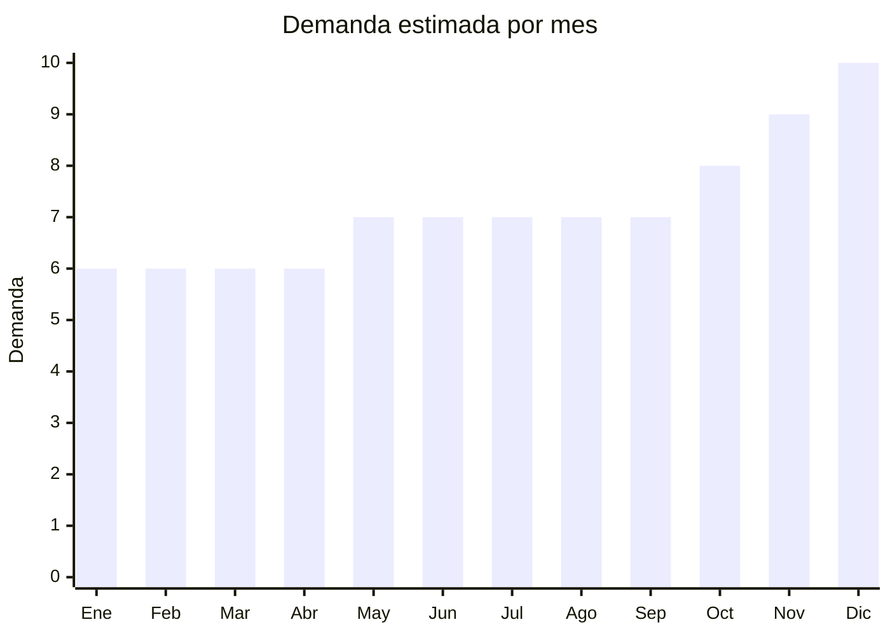

# Tiras LED y Controladores

> **Capitulo NCM 94** — Muebles, iluminacion y construcciones prefabricadas | **Temporada:** Atemporal

## Que es y por que importarlo

Las tiras LED son circuitos flexibles con diodos LED montados que se adhieren a superficies para iluminacion decorativa, ambiental o funcional. Se venden con controladores que permiten cambiar colores, efectos y brillo, ya sea por control remoto infrarrojo o mediante aplicaciones WiFi/Bluetooth. Incluyen tiras RGB basicas, RGBIC direccionables, blanco calido y neon flex.

Este es un **bestseller absoluto** en MercadoLibre Argentina. Los vendedores top superan las 100,000 unidades vendidas, lo que demuestra una demanda masiva y sostenida. China produce la totalidad del mercado mundial de tiras LED, con precios FOB desde USD 1 por rollo de 5 metros, permitiendo margenes de 200% a 400%. El producto es ultraliviano, facil de enviar y tiene un costo de inventario minimo.

## Datos clave

| Dato | Valor |
|------|-------|
| **Posiciones NCM tipicas** | 9405.40 |
| **Derecho de importacion** | 20% (DIE) + 3% tasa estadistica |
| **Rango FOB tipico** | USD 1 — USD 5 por rollo de 5m |
| **Precio de venta en Argentina** | ARS 5,000 — ARS 25,000 |
| **Margen bruto estimado** | 200% — 400% |
| **MOQ tipico** | 100 — 1,000 rollos |
| **Demanda en MercadoLibre** | Muy Alta |
| **Competencia en MercadoLibre** | Alta |
| **Dificultad para importar** | Baja-Moderada |
| **Certificaciones necesarias** | S-Mark (puede requerir), ENACOM (solo smart WiFi/BT) |
| **Antidumping** | **No** |

## Variantes y subtipos mas comunes

| Subtipo / Variante | FOB aprox. | Venta AR aprox. | Nota |
|--------------------|-----------|-----------------|------|
| Tira RGB 5m basica (control remoto IR) | USD 1 — 2 | ARS 5,000 — 10,000 | Mayor volumen de ventas, entry-level |
| Tira RGBIC direccionable | USD 2 — 4 | ARS 10,000 — 20,000 | Efectos multicolor por segmento, premium |
| Tira warm white 5m | USD 1 — 2 | ARS 5,000 — 12,000 | Uso funcional: cocinas, muebles |
| Tira neon flex | USD 3 — 5 | ARS 12,000 — 25,000 | Efecto neon uniforme, muy estetico |
| Controlador WiFi Tuya | USD 2 — 4 | ARS 8,000 — 15,000 | Compatible Alexa/Google, venta complementaria |

## Regulaciones y requisitos

<Tabs>
  <Tab title="Certificaciones">
    | Organismo | Requiere | Detalle | Costo aprox. | Tiempo aprox. |
    |-----------|----------|---------|-------------|--------------|
    | ARCA (Aduana) | Si siempre | Despacho de importacion | Variable | — |
    | S-Mark (Seguridad electrica) | Puede requerir | Depende del modelo y si incluye fuente de alimentacion 220V | USD 200 — 500 por modelo | 4 — 6 semanas |
    | QR fiscal | Si | Codigo QR de trazabilidad obligatorio | Incluido en proceso S-Mark | — |
    | ENACOM | **Solo smart WiFi/BT** | Modelos con controlador WiFi o Bluetooth requieren homologacion | USD 100 — 300 por modelo | 4 — 8 semanas |

    <Warning>
    Los controladores WiFi Tuya y modelos con Bluetooth **requieren homologacion ENACOM**. Las tiras LED basicas con control remoto infrarrojo (IR) generalmente no requieren ENACOM. Verificar siempre con el despachante de aduanas antes de embarcar.
    </Warning>
  </Tab>

  <Tab title="Etiquetado">
    | Requisito | Aplica |
    |-----------|--------|
    | Idioma espanol | Si |
    | Datos del importador | Si |
    | Voltaje de operacion | Si |
    | Potencia por metro | Si |
    | Instrucciones de instalacion | Si |
    | Garantia legal 6 meses | Si |
    | QR de trazabilidad | Si |

    Incluir en espanol: datos del importador, CUIT, pais de origen, voltaje (12V/24V DC), potencia por metro, instrucciones de instalacion y advertencias de seguridad. Para modelos WiFi, incluir numero de homologacion ENACOM.
  </Tab>

  <Tab title="Restricciones">
    No hay medidas antidumping vigentes para tiras LED. Consideraciones:

    - La fuente de alimentacion (transformador 220V a 12V/24V) es el componente que mas regulacion tiene
    - Tiras LED que operan solo con USB 5V tienen requisitos simplificados
    - Modelos smart con WiFi requieren homologacion ENACOM ademas de S-Mark
    - Verificar que el adhesivo 3M de la tira sea genuino (muchos proveedores usan adhesivo generico)
  </Tab>
</Tabs>

## Logistica

| Dato | Valor |
|------|-------|
| **Peso tipico por unidad** | 0.1 — 0.3 kg (rollo 5m con caja) |
| **Volumen tipico** | Muy bajo |
| **Fragilidad** | Baja |
| **Envio recomendado** | Aereo o courier (por ser ultraliviano) |
| **Tiempo total estimado** (pedido a deposito) | 3 — 6 semanas (aereo) / 8 — 12 semanas (maritimo) |
| **Baterias de litio** | No (generalmente) |
| **Requiere empaque especial** | No: el rollo es compacto y resistente |

<Tip>
Las tiras LED son uno de los productos mas eficientes para envio aereo. Un carton de 100 rollos pesa aproximadamente 20-30 kg, lo que hace que el costo de flete aereo sea minimo por unidad. Esto permite hacer pedidos frecuentes y pequenos para testear proveedores sin comprometer capital. Shenzhen y Guangzhou son los principales puertos de origen.
</Tip>

## Estacionalidad



| Aspecto | Detalle |
|---------|---------|
| **Meses pico** | Noviembre-Diciembre (decoracion fiestas, regalos, Black Friday) |
| **Meses valle** | Enero-Marzo (leve baja post-fiestas) |
| **Cuando pedir para llegar a tiempo** | Agosto-Septiembre para temporada de fiestas |

## Ventajas y riesgos

<CardGroup cols={2}>
  <Card title="Ventajas" icon="circle-check">
    - **Bestseller absoluto** con vendedores superando 100,000 unidades vendidas
    - Margenes del 200% al 400% con producto ultraliviano
    - Flete aereo viable y economico por el bajo peso y volumen
    - Demanda masiva y constante todo el ano
    - MOQ accesible: proveedores aceptan desde 100 rollos
    - Producto no fragil, bajo riesgo de dano en transito
    - Venta cruzada natural: tiras + controladores + fuentes + conectores
  </Card>
  <Card title="Riesgos" icon="triangle-exclamation">
    - Competencia extrema: miles de vendedores en MercadoLibre
    - Guerra de precios constante en el segmento basico
    - Calidad del adhesivo variable: modelos baratos se despegan
    - LEDs baratos pierden brillo o cambian color con el uso
    - Modelos WiFi requieren ENACOM (costo y tiempo adicional)
    - Fuentes de alimentacion de baja calidad pueden sobrecalentarse
  </Card>
</CardGroup>

## Palabras clave para buscar en Alibaba

```
LED strip light 5050 RGB 5m, RGBIC LED strip addressable,
warm white LED strip 2835, neon flex LED strip,
WiFi LED controller Tuya, LED strip power supply 12V,
5m LED strip kit remote control, smart LED strip Alexa compatible
```

## Fuentes

- [Nomenclador NCM - ARCA (ex-AFIP)](https://www.arca.gob.ar)
- [ENACOM - Homologacion de equipos](https://www.enacom.gob.ar/homologacion)
- [S-Mark - Seguridad electrica Argentina](https://www.argentina.gob.ar/comercio-interior/marca-de-seguridad)
- [MercadoLibre Argentina - Tiras LED](https://www.mercadolibre.com.ar/tiras-led)
- [Alibaba - LED strip suppliers](https://www.alibaba.com/trade/search?SearchText=led+strip+light+5050)
