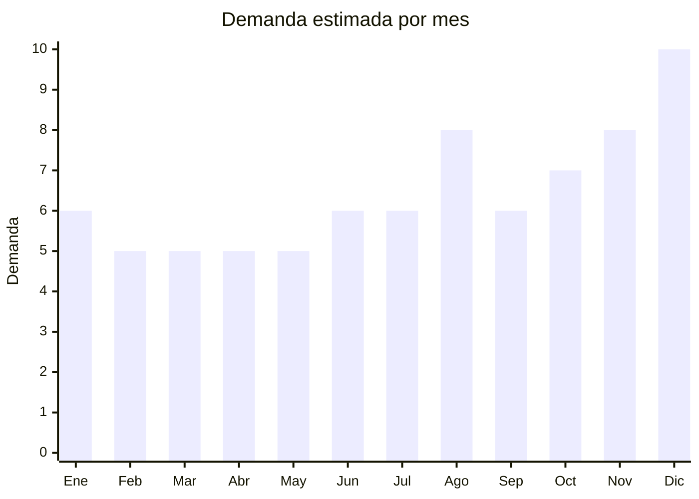

# Drones Recreativos

> **Capitulo NCM 95** — Juguetes, juegos y articulos para recreo o deporte | **Temporada:** Atemporal

## Que es y por que importarlo

Los drones recreativos son vehiculos aereos no tripulados (VANT) controlados por radio o WiFi, utilizados para entretenimiento, fotografia aerea, carreras FPV y uso educativo. Incluyen desde mini drones de menos de 100 gramos sin camara hasta modelos con camara 4K, GPS y funcion return-to-home. La fabricacion esta absolutamente concentrada en Shenzhen (China), donde se encuentran las principales fabricas del mundo: DJI, SJRC, Holy Stone, Eachine y cientos de fabricantes OEM que producen para marcas de todo el mundo.

Este es un producto con margenes excelentes (150-300%) pero con la mayor complejidad regulatoria del capitulo 95. Un drone recreativo puede estar sujeto a **hasta cuatro regulaciones simultaneas**: IRAM 3583 si se comercializa como juguete para menores de 14 anos, ENACOM si utiliza WiFi o Bluetooth para transmision de video, ANAC si pesa mas de 250 gramos (requiere registro como VANT), y regulaciones de transporte de baterias de litio (UN38.3). A pesar de esta complejidad, los margenes justifican el esfuerzo: un mini drone con camara 720p que se compra a USD 15-20 FOB se vende a ARS 40,000-80,000 en Argentina.

El mercado argentino de drones esta en crecimiento sostenido. Los compradores van desde adolescentes que quieren su primer drone hasta adultos que buscan fotografia aerea amateur. Los mini drones sin camara (menos de 100g) son el segmento mas accesible para importar porque escapan de varias regulaciones, mientras que los modelos con camara 4K y GPS compiten con DJI en el segmento medio a una fraccion del precio.

## Datos clave

| Dato | Valor |
|------|-------|
| **Posiciones NCM tipicas** | 9503.00 (si juguete), 8806.00 (si >250g, regulado ANAC) |
| **Derecho de importacion** | 20% (DIE) + 3% tasa estadistica |
| **Rango FOB tipico** | USD 10 — USD 50 por unidad |
| **Precio de venta en Argentina** | ARS 30,000 — ARS 150,000 |
| **Margen bruto estimado** | 150% — 300% |
| **MOQ tipico** | 50 — 200 unidades |
| **Demanda en MercadoLibre** | Media-Alta |
| **Competencia en MercadoLibre** | Media |
| **Dificultad para importar** | Alta (multiples regulaciones posibles) |
| **Certificaciones necesarias** | Variable: IRAM 3583 (juguete), ENACOM (WiFi/BT), ANAC (>250g), UN38.3 (baterias litio) |
| **Antidumping** | **No** |

## Variantes y subtipos mas comunes

| Subtipo / Variante | FOB aprox. | Venta AR aprox. | Nota |
|--------------------|-----------|-----------------|------|
| Mini sin camara (&lt;100g) | USD 10 — 15 | ARS 30,000 — 50,000 | Menos regulaciones, ideal para empezar |
| Mini con camara 720p | USD 15 — 25 | ARS 40,000 — 80,000 | Bestseller, relacion precio-prestacion |
| Con camara 4K (tipo DJI economico) | USD 30 — 50 | ARS 80,000 — 150,000 | Compite con DJI en precio, mayor margen |
| FPV racing | USD 25 — 40 | ARS 60,000 — 120,000 | Nicho de carreras, publico tecnico |
| Con GPS y return-to-home | USD 35 — 50 | ARS 90,000 — 150,000 | Funciones avanzadas, menor riesgo de perdida |

## Regulaciones y requisitos

<Tabs>
  <Tab title="Certificaciones">
    | Organismo | Requiere | Detalle | Costo aprox. | Tiempo aprox. |
    |-----------|----------|---------|-------------|--------------|
    | ARCA (Aduana) | Si siempre | Despacho de importacion | Variable | — |
    | IRAM 3583 | **Si — si juguete para menores de 14** | Certificacion de seguridad de juguetes (equivalente EN-71) | USD 500 — 2,000 por modelo | 4 — 8 semanas |
    | ENACOM | **Si — si tiene WiFi/Bluetooth** | Homologacion de equipos de telecomunicaciones (transmision de video) | USD 300 — 800 por modelo | 4 — 12 semanas |
    | ANAC | **Si — si pesa mas de 250g** | Registro como VANT (Vehiculo Aereo No Tripulado). El usuario final debe registrarlo | Gratuito para el fabricante, tasa para el usuario | Variable |
    | UN38.3 | **Si — baterias de litio** | Certificacion de seguridad para transporte de baterias de litio | USD 200 — 500 | El proveedor debe tenerlo |

    <Warning>
    Los drones recreativos pueden requerir **hasta 4 regulaciones simultaneas**. La combinacion mas comun es:

    1. **IRAM 3583** — si se comercializa como juguete para menores de 14 anos
    2. **ENACOM** — si utiliza WiFi o Bluetooth para transmision de video (la mayoria de drones con camara)
    3. **ANAC** — si pesa mas de 250g (el usuario debe registrarlo, pero el importador debe informarlo)
    4. **UN38.3** — las baterias de litio requieren certificacion para transporte aereo y maritimo

    **Estrategia para minimizar regulaciones:** Importar mini drones de menos de 100g, sin camara WiFi, posicionados como "+14 anos". Esto evita IRAM, reduce requisitos ENACOM y evita registro ANAC.
    </Warning>
  </Tab>

  <Tab title="Etiquetado">
    | Requisito | Aplica |
    |-----------|--------|
    | Idioma espanol | Si |
    | Datos del importador | Si |
    | Rango de edad recomendado | **Si — obligatorio** |
    | Peso del drone | **Si — obligatorio** (determina si requiere registro ANAC) |
    | Advertencia de baterias de litio | Si |
    | Frecuencia de operacion (si WiFi/BT) | Si si aplica ENACOM |
    | Logo IRAM (si juguete menores 14) | Si si aplica |
    | Pais de origen | Si |
    | Instrucciones en espanol | Si |
    | Advertencias de seguridad de vuelo | Si |
    | Garantia legal 6 meses | Si |

    El etiquetado de drones es complejo: debe incluir peso exacto del drone (critico para determinar registro ANAC), rango de edad recomendado, advertencias sobre baterias de litio (no exponer al calor, no perforar), frecuencia de operacion si aplica ENACOM, datos del importador con CUIT, instrucciones completas en espanol y advertencias de seguridad de vuelo (no volar cerca de aeropuertos, respetar alturas maximas, no volar sobre personas).
  </Tab>

  <Tab title="Restricciones">
    Restricciones multiples para drones recreativos:

    - **ANAC Regulacion VANT:** Drones de mas de 250g requieren registro por parte del usuario final. El importador debe informar esto claramente en el empaque y documentacion
    - **Zonas de exclusion aerea:** El importador debe incluir advertencias sobre restricciones de vuelo en zonas urbanas, cerca de aeropuertos y sobre personas
    - **Baterias de litio:** Las aerolineas y empresas de courier tienen restricciones especificas para envio de baterias de litio (limite de Wh, empaque especial, etiquetado UN38.3)
    - **Frecuencia 2.4 GHz/5.8 GHz:** Los drones que transmiten video por WiFi deben operar en frecuencias permitidas por ENACOM en Argentina
    - **Privacidad:** Drones con camara deben incluir advertencia sobre ley de proteccion de datos personales y privacidad
    - **Propiedad intelectual:** Drones que imiten el diseno de DJI pueden ser retenidos por propiedad intelectual
  </Tab>
</Tabs>

## Logistica

| Dato | Valor |
|------|-------|
| **Peso tipico por unidad** | 0.1 — 0.8 kg (con caja y accesorios) |
| **Volumen tipico** | Bajo-Medio |
| **Fragilidad** | Media (helices y gimbal fragiles) |
| **Envio recomendado** | Maritimo preferible (baterias litio limitan aereo) |
| **Tiempo total estimado** (pedido a deposito) | 8 — 14 semanas (maritimo recomendado por baterias) |
| **Baterias de litio** | **Si — requiere UN38.3 y empaque especial** |
| **Requiere empaque especial** | Si: caja rigida individual, helices protegidas, baterias separadas segun norma |

<Tip>
El principal desafio logistico de los drones son las **baterias de litio**. Para envio aereo, las baterias deben estar al 30% de carga, empacadas individualmente y con etiquetado UN38.3. Muchas aerolineas rechazan envios con baterias de litio o cobran recargos significativos. **El envio maritimo es generalmente mas economico y menos restrictivo** para este tipo de productos. Solicitar siempre al proveedor chino el certificado UN38.3 de las baterias antes de embarcar, y verificar que el empaque cumpla con las normas IATA/IMDG. Los mini drones sin camara (menores a 100g) con baterias muy pequenas tienen menos restricciones de transporte.
</Tip>

## Estacionalidad



| Aspecto | Detalle |
|---------|---------|
| **Meses pico** | Agosto (Dia del Nino — regalo estrella), Diciembre (Navidad — pico maximo), Noviembre (Hot Sale, Black Friday) |
| **Meses valle** | Febrero-Abril (post-fiestas, menor demanda de tecnologia) |
| **Cuando pedir para llegar a tiempo** | Mayo-Junio para Dia del Nino, Agosto-Septiembre para temporada de fiestas |

## Ventajas y riesgos

<CardGroup cols={2}>
  <Card title="Ventajas" icon="circle-check">
    - Margenes del 150% al 300% con tickets de venta altos
    - Producto de alta demanda como regalo (Dia del Nino, Navidad)
    - Mercado en crecimiento sostenido en Argentina
    - Competencia media: no esta saturado como otros segmentos
    - Livianos a pesar de la tecnologia (0.1-0.8 kg)
    - China domina la fabricacion: multiples proveedores con OEM disponible
    - Mini drones (<100g) minimizan la carga regulatoria
  </Card>
  <Card title="Riesgos" icon="triangle-exclamation">
    - **Doble/triple regulacion**: IRAM + ENACOM + ANAC posible
    - Baterias de litio complican logistica y encarecen flete aereo
    - Producto tecnologico con riesgo de defectos y reclamos
    - Homologacion ENACOM costosa y lenta (4-12 semanas)
    - Drones baratos con camaras de baja calidad generan insatisfaccion
    - Riesgo de retencion aduanera si no se cumple alguna regulacion
    - Modelos que imiten marcas (DJI) pueden tener problemas de PI
    - Post-venta complejo: repuestos, helices, baterias de reemplazo
  </Card>
</CardGroup>

## Palabras clave para buscar en Alibaba

```
mini drone no camera under 100g, drone 720p camera WiFi FPV,
drone 4K camera GPS brushless, FPV racing drone kit,
drone GPS return home foldable, mini quadcopter toy OEM,
drone factory Shenzhen, RC drone custom logo,
drone UN38.3 battery certified, foldable drone 4K gimbal
```

## Fuentes

- [Nomenclador NCM - ARCA (ex-AFIP)](https://www.arca.gob.ar)
- [ENACOM - Homologacion de equipos](https://www.enacom.gob.ar)
- [ANAC - Regulacion VANT (drones)](https://www.anac.gob.ar/anac/web/index.php/2/1475/vant)
- [IRAM - Certificacion de juguetes](https://www.iram.org.ar)
- [MercadoLibre Argentina - Drones](https://www.mercadolibre.com.ar/drones)
- [Alibaba - Drone suppliers](https://www.alibaba.com/trade/search?SearchText=mini+drone+camera)
