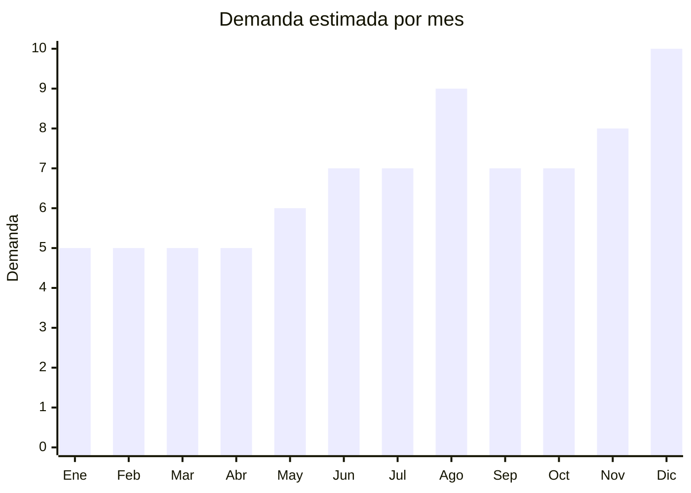

# Juegos de Mesa y Cartas

> **Capitulo NCM 95** — Juguetes, juegos y articulos para recreo o deporte | **Temporada:** Atemporal

## Que es y por que importarlo

Los juegos de mesa y cartas son productos de entretenimiento que incluyen juegos de naipes (tipo UNO, cartas party), juegos de estrategia familiar, rompecabezas de 500 a 1000 piezas, sets de poker con fichas de ceramica y juegos clasicos en madera como ajedrez y damas. Se fabrican mayoritariamente en China, con concentracion de fabricas en Dongguan (Guangdong) para impresion de cartas y cajas, y Yiwu (Zhejiang) para juegos de mesa generales.

Los juegos de cartas tipo UNO y party games son el producto estrella de esta categoria: tienen un FOB de apenas USD 1-3 por unidad y se venden entre ARS 5,000 y ARS 15,000 en Argentina, generando margenes del 300% o mas. La demanda es constante durante todo el ano con picos muy marcados en Dia del Nino (agosto) y Navidad (diciembre). Un factor clave es que **si el producto esta dirigido a menores de 14 anos, requiere certificacion IRAM 3583**, pero los juegos para adultos (poker, juegos de estrategia para mayores de 14) quedan exentos.

El mercado argentino tiene apetito por juegos de mesa innovadores y accesibles. Las marcas locales como Ruibal y Top Toys cubren el segmento premium, pero hay espacio enorme en el segmento economico y en nichos como juegos party para adultos, rompecabezas de alta calidad y juegos clasicos de madera con terminacion artesanal. La ventaja logistica es notable: los juegos de mesa son livianos, compactos y resistentes, lo que los hace ideales para envios aereos y primeras importaciones.

## Datos clave

| Dato | Valor |
|------|-------|
| **Posiciones NCM tipicas** | 9504.40 (naipes), 9504.90 (otros juegos de mesa) |
| **Derecho de importacion** | 20% (DIE) + 3% tasa estadistica |
| **Rango FOB tipico** | USD 1 — USD 8 por unidad |
| **Precio de venta en Argentina** | ARS 5,000 — ARS 30,000 |
| **Margen bruto estimado** | 200% — 400% |
| **MOQ tipico** | 200 — 1,000 unidades |
| **Demanda en MercadoLibre** | Alta |
| **Competencia en MercadoLibre** | Media-Alta |
| **Dificultad para importar** | Baja (adultos) / Moderada (menores de 14) |
| **Certificaciones necesarias** | IRAM 3583 obligatorio si dirigido a menores de 14 anos (costo USD 500-2,000/modelo) |
| **Antidumping** | **No** |

## Variantes y subtipos mas comunes

| Subtipo / Variante | FOB aprox. | Venta AR aprox. | Nota |
|--------------------|-----------|-----------------|------|
| Cartas tipo UNO/party | USD 1 — 3 | ARS 5,000 — 15,000 | Bestseller, altisima rotacion, margen 300%+ |
| Juegos de estrategia/family | USD 3 — 8 | ARS 12,000 — 30,000 | Mayor valor percibido, nicho creciente |
| Rompecabezas 500-1000 piezas | USD 2 — 5 | ARS 8,000 — 20,000 | Demanda constante, regalo clasico |
| Set poker fichas ceramicas | USD 4 — 8 | ARS 15,000 — 30,000 | Segmento adulto, no requiere IRAM |
| Juegos clasicos madera (ajedrez, damas) | USD 3 — 7 | ARS 10,000 — 25,000 | Terminacion artesanal, alto valor percibido |

## Regulaciones y requisitos

<Tabs>
  <Tab title="Certificaciones">
    | Organismo | Requiere | Detalle | Costo aprox. | Tiempo aprox. |
    |-----------|----------|---------|-------------|--------------|
    | ARCA (Aduana) | Si siempre | Despacho de importacion | Variable | — |
    | IRAM 3583 | **Si — si dirigido a menores de 14** | Certificacion de seguridad para juguetes (equivalente EN-71). NO aplica para juegos dirigidos exclusivamente a adultos (+14) | USD 500 — 2,000 por modelo | 4 — 8 semanas |
    | S-Mark | No | No es producto electrico | — | — |
    | ENACOM | No | No emite radiofrecuencia | — | — |
    | ANMAT | No | No es producto medico | — | — |

    <Warning>
    La certificacion **IRAM 3583 aplica solo si el juego esta dirigido a menores de 14 anos**. Un set de poker para adultos o un juego party "+18" NO requieren IRAM. Pero un juego de cartas infantil o un rompecabezas para ninos **si lo requiere**. El criterio es el **publico objetivo declarado en el packaging**, no el producto en si. Estrategia comun: posicionar como "+14 anos" cuando el producto lo permite, para evitar la certificacion. Sin embargo, juegos que evidentemente son para ninos no pueden evadir esta regulacion.
    </Warning>
  </Tab>

  <Tab title="Etiquetado">
    | Requisito | Aplica |
    |-----------|--------|
    | Idioma espanol | Si |
    | Datos del importador | Si |
    | Rango de edad recomendado | **Si — obligatorio** |
    | Numero de jugadores | Recomendado |
    | Advertencias piezas pequenas (si menores 3 anos) | Si si aplica |
    | Logo IRAM (si dirigido a menores 14) | Si si aplica |
    | Pais de origen | Si |
    | Instrucciones en espanol | Si |
    | Garantia legal 6 meses | Si |

    El etiquetado debe incluir: rango de edad recomendado (crucial para determinar si aplica IRAM), numero de jugadores, datos del importador con CUIT, pais de origen, instrucciones completas en espanol. Si el juego tiene piezas pequenas, debe incluir advertencia de peligro de asfixia para menores de 3 anos. Si esta certificado IRAM, incluir el logo con numero de certificacion.
  </Tab>

  <Tab title="Restricciones">
    No hay medidas antidumping vigentes para juegos de mesa. Restricciones importantes:

    - Juegos con tematica de marcas registradas (Disney, Marvel, etc.) pueden ser retenidos por propiedad intelectual
    - Juegos que son copias identicas de juegos patentados (UNO es marca registrada de Mattel) deben tener variaciones suficientes para evitar reclamos
    - Juegos de mesa con piezas de madera para menores de 3 anos requieren pintura no toxica certificada
    - Rompecabezas para ninos deben pasar prueba de partes pequenas (IRAM 3583)
    - Cartas con contenido para adultos deben tener advertencia clara y empaque que impida visualizacion por menores
  </Tab>
</Tabs>

## Logistica

| Dato | Valor |
|------|-------|
| **Peso tipico por unidad** | 0.2 — 1 kg (con caja) |
| **Volumen tipico** | Bajo — compacto |
| **Fragilidad** | Baja (cartas) a Media (juegos con tablero/piezas) |
| **Envio recomendado** | Aereo para muestras y lotes chicos, maritimo para volumenes |
| **Tiempo total estimado** (pedido a deposito) | 3 — 6 semanas (aereo) / 8 — 12 semanas (maritimo) |
| **Baterias de litio** | No |
| **Requiere empaque especial** | No: caja individual + film retractil es suficiente |

<Tip>
Los juegos de cartas son el producto ideal para primeras importaciones dentro de esta categoria: pesan menos de 200g por unidad, el MOQ es bajo (muchos proveedores aceptan 200-500 unidades), el FOB es minimo (USD 1-3) y los margenes superan el 300%. Un envio aereo de 500 juegos de cartas puede pesar apenas 100 kg. Para rompecabezas, solicitar al proveedor embalaje con film retractil para evitar que las cajas se abran durante el transito. Los juegos de madera (ajedrez) requieren algo mas de cuidado en el empaque para evitar rayones.
</Tip>

## Estacionalidad



| Aspecto | Detalle |
|---------|---------|
| **Meses pico** | Agosto (Dia del Nino — pico maximo), Diciembre (Navidad/Reyes — pico maximo), Junio-Julio (invierno, mas tiempo en casa) |
| **Meses valle** | Enero-Febrero (vacaciones de verano, menos tiempo en casa) |
| **Cuando pedir para llegar a tiempo** | Mayo-Junio para Dia del Nino, Septiembre-Octubre para temporada de fiestas |

## Ventajas y riesgos

<CardGroup cols={2}>
  <Card title="Ventajas" icon="circle-check">
    - Margenes del 200% al 400%, cartas party superan el 300%
    - Liviano y compacto: flete aereo viable y economico
    - Juegos para adultos (+14) **no requieren IRAM** — importacion simple
    - Demanda constante con picos fuertes en Dia del Nino y Navidad
    - FOB muy bajo: desde USD 1 por juego de cartas
    - Producto resistente en transito, sin riesgo de rotura
    - Personalizacion facil: impresion custom a bajo costo
  </Card>
  <Card title="Riesgos" icon="triangle-exclamation">
    - IRAM 3583 obligatorio si dirigido a menores de 14 (USD 500-2,000/modelo)
    - Copias de marcas registradas (UNO, Mattel) pueden generar reclamos legales
    - Rompecabezas con impresion de baja calidad generan reclamos y devolucion
    - Competencia de marcas locales establecidas (Ruibal, Top Toys)
    - Juegos sin instrucciones en espanol no se venden bien
    - Cada variante/modelo para menores requiere certificacion independiente
  </Card>
</CardGroup>

## Palabras clave para buscar en Alibaba

```
card game party custom printing, UNO style card game OEM,
board game family strategy, jigsaw puzzle 1000 pieces custom,
poker chip set ceramic, wooden chess set folding board,
card game factory Dongguan, custom board game manufacturer,
playing cards custom design, puzzle factory OEM 500 pieces
```

## Fuentes

- [Nomenclador NCM - ARCA (ex-AFIP)](https://www.arca.gob.ar)
- [IRAM - Certificacion de juguetes](https://www.iram.org.ar)
- [MercadoLibre Argentina - Juegos de mesa](https://www.mercadolibre.com.ar/juegos-de-mesa-y-cartas)
- [Alibaba - Board game suppliers](https://www.alibaba.com/trade/search?SearchText=board+game+custom)
- [Ministerio de Economia - Arancel externo comun](https://www.argentina.gob.ar/economia)
