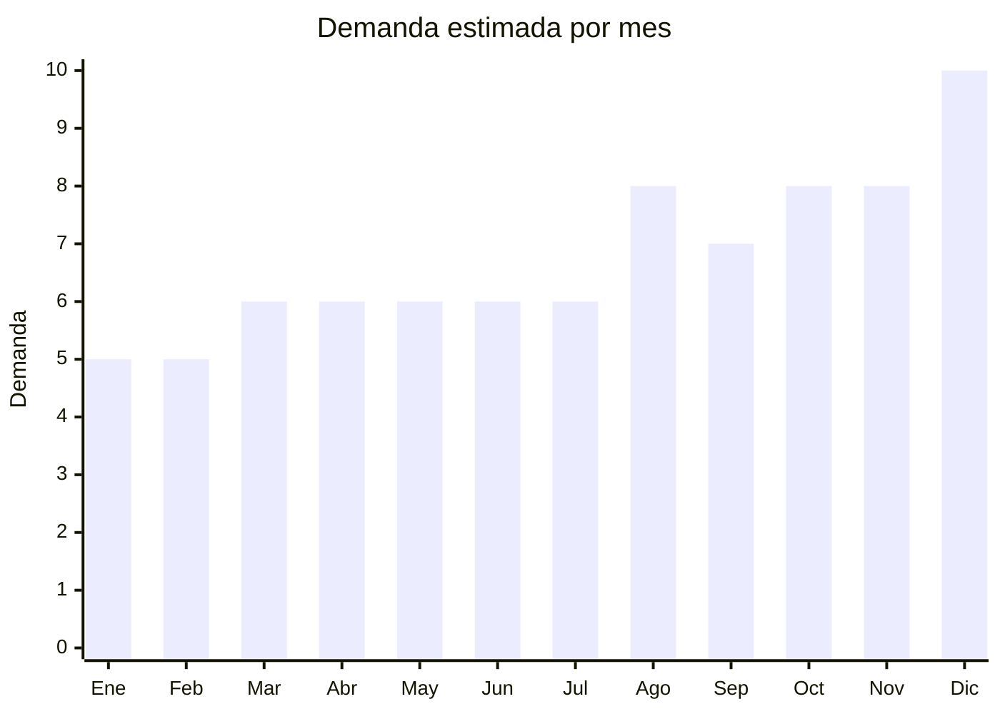

# Juguetes Didacticos

> **Capitulo NCM 95** — Juguetes, juegos y articulos para recreo o deporte | **Temporada:** Atemporal

## Que es y por que importarlo

Los juguetes didacticos son productos disenados para estimular el aprendizaje y el desarrollo cognitivo de ninos a traves del juego. Incluyen bloques magneticos de construccion, rompecabezas 3D, kits de robotica STEM, juegos Montessori de madera y circuitos de bolitas. Son productos con alto valor percibido por los padres, que priorizan el componente educativo al momento de comprar.

China produce la gran mayoria de juguetes didacticos del mundo, con fabricas concentradas en Shantou (Guangdong) y Yiwu (Zhejiang). Los bloques magneticos son el bestseller absoluto de esta categoria, con miles de unidades vendidas mensualmente en MercadoLibre Argentina. Los margenes son excelentes (200-400%) pero la certificacion IRAM 3583 es obligatoria para juguetes destinados a menores de 14 anos, lo cual agrega costo y tiempo al proceso.

## Datos clave

| Dato | Valor |
|------|-------|
| **Posiciones NCM tipicas** | 9503.00 |
| **Derecho de importacion** | 20% (DIE) + 3% tasa estadistica |
| **Rango FOB tipico** | USD 2 — USD 15 por unidad |
| **Precio de venta en Argentina** | ARS 10,000 — ARS 60,000 |
| **Margen bruto estimado** | 200% — 400% |
| **MOQ tipico** | 100 — 500 unidades |
| **Demanda en MercadoLibre** | Muy Alta |
| **Competencia en MercadoLibre** | Alta |
| **Dificultad para importar** | Moderada-Alta (requiere IRAM 3583) |
| **Certificaciones necesarias** | IRAM 3583 obligatorio (equivalente EN-71) |
| **Antidumping** | **No** |

## Variantes y subtipos mas comunes

| Subtipo / Variante | FOB aprox. | Venta AR aprox. | Nota |
|--------------------|-----------|-----------------|------|
| Bloques magneticos (bestseller) | USD 5 — 12 | ARS 20,000 — 50,000 | Mayor volumen de ventas, alta demanda |
| Rompecabezas 3D | USD 2 — 6 | ARS 10,000 — 25,000 | Variedad de modelos, bajo MOQ |
| Kit robotica STEM | USD 8 — 15 | ARS 30,000 — 60,000 | Alto valor percibido, nicho educativo |
| Juego Montessori madera | USD 3 — 8 | ARS 12,000 — 35,000 | Tendencia en crianza consciente |
| Circuito de bolitas | USD 4 — 10 | ARS 15,000 — 40,000 | Visual, entretenido, regalo popular |

## Regulaciones y requisitos

<Tabs>
  <Tab title="Certificaciones">
    | Organismo | Requiere | Detalle | Costo aprox. | Tiempo aprox. |
    |-----------|----------|---------|-------------|--------------|
    | ARCA (Aduana) | Si siempre | Despacho de importacion | Variable | — |
    | IRAM 3583 | **Si — obligatorio** | Certificacion de seguridad para juguetes destinados a menores de 14 anos (equivalente EN-71) | USD 500 — 2,000 por modelo | 4 — 8 semanas |
    | S-Mark | No (salvo electronicos) | Solo si el juguete tiene componentes electricos | — | — |
    | ENACOM | No (salvo WiFi/BT) | Solo si tiene conectividad inalambrica | — | — |

    <Warning>
    La certificacion **IRAM 3583 es obligatoria** para todos los juguetes destinados a menores de 14 anos. Sin esta certificacion, la aduana retendra la mercaderia y no se podra comercializar legalmente. La Resolucion 313/2025 simplifico algunos tramites, pero la certificacion sigue siendo obligatoria. Cada modelo/variante requiere su propia certificacion. El costo puede ir de USD 500 a USD 2,000 por modelo.
    </Warning>
  </Tab>

  <Tab title="Etiquetado">
    | Requisito | Aplica |
    |-----------|--------|
    | Idioma espanol | Si |
    | Datos del importador | Si |
    | Rango de edad recomendado | **Si — obligatorio** |
    | Advertencias de piezas pequenas | **Si — obligatorio** |
    | Logo IRAM con numero de certificacion | **Si — obligatorio** |
    | Pais de origen | Si |
    | Instrucciones de uso | Si |
    | Garantia legal 6 meses | Si |

    El etiquetado de juguetes tiene requisitos estrictos: debe incluir rango de edad recomendado, advertencias de piezas pequenas (peligro de asfixia para menores de 3 anos), logo IRAM con numero de certificacion, datos del importador con CUIT, pais de origen e instrucciones en espanol.
  </Tab>

  <Tab title="Restricciones">
    No hay medidas antidumping vigentes. Restricciones importantes:

    - Todos los juguetes para menores de 14 anos deben cumplir IRAM 3583 (limites de metales pesados, inflamabilidad, partes pequenas)
    - Los bloques magneticos deben cumplir requisitos de fuerza de iman (los imanes pequenos que se desprendan pueden ser ingeridos, riesgo grave)
    - Juguetes de madera deben tener pinturas no toxicas (verificar certificados)
    - Kits con baterias tienen requisitos adicionales de seguridad
    - Los juguetes importados sin certificacion pueden ser decomisados y destruidos por la aduana
  </Tab>
</Tabs>

## Logistica

| Dato | Valor |
|------|-------|
| **Peso tipico por unidad** | 0.3 — 2 kg (con caja) |
| **Volumen tipico** | Bajo-Medio |
| **Fragilidad** | Baja (salvo rompecabezas 3D) |
| **Envio recomendado** | Aereo para lotes chicos, maritimo para volumenes |
| **Tiempo total estimado** (pedido a deposito) | 3 — 6 semanas (aereo) / 8 — 12 semanas (maritimo) |
| **Baterias de litio** | Solo kits robotica con baterias — requiere UN38.3 |
| **Requiere empaque especial** | No: caja individual del juguete es suficiente |

<Tip>
Iniciar el tramite de certificacion IRAM 3583 **antes** de embarcar la mercaderia. El proceso lleva 4-8 semanas y se necesitan muestras fisicas del producto. Muchos proveedores chinos ya cuentan con certificacion EN-71 (norma europea equivalente), lo que acelera significativamente el proceso de certificacion IRAM. Solicitar siempre al proveedor el informe EN-71 junto con la cotizacion.
</Tip>

## Estacionalidad



| Aspecto | Detalle |
|---------|---------|
| **Meses pico** | Agosto (Dia del Nino en Argentina), Octubre (Dia de la Madre como regalo), Diciembre (Navidad/Reyes) |
| **Meses valle** | Enero-Febrero (vacaciones de verano) |
| **Cuando pedir para llegar a tiempo** | Mayo-Junio para Dia del Nino, Septiembre para temporada de fiestas |

## Ventajas y riesgos

<CardGroup cols={2}>
  <Card title="Ventajas" icon="circle-check">
    - Margenes del 200% al 400% con alta demanda sostenida
    - Bloques magneticos son bestseller absoluto en MercadoLibre
    - Padres dispuestos a pagar mas por juguetes educativos
    - Tendencia Montessori y STEM impulsan la categoria
    - Productos livianos, flete manejable
    - Resolucion 313/2025 simplifico algunos tramites de certificacion
  </Card>
  <Card title="Riesgos" icon="triangle-exclamation">
    - Certificacion IRAM 3583 obligatoria: USD 500-2,000 por modelo y 4-8 semanas
    - Sin IRAM la mercaderia puede ser decomisada y destruida
    - Bloques magneticos tienen riesgo de seguridad si los imanes se desprenden
    - Pinturas toxicas en juguetes baratos generan graves problemas legales
    - Competencia alta en el segmento de bloques magneticos
    - Cada variante o modelo requiere certificacion independiente
  </Card>
</CardGroup>

## Palabras clave para buscar en Alibaba

```
magnetic building blocks tiles, 3D puzzle toy educational,
STEM robot kit kids, Montessori wooden toy, marble run toy,
magnetic tiles EN-71 certified, educational toy factory Shantou,
OEM STEM toy custom, building blocks magnetic set
```

## Fuentes

- [Nomenclador NCM - ARCA (ex-AFIP)](https://www.arca.gob.ar)
- [IRAM - Certificacion de juguetes](https://www.iram.org.ar)
- [Resolucion 313/2025 - Simplificacion juguetes](https://www.argentina.gob.ar/economia)
- [MercadoLibre Argentina - Juguetes didacticos](https://www.mercadolibre.com.ar/juguetes-didacticos)
- [Alibaba - Educational toy suppliers](https://www.alibaba.com/trade/search?SearchText=educational+toy+magnetic)
