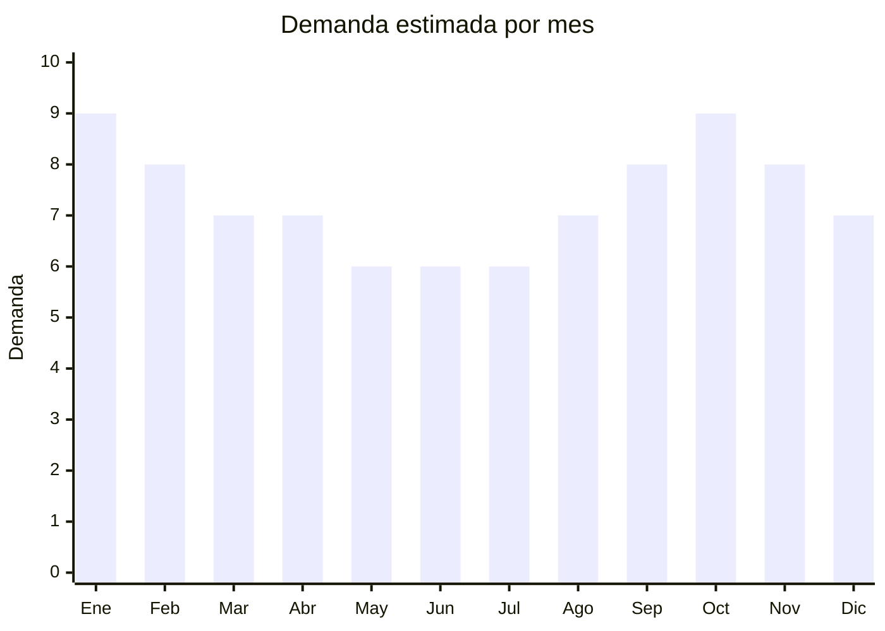

# Mancuernas y Pesas

> **Capitulo NCM 95** — Juguetes, juegos y articulos para recreo o deporte | **Temporada:** Atemporal

## Que es y por que importarlo

Las mancuernas y pesas son equipos de entrenamiento de fuerza fabricados en hierro fundido, acero o hierro recubierto de vinilo/neopreno, utilizados tanto en gimnasios comerciales como en entrenamientos hogareños. Incluyen mancuernas de vinilo livianas (1-5 kg), mancuernas ajustables tipo Bowflex (hasta 24 kg), kettlebells de fundicion, sets de discos con barra olimpica y tobilleras con peso. La fabricacion se concentra en Nantong y Rizhao (China), que producen la mayor parte del equipamiento de pesas del mundo.

El segmento de home gym se consolido desde 2020 y la demanda no retrocedio: entrenar en casa paso de tendencia a habito. En Argentina, marcas como Ranbak, Gadnic y Olmo dominan el mercado de equipamiento fitness, pero todas importan de los mismos origenes chinos. El importador independiente puede competir en precio ofreciendo mancuernas de vinilo, kettlebells y sets de discos a menor costo, especialmente si desarrolla marca propia. Los margenes van del 100% al 200%, inferiores a otros productos del capitulo 95, pero compensados por tickets de venta altos (ARS 15,000 a ARS 80,000 por unidad).

<Warning>
**CUIDADO: Producto MUY PESADO.** Las mancuernas y pesas son de los productos mas pesados que se pueden importar. El flete maritimo se cobra por peso en este caso (no por volumen), y **el costo de flete por kilogramo puede superar el valor FOB del producto en mancuernas pesadas**. Solo es viable en envios maritimos FCL (contenedor completo). No es recomendable como primer producto de importacion salvo mancuernas de vinilo livianas (1-5 kg).
</Warning>

## Datos clave

| Dato | Valor |
|------|-------|
| **Posiciones NCM tipicas** | 9506.91.00 |
| **Derecho de importacion** | 20% (DIE) + 3% tasa estadistica |
| **Rango FOB tipico** | USD 5 — USD 30 por unidad (segun peso) |
| **Precio de venta en Argentina** | ARS 15,000 — ARS 80,000 |
| **Margen bruto estimado** | 100% — 200% |
| **MOQ tipico** | 200 — 500 unidades (o por tonelada, ej: 5-10 ton) |
| **Demanda en MercadoLibre** | Alta |
| **Competencia en MercadoLibre** | Alta (Ranbak, Gadnic, Olmo) |
| **Dificultad para importar** | Moderada-Alta (por peso y flete) |
| **Certificaciones necesarias** | Ninguna obligatoria (articulo deportivo adulto) |
| **Antidumping** | **No** |

## Variantes y subtipos mas comunes

| Subtipo / Variante | FOB aprox. | Venta AR aprox. | Nota |
|--------------------|-----------|-----------------|------|
| Mancuerna vinilo 1-5 kg (par) | USD 5 — 10 | ARS 15,000 — 30,000 | Entry-level, liviano, ideal para empezar |
| Mancuerna ajustable 24 kg tipo Bowflex | USD 20 — 30 | ARS 50,000 — 80,000 | Alto valor, nicho premium, menor volumen |
| Kettlebell fundicion 8-16 kg | USD 8 — 18 | ARS 20,000 — 45,000 | CrossFit y entrenamiento funcional |
| Set discos + barra olimpica (50 kg) | USD 25 — 50 (set) | ARS 40,000 — 80,000 | Set completo home gym, ticket alto |
| Tobilleras con peso 1-3 kg (par) | USD 3 — 6 | ARS 10,000 — 20,000 | Complemento liviano, buen margen |

## Regulaciones y requisitos

<Tabs>
  <Tab title="Certificaciones">
    | Organismo | Requiere | Detalle | Costo aprox. | Tiempo aprox. |
    |-----------|----------|---------|-------------|--------------|
    | ARCA (Aduana) | Si siempre | Despacho de importacion | Variable | — |
    | IRAM | **No** | No aplica para articulos deportivos de adultos | — | — |
    | S-Mark | No | No es producto electrico | — | — |
    | ENACOM | No | No emite radiofrecuencia | — | — |
    | ANMAT | No | No es producto medico | — | — |

    <Note>
    Las mancuernas y pesas **no requieren certificacion IRAM** ya que son articulos deportivos para adultos. Esta es una ventaja regulatoria, pero la verdadera dificultad de este producto no esta en las certificaciones sino en la logistica: el peso extremo encarece significativamente el flete y requiere planificacion logistica cuidadosa.
    </Note>
  </Tab>

  <Tab title="Etiquetado">
    | Requisito | Aplica |
    |-----------|--------|
    | Idioma espanol | Si |
    | Datos del importador | Si |
    | Peso indicado en kg | **Si — obligatorio** |
    | Material de fabricacion | Si |
    | Instrucciones de uso | Recomendado |
    | Advertencias de seguridad | Recomendado |
    | Pais de origen | Si |

    Incluir en espanol: datos del importador con CUIT, pais de origen, peso exacto en kilogramos de cada pieza (grabado o impreso en la mancuerna/disco), material (hierro fundido, acero, vinilo), advertencias de uso seguro e instrucciones basicas.
  </Tab>

  <Tab title="Restricciones">
    No hay medidas antidumping ni restricciones especificas para mancuernas. Consideraciones criticas:

    - El peso real debe coincidir con el peso declarado: mancuernas que pesan menos de lo indicado generan reclamos masivos
    - Las mancuernas de vinilo barato pueden descascararse con el uso, exponiendo el hierro que se oxida
    - Los discos olimpicos deben tener diametro de agujero estandar (50mm olimpico o 25mm estandar) — no mezclar
    - Las kettlebells de fundicion pueden tener rebarbas o bordes cortantes si la terminacion es deficiente
    - El recubrimiento de neopreno/vinilo no debe contener sustancias toxicas (verificar certificado)
  </Tab>
</Tabs>

## Logistica

| Dato | Valor |
|------|-------|
| **Peso tipico por unidad** | 2 — 25 kg (producto extremadamente pesado) |
| **Volumen tipico** | Bajo (pesado pero compacto) |
| **Fragilidad** | Nula (hierro fundido) |
| **Envio recomendado** | **Maritimo FCL unicamente** (contenedor completo) |
| **Tiempo total estimado** (pedido a deposito) | 10 — 16 semanas (solo maritimo viable) |
| **Baterias de litio** | No |
| **Requiere empaque especial** | Si: pallets reforzados, separadores entre piezas para evitar golpes y rayones |

<Tip>
Este producto tiene una logistica unica: un contenedor de 20 pies (20' FCL) puede cargar aproximadamente 18-22 toneladas de mancuernas. El flete maritimo para un contenedor desde China a Buenos Aires ronda los USD 2,000-4,000, lo que implica un costo de flete de aproximadamente USD 0.10-0.20 por kilogramo. Sin embargo, **las mancuernas pesadas (10 kg+) tienen un FOB de apenas USD 1-1.50 por kg**, lo que significa que el flete representa el 10-20% del valor FOB. Para mancuernas livianas de vinilo (1-3 kg), el FOB por kg es mayor (USD 3-5/kg) y la relacion flete/FOB es mas favorable. Recomendacion: comenzar con mancuernas livianas de vinilo y tobilleras con peso, que tienen mejor relacion margen/flete.
</Tip>

## Estacionalidad



| Aspecto | Detalle |
|---------|---------|
| **Meses pico** | Enero-Febrero (propositos de ano nuevo, operacion verano), Septiembre-Octubre (pre-verano, vuelta al entrenamiento) |
| **Meses valle** | Mayo-Julio (invierno, menor motivacion fitness) |
| **Cuando pedir para llegar a tiempo** | Septiembre-Octubre para temporada enero (considerar 10-16 semanas de lead time maritimo) |

## Ventajas y riesgos

<CardGroup cols={2}>
  <Card title="Ventajas" icon="circle-check">
    - **No requiere certificaciones** — importacion simple en regulaciones
    - Ticket de venta alto (ARS 15,000 a ARS 80,000 por unidad)
    - Demanda consolidada de home gym que no retrocede
    - Producto indestructible: cero roturas en transito
    - Barrera de entrada alta por logistica pesada (menos competencia informal)
    - Margenes del 100% al 200% con volumen compensan
    - Oportunidad de marca propia en segmento medio
  </Card>
  <Card title="Riesgos" icon="triangle-exclamation">
    - **MUY PESADO**: flete maritimo costoso, solo viable FCL
    - Costo de flete puede superar el FOB en pesas pesadas
    - Competencia de marcas establecidas (Ranbak, Gadnic, Olmo)
    - No viable como primer producto de importacion (requiere capital alto)
    - Mancuernas de vinilo barato se descascaran rapidamente
    - Peso mal calibrado genera reclamos y devoluciones masivas
    - Almacenamiento requiere espacio reforzado (peso en estanterias)
  </Card>
</CardGroup>

## Palabras clave para buscar en Alibaba

```
vinyl dumbbell set 1-5kg, adjustable dumbbell 24kg bowflex style,
cast iron kettlebell, Olympic weight plate set barbell,
ankle weight pair, neoprene dumbbell factory Nantong,
hex dumbbell rubber coated, weight plate bumper Olympic,
home gym equipment OEM, dumbbell set custom logo
```

## Fuentes

- [Nomenclador NCM - ARCA (ex-AFIP)](https://www.arca.gob.ar)
- [MercadoLibre Argentina - Mancuernas pesas](https://www.mercadolibre.com.ar/mancuernas-pesas)
- [Alibaba - Dumbbell suppliers](https://www.alibaba.com/trade/search?SearchText=dumbbell+set+vinyl)
- [Ministerio de Economia - Arancel externo comun](https://www.argentina.gob.ar/economia)
