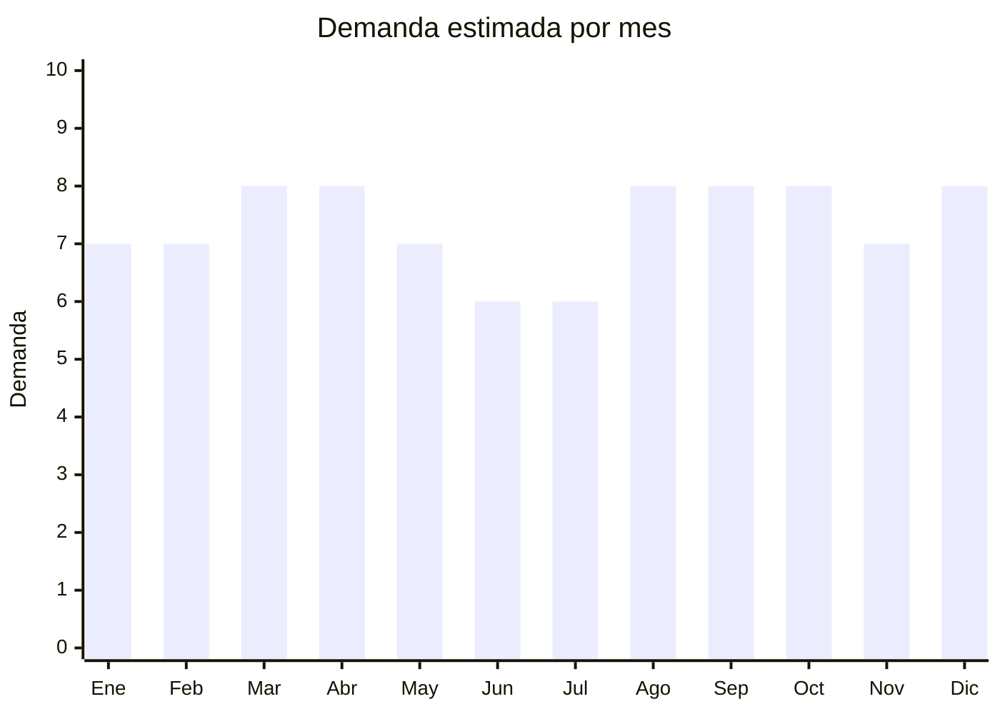

# Pelotas Deportivas

> **Capitulo NCM 95** — Juguetes, juegos y articulos para recreo o deporte | **Temporada:** Atemporal

## Que es y por que importarlo

Las pelotas deportivas son articulos de recreo y deporte fabricados en PVC, PU (poliuretano) o cuero sintetico, utilizados para futbol, basquet, voley, handball y fitness. Incluyen desde pelotas de entrenamiento economicas hasta modelos de competicion cosidos a mano. El proceso de fabricacion se concentra en Sialkot (Pakistan) para gama alta cosida y en Yiwu/Dongguan (China) para gama media y economica en PVC y PU termosellado.

Argentina es un pais donde el futbol es practicamente una religion: hay demanda permanente de pelotas en todos los segmentos, desde las pelotas de entrenamiento para escuelitas de futbol hasta modelos de competicion para ligas amateurs. El segmento economico (pelotas PVC para entrenamiento, uso recreativo y escolar) tiene espacio enorme porque las marcas locales como Striker, DRB y Penalty cubren gama media, dejando el segmento entry-level con poca oferta de calidad. Ademas, la demanda no se limita al futbol: basquet, voley y pelotas de fitness (pilates, yoga) mantienen volumen constante durante todo el ano.

El margen bruto tipico oscila entre 150% y 250%, con la ventaja adicional de que **no requieren certificacion IRAM** por tratarse de articulos deportivos para adultos (salvo que se comercialicen especificamente como juguetes para menores de 14 anos). Las pelotas se envian desinfladas, lo que reduce drasticamente el volumen del envio y permite aprovechar mejor el espacio en contenedores o envios aereos.

## Datos clave

| Dato | Valor |
|------|-------|
| **Posiciones NCM tipicas** | 9506.62.00 |
| **Derecho de importacion** | 20% (DIE) + 3% tasa estadistica |
| **Rango FOB tipico** | USD 3 — USD 15 por unidad |
| **Precio de venta en Argentina** | ARS 10,000 — ARS 50,000 |
| **Margen bruto estimado** | 150% — 250% |
| **MOQ tipico** | 50 — 200 unidades |
| **Demanda en MercadoLibre** | Muy Alta |
| **Competencia en MercadoLibre** | Alta |
| **Dificultad para importar** | Baja |
| **Certificaciones necesarias** | Ninguna obligatoria (articulo deportivo adulto) |
| **Antidumping** | **No** |

## Variantes y subtipos mas comunes

| Subtipo / Variante | FOB aprox. | Venta AR aprox. | Nota |
|--------------------|-----------|-----------------|------|
| Futbol N5 entrenamiento PVC | USD 3 — 5 | ARS 10,000 — 18,000 | Mayor volumen de ventas, escuelas y recreativo |
| Futbol N5 match PU cosido | USD 8 — 15 | ARS 25,000 — 50,000 | Calidad superior, ligas amateurs y semi-pro |
| Basquet N7 indoor/outdoor | USD 5 — 12 | ARS 15,000 — 40,000 | Goma outdoor o PU indoor, demanda estable |
| Voley playa | USD 4 — 8 | ARS 12,000 — 25,000 | Cosido a maquina, segmento recreativo fuerte |
| Pelota fitness/pilates 65cm | USD 3 — 6 | ARS 10,000 — 20,000 | Anti-burst, incluye inflador, home gym |

## Regulaciones y requisitos

<Tabs>
  <Tab title="Certificaciones">
    | Organismo | Requiere | Detalle | Costo aprox. | Tiempo aprox. |
    |-----------|----------|---------|-------------|--------------|
    | ARCA (Aduana) | Si siempre | Despacho de importacion | Variable | — |
    | IRAM | **No** | No aplica para articulos deportivos de adultos | — | — |
    | S-Mark | No | No es producto electrico | — | — |
    | ENACOM | No | No emite radiofrecuencia | — | — |
    | ANMAT | No | No es producto medico | — | — |

    <Note>
    Las pelotas deportivas **no requieren certificacion IRAM** ya que son articulos deportivos para adultos, no juguetes. Sin embargo, si se comercializan especificamente como "pelota de futbol infantil" dirigida a menores de 14 anos (por ejemplo, pelotas N3 con dibujos animados), **si activaria la obligacion de IRAM 3583**. La recomendacion es posicionarlas como articulo deportivo general para evitar este requisito.
    </Note>
  </Tab>

  <Tab title="Etiquetado">
    | Requisito | Aplica |
    |-----------|--------|
    | Idioma espanol | Si |
    | Datos del importador | Si |
    | Material de fabricacion | Si |
    | Tamano/peso oficial | Recomendado |
    | Presion de inflado recomendada | Recomendado |
    | Pais de origen | Si |
    | Instrucciones de cuidado | Recomendado |

    Incluir en espanol: datos del importador con CUIT, pais de origen, material (PVC, PU, cuero sintetico), tamano oficial (N3, N4, N5), presion de inflado recomendada en PSI/bar e instrucciones de cuidado (no exponer al sol directo, no sobre-inflar).
  </Tab>

  <Tab title="Restricciones">
    No hay medidas antidumping ni restricciones especificas para pelotas deportivas. Consideraciones:

    - Si se comercializan como "juguetes" para menores de 14 anos, se activa IRAM 3583
    - Pelotas de PVC muy barato pueden tener olor fuerte a quimicos (ftalatos) y generar reclamos
    - Las pelotas de futbol con disenos que imiten marcas registradas (Adidas, Nike, FIFA) pueden ser retenidas por propiedad intelectual
    - Verificar que las valvulas de inflado sean compatibles con infladores estandar
    - Las pelotas fitness anti-burst deben pasar prueba de carga (verificar certificado del fabricante)
  </Tab>
</Tabs>

## Logistica

| Dato | Valor |
|------|-------|
| **Peso tipico por unidad** | 0.3 — 0.5 kg (desinflada) |
| **Volumen tipico** | Muy bajo (se envian desinfladas y plegadas) |
| **Fragilidad** | Nula |
| **Envio recomendado** | Aereo para lotes chicos, maritimo para volumenes |
| **Tiempo total estimado** (pedido a deposito) | 3 — 6 semanas (aereo) / 8 — 12 semanas (maritimo) |
| **Baterias de litio** | No |
| **Requiere empaque especial** | No: se envian desinfladas en bolsa individual + caja master |

<Tip>
La clave logistica de las pelotas deportivas es que **se envian desinfladas**: esto reduce el volumen entre un 70% y 80%, permitiendo empacar cientos de unidades en espacios reducidos. Un envio de 200 pelotas desinfladas puede pesar apenas 80-100 kg, haciendo viable el envio aereo para primeros pedidos. Incluir siempre un inflador manual o aguja de inflado como accesorio de valor agregado. Solicitar al proveedor que empaque en bolsas individuales con la pelota plegada y un inflador por cada 10-20 unidades.
</Tip>

## Estacionalidad



| Aspecto | Detalle |
|---------|---------|
| **Meses pico** | Marzo-Abril (inicio de temporada futbol), Agosto (Dia del Nino, inicio torneos), Diciembre (regalos navidad) |
| **Meses valle** | Junio-Julio (invierno, receso deportivo) |
| **Cuando pedir para llegar a tiempo** | Enero para temporada marzo, Junio para temporada agosto, Septiembre para temporada diciembre |

## Ventajas y riesgos

<CardGroup cols={2}>
  <Card title="Ventajas" icon="circle-check">
    - **No requiere certificaciones** — importacion simple y directa
    - Demanda inagotable en Argentina por cultura futbolera
    - Se envian desinfladas: volumen reducido, flete economico
    - Margenes del 150% al 250% en segmento economico
    - MOQ bajo: proveedores aceptan desde 50 unidades
    - Producto resistente: no se rompe en transito
    - Multiples deportes cubren demanda todo el ano (futbol, basquet, voley, fitness)
  </Card>
  <Card title="Riesgos" icon="triangle-exclamation">
    - Competencia alta de marcas locales (Striker, DRB, Penalty)
    - Pelotas PVC baratas pierden forma y color rapidamente (reclamos)
    - Imitaciones de marcas registradas pueden ser retenidas en aduana
    - Guerra de precios en segmento economico
    - Pelotas de baja calidad pueden tener olor quimico fuerte (ftalatos)
    - Diferenciacion limitada sin marca propia
  </Card>
</CardGroup>

## Palabras clave para buscar en Alibaba

```
soccer ball size 5 PVC training, football PU thermal bonded,
basketball size 7 outdoor rubber, volleyball beach PVC,
pilates ball 65cm anti-burst, exercise ball with pump,
soccer ball custom logo OEM, football machine stitched PU
```

## Fuentes

- [Nomenclador NCM - ARCA (ex-AFIP)](https://www.arca.gob.ar)
- [MercadoLibre Argentina - Pelotas futbol](https://www.mercadolibre.com.ar/pelotas-futbol)
- [Alibaba - Soccer ball suppliers](https://www.alibaba.com/trade/search?SearchText=soccer+ball+size+5)
- [Ministerio de Economia - Arancel externo comun](https://www.argentina.gob.ar/economia)
