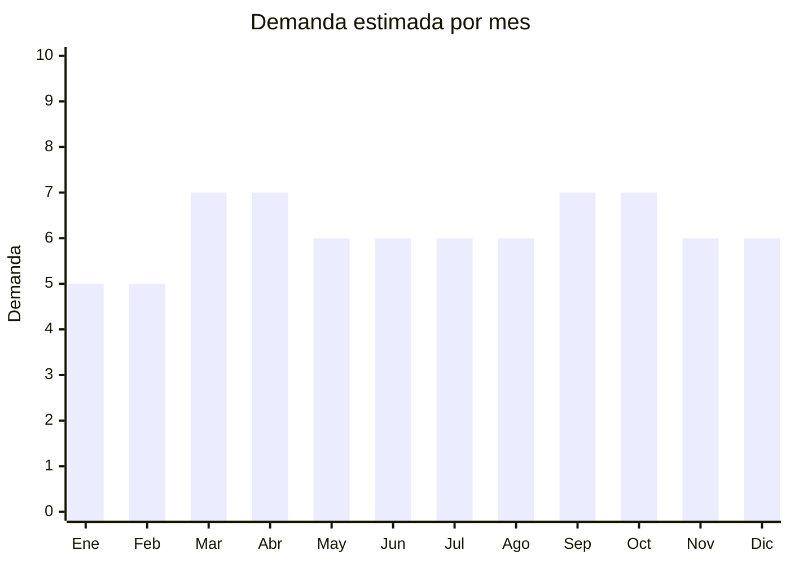

# Botones, cierres y accesorios de costura

> **Capítulo NCM 96** — Manufacturas diversas | **Temporada:** Atemporal

## Qué es y por qué importarlo

Los botones, cierres de cremallera (zippers), snaps (broches a presión), velcro y demás accesorios de mercería son insumos fundamentales para la industria de la confección, la costura doméstica y las reparaciones textiles. Se comercializan tanto al por mayor (para talleres de costura y fábricas) como en kits surtidos organizados (para modistas independientes, hobbyistas y mercerías). Los kits surtidos en cajas organizadoras con compartimentos son particularmente populares en MercadoLibre porque agregan enorme valor percibido a un producto que por unidad cuesta centavos.

Yiwu (Zhejiang, China) es el centro mundial absoluto de mercería y accesorios de costura. El Yiwu International Trade Market tiene más de 10.000 proveedores de botones, cierres, cintas, hilos y todo tipo de accesorios de costura. Los precios FOB son extraordinariamente bajos: un botón individual cuesta entre USD 0.01 y USD 0.10, y un kit surtido de 300-500 piezas variadas se consigue por USD 1-5. En Argentina, estos kits se venden a ARS 1.000-5.000 (y hasta ARS 8.000 los más completos), generando márgenes brutos de 300-600% que son de los más altos de cualquier categoría de importación.

En MercadoLibre Argentina, el nicho de mercería y accesorios de costura tiene una competencia sorprendentemente baja comparada con otros rubros. Las modistas, costureras, hobbyistas de costura y pequeñas mercerías de barrio son los principales compradores. Es un mercado de nicho pero estable: la gente siempre necesita reparar ropa, coser botones, reemplazar cierres. Los kits surtidos en cajas organizadoras plásticas se venden significativamente mejor que los botones o cierres sueltos, porque el formato "todo en uno" resuelve la necesidad del comprador de forma completa y tiene una presentación visual atractiva.

## Datos clave

| Dato | Valor |
|------|-------|
| **Posiciones NCM típicas** | 9606 (botones, automáticos, gemelos), 9607 (cierres de cremallera/zippers) |
| **Derecho de importación** | 18% (DIE) + 3% tasa estadística |
| **Rango FOB típico** | USD 0.01 — USD 0.10 por unidad / USD 1.00 — USD 5.00 por kit surtido |
| **Precio de venta en Argentina** | ARS 1.000 — ARS 5.000 por pack/kit |
| **Margen bruto estimado** | 300% — 600% |
| **MOQ típico** | 1.000 — 10.000 unidades sueltas / 50 — 200 kits surtidos |
| **Demanda en MercadoLibre** | Media (nicho modistas/mercerías) |
| **Competencia en MercadoLibre** | Baja |
| **Dificultad para importar** | Muy baja (sin regulaciones especiales) |
| **Certificaciones necesarias** | Ninguna especial |
| **Antidumping** | No |

## Variantes y subtipos más comunes

| Subtipo / Variante | FOB aprox. | Venta AR aprox. | Nota |
|--------------------|-----------|-----------------|------|
| Kit surtido botones (300-500 piezas en caja organizadora) | USD 1.00 — 5.00 | ARS 3.000 — 8.000 | **Mayor valor percibido** — la caja organizadora vende |
| Cierres invisibles pack x10 | USD 0.50 — 2.00 | ARS 2.000 — 5.000 | Alta demanda en modistas, colores surtidos |
| Snaps/broches a presión pack x100 | USD 0.50 — 2.00 | ARS 1.500 — 4.000 | Herramienta de instalación incluida agrega valor |
| Botones jean/metal para costura (pack x50) | USD 0.50 — 2.00 | ARS 1.500 — 4.000 | Nicho jeans/denim. Incluir herramienta de colocación |
| Velcro rollo 25m | USD 1.00 — 3.00 | ARS 2.000 — 6.000 | Uso doméstico + industrial. Alta rotación |

## Regulaciones y requisitos

<Tabs>
  <Tab title="Certificaciones">
    | Organismo | Requiere | Detalle | Costo aprox. | Tiempo aprox. |
    |-----------|----------|---------|-------------|--------------|
    | ARCA (Aduana) | Sí siempre | Despacho de importación estándar | Variable | — |
    | ANMAT | No | No es producto cosmético ni alimenticio | — | — |
    | INTI | No | No requiere certificación técnica para accesorios de costura | — | — |
    | S-Mark | No | No es producto eléctrico | — | — |

    <Note>
    Los botones, cierres y accesorios de costura son uno de los productos con **menos regulaciones** para importar. No requieren certificaciones especiales de ningún organismo (ANMAT, ENACOM, S-Mark, SENASA). Solo el despacho aduanero estándar a través de ARCA. Esto los convierte en un producto ideal para importadores principiantes.
    </Note>
  </Tab>

  <Tab title="Etiquetado">
    | Requisito | Aplica |
    |-----------|--------|
    | Idioma español | Sí |
    | Datos del importador | Sí |
    | País de origen | Sí |
    | Composición / material | Recomendado (plástico, metal, nylon) |
    | Cantidad por pack | Sí |
    | Tamaño / medidas | Recomendado (diámetro en mm para botones, largo en cm para cierres) |

    El etiquetado es mínimo. Un sticker con datos del importador, CUIT, país de origen y cantidad es suficiente. Para kits surtidos, una etiqueta que indique "Kit de costura — X piezas" y la composición general del contenido.
  </Tab>

  <Tab title="Restricciones">
    No hay medidas antidumping ni restricciones especiales para botones, cierres o accesorios de costura. Tener en cuenta:

    - Algunos botones metálicos pueden contener **níquel** en exceso, lo que puede causar alergias dermatológicas. Si se destinan a ropa en contacto directo con la piel, verificar que cumplan con límites de liberación de níquel (norma EN 12472).
    - Los botones con **plomo** están prohibidos para uso en ropa infantil en muchos países. Verificar con el proveedor que el material sea libre de plomo, especialmente para botones pintados.
    - Los cierres de cremallera de marca (YKK, SBS, etc.) tienen propiedad intelectual. Importar réplicas con marca falsificada puede resultar en decomiso. Comprar genéricos sin marca o con marca propia.
  </Tab>
</Tabs>

## Logística

| Dato | Valor |
|------|-------|
| **Peso típico por unidad** | 0.001 — 0.01 kg (botón individual) / 0.20 — 0.50 kg (kit surtido con caja) |
| **Volumen típico** | Muy bajo |
| **Fragilidad** | Muy baja (plástico y metal resistente) |
| **Envío recomendado** | Aéreo o courier (producto ultraliviano) |
| **Tiempo total estimado** | 15 — 25 días (aéreo/courier) / 50 — 70 días (marítimo) |
| **Baterías de litio** | No |
| **Requiere empaque especial** | No — los kits en caja organizadora ya tienen su propio empaque. Bolsa ziplock para botones sueltos |

<Tip>
**El empaque agrega más valor que el producto.** Un lote de 500 botones sueltos en una bolsa cuesta USD 2-5 FOB y se vende a ARS 1.000-2.000. Los mismos 500 botones organizados por color y tamaño en una caja plástica con compartimentos cuestan USD 3-7 FOB y se venden a ARS 5.000-8.000. La diferencia de costo es mínima pero la percepción de valor se triplica. Siempre pedir al proveedor que empaque en cajas organizadoras con separadores.
</Tip>

## Estacionalidad



| Aspecto | Detalle |
|---------|---------|
| **Meses pico** | Marzo-Abril (vuelta a clases: uniformes escolares, reparaciones) y Septiembre-Octubre (cambio de temporada: ajustes de ropa, talleres de costura preparan colecciones primavera-verano) |
| **Meses valle** | Enero-Febrero (vacaciones, talleres cerrados) y Diciembre (fiestas, menor actividad de costura) |
| **Cuándo pedir para llegar a tiempo** | Diciembre-Enero para tener stock en marzo (vuelta a clases). Julio-Agosto para temporada primavera |

## Ventajas y riesgos

<CardGroup cols={2}>
  <Card title="Ventajas" icon="circle-check">
    - **Márgenes excepcionales:** 300-600% — de los más altos en importación
    - Producto ultraliviano: flete aéreo/courier por centavos
    - Cero regulaciones especiales: no requiere ANMAT, ENACOM, S-Mark ni ninguna certificación
    - Competencia baja en MercadoLibre — nicho poco explotado
    - Demanda estable: la gente siempre necesita reparar ropa y coser
    - MOQ accesible: 50-200 kits surtidos = inversión muy baja
    - Los kits organizados en cajas plásticas tienen altísima percepción de valor
    - Yiwu tiene miles de proveedores: fácil encontrar buenos precios
  </Card>
  <Card title="Riesgos" icon="triangle-exclamation">
    - Mercado de nicho: volumen total menor que productos masivos (electrónica, ropa)
    - Ticket promedio bajo (ARS 2.000-5.000) — requiere alto volumen para facturación significativa
    - Variedad excesiva de SKUs: gestionar colores, tamaños y tipos puede ser complejo
    - Control de calidad difícil en productos de centavos: mezclas incorrectas, medidas variables
    - Mercerías de barrio compran por costumbre a distribuidores locales — cambiar proveedor es lento
    - Productos metálicos pueden oxidarse si el almacenamiento no es adecuado (humedad)
  </Card>
</CardGroup>

<Warning>
**Gestión de inventario.** El mayor desafío de este nicho no es la importación sino la gestión de la variedad. Un kit surtido puede tener 20 tipos de botones en 10 colores y 5 tamaños. Definir con el proveedor exactamente qué va en cada kit antes de producir, y solicitar fotos de pre-producción del armado. Un kit mal surtido (con exceso de un color que nadie quiere) genera stock muerto.
</Warning>

## Palabras clave para buscar en Alibaba

```
buttons assorted box set, sewing kit organizer box, zipper invisible wholesale,
snap buttons kit with tool, jean buttons metal denim, velcro hook loop roll 25m,
sewing accessories kit box, buttons wholesale Yiwu, zipper pack assorted colors,
plastic organizer box sewing supplies, press studs snap fastener kit
```

## Fuentes

- [MercadoLibre Argentina — Kit botones costura](https://listado.mercadolibre.com.ar/kit-botones-costura)
- [MercadoLibre Argentina — Cierres cremallera](https://listado.mercadolibre.com.ar/cierres-cremallera-costura)
- [Alibaba — Sewing buttons kit wholesale](https://www.alibaba.com/trade/search?SearchText=sewing+buttons+kit+box)
- [Yiwu International Trade Market](https://www.yiwu-market.cn)
- [ARCA — Nomenclador NCM](https://www.arca.gob.ar)
