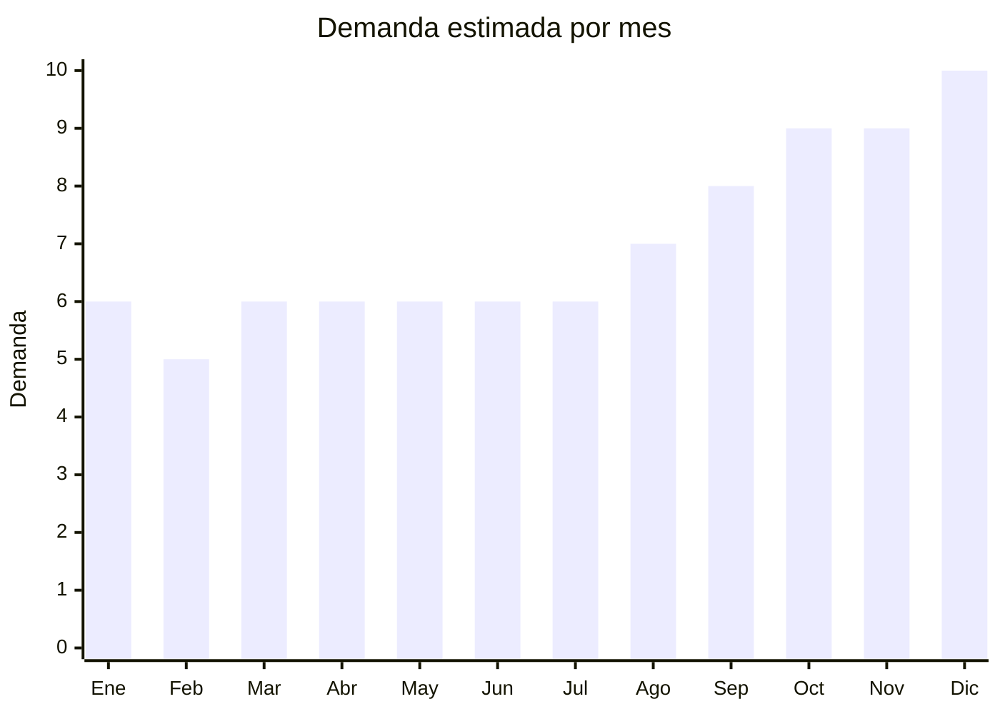

# Brochas y pinceles de maquillaje

> **Capítulo NCM 96** — Manufacturas diversas | **Temporada:** Atemporal

## Qué es y por qué importarlo

Las brochas y pinceles de maquillaje son herramientas cosméticas utilizadas para aplicar, difuminar y mezclar productos como base, polvo, rubor, sombras de ojos y contorno. Se comercializan en sets de 5 a 15 piezas (con estuche enrollable o rígido de cuero sintético) o como brochas individuales de uso específico (kabuki, abanico, contorno). Es uno de los productos de belleza con mayor demanda en Argentina y toda Latinoamérica, impulsado por la cultura del maquillaje en redes sociales.

China produce más del 80% de las brochas de maquillaje a nivel mundial. Las principales zonas de producción son Shenzhen (Guangdong) y Tianjin, donde se fabrican brochas tanto para marcas globales de lujo (MAC, Sigma, BH Cosmetics) como para líneas económicas y white-label. El pelo sintético de alta calidad (taklon, nylon suave) ha reemplazado casi por completo al pelo natural, reduciendo costos sin sacrificar performance. Esto permite acceder a sets completos desde USD 1 FOB con una calidad aceptable para el mercado masivo.

Un punto clave es que las brochas de maquillaje NO son cosméticos: son herramientas/accesorios. Esto significa que en Argentina generalmente no requieren registro ante ANMAT (Administración Nacional de Medicamentos, Alimentos y Tecnología Médica), lo que simplifica enormemente el proceso de importación frente a productos cosméticos como cremas o labiales. En MercadoLibre Argentina, los sets de brochas con estuche de cuero sintético se perciben como producto premium y alcanzan precios de venta de ARS 8.000 a 25.000, generando márgenes brutos superiores al 300%. La demanda es constante todo el año, con picos en fechas como Día de la Madre, Navidad y Hot Sale.

## Datos clave

| Dato | Valor |
|------|-------|
| **Posiciones NCM típicas** | 9603.30.00 (pinceles y brochas para cosméticos/maquillaje) |
| **Derecho de importación** | 18% (DIE) + 3% tasa estadística |
| **Rango FOB típico** | USD 1.00 — USD 8.00 por set |
| **Precio de venta en Argentina** | ARS 5.000 — ARS 25.000 |
| **Margen bruto estimado** | 200% — 400% |
| **MOQ típico** | 50 — 200 sets |
| **Demanda en MercadoLibre** | Alta |
| **Competencia en MercadoLibre** | Media-Alta |
| **Dificultad para importar** | Baja (sin regulaciones especiales) |
| **Certificaciones necesarias** | Ninguna especial — ANMAT generalmente no aplica (es accesorio, no cosmético) |
| **Antidumping** | No |

## Variantes y subtipos más comunes

| Subtipo / Variante | FOB aprox. | Venta AR aprox. | Nota |
|--------------------|-----------|-----------------|------|
| Set 10-15 brochas con estuche PU | USD 3.00 — 8.00 | ARS 10.000 — 25.000 | **Mayor valor percibido** — el estuche vende |
| Set 5 brochas viaje mini | USD 1.00 — 3.00 | ARS 5.000 — 12.000 | Compacto, ideal regalo y primera compra |
| Brocha kabuki individual | USD 0.50 — 2.00 | ARS 3.000 — 8.000 | Alta rotación, producto complementario |
| Set con beauty blender incluida | USD 2.00 — 5.00 | ARS 8.000 — 18.000 | Combo percibido como completo |
| Brochas pelo sintético premium (taklon) | USD 4.00 — 8.00 | ARS 12.000 — 25.000 | Calidad comparable a marcas de USD 30-50 retail |

## Regulaciones y requisitos

<Tabs>
  <Tab title="Certificaciones">
    | Organismo | Requiere | Detalle | Costo aprox. | Tiempo aprox. |
    |-----------|----------|---------|-------------|--------------|
    | ARCA (Aduana) | Sí siempre | Despacho de importación estándar | Variable | — |
    | ANMAT | **No** (generalmente) | Las brochas son accesorios/herramientas, NO cosméticos. No requieren registro sanitario | — | — |
    | INAL / SENASA | No | No aplica — no es alimento ni producto de origen animal (pelo sintético) | — | — |
    | S-Mark | No | No es producto eléctrico | — | — |

    <Note>
    Si las brochas incluyen pelo de origen animal (pelo de cabra, marta, etc.), podrían requerir certificado fitosanitario o SENASA. Sin embargo, el 95% de las brochas chinas actuales usan pelo 100% sintético (taklon/nylon), lo que elimina este requisito. Verificar siempre con el proveedor que el material sea sintético.
    </Note>
  </Tab>

  <Tab title="Etiquetado">
    | Requisito | Aplica |
    |-----------|--------|
    | Idioma español | Sí |
    | Datos del importador | Sí |
    | Composición / materiales | Sí (indicar tipo de pelo: sintético/taklon) |
    | País de origen | Sí |
    | Instrucciones de uso / cuidado | Recomendado |
    | Garantía legal 6 meses | Sí (Ley de Defensa del Consumidor) |

    El etiquetado puede resolverse con stickers adheridos al packaging original. Incluir: nombre del importador, CUIT, dirección, país de origen y composición del pelo (sintético). No se requiere registro ANMAT ni número de lote cosmético.
  </Tab>

  <Tab title="Restricciones">
    No hay medidas antidumping ni restricciones específicas para brochas de maquillaje. Tener en cuenta:

    - Si se importan como "cosméticos" por error de clasificación NCM, la aduana puede exigir registro ANMAT. Asegurar que la posición arancelaria sea 9603.30.00 (cepillos/brochas) y NO la de cosméticos.
    - Si las brochas incluyen pelo animal, puede requerir documentación CITES o SENASA según la especie.
    - Verificar que los mangos/ferrules no contengan niveles de plomo o cadmio superiores a los permitidos (especialmente en pinturas de mangos económicos).
  </Tab>
</Tabs>

## Logística

| Dato | Valor |
|------|-------|
| **Peso típico por unidad** | 0.10 — 0.30 kg (set con estuche) |
| **Volumen típico** | Muy bajo |
| **Fragilidad** | Baja (pelo flexible, mangos resistentes) |
| **Envío recomendado** | Aéreo o courier (producto ultraliviano) |
| **Tiempo total estimado** | 15 — 25 días (aéreo) / 50 — 70 días (marítimo) |
| **Baterías de litio** | No |
| **Requiere empaque especial** | No — el estuche propio protege las brochas. Caja master estándar es suficiente |

<Tip>
Las brochas de maquillaje son uno de los productos más convenientes para envío aéreo: un pedido de 200 sets (con estuche) pesa aproximadamente 40-60 kg y ocupa muy poco volumen. El costo de flete aéreo desde Shenzhen o Yiwu es mínimo comparado con el valor de la mercadería. Para primeras importaciones, courier tipo DHL/FedEx es perfectamente viable y permite recibir en 7-15 días.
</Tip>

## Estacionalidad



| Aspecto | Detalle |
|---------|---------|
| **Meses pico** | Octubre (Día de la Madre), Noviembre-Diciembre (Black Friday, Navidad — regalo ideal), Marzo (vuelta a clases/regalos) |
| **Meses valle** | Enero-Febrero (post-fiestas) |
| **Cuándo pedir para llegar a tiempo** | Julio-Agosto para tener stock en octubre (Día de la Madre) y temporada navideña |

## Ventajas y riesgos

<CardGroup cols={2}>
  <Card title="Ventajas" icon="circle-check">
    - Márgenes brutos de 200-400% — especialmente en sets con estuche premium
    - NO requiere ANMAT ni certificaciones especiales (es accesorio, no cosmético)
    - Producto ultraliviano: flete aéreo viable incluso para volúmenes pequeños
    - MOQ muy bajo (desde 50 sets) — ideal para empezar con poco capital
    - Ideal para marca propia: los proveedores ofrecen grabado láser en mangos y logo en estuche
    - Demanda constante impulsada por redes sociales y cultura beauty
    - Sets en estuche de cuero sintético se perciben como producto premium de USD 30-50
  </Card>
  <Card title="Riesgos" icon="triangle-exclamation">
    - Competencia creciente: muchos importadores ya venden sets similares
    - Calidad del pelo variable: los sets sub-USD 1 FOB suelen tener pelo que se cae o irrita la piel
    - Estuches de PU económicos pueden pelarse o agrietarse rápidamente
    - Diferenciación difícil si no se invierte en branding propio
    - Los colores y acabados del pelo pueden variar entre lotes de producción
    - Reclamos por alergias: aunque raro con pelo sintético, puede ocurrir con materiales de baja calidad
  </Card>
</CardGroup>

<Warning>
Antes de hacer un pedido grande, solicitar muestras de al menos 3 proveedores distintos. Probar la suavidad del pelo, la firmeza del engaste (ferrule) y la durabilidad del estuche. Los sets sub-USD 1.00 FOB frecuentemente tienen pelo que se desprende al primer uso, lo que genera devoluciones masivas y reseñas negativas en MercadoLibre.
</Warning>

## Palabras clave para buscar en Alibaba

```
makeup brush set with PU case, cosmetic brush set OEM,
15 piece makeup brush set custom logo, kabuki brush wholesale,
synthetic hair makeup brush factory, taklon makeup brush set,
beauty blender set with brushes, travel makeup brush mini set,
private label makeup brushes manufacturer Shenzhen
```

## Fuentes

- [MercadoLibre Argentina — Sets de brochas maquillaje](https://listado.mercadolibre.com.ar/set-brochas-maquillaje)
- [Alibaba — Makeup brush set suppliers](https://www.alibaba.com/trade/search?SearchText=makeup+brush+set+pu+case)
- [ARCA — Nomenclador NCM](https://www.arca.gob.ar)
- [ANMAT — Registro de productos](https://www.argentina.gob.ar/anmat)
