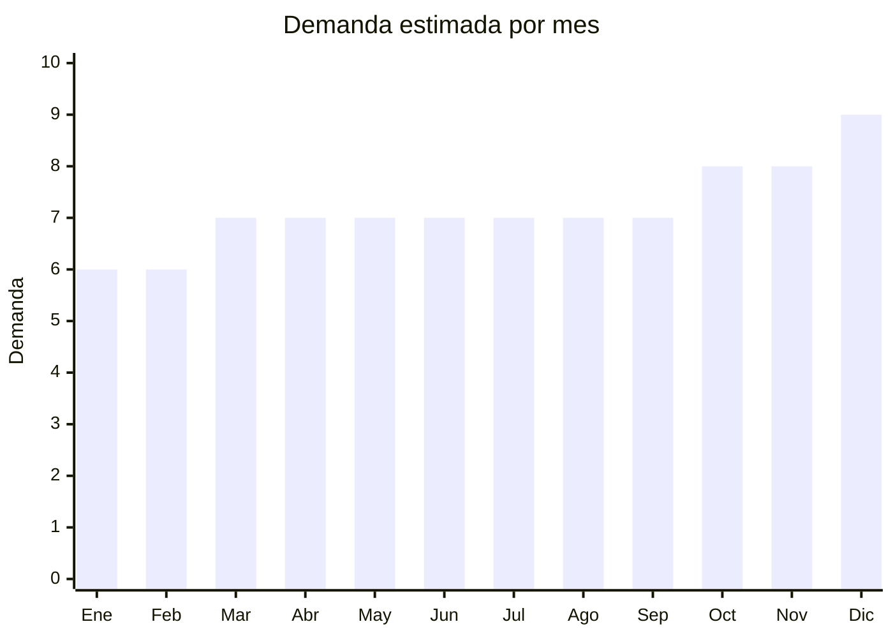

# Cepillos dentales eléctricos

> **Capítulo NCM 96** — Manufacturas diversas | **Temporada:** Atemporal

## Qué es y por qué importarlo

Los cepillos dentales eléctricos sónicos son dispositivos de higiene bucal que utilizan vibraciones de alta frecuencia (30.000-40.000 movimientos por minuto) para limpiar los dientes de forma más eficiente que un cepillo manual. Los modelos actuales incluyen funciones como temporizador de 2 minutos (recomendación odontológica), múltiples modos de limpieza (sensible, blanqueamiento, masaje), indicador de batería y carga USB-C. Los cabezales de repuesto compatibles con marcas como Oral-B y Philips Sonicare representan un negocio complementario de altísima rentabilidad por su naturaleza de venta recurrente.

China es el mayor fabricante mundial de cepillos dentales eléctricos, con centros de producción en Shenzhen (Guangdong) y Ningbo (Zhejiang). Las mismas fábricas que producen para marcas premium (Philips, Oral-B, Colgate) también fabrican modelos OEM/white-label con tecnología similar a una fracción del precio. Un cepillo sónico USB con timer se consigue a USD 3-10 FOB, mientras que en Argentina se vende entre ARS 15.000 y ARS 50.000. Los cabezales compatibles son el verdadero negocio oculto: cuestan USD 0.20-0.50 por unidad FOB (pack de 4-8 cabezales) y se venden a ARS 3.000-8.000 por pack, con márgenes que superan el 400%.

En MercadoLibre Argentina, la demanda de cepillos eléctricos sónicos está en crecimiento sostenido, impulsada por la tendencia de autocuidado y salud preventiva. Los cabezales compatibles tienen demanda aún más alta porque los usuarios de Oral-B y Philips Sonicare necesitan reemplazarlos cada 3 meses (según recomendación odontológica), generando compras recurrentes. Es un negocio con dos frentes: el cepillo (compra única, margen bueno) y los cabezales (compra repetida, margen excepcional, ultralivianos).

## Datos clave

| Dato | Valor |
|------|-------|
| **Posiciones NCM típicas** | 9603.21.00 (cepillos de dientes, incluidos los eléctricos) |
| **Derecho de importación** | 18% (DIE) + 3% tasa estadística |
| **Rango FOB típico** | USD 0.20 — USD 10.00 por unidad (según producto) |
| **Precio de venta en Argentina** | ARS 3.000 — ARS 50.000 (según producto) |
| **Margen bruto estimado** | 200% — 400% |
| **MOQ típico** | 50 — 200 unidades (cepillos) / 200 — 1.000 packs (cabezales) |
| **Demanda en MercadoLibre** | Alta (creciente) |
| **Competencia en MercadoLibre** | Media |
| **Dificultad para importar** | Media (puede requerir S-Mark para modelos eléctricos) |
| **Certificaciones necesarias** | Puede requerir S-Mark (seguridad eléctrica). ANMAT generalmente no aplica (no es producto medicinal) |
| **Antidumping** | No |

## Variantes y subtipos más comunes

| Subtipo / Variante | FOB aprox. | Venta AR aprox. | Nota |
|--------------------|-----------|-----------------|------|
| Sónico básico USB recargable | USD 3.00 — 5.00 | ARS 15.000 — 25.000 | **Entrada al mercado** — timer 2 min, 3 modos |
| Sónico con timer + 5 modos + estuche viaje | USD 5.00 — 10.00 | ARS 25.000 — 50.000 | Modelo premium con mayor margen |
| Cabezales compatibles Oral-B (pack x4/x8) | USD 0.20 — 0.50/u | ARS 3.000 — 8.000/pack | **El verdadero negocio** — venta recurrente |
| Cabezales compatibles Philips Sonicare | USD 0.30 — 0.80/u | ARS 4.000 — 10.000/pack | Menos volumen que Oral-B pero mayor margen |
| Cepillo infantil con diseños | USD 3.00 — 6.00 | ARS 12.000 — 30.000 | Nicho con menos competencia, ideal regalo |

## Regulaciones y requisitos

<Tabs>
  <Tab title="Certificaciones">
    | Organismo | Requiere | Detalle | Costo aprox. | Tiempo aprox. |
    |-----------|----------|---------|-------------|--------------|
    | ARCA (Aduana) | Sí siempre | Despacho de importación estándar | Variable | — |
    | S-Mark (seguridad eléctrica) | Puede requerir | Para modelos eléctricos con batería de litio recargable. Consultar con despachante | USD 200 — 500 por modelo | 4 — 6 semanas |
    | ANMAT | Generalmente no | El cepillo es dispositivo de higiene, no medicinal. No requiere registro como producto médico | — | — |
    | ENACOM | No | No emite radiofrecuencia (no es Bluetooth/WiFi, salvo modelos smart raros) | — | — |

    <Note>
    Los **cabezales de repuesto** (sin componente eléctrico) no requieren S-Mark ni ninguna certificación especial. Son simplemente cerdas plásticas con conector. Esto los convierte en el producto más fácil de importar del rubro, con regulaciones mínimas y márgenes excepcionales.
    </Note>
  </Tab>

  <Tab title="Etiquetado">
    | Requisito | Aplica |
    |-----------|--------|
    | Idioma español | Sí |
    | Datos del importador | Sí |
    | Instrucciones de uso | Sí |
    | Tipo de cerdas (dureza) | Recomendado (suave, medio) |
    | País de origen | Sí |
    | Instrucciones de carga (modelos eléctricos) | Sí |
    | Garantía legal 6 meses | Sí |
    | Compatibilidad (para cabezales) | Sí — indicar modelos compatibles |

    Para los cabezales compatibles, indicar claramente con qué modelos son compatibles (ej: "Compatible con Oral-B Vitality, Pro, Smart, Genius"). Nunca usar los logos de Oral-B o Philips sin autorización — usar la palabra "compatible" o "genérico".
  </Tab>

  <Tab title="Restricciones">
    No hay medidas antidumping vigentes para cepillos dentales. Tener en cuenta:

    - Los cepillos eléctricos con batería de litio recargable tienen restricción menor de transporte (UN38.3), similar a cualquier dispositivo con batería pequeña.
    - Para cabezales compatibles: no hay restricciones especiales. Es un producto de plástico sin componentes regulados.
    - **Marcas registradas:** NUNCA usar los logos de Oral-B, Philips o Sonicare en el packaging. Usar la palabra "compatible" o "genérico apto para". El uso no autorizado de marcas registradas puede resultar en retención aduanera y acciones legales.
    - La clasificación NCM 9603.21.00 incluye tanto cepillos manuales como eléctricos.
  </Tab>
</Tabs>

## Logística

| Dato | Valor |
|------|-------|
| **Peso típico por unidad** | 0.10 — 0.25 kg (cepillo con caja) / 0.02 — 0.05 kg (pack cabezales) |
| **Volumen típico** | Muy bajo |
| **Fragilidad** | Baja |
| **Envío recomendado** | Aéreo o courier (producto ultraliviano, especialmente cabezales) |
| **Tiempo total estimado** | 15 — 25 días (aéreo) / 50 — 70 días (marítimo) |
| **Baterías de litio** | **Sí** (cepillos eléctricos) — requiere UN38.3. **No** para cabezales sueltos |
| **Requiere empaque especial** | No — packaging individual estándar es suficiente |

<Tip>
**Los cabezales compatibles son el producto logístico ideal:** pesan gramos, ocupan centímetros cúbicos, no tienen batería, no requieren certificaciones y tienen márgenes de 400%+. Un pedido de 1.000 packs de cabezales (x4) pesa menos de 50 kg y cabe en una caja de cartón. Se puede enviar por courier DHL/FedEx por menos de USD 100 de flete. Es el producto perfecto para empezar a importar con riesgo mínimo.
</Tip>

## Estacionalidad



| Aspecto | Detalle |
|---------|---------|
| **Meses pico** | Noviembre-Diciembre (Navidad — regalo de salud/bienestar), Octubre (Día de la Madre). Los cabezales tienen demanda constante todo el año (reposición cada 3 meses) |
| **Meses valle** | Enero-Febrero (leve baja post-fiestas, pero demanda base es estable) |
| **Cuándo pedir para llegar a tiempo** | Agosto-Septiembre para tener stock en octubre-diciembre. Los cabezales: pedir todo el año, mantener stock permanente |

## Ventajas y riesgos

<CardGroup cols={2}>
  <Card title="Ventajas" icon="circle-check">
    - **Doble negocio:** cepillo (compra única) + cabezales (compra recurrente cada 3 meses)
    - Cabezales compatibles: margen 400%+, ultralivianos, sin certificaciones, logística trivial
    - Tendencia creciente de autocuidado y salud bucal preventiva
    - MOQ bajo para empezar (50 cepillos o 200 packs de cabezales)
    - Sin ANMAT ni ENACOM para la mayoría de modelos
    - Producto con percepción de alto valor tecnológico (sónico, timer, modos)
    - Ideal para marca propia en segmento accesible (vs. Oral-B ARS 80.000+)
  </Card>
  <Card title="Riesgos" icon="triangle-exclamation">
    - Puede requerir S-Mark para modelos eléctricos (costo y tiempo adicional)
    - Calidad de cerdas variable: las más baratas se deforman rápidamente
    - Baterías de litio de baja calidad: duración real menor a la declarada
    - Riesgo de problemas con marcas registradas si se usa branding de Oral-B/Philips
    - Competencia creciente a medida que más importadores descubren el nicho
    - Motores sónicos baratos pueden ser ruidosos o débiles
  </Card>
</CardGroup>

<Warning>
**Cabezales compatibles: cuidado con las marcas registradas.** NUNCA imprimir logos de Oral-B, Philips Sonicare, Braun ni ninguna otra marca registrada en tus cabezales o packaging. Usar siempre la palabra "compatible con" o "genérico apto para" seguida del nombre del modelo. El uso no autorizado de marcas puede resultar en decomiso de mercadería en aduana y acciones legales del titular de la marca.
</Warning>

## Palabras clave para buscar en Alibaba

```
sonic toothbrush USB rechargeable, electric toothbrush OEM manufacturer,
replacement brush heads compatible Oral-B, Sonicare compatible heads wholesale,
sonic toothbrush timer 2 minutes, kids electric toothbrush cartoon,
toothbrush heads pack 4 8 generic, electric toothbrush private label,
Shenzhen Ningbo toothbrush factory wholesale
```

## Fuentes

- [MercadoLibre Argentina — Cepillo dental eléctrico sónico](https://listado.mercadolibre.com.ar/cepillo-dental-electrico-sonico)
- [MercadoLibre Argentina — Cabezales Oral-B compatibles](https://listado.mercadolibre.com.ar/cabezales-oral-b-compatibles)
- [Alibaba — Sonic toothbrush OEM](https://www.alibaba.com/trade/search?SearchText=sonic+toothbrush+usb+rechargeable)
- [ARCA — Nomenclador NCM](https://www.arca.gob.ar)
