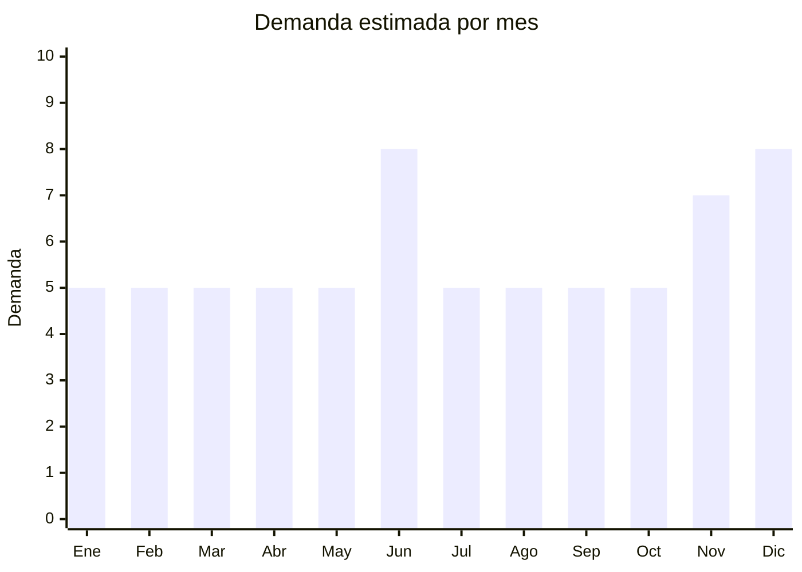

# Encendedores recargables

> **Capítulo NCM 96** — Manufacturas diversas | **Temporada:** Atemporal

## Qué es y por qué importarlo

Los encendedores son dispositivos portátiles utilizados para generar llama o arco eléctrico, empleados para encender cigarrillos, velas, hornallas, asados y otros usos domésticos. El mercado de encendedores está en plena transición tecnológica: los encendedores de arco eléctrico USB (plasma) están reemplazando progresivamente a los de gas butano tradicionales. Este cambio es impulsado por la tendencia ecológica (recargables, sin gas, sin desechables), el diseño premium (acabados metálicos, cajas regalo) y la funcionalidad (resistentes al viento, sin combustible).

China produce la gran mayoría de los encendedores del mundo, con centros de producción concentrados en Wenzhou (Zhejiang) para encendedores de gas y Shenzhen (Guangdong) para los eléctricos/electrónicos. Fábricas chinas producen para marcas globales como Zippo (algunos componentes), así como una enorme variedad de modelos OEM/ODM con personalización de logo y diseño. Los encendedores de arco eléctrico USB tienen un costo FOB de USD 1 a 5 por unidad, con precios de venta en Argentina que oscilan entre ARS 5.000 y ARS 20.000, generando márgenes brutos superiores al 200%.

En MercadoLibre Argentina, los encendedores eléctricos USB son tendencia creciente. Los modelos de doble arco plasma y los estilo Zippo recargables USB son los más buscados. La demanda es atemporal pero con picos en fechas de regalo masculino (Día del Padre, Navidad). Es un producto ideal para marca propia por su bajo costo, alta percepción de valor y facilidad de personalización (grabado láser, cajas premium).

## Datos clave

| Dato | Valor |
|------|-------|
| **Posiciones NCM típicas** | 9613.80.00 (encendedores y mecheros, excepto los de la partida 36.03) |
| **Derecho de importación** | 18-20% (DIE) + 3% tasa estadística |
| **Rango FOB típico** | USD 1.00 — USD 5.00 por unidad |
| **Precio de venta en Argentina** | ARS 5.000 — ARS 20.000 |
| **Margen bruto estimado** | 200% — 400% |
| **MOQ típico** | 100 — 500 unidades |
| **Demanda en MercadoLibre** | Alta |
| **Competencia en MercadoLibre** | Media |
| **Dificultad para importar** | Media (restricciones de transporte según tipo) |
| **Certificaciones necesarias** | Puede requerir S-Mark para modelos eléctricos. Encendedores a gas = mercancía peligrosa |
| **Antidumping** | No |

## Variantes y subtipos más comunes

| Subtipo / Variante | FOB aprox. | Venta AR aprox. | Nota |
|--------------------|-----------|-----------------|------|
| Arco eléctrico USB simple | USD 1.00 — 2.50 | ARS 5.000 — 10.000 | **Mayor rotación** — entrada al segmento |
| Plasma doble arco | USD 2.00 — 4.00 | ARS 8.000 — 15.000 | Más potente, estético, resistente al viento |
| Jet torch (tipo soplete) | USD 1.50 — 3.50 | ARS 5.000 — 12.000 | Uso cocina/asado/soldadura liviana. Gas butano |
| Encendedor cocina largo flexible | USD 1.00 — 3.00 | ARS 5.000 — 12.000 | Cuello flexible USB. Ideal hornallas y velas |
| Estilo Zippo recargable USB | USD 2.50 — 5.00 | ARS 10.000 — 20.000 | **Mayor margen** — diseño clásico + tecnología moderna |

## Regulaciones y requisitos

<Tabs>
  <Tab title="Certificaciones">
    | Organismo | Requiere | Detalle | Costo aprox. | Tiempo aprox. |
    |-----------|----------|---------|-------------|--------------|
    | ARCA (Aduana) | Sí siempre | Despacho de importación estándar | Variable | — |
    | S-Mark (seguridad eléctrica) | Puede requerir | Para modelos eléctricos USB con batería de litio | USD 200 — 500 por modelo | 4 — 6 semanas |
    | ENACOM | No | No emite radiofrecuencia (no es Bluetooth/WiFi) | — | — |
    | ANMAT | No | No es producto cosmético ni alimenticio | — | — |

    <Warning>
    **Encendedores a gas butano** son clasificados como **mercancía peligrosa** (clase 2.1 gases inflamables) para transporte internacional. Tienen restricciones severas en envío aéreo (muchas aerolíneas los rechazan directamente). Los **encendedores eléctricos USB** NO tienen esta restricción (solo la menor de baterías de litio UN38.3), lo que los hace mucho más prácticos de importar.
    </Warning>
  </Tab>

  <Tab title="Etiquetado">
    | Requisito | Aplica |
    |-----------|--------|
    | Idioma español | Sí |
    | Datos del importador | Sí |
    | País de origen | Sí |
    | Instrucciones de uso y seguridad | Sí |
    | Advertencias (mantener fuera del alcance de niños) | Sí — obligatorio |
    | Garantía legal 6 meses | Sí (modelos recargables) |

    El etiquetado debe incluir advertencias de seguridad claras: mantener fuera del alcance de niños, no exponer a calor extremo, no desarmar. Para modelos eléctricos: incluir instrucciones de carga USB y precauciones de batería.
  </Tab>

  <Tab title="Restricciones">
    Las restricciones varían significativamente según el tipo de encendedor:

    - **Encendedores a gas butano:** Mercancía peligrosa clase 2.1. Restricción severa en transporte aéreo. Requiere declaración DGD (Dangerous Goods Declaration). Muchas aerolíneas no aceptan este cargo. El marítimo es viable pero requiere documentación especial.
    - **Encendedores eléctricos USB:** Restricción menor por batería de litio (UN38.3). Mucho más fáciles de transportar. Es la opción recomendada para importadores principiantes.
    - **Encendedores jet torch:** Usan gas butano (se venden sin gas). Si se importan vacíos, la restricción es menor pero igualmente requiere verificar con el forwarder.
    - No hay medidas antidumping vigentes para encendedores.
  </Tab>
</Tabs>

## Logística

| Dato | Valor |
|------|-------|
| **Peso típico por unidad** | 0.05 — 0.15 kg (con caja individual) |
| **Volumen típico** | Muy bajo |
| **Fragilidad** | Baja (cuerpo metálico resistente) |
| **Envío recomendado** | Aéreo para eléctricos USB / Marítimo para modelos a gas |
| **Tiempo total estimado** | 15 — 25 días (aéreo eléctricos) / 50 — 70 días (marítimo) |
| **Baterías de litio** | **Sí** (modelos eléctricos USB) — requiere UN38.3 y MSDS |
| **Requiere empaque especial** | Sí para gas (embalaje mercancía peligrosa). No especial para eléctricos (caja individual estándar) |

<Tip>
**Recomendación clave:** Si sos importador principiante, empezá exclusivamente con modelos eléctricos USB (arco simple, doble arco o estilo Zippo USB). Evitá los encendedores a gas butano hasta ganar experiencia, porque la logística de mercancía peligrosa complica y encarece significativamente el proceso. Los eléctricos son más fáciles de transportar, tienen mejor margen y están en tendencia creciente.
</Tip>

## Estacionalidad



| Aspecto | Detalle |
|---------|---------|
| **Meses pico** | Junio (Día del Padre — regalo masculino clásico), Noviembre-Diciembre (Navidad, Black Friday) |
| **Meses valle** | Enero-Febrero, Julio-Septiembre (post-fiestas, sin fechas de regalo relevantes) |
| **Cuándo pedir para llegar a tiempo** | Marzo-Abril para Día del Padre (junio). Agosto-Septiembre para temporada navideña |

## Ventajas y riesgos

<CardGroup cols={2}>
  <Card title="Ventajas" icon="circle-check">
    - Márgenes brutos de 200-400% — especialmente modelos estilo Zippo USB
    - Producto ultraliviano: flete aéreo viable y económico (modelos eléctricos)
    - Tendencia eco-premium: los recargables USB reemplazan a los desechables
    - MOQ bajo (desde 100 unidades) — inversión inicial mínima
    - Ideal para marca propia: grabado láser en cuerpo metálico desde fábrica
    - Resistentes al viento (arco eléctrico) = argumento de venta potente
    - Cajas de regalo incluidas en precio FOB — packaging premium sin costo extra
  </Card>
  <Card title="Riesgos" icon="triangle-exclamation">
    - Encendedores a gas butano son mercancía peligrosa — logística compleja y costosa
    - Modelos eléctricos con batería de litio tienen restricción de transporte (menor pero existente)
    - Electrodos de arco se desgastan con el uso — calidad variable en modelos económicos
    - Modelos sub-USD 1 FOB pueden tener baterías de baja calidad (riesgo de hinchazón)
    - Competencia con Zippo original y marcas de gas establecidas (Cricket, BIC)
    - Niños: producto que requiere advertencias de seguridad claras en el packaging
  </Card>
</CardGroup>

<Warning>
**Cuidado con los encendedores de gas butano.** Son clasificados como mercancía peligrosa clase 2.1 (gases inflamables) y tienen restricciones severas de transporte aéreo. Muchos forwarders no aceptan este tipo de carga. Si decidís importar modelos a gas, verificar SIEMPRE con tu agente de carga las condiciones antes de cerrar el pedido con el proveedor chino.
</Warning>

## Palabras clave para buscar en Alibaba

```
electric arc lighter USB rechargeable, plasma lighter double arc,
windproof USB lighter OEM, Zippo style electric lighter,
kitchen lighter long neck USB, jet torch lighter windproof,
custom logo lighter manufacturer, rechargeable lighter gift box,
USB lighter wholesale Wenzhou Shenzhen
```

## Fuentes

- [MercadoLibre Argentina — Encendedores eléctricos](https://listado.mercadolibre.com.ar/encendedor-electrico-usb)
- [Alibaba — Electric arc lighter suppliers](https://www.alibaba.com/trade/search?SearchText=electric+arc+lighter+usb)
- [ARCA — Nomenclador NCM](https://www.arca.gob.ar)
- [IATA — Dangerous Goods Regulations](https://www.iata.org/en/programs/cargo/dgr/)
