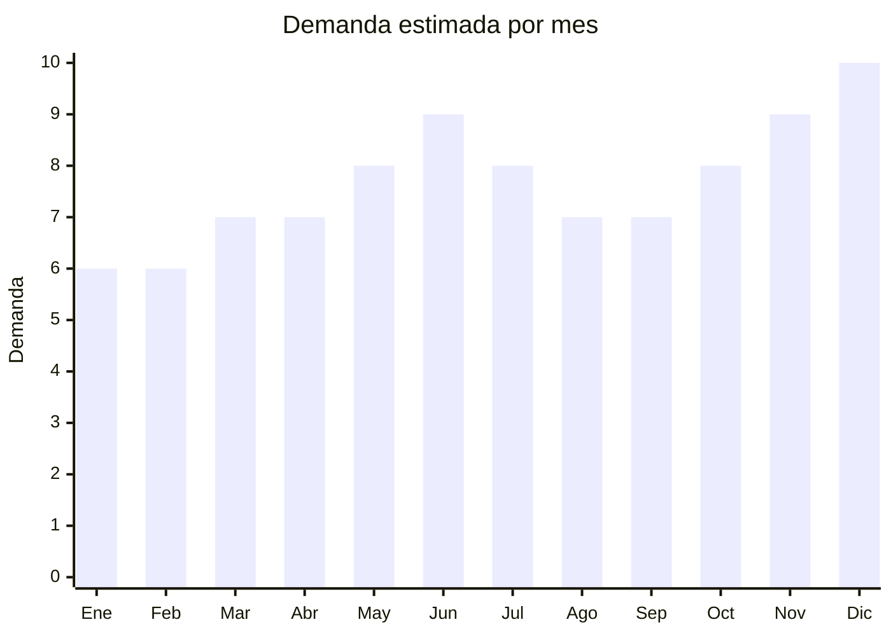

# Termos y accesorios para mate

> **Capítulo NCM 96** — Manufacturas diversas | **Temporada:** Atemporal

## Qué es y por qué importarlo

Los termos para mate, bombillas y mates son accesorios fundamentales de la cultura argentina. El termo con pico cebador (vertedor) de acero inoxidable es el producto estrella: mantiene el agua caliente durante horas y permite cebar mate sin derramar. Las bombillas de acero inoxidable (pico de loro, rectas, con resorte) y los mates de diversos materiales (acero, silicona, madera, calabaza) completan el ecosistema. Argentina es el mayor consumidor de mate del mundo, con un consumo per cápita que supera los 6 kg de yerba por persona al año, lo que convierte a estos accesorios en un producto con demanda permanente e inagotable.

China ha ingresado con fuerza en la producción de accesorios para mate, especialmente termos de acero inoxidable con pico cebador, bombillas de acero y mates de diseño moderno. Las fábricas chinas de Yongkang (Zhejiang) y Guangzhou producen termos de doble pared al vacío con calidad comparable a marcas establecidas como Stanley, Waterdog o Lumilagro, pero a una fracción del costo. Un termo pico cebador de 1 litro se consigue a USD 3-10 FOB, mientras que en Argentina se vende entre ARS 15.000 y ARS 60.000 según marca y calidad. Las bombillas de acero inoxidable tienen un costo FOB de centavos (USD 0.50-3) y se venden a ARS 3.000-15.000.

En MercadoLibre Argentina, la categoría de accesorios para mate es una de las más activas del marketplace. Los sets materos (termo + mate + bombilla en bolso organizador) son particularmente populares y tienen alta percepción de valor como regalo. La competencia es alta con marcas establecidas (Rolan, Stanley, Waterdog, Lumilagro), pero hay espacio para marcas propias en el segmento medio que ofrezcan buena relación calidad-precio. La clave está en diferenciar con diseño, colores exclusivos y packaging atractivo.

## Datos clave

| Dato | Valor |
|------|-------|
| **Posiciones NCM típicas** | 9617.00 (termos), 7323/7615 (bombillas metal), 7615.20 (artículos higiene/tocador aluminio) |
| **Derecho de importación** | 18-20% (DIE) + 3% tasa estadística |
| **Rango FOB típico** | USD 0.50 — USD 10.00 por unidad (según producto) |
| **Precio de venta en Argentina** | ARS 3.000 — ARS 60.000 (según producto) |
| **Margen bruto estimado** | 150% — 300% |
| **MOQ típico** | 50 — 200 unidades |
| **Demanda en MercadoLibre** | **Masiva** — bestseller nacional |
| **Competencia en MercadoLibre** | Alta (Rolan, Stanley, Waterdog, Lumilagro) |
| **Dificultad para importar** | Baja-Media (sin regulaciones especiales complejas) |
| **Certificaciones necesarias** | Contacto alimentario: puede requerir análisis de migración (acero inoxidable apto alimentos). INAL/ANMAT para contacto con alimentos |
| **Antidumping** | No |

## Variantes y subtipos más comunes

| Subtipo / Variante | FOB aprox. | Venta AR aprox. | Nota |
|--------------------|-----------|-----------------|------|
| Termo pico cebador 1L acero inoxidable | USD 3.00 — 10.00 | ARS 15.000 — 60.000 | **Producto estrella** — doble pared al vacío |
| Set matero completo (mate+bombilla+termo en bolso) | USD 8.00 — 20.00 | ARS 30.000 — 80.000 | **Mayor valor percibido** — ideal regalo |
| Bombilla acero inoxidable pico de loro | USD 0.50 — 3.00 | ARS 3.000 — 15.000 | Alta rotación, venta complementaria, ultraliviano |
| Mate acero inoxidable/silicona | USD 1.00 — 5.00 | ARS 5.000 — 20.000 | Diseño moderno, irrompible, fácil limpieza |
| Bolso matero organizador | USD 2.00 — 6.00 | ARS 8.000 — 25.000 | Complemento perfecto para venta en combo |

## Regulaciones y requisitos

<Tabs>
  <Tab title="Certificaciones">
    | Organismo | Requiere | Detalle | Costo aprox. | Tiempo aprox. |
    |-----------|----------|---------|-------------|--------------|
    | ARCA (Aduana) | Sí siempre | Despacho de importación estándar | Variable | — |
    | INAL / ANMAT | Puede requerir | Productos en contacto con alimentos pueden necesitar certificado de aptitud alimentaria (migración de metales) | USD 200 — 500 por análisis | 2 — 4 semanas |
    | SENASA | No | No es producto de origen animal | — | — |
    | S-Mark | No | No es producto eléctrico (salvo termos eléctricos con calentador, que son otro producto) | — | — |

    <Note>
    Los termos y bombillas de acero inoxidable están en contacto directo con agua y alimentos. Es recomendable solicitar al proveedor chino el certificado de grado alimentario (food grade 304/316 stainless steel) y el informe de migración de metales pesados. Esto facilita el despacho aduanero y protege ante reclamos de consumidores.
    </Note>
  </Tab>

  <Tab title="Etiquetado">
    | Requisito | Aplica |
    |-----------|--------|
    | Idioma español | Sí |
    | Datos del importador | Sí |
    | Material (tipo de acero inoxidable) | Sí |
    | Capacidad en litros/ml | Sí |
    | País de origen | Sí |
    | Instrucciones de uso y cuidado | Sí |
    | Apto contacto con alimentos | Recomendado |
    | Garantía legal 6 meses | Sí |

    Indicar claramente el material (acero inoxidable 304 o 316), capacidad, y que es apto para contacto con alimentos. Los termos de doble pared al vacío deben indicar las horas de retención de temperatura.
  </Tab>

  <Tab title="Restricciones">
    No hay medidas antidumping vigentes para termos ni accesorios de mate. Tener en cuenta:

    - Los termos de acero inoxidable que declaren grado alimentario (304/316) deben poder demostrarlo. La aduana puede solicitar certificado de aptitud alimentaria o análisis de migración.
    - Bombillas con soldadura de plomo están prohibidas para contacto con alimentos. Verificar que sean soldadura libre de plomo (lead-free solder).
    - Si se importan mates de madera o calabaza, pueden requerir certificación fitosanitaria.
    - Los sets materos con bolso de cuero pueden caer en una posición NCM diferente (cap. 42) — consultar con despachante.
  </Tab>
</Tabs>

## Logística

| Dato | Valor |
|------|-------|
| **Peso típico por unidad** | 0.30 — 0.80 kg (termo 1L) / 0.05 — 0.10 kg (bombilla) |
| **Volumen típico** | Medio (termos ocupan espacio por forma cilíndrica) |
| **Fragilidad** | Baja (acero inoxidable, resistente a golpes) |
| **Envío recomendado** | Marítimo LCL para volumen (+200 u). Aéreo viable para bombillas sueltas |
| **Tiempo total estimado** | 15 — 25 días (aéreo) / 50 — 80 días (marítimo) |
| **Baterías de litio** | No |
| **Requiere empaque especial** | Sí — termos requieren separadores individuales y foam para evitar rayaduras. Caja master reforzada por peso |

<Tip>
**Estrategia logística recomendada:** Las bombillas de acero inoxidable son ultralivianas (50-100 g cada una) y se pueden enviar por courier/aéreo con costo mínimo. Los termos, en cambio, son más pesados y voluminosos: un pedido de 200 termos de 1L pesa unos 150-200 kg. Para termos, el envío marítimo LCL (consolidado) es la opción más económica. Considerar importar bombillas por aéreo (rápido, barato) y termos por marítimo (económico) en envíos separados.
</Tip>

## Estacionalidad



| Aspecto | Detalle |
|---------|---------|
| **Meses pico** | Mayo-Junio (Día del Padre + frío = más mate), Noviembre-Diciembre (Navidad — regalo ideal), Julio (vacaciones de invierno, mate en todo momento) |
| **Meses valle** | Enero-Febrero (verano — menor consumo de mate caliente, pero se compensa con tereré en algunas regiones) |
| **Cuándo pedir para llegar a tiempo** | Febrero-Marzo para stock de otoño/invierno (mayo-julio). Agosto-Septiembre para temporada navideña |

## Ventajas y riesgos

<CardGroup cols={2}>
  <Card title="Ventajas" icon="circle-check">
    - **Demanda inagotable:** Argentina = mayor consumidor de mate del mundo. La demanda es permanente
    - Producto cultural arraigado — no es moda pasajera, es estilo de vida
    - Márgenes de 150-300% en termos y hasta 500% en bombillas individuales
    - Sin regulaciones complejas (no eléctrico, no requiere ENACOM ni S-Mark)
    - Amplia variedad de combos y sets para maximizar ticket promedio
    - Ideal para marca propia: los proveedores chinos ya conocen el mercado argentino
    - Venta complementaria natural: termo + mate + bombilla + bolso = ticket alto
  </Card>
  <Card title="Riesgos" icon="triangle-exclamation">
    - Competencia alta con marcas establecidas (Stanley, Rolan, Waterdog, Lumilagro)
    - Calidad de la retención térmica variable: termos baratos pierden temperatura rápido
    - Guerra de precios en el segmento económico — márgenes se erosionan
    - Pico cebador de mala calidad gotea o no cierra bien — genera devoluciones
    - Riesgo de materiales no aptos para alimentos en proveedores de baja calidad (plomo en soldaduras)
    - Los termos pesan: el flete impacta más que en productos ultralivianos
  </Card>
</CardGroup>

<Warning>
**Cuidado con la calidad del aislamiento térmico.** La diferencia de precio entre un termo de doble pared al vacío real y uno con simple cámara de aire es mínima en FOB (USD 1-2), pero la diferencia en retención de temperatura es enorme. Un termo de baja calidad pierde temperatura en 2-3 horas, mientras que uno bueno mantiene por 12-24 horas. Solicitar siempre al proveedor prueba de retención térmica (heat retention test) y verificar con muestras antes de hacer pedido grande.
</Warning>

## Palabras clave para buscar en Alibaba

```
yerba mate thermos flask, stainless steel vacuum flask 1 liter,
mate cup stainless steel, bombilla mate straw stainless steel,
double wall vacuum flask pouring spout, mate set bag organizer,
custom logo thermos flask OEM, food grade 304 stainless steel flask,
Argentina mate accessories manufacturer Yongkang
```

## Fuentes

- [MercadoLibre Argentina — Termos mate pico cebador](https://listado.mercadolibre.com.ar/termo-pico-cebador)
- [MercadoLibre Argentina — Bombillas mate acero](https://listado.mercadolibre.com.ar/bombilla-mate-acero-inoxidable)
- [Alibaba — Yerba mate thermos suppliers](https://www.alibaba.com/trade/search?SearchText=yerba+mate+thermos+flask)
- [ARCA — Nomenclador NCM](https://www.arca.gob.ar)
- [INAL — Instituto Nacional de Alimentos](https://www.argentina.gob.ar/anmat/inal)
