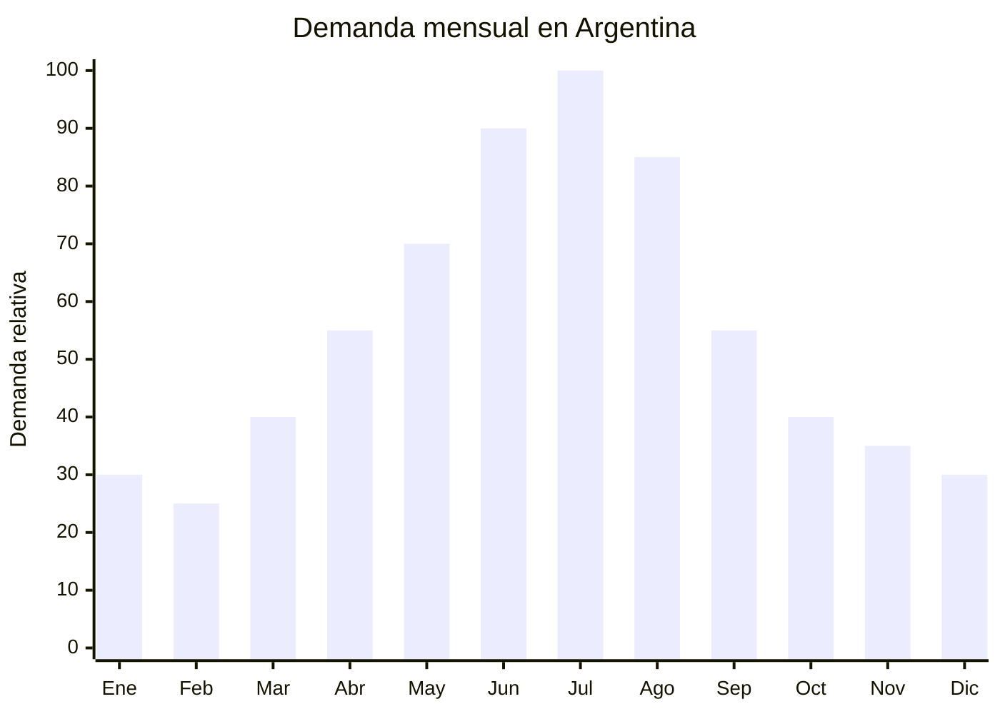

# Mascarillas faciales K-Beauty (sheet masks)

> **Capitulo NCM 33** — Aceites esenciales, preparaciones de perfumeria y cosmetica | **Temporada:** Invierno (Jun-Ago)

## Que es y por que importarlo

Las mascarillas faciales tipo sheet mask son laminas de tela (algodon, celulosa, hidrogel o biocelulosa) impregnadas en serums concentrados con ingredientes activos como acido hialuronico, niacinamida, centella asiatica, snail mucin (baba de caracol), te verde, vitamina C o colageno. Se aplican sobre el rostro durante 15-20 minutos y proporcionan hidratacion intensiva, luminosidad y nutricion a la piel sin necesidad de enjuague.

En Argentina, la demanda de mascarillas faciales se dispara entre junio y agosto. El motivo es claro: el frio seco del invierno combinado con la calefaccion artificial (que elimina la humedad del ambiente) reseca la piel de forma agresiva. Las consumidoras argentinas buscan soluciones rapidas e intensivas para combatir la deshidratacion, las grietas y la opacidad que el invierno genera. Marcas como Coony, The Crux y diversas marcas coreanas importadas ya tienen presencia en farmacias y MercadoLibre, validando el mercado.

China (especialmente Guangzhou y la provincia de Guangdong) es el epicentro mundial de produccion de sheet masks. La mayoria de las marcas coreanas (incluso las de K-beauty premium) fabrican en plantas chinas con certificacion GMP. Esto permite acceder a productos de calidad identica a los "coreanos" a precios FOB de USD 0.15-0.60 por unidad, con MOQ desde 1,000 unidades y posibilidad de marca propia (OEM/ODM). El registro ANMAT como cosmetico grado 1 (Disposicion 4033/2025) se resuelve en 15-30 dias con documentacion minima, lo que hace viable la importacion incluso para emprendedores pequenos.

## Datos clave

| Dato | Valor |
|------|-------|
| **Posiciones NCM tipicas** | 3304.99.10 (preparaciones para el cuidado de la piel) |
| **Derecho de importacion** | 18% (DIE) + 3% tasa estadistica |
| **Rango FOB tipico** | USD 0.15 — USD 0.60 por unidad |
| **Precio de venta en Argentina** | ARS 1.500 — ARS 6.000 por unidad |
| **Margen bruto estimado** | 300% — 600% |
| **MOQ tipico** | 1,000 — 10,000 unidades |
| **Demanda en MercadoLibre** | Alta (crece cada invierno) |
| **Competencia en MercadoLibre** | Media (Coony domina, espacio para nuevas marcas) |
| **Dificultad para importar** | Baja-Moderada (ANMAT grado 1 simplificado) |
| **Certificaciones necesarias** | ANMAT — Cosmetico Grado 1 (Disp. 4033/2025) |
| **Antidumping** | No |

## Variantes y subtipos mas comunes

| Subtipo / Variante | Caracteristicas | FOB estimado |
|--------------------|----------------|-------------|
| Sheet mask algodon basica | Tela de algodon, serum 25-30ml, un solo activo | USD 0.15 — 0.25 |
| Sheet mask hidrogel | Gel transparente, doble parte (superior/inferior), mayor adhesion | USD 0.30 — 0.50 |
| Sheet mask biocelulosa | Material premium, origen coco, maxima absorcion | USD 0.40 — 0.60 |
| Pack 5-10 unidades surtidas | Varios activos en un pack, ideal para regalo | USD 1.00 — 3.50/pack |
| Mascarilla de ojos (parches) | Hidrogel para ojeras, formato 2 parches | USD 0.08 — 0.20/par |
| Set skincare con mascarillas | 3-5 mascarillas + serum + crema miniatura | USD 2.00 — 5.00/set |

## Regulaciones y requisitos

<Tabs>
  <Tab title="Certificaciones">
    | Organismo | Requiere | Detalle |
    |-----------|----------|---------|
    | ARCA (Aduana) | Si siempre | Despacho estandar |
    | ANMAT | **Si — Grado 1** | Cosmetico de grado 1 (mascarilla hidratante sin claims terapeuticos). Disposicion 4033/2025: DJC simplificada, 15-30 dias de proceso |
    | ENACOM | No | No es electronico |
    | SENASA | No | No es alimento |

    **Recomendacion:** Solicitar al proveedor chino: certificado GMP de fabrica, formula cuali-cuantitativa (INCI completo), test de estabilidad, test microbiologico y certificado de metales pesados. Con la Disp. 4033/2025 el proceso es agil, pero necesitas un profesional farmaceutico como director tecnico para firmar la DJC.
  </Tab>

  <Tab title="Etiquetado">
    | Requisito | Aplica |
    |-----------|--------|
    | Pais de origen | Si |
    | Datos importador | Si (nombre, direccion, CUIT) |
    | Composicion (INCI) | Si — lista completa |
    | Instrucciones de uso | Si ("Aplicar sobre piel limpia 15-20 min") |
    | Lote y vencimiento | Si |
    | Precauciones | Si ("Uso externo", "Suspender si hay irritacion") |
    | Numero de registro ANMAT | Si — visible en envase |

    **Tip:** Muchos proveedores chinos ya ofrecen impresion de etiquetas en espanol directamente en fabrica. Pedir el arte con datos argentinos desde la primera orden.
  </Tab>

  <Tab title="Restricciones">
    - NO hacer claims terapeuticos ("cura el acne", "elimina arrugas", "tratamiento dermatologico"). Esto reclasifica a Grado 2 con requisitos mucho mas estrictos.
    - Claims cosmeticos permitidos: "hidrata", "nutre", "ilumina", "refresca la piel".
    - Verificar que la formula no contenga ingredientes prohibidos por ANMAT (parabenos en concentraciones no permitidas, fragancias alergenas sin declarar).
    - Sin antidumping vigente para esta partida.
    - Si la mascarilla contiene "collageno bovino" real, puede requerir certificacion SENASA adicional (preferir collageno vegetal o sintetico).
  </Tab>
</Tabs>

## Logistica de importacion

| Factor | Detalle |
|--------|---------|
| **Peso por unidad** | 30 — 50 g (sobre individual sellado) |
| **Volumen por unidad** | Compacto (sobre plano ~15x20 cm) |
| **Unidades por caja (master carton)** | 200 — 500 unidades |
| **Peso por caja** | 8 — 15 kg |
| **Unidades por contenedor 20'** | ~150,000 — 300,000 unidades |
| **Fragilidad** | Muy baja (sobres sellados, flexibles) |
| **Modo de envio recomendado** | Maritimo consolidado (primer pedido) o aereo si es urgente |
| **Tiempo de produccion** | 15 — 25 dias (con OEM/etiqueta propia: 25-35 dias) |
| **Tiempo de envio maritimo** | 35 — 50 dias |

<Tip>
Las sheet masks son uno de los productos mas eficientes para importar: extremadamente livianas (30-50g), planas (no ocupan volumen) y no fragiles. Un pedido de 5,000 unidades puede pesar solo 200 kg y enviarse como carga consolidada maritima a bajo costo. Incluso el envio aereo es viable para pedidos urgentes porque el peso es minimo.
</Tip>

## Estacionalidad y timing de compra

| Timing | Fecha |
|--------|-------|
| **Pedir a fabrica** | Febrero — Marzo |
| **Embarque** | Marzo — Abril |
| **Llegada Argentina** | Mayo (justo antes del pico) |
| **Inicio ventas** | Junio (arranque invierno) |

<Note>
Las mascarillas tienen shelf life largo (2-3 anos) asi que el stock no vendido en invierno se puede seguir vendiendo todo el ano. El pico es invierno, pero hay demanda base permanente.
</Note>

## Ventajas y riesgos

<CardGroup cols={2}>
  <Card title="Ventajas" icon="circle-check">
    - Margen bruto 300-600% sobre FOB
    - Producto ultraliviano y compacto (flete casi insignificante por unidad)
    - ANMAT grado 1 simplificado (barrera baja vs otros cosmeticos)
    - Tendencia K-beauty en crecimiento sostenido en Argentina
    - Consumo recurrente: clientas compran 4-8 mascarillas por mes
    - OEM desde 1,000 unidades (ideal para marca propia)
    - Shelf life largo (2-3 anos) reduce riesgo de stock muerto
  </Card>

  <Card title="Riesgos y desventajas" icon="triangle-exclamation">
    - Requiere registro ANMAT (barrera de entrada, aunque simplificada)
    - Necesita director tecnico farmaceutico para la DJC
    - Competencia creciente: mas importadores descubriendo el nicho
    - Riesgo de reacciones alergicas (cuidar formulacion y warnings)
    - Percepcion "chino vs coreano": el consumidor prefiere origen Korea, aunque el producto sea identico
    - Temporalidad marcada: 60% de la venta se concentra en 3 meses
  </Card>
</CardGroup>

## Palabras clave para buscar en Alibaba

`sheet mask OEM private label` `face mask korean style manufacturer` `hydrogel facial mask wholesale` `biocellulose mask factory Guangzhou` `snail mucin sheet mask bulk` `hyaluronic acid face mask OEM` `collagen eye patch wholesale`

## Fuentes

- MercadoLibre Argentina — busqueda "mascarilla facial" y "sheet mask"
- Alibaba.com — proveedores de sheet mask OEM/ODM Guangzhou
- ANMAT — Disposicion 4033/2025 sobre registro simplificado de cosmeticos
- Coony Argentina — referencia de precios y posicionamiento
