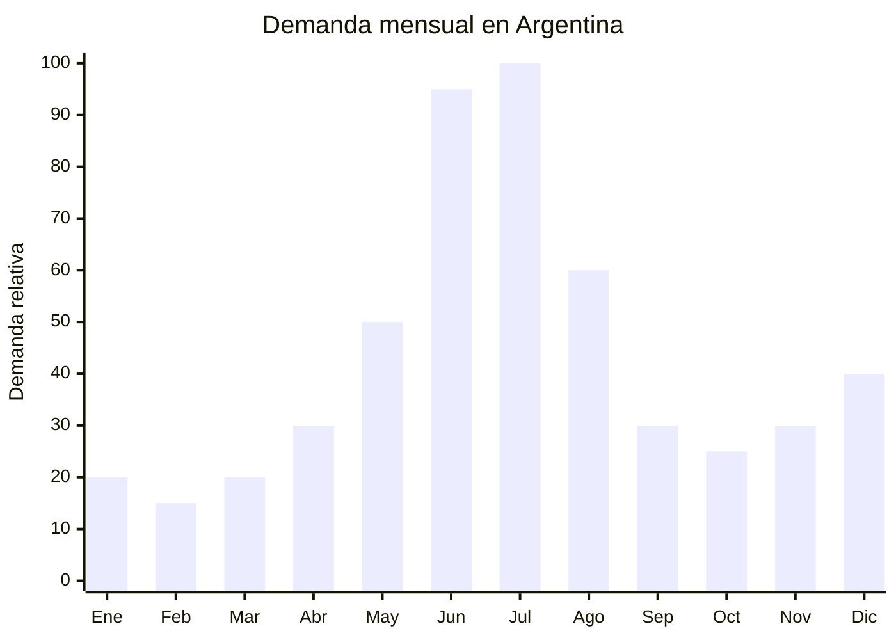

# Kits de aromaterapia y sets de esencias

> **Capitulo NCM 34** — Jabones, ceras, velas, pastas y preparaciones similares | **Temporada:** Invierno (Jun-Ago)

## Que es y por que importarlo

Los kits de aromaterapia son sets que combinan aceites esenciales (lavanda, eucalipto, menta, arbol de te, naranja, limon) con difusores ceramicos, humidificadores ultrasonicos o varillas de bambu. Se presentan en packaging tipo regalo con cajas decorativas, ideales para obsequiar. Los formatos mas populares incluyen sets de 6, 8 o 12 frascos de 10ml con un difusor incluido.

En Argentina, estos productos tienen un pico de demanda concentrado entre junio y julio, impulsado por tres fechas clave consecutivas: el Dia del Padre (tercer domingo de junio), el Dia del Amigo (20 de julio) y el comienzo de las vacaciones de invierno. La aromaterapia se posiciona como un regalo "de bienestar" accesible, con ticket promedio de ARS 10.000-25.000 que resulta ideal para quienes buscan un obsequio con buena presentacion sin gastar demasiado. Marcas como Briganti, ByF Deco y Aromagia ya validan el mercado en MercadoLibre con miles de ventas mensuales.

La gran ventaja de este producto es que NO requiere registro ANMAT, ya que los aceites esenciales en formato aromaterapia (para difusor ambiental, no para aplicacion cutanea) no se clasifican como cosmeticos ni como productos de salud. Esto elimina la principal barrera regulatoria y permite importar con tramites aduaneros estandar. China (Guangdong, Zhejiang) produce el 80% de los aceites esenciales comerciales del mundo a precios FOB de USD 2-8 por set completo.

## Datos clave

| Dato | Valor |
|------|-------|
| **Posiciones NCM tipicas** | 3307.49.00 (preparaciones para perfumar o desodorizar locales) |
| **Derecho de importacion** | 18% (DIE) + 3% tasa estadistica |
| **Rango FOB tipico** | USD 2.00 — USD 8.00 por set |
| **Precio de venta en Argentina** | ARS 8.000 — ARS 30.000 |
| **Margen bruto estimado** | 250% — 500% |
| **MOQ tipico** | 200 — 1,000 sets |
| **Demanda en MercadoLibre** | Alta (pico junio-julio) |
| **Competencia en MercadoLibre** | Media (Briganti, ByF Deco lideran) |
| **Dificultad para importar** | Baja (sin ANMAT, sin certificaciones especiales) |
| **Certificaciones necesarias** | Ninguna especifica (despacho aduanero estandar) |
| **Antidumping** | No |

## Variantes y subtipos mas comunes

| Subtipo / Variante | Caracteristicas | FOB estimado |
|--------------------|----------------|-------------|
| Set 6 esencias + caja regalo | 6 frascos x 10ml, caja carton premium | USD 2.00 — 3.50 |
| Set 12 esencias + caja regalo | 12 frascos x 10ml, caja de madera o carton | USD 3.50 — 6.00 |
| Kit esencias + difusor ceramico | 3-6 esencias + difusor varillas bambu 100ml | USD 3.00 — 5.00 |
| Kit esencias + humidificador ultrasonico | 3-6 esencias + mini humidificador USB | USD 5.00 — 8.00 |
| Set esencias individuales (sin difusor) | 1 frasco x 30ml, esencia pura | USD 0.50 — 1.50 |
| Difusor varillas solo (sin esencias) | Frasco vidrio 100-200ml + varillas bambu | USD 1.50 — 3.00 |

## Regulaciones y requisitos

<Tabs>
  <Tab title="Certificaciones">
    | Organismo | Requiere | Detalle |
    |-----------|----------|---------|
    | ARCA (Aduana) | Si siempre | Despacho estandar |
    | ANMAT | **No** | Los aceites esenciales para difusor ambiental no se clasifican como cosmetico (no son de aplicacion cutanea) ni como producto medico |
    | ENACOM | No* | No aplica excepto si el kit incluye humidificador electrico (en ese caso puede requerir declaracion) |
    | SENASA | No | No es alimento |

    **Importante:** Si el producto se comercializa para "aplicacion sobre la piel" o con claims terapeuticos ("alivia el estres", "cura el insomnio"), ANMAT podria reclasificarlo como cosmetico grado 1 o incluso como producto de salud. Mantener el marketing enfocado en "aromaterapia ambiental" y "perfumar ambientes".
  </Tab>

  <Tab title="Etiquetado">
    | Requisito | Aplica |
    |-----------|--------|
    | Pais de origen | Si |
    | Datos importador | Si (nombre, direccion, CUIT) |
    | Composicion | Si — listar ingredientes |
    | Instrucciones de uso | Si ("Agregar 3-5 gotas al difusor") |
    | Precauciones | Si ("No ingerir", "Mantener fuera del alcance de ninos", "No aplicar directamente sobre la piel") |
    | Lote | Si |
    | Idioma espanol | Si |

    **Tip:** Pedir al proveedor que imprima las etiquetas en espanol directamente. El costo adicional es minimo (USD 0.05-0.10 por set) y evita tener que re-etiquetar en Argentina.
  </Tab>

  <Tab title="Restricciones">
    - No hacer claims medicinales o terapeuticos (no decir "cura", "trata", "alivia enfermedades").
    - Si el kit incluye humidificador electrico, verificar si requiere declaracion ENACOM (equipos electronicos con emision de radiofrecuencia).
    - Asegurarse de que los frascos de vidrio no contengan plomo en la pintura o decoracion.
    - Sin antidumping vigente.
    - Si se importan como "aceites esenciales puros" (Cap. 33), el arancel puede variar. Verificar la clasificacion exacta con el despachante.
  </Tab>
</Tabs>

## Logistica de importacion

| Factor | Detalle |
|--------|---------|
| **Peso por set** | 200 — 600 g (dependiendo si incluye difusor) |
| **Volumen por set** | Mediano (cajas regalo 20x15x10 cm aprox.) |
| **Sets por caja (master carton)** | 20 — 50 sets |
| **Peso por caja** | 8 — 15 kg |
| **Fragilidad** | **Alta** (frascos de vidrio) |
| **Modo de envio recomendado** | Maritimo consolidado con embalaje reforzado |
| **Tiempo de produccion** | 15 — 25 dias |
| **Tiempo de envio maritimo** | 35 — 50 dias |
| **Packaging** | Cajas individuales + foam o separadores internos + master carton reforzado |

<Tip>
Los frascos de vidrio son el punto critico del envio. Exigir al proveedor: (1) separadores de foam entre frascos dentro de cada caja, (2) stickers "FRAGIL" en los master cartons, y (3) relleno de burbujas o foam entre cajas dentro del pallet. Solicitar fotos del embalaje antes del embarque. Una rotura del 5-10% en transito es comun si no se empaca bien.
</Tip>

## Estacionalidad y timing de compra

| Timing | Fecha |
|--------|-------|
| **Pedir a fabrica** | Febrero — Marzo |
| **Embarque** | Marzo — Abril |
| **Llegada Argentina** | Mayo (2-3 semanas antes del Dia del Padre) |
| **Inicio ventas** | Junio (Dia del Padre) — Julio (Dia del Amigo) |

<Note>
El pico de ventas es MUY concentrado en junio-julio. Si la mercaderia no llega antes de la primera semana de junio, se pierde la mitad de la temporada. Considerar envio aereo parcial si hay retrasos.
</Note>

## Ventajas y riesgos

<CardGroup cols={2}>
  <Card title="Ventajas" icon="circle-check">
    - SIN registro ANMAT (barrera de entrada minima)
    - Margen bruto 250-500% sobre FOB
    - Producto "regalo" con alta percepcion de valor
    - Packaging atractivo listo para regalar
    - Tres fechas de regalo concentradas en 5 semanas (Dia Padre + Dia Amigo + vacaciones)
    - MOQ bajo: desde 200 sets
    - Demanda complementaria en diciembre (Navidad)
  </Card>

  <Card title="Riesgos y desventajas" icon="triangle-exclamation">
    - Fragilidad: frascos de vidrio se rompen en transito (prever 5-10% de merma)
    - Estacionalidad extrema: 70% de la venta en 2 meses
    - Competencia creciente de marcas nacionales (Briganti tiene buena logistica local)
    - Si incluye humidificador electrico, puede requerir ENACOM
    - Stock remanente queda hasta Navidad (6 meses de espera)
    - Percepcion negativa si el producto tiene olor quimico (calidad del aceite es critica)
  </Card>
</CardGroup>

## Palabras clave para buscar en Alibaba

`essential oil gift set` `aromatherapy set box` `essential oil diffuser set wholesale` `lavender essential oil kit` `reed diffuser gift set OEM` `aroma oil set private label` `essential oil 6 pack gift box`

## Fuentes

- MercadoLibre Argentina — busqueda "kit aromaterapia" y "set aceites esenciales"
- Alibaba.com — proveedores de essential oil gift sets
- Briganti Argentina — referencia de precios y presentaciones
- ByF Deco Argentina — referencia de mercado
