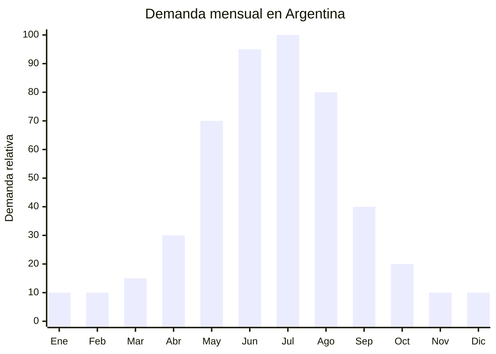

# Pastillas deshumidificadoras y antihumedad

> **Capitulo NCM 34** — Jabones, ceras, velas, pastas y preparaciones similares | **Temporada:** Invierno (Jun-Ago)

## Que es y por que importarlo

Las pastillas deshumidificadoras son productos quimicos a base de cloruro de calcio (CaCl2) que absorben la humedad del aire y la convierten en una solucion liquida que se acumula en un recipiente. Se presentan en diversos formatos: pastillas solidas para recipientes recargables, bolsitas colgantes para placards y cajones, cajas desechables para ambientes pequenos, y packs multiuso. Su funcion principal es prevenir la formacion de moho, malos olores, manchas de humedad y deterioro de ropa y objetos almacenados.

En Argentina, la demanda se dispara entre mayo y agosto. El motivo es que durante el invierno las ventanas permanecen cerradas la mayor parte del dia, la calefaccion genera diferencias termicas con el exterior, y la humedad se condensa en paredes, techos y muebles. Esto es especialmente critico en el conurbano bonaerense, donde muchas viviendas tienen problemas estructurales de humedad. Marcas como Aero, SecaMax, Sekoplas y Aire Pur son referentes del mercado local, pero la mayoria importa el insumo (cloruro de calcio) desde China y solo agrega el packaging argentino.

China es el mayor productor mundial de cloruro de calcio industrial y de grado comercial. Las fabricas de Shandong y Hebei producen pastillas antihumedad listas para retail a precios FOB de USD 0.20-1.00 por unidad, con MOQ desde 500 unidades. El producto NO requiere registro ANMAT, SENASA ni ninguna certificacion especial, lo que lo convierte en uno de los productos mas simples de importar.

## Datos clave

| Dato | Valor |
|------|-------|
| **Posiciones NCM tipicas** | 3824.99.89 (preparaciones quimicas diversas) |
| **Derecho de importacion** | 14% (DIE) + 3% tasa estadistica |
| **Rango FOB tipico** | USD 0.20 — USD 1.00 por unidad |
| **Precio de venta en Argentina** | ARS 2.000 — ARS 8.000 |
| **Margen bruto estimado** | 300% — 500% |
| **MOQ tipico** | 500 — 5,000 unidades |
| **Demanda en MercadoLibre** | Alta (pico mayo-agosto) |
| **Competencia en MercadoLibre** | Media-Alta (Aero, SecaMax dominan) |
| **Dificultad para importar** | Muy baja (sin certificaciones especiales) |
| **Certificaciones necesarias** | Ninguna especifica |
| **Antidumping** | No |

## Variantes y subtipos mas comunes

| Subtipo / Variante | Caracteristicas | FOB estimado |
|--------------------|----------------|-------------|
| Bolsita colgante placard (100-200g) | Gancho plastico, bolsa sellada, para colgar en closet | USD 0.20 — 0.40 |
| Pastilla para recipiente (450-500g) | Pastilla redonda o cuadrada, para bandeja reutilizable | USD 0.30 — 0.60 |
| Caja desechable con pastilla (250-500g) | Todo en uno: caja + pastilla + bandeja, listo para usar | USD 0.40 — 0.80 |
| Recipiente recargable premium (con indicador) | Contenedor plastico reutilizable, indicador de saturacion | USD 0.60 — 1.00 |
| Pack 3-6 bolsitas surtidas | Varias bolsitas en blister o caja, para cajones y zapatos | USD 0.80 — 2.00/pack |
| Absorbe humedad con fragancia | Lavanda, limon o "aire fresco", agrega valor percibido | USD 0.30 — 0.60 |

## Regulaciones y requisitos

<Tabs>
  <Tab title="Certificaciones">
    | Organismo | Requiere | Detalle |
    |-----------|----------|---------|
    | ARCA (Aduana) | Si siempre | Despacho estandar |
    | ANMAT | **No** | No es cosmetico ni producto de salud |
    | ENACOM | No | No es electronico |
    | SENASA | No | No es alimento ni agroquimico |
    | Ministerio de Ambiente | No* | El CaCl2 no esta clasificado como sustancia peligrosa en concentraciones comerciales |

    **Nota:** Si el producto se importa como "cloruro de calcio a granel" (no como producto terminado para consumidor final), puede requerir ficha de seguridad (MSDS). En formato retail para consumidor final con packaging comercial, no hay requisitos especiales.
  </Tab>

  <Tab title="Etiquetado">
    | Requisito | Aplica |
    |-----------|--------|
    | Pais de origen | Si |
    | Datos importador | Si (nombre, direccion, CUIT) |
    | Composicion | Si ("Cloruro de calcio") |
    | Instrucciones de uso | Si ("Colocar en ambiente cerrado", "Reemplazar cuando la pastilla se disuelva") |
    | Precauciones | Si ("No ingerir", "Mantener fuera del alcance de ninos", "Evitar contacto con ojos") |
    | Peso neto | Si |
    | Idioma espanol | Si |
  </Tab>

  <Tab title="Restricciones">
    - Sin antidumping vigente para esta categoria.
    - El cloruro de calcio es irritante para ojos y piel: incluir precauciones claras en el envase.
    - Si se comercializa como "deshumidificador electrico" en lugar de quimico, aplican otras regulaciones (ver Cap. 84/85).
    - Verificar que el liquido resultante (solucion de CaCl2) no genere derrames durante el transporte: los recipientes deben ser hermeticos.
  </Tab>
</Tabs>

## Logistica de importacion

| Factor | Detalle |
|--------|---------|
| **Peso por unidad** | 150 — 600 g (dependiendo del formato) |
| **Volumen por unidad** | Compacto a mediano |
| **Unidades por caja (master carton)** | 24 — 48 unidades |
| **Peso por caja** | 8 — 20 kg |
| **Fragilidad** | Baja (plastico y quimico solido) |
| **Modo de envio recomendado** | Maritimo (producto pesado para su valor) |
| **Tiempo de produccion** | 10 — 20 dias |
| **Tiempo de envio maritimo** | 35 — 50 dias |
| **Packaging** | Blister o caja individual + shrink wrap + master carton |

<Tip>
El cloruro de calcio es higroscopico (absorbe humedad del aire). Si el packaging del producto no esta perfectamente sellado, la pastilla puede comenzar a disolverse durante el transporte maritimo. Exigir al proveedor: (1) sellado individual hermetico de cada unidad, (2) bolsas de desecante adicional dentro del master carton, y (3) uso de pelicula shrink wrap en el pallet. Solicitar certificado de sellado y fotos del proceso.
</Tip>

## Estacionalidad y timing de compra

| Timing | Fecha |
|--------|-------|
| **Pedir a fabrica** | Enero — Febrero |
| **Embarque** | Febrero — Marzo |
| **Llegada Argentina** | Abril (antes del inicio del frio) |
| **Inicio ventas** | Mayo (primeras heladas, humedad sube) |

<Note>
La demanda cae abruptamente en septiembre. El stock que no se vende en agosto queda inmovilizado hasta el proximo mayo. Calcular pedidos conservadores y no sobrestockear.
</Note>

## Ventajas y riesgos

<CardGroup cols={2}>
  <Card title="Ventajas" icon="circle-check">
    - SIN ninguna certificacion especial (barrera de entrada minima)
    - Margen bruto 300-500% sobre FOB
    - Producto de consumo recurrente (se reemplaza cada 30-60 dias)
    - Mercado enorme: millones de hogares argentinos tienen problemas de humedad
    - Produccion rapida en China (10-20 dias)
    - Ideal para marca propia: packaging simple, formula estandarizada
    - MOQ bajo: desde 500 unidades
  </Card>

  <Card title="Riesgos y desventajas" icon="triangle-exclamation">
    - Competencia fuerte de marcas locales establecidas (Aero, SecaMax)
    - Producto pesado para su valor: el flete pesa en el costo final
    - Estacionalidad extrema: 80% de la venta en 4 meses
    - Si el sellado falla, el producto se inutiliza antes de llegar al consumidor
    - Margen por unidad bajo en valor absoluto (necesita volumen)
    - Riesgo de derrame del liquido resultante en transporte
  </Card>
</CardGroup>

## Palabras clave para buscar en Alibaba

`calcium chloride moisture absorber` `dehumidifier box wholesale` `hanging wardrobe dehumidifier` `moisture absorber bag closet` `damp absorber refill tablets` `anti humidity box OEM` `calcium chloride desiccant home`

## Fuentes

- MercadoLibre Argentina — busqueda "pastilla antihumedad" y "deshumidificador"
- Alibaba.com — proveedores de moisture absorber
- Aero Argentina — referencia de precios y formatos
- SecaMax — referencia de mercado y presentaciones
