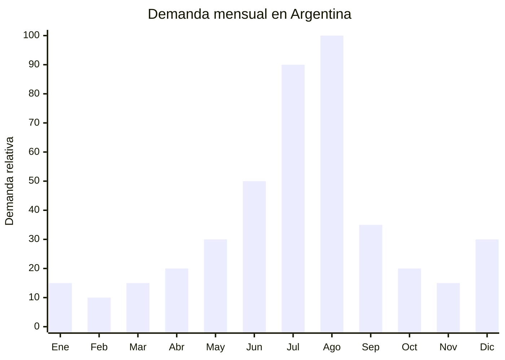

# Kits de slime y masas para modelar

> **Capitulo NCM 39** — Plasticos y sus manufacturas | **Temporada:** Invierno (Jun-Ago)

## Que es y por que importarlo

Los kits de slime y masas para modelar son sets de juego que incluyen bases de slime (transparente, de colores, fluffy, butter slime), brillantina (glitter), espuma (foam beads), pigmentos, moldes, herramientas de modelado y contenedores. Permiten a los ninos crear sus propias texturas y formas, combinando creatividad con estimulacion sensorial. Los formatos van desde kits basicos de 1-2 slimes hasta mega kits con 20+ componentes.

En Argentina, la demanda de estos productos explota entre julio y agosto por la combinacion de dos factores: las vacaciones de invierno (2 semanas en julio donde los ninos estan en casa todo el dia) y la proximidad del Dia del Nino (tercer domingo de agosto). Los padres buscan opciones de entretenimiento indoor que mantengan ocupados a los chicos durante los dias frios y lluviosos en los que no se puede salir. Marcas como Ditoys, Duravit, Slime Lab y Play-Doh son referentes del mercado local.

China (especialmente Yiwu, Shantou y Guangzhou) domina la produccion mundial de juguetes de slime y masas, con fabricas que ofrecen variedad infinita de formatos, colores y presentaciones. Los precios FOB oscilan entre USD 1.50 y USD 5.00 por kit, con margenes de reventa del 250-450% en Argentina. La principal consideracion regulatoria es que si el producto se destina a menores de 14 anos, debe cumplir con la norma IRAM 3583 de seguridad de juguetes, que incluye ensayos de toxicidad, migracion de metales pesados y partes pequenas.

## Datos clave

| Dato | Valor |
|------|-------|
| **Posiciones NCM tipicas** | 3924.90.00 (articulos para uso domestico y de higiene de plastico) / 9503.00.99 (juguetes) |
| **Derecho de importacion** | 18-20% (DIE) + 3% tasa estadistica |
| **Rango FOB tipico** | USD 1.50 — USD 5.00 por kit |
| **Precio de venta en Argentina** | ARS 5.000 — ARS 20.000 |
| **Margen bruto estimado** | 250% — 450% |
| **MOQ tipico** | 500 — 3,000 kits |
| **Demanda en MercadoLibre** | Muy alta (julio-agosto) |
| **Competencia en MercadoLibre** | Alta (Ditoys, Duravit, marcas chinas) |
| **Dificultad para importar** | Moderada (IRAM 3583 si es para <14 anos) |
| **Certificaciones necesarias** | IRAM 3583 (seguridad de juguetes) si el usuario es <14 anos |
| **Antidumping** | No |

## Variantes y subtipos mas comunes

| Subtipo / Variante | Caracteristicas | FOB estimado |
|--------------------|----------------|-------------|
| Kit slime basico (2-4 colores) | 2-4 potes slime + glitter + bolsa | USD 1.50 — 2.50 |
| Kit slime premium (8-12 colores) | 8-12 potes + glitter + foam beads + moldes + herramientas | USD 3.00 — 5.00 |
| Slime DIY "haz tu propio" | Base PVA + activador + pigmentos + instrucciones | USD 2.00 — 4.00 |
| Masa para modelar tipo plastilina | 6-12 colores + moldes + herramientas, no seca | USD 1.50 — 3.50 |
| Arena magica (kinetic sand) | Arena moldeable + moldes + bandeja | USD 2.00 — 4.50 |
| Mega kit combinado | Slime + arena + masa + accesorios (20+ items) | USD 4.00 — 8.00 |

## Regulaciones y requisitos

<Tabs>
  <Tab title="Certificaciones">
    | Organismo | Requiere | Detalle |
    |-----------|----------|---------|
    | ARCA (Aduana) | Si siempre | Despacho estandar |
    | IRAM | **Si — IRAM 3583** | Si el producto esta destinado a menores de 14 anos, debe cumplir norma de seguridad de juguetes. Incluye ensayos de: partes pequenas, toxicidad, migracion de metales pesados, inflamabilidad |
    | ANMAT | No | No es cosmetico ni medicamento |
    | ENACOM | No | No es electronico |

    **Proceso IRAM 3583:**
    1. Enviar muestras a laboratorio acreditado en Argentina (INTI, SGS, Bureau Veritas)
    2. Ensayos: 15-30 dias, costo USD 200-600 por producto
    3. Obtener certificado de conformidad
    4. Presentar en aduana para el despacho

    **Alternativa:** Si se clasifica para mayores de 14 anos (indicar claramente "+14" en el packaging), NO requiere IRAM 3583. Sin embargo, esto limita el mercado objetivo.
  </Tab>

  <Tab title="Etiquetado">
    | Requisito | Aplica |
    |-----------|--------|
    | Pais de origen | Si |
    | Datos importador | Si (nombre, direccion, CUIT) |
    | Edad recomendada | Si — obligatorio si es juguete |
    | Precauciones | Si ("No apto para menores de 3 anos", "Contiene piezas pequenas") |
    | Composicion | Si (materiales del slime) |
    | Lote | Si |
    | Idioma espanol | Si |
    | Sello "S" de seguridad | Si — si cumple IRAM 3583 |
  </Tab>

  <Tab title="Restricciones">
    - Norma IRAM 3583 exige que el slime no contenga acido borico por encima de los limites permitidos (el borato de sodio/borax es el activador comun del slime y tiene limites de migracion).
    - Verificar migracion de metales pesados en los pigmentos y colorantes.
    - Las piezas pequenas (moldes, accesorios) deben pasar el test de cilindro para menores de 3 anos.
    - Sin antidumping vigente.
    - Si el producto contiene fragancias, verificar alergenos.
  </Tab>
</Tabs>

## Logistica de importacion

| Factor | Detalle |
|--------|---------|
| **Peso por kit** | 200 — 800 g |
| **Volumen por kit** | Mediano (cajas de 15x15x10 a 30x20x15 cm) |
| **Kits por caja (master carton)** | 12 — 48 kits |
| **Peso por caja** | 6 — 15 kg |
| **Fragilidad** | Baja (plastico, envases hermeticos) |
| **Modo de envio recomendado** | Maritimo consolidado |
| **Tiempo de produccion** | 15 — 25 dias |
| **Tiempo de envio maritimo** | 35 — 50 dias |
| **Packaging** | Caja individual impresa + blister + master carton |

<Tip>
Verificar que los contenedores de slime esten perfectamente sellados antes del embarque. El slime puede secarse si pierde hermeticidad durante los 35-50 dias de transporte maritimo. Solicitar al proveedor fotos y video del sellado. Considerar agregar una pelicula de sello de seguridad (heat seal) sobre cada pote.
</Tip>

## Estacionalidad y timing de compra

| Timing | Fecha |
|--------|-------|
| **Pedir a fabrica** | Febrero — Marzo |
| **Embarque** | Marzo — Abril |
| **Llegada Argentina** | Mayo — Junio |
| **Inicio ventas** | Julio (vacaciones de invierno) |

<Warning>
El Dia del Nino es el evento mas fuerte. Si la mercaderia no llega antes de la ultima semana de julio, se pierde el 50% de la temporada. Considerar que los ensayos IRAM 3583 pueden demorar 15-30 dias adicionales despues de la llegada.
</Warning>

## Ventajas y riesgos

<CardGroup cols={2}>
  <Card title="Ventajas" icon="circle-check">
    - Margen bruto 250-450% sobre FOB
    - Demanda explosiva en julio-agosto (vacaciones + Dia del Nino)
    - Producto liviano y no fragil (flete eficiente)
    - Variedad infinita de presentaciones y combinaciones
    - Producto atractivo visualmente (vende solo con buenas fotos)
    - Ideal para venta en packs ("kit de slime x3")
    - Complemento natural de otros juguetes importados
  </Card>

  <Card title="Riesgos y desventajas" icon="triangle-exclamation">
    - IRAM 3583 obligatorio si es para menores de 14 anos (costo y tiempo)
    - Contenido de borax/borato requiere verificacion de limites de migracion
    - Competencia alta de marcas locales con distribucion en jugueterias
    - Estacionalidad muy marcada: venta se concentra en 6-8 semanas
    - El slime puede secarse o deteriorarse si el sellado no es perfecto
    - Tendencias cambian rapido: el tipo de slime "de moda" varia cada temporada
  </Card>
</CardGroup>

## Palabras clave para buscar en Alibaba

`slime kit wholesale` `DIY slime set kids` `kinetic sand kit` `modeling clay set children` `fluffy slime maker kit` `slime factory Shantou` `play dough set OEM` `sensory toy kit wholesale`

## Fuentes

- MercadoLibre Argentina — busqueda "kit slime" y "masa para modelar"
- Alibaba.com — proveedores de slime kit y modeling clay
- Ditoys Argentina — referencia de precios y presentaciones
- IRAM — Norma IRAM 3583 seguridad de juguetes
- INTI — laboratorio de ensayos de juguetes
