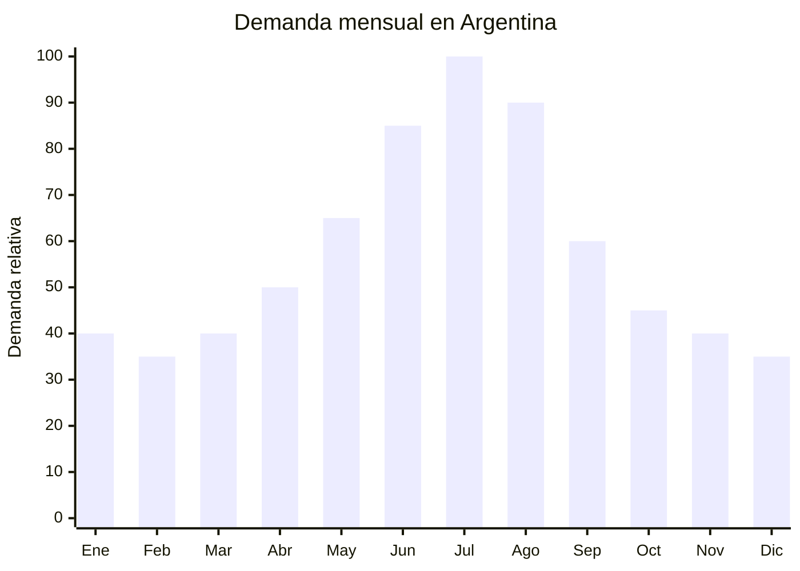

# Sets premium de bandas de resistencia

> **Capitulo NCM 40** — Caucho y sus manufacturas | **Temporada:** Invierno (Jun-Ago)

## Que es y por que importarlo

Los sets premium de bandas de resistencia son kits completos de entrenamiento que incluyen entre 5 y 11 bandas elasticas de latex o TPE (elastomero termoplastico) con diferentes niveles de resistencia (5-150 lbs), asas acolchadas, ancla para puerta, tobilleras, mosquetones y bolso de transporte. Permiten realizar mas de 100 ejercicios de fuerza y flexibilidad sin necesidad de ir al gimnasio. Se diferencian de las bandas individuales por ser un "gimnasio portatil completo" en un solo paquete.

En Argentina, el fitness indoor aumenta un 85% en julio respecto a los meses de verano. El motivo es simple: cuando hace frio, llueve y anochece temprano, la gente abandona el running al aire libre y las actividades outdoor, pero no quiere dejar de entrenar. Los sets de bandas de resistencia se posicionan como la alternativa perfecta al gimnasio para quienes quieren entrenar en casa sin invertir en equipos costosos. En MercadoLibre, las busquedas de "bandas elasticas" crecen sostenidamente entre mayo y agosto.

China (Dongguan, Yiwu) produce el 90% de las bandas de resistencia del mundo. Los sets premium de 5-11 bandas con todos los accesorios tienen un FOB de USD 3-8, mientras que en Argentina se venden entre ARS 15.000 y ARS 45.000, generando margenes del 300-500%. El producto NO requiere ninguna certificacion especial, pesa menos de 1 kg por set y es extremadamente compacto, lo que lo convierte en uno de los productos con mejor relacion margen/peso/volumen para importar.

## Datos clave

| Dato | Valor |
|------|-------|
| **Posiciones NCM tipicas** | 4016.99.90 (las demas manufacturas de caucho vulcanizado sin endurecer) |
| **Derecho de importacion** | 14% (DIE) + 3% tasa estadistica |
| **Rango FOB tipico** | USD 3.00 — USD 8.00 por set |
| **Precio de venta en Argentina** | ARS 15.000 — ARS 45.000 |
| **Margen bruto estimado** | 300% — 500% |
| **MOQ tipico** | 200 — 1,000 sets |
| **Demanda en MercadoLibre** | Alta (crece en invierno) |
| **Competencia en MercadoLibre** | Media (muchos vendedores, poca diferenciacion) |
| **Dificultad para importar** | Muy baja (sin certificaciones) |
| **Certificaciones necesarias** | Ninguna especifica |
| **Antidumping** | No |

## Variantes y subtipos mas comunes

| Subtipo / Variante | Caracteristicas | FOB estimado |
|--------------------|----------------|-------------|
| Set 5 bandas basico con bolso | 5 bandas (10-50 lbs) + asas + ancla puerta + bolso | USD 3.00 — 4.50 |
| Set 11 bandas premium completo | 11 bandas (5-150 lbs) + asas + tobilleras + ancla + mosquetones + bolso | USD 5.00 — 8.00 |
| Set bandas mini (loop bands) x5 | 5 bandas circulares para gluteos y piernas, sin accesorios | USD 1.00 — 2.50 |
| Set bandas tela (fabric bands) x3 | 3 bandas de tela antideslizante para gluteos | USD 1.50 — 3.00 |
| Banda individual larga con asas | 1 banda con asas, resistencia variable | USD 0.80 — 2.00 |
| Set combinado (tubulares + loops) | 5 tubulares + 5 loops + accesorios completos | USD 6.00 — 10.00 |

## Regulaciones y requisitos

<Tabs>
  <Tab title="Certificaciones">
    | Organismo | Requiere | Detalle |
    |-----------|----------|---------|
    | ARCA (Aduana) | Si siempre | Despacho estandar |
    | ANMAT | No | No es producto de salud ni cosmetico |
    | ENACOM | No | No es electronico |
    | IRAM | No* | No hay norma IRAM especifica para bandas de resistencia. No es juguete |

    **Nota:** Aunque no hay regulacion obligatoria, es recomendable solicitar al proveedor un test de resistencia a la traccion (tensile strength test) para verificar que las bandas soportan la carga declarada sin romperse. Un reclamo por rotura de banda puede generar problemas legales por lesiones.
  </Tab>

  <Tab title="Etiquetado">
    | Requisito | Aplica |
    |-----------|--------|
    | Pais de origen | Si |
    | Datos importador | Si (nombre, direccion, CUIT) |
    | Instrucciones de uso | Recomendable (incluir ejercicios basicos) |
    | Niveles de resistencia | Recomendable (indicar libras/kg por banda) |
    | Precauciones | Recomendable ("No estirar mas de 3x su longitud", "Inspeccionar antes de cada uso") |
    | Idioma espanol | Si |
  </Tab>

  <Tab title="Restricciones">
    - Sin antidumping vigente.
    - Verificar que las bandas de latex natural no contengan exceso de proteinas alergenas (importante para usuarios con alergia al latex). Las bandas de TPE (libre de latex) son una alternativa segura.
    - Las asas y mosquetones metalicos deben ser de buena calidad: una falla puede causar lesiones. Solicitar certificado de materiales.
    - Sin restricciones especiales de importacion.
  </Tab>
</Tabs>

## Logistica de importacion

| Factor | Detalle |
|--------|---------|
| **Peso por set** | 500 g — 1.2 kg |
| **Volumen por set** | Muy compacto (bolso enrollado ~25x15x10 cm) |
| **Sets por caja (master carton)** | 20 — 40 sets |
| **Peso por caja** | 12 — 25 kg |
| **Fragilidad** | Muy baja (caucho + nylon + metal) |
| **Modo de envio recomendado** | Maritimo consolidado o aereo (por lo liviano) |
| **Tiempo de produccion** | 10 — 20 dias |
| **Tiempo de envio maritimo** | 35 — 50 dias |
| **Packaging** | Bolso individual + caja individual + master carton |

<Tip>
Este es uno de los productos con mejor ratio valor/peso para importar. Un pedido de 500 sets pesa solo 400-600 kg y cabe en media paleta. El envio aereo puede ser viable para pedidos urgentes porque el costo de flete por kilo se diluye en un producto con alto margen. Un envio aereo de 500 kg desde China a Buenos Aires cuesta aprox. USD 1,500-2,500 (USD 3-5 por set), y el margen sigue siendo excelente.
</Tip>

## Estacionalidad y timing de compra

| Timing | Fecha |
|--------|-------|
| **Pedir a fabrica** | Febrero — Marzo |
| **Embarque** | Marzo — Abril |
| **Llegada Argentina** | Mayo |
| **Inicio ventas** | Junio (inicio invierno + auge fitness indoor) |

<Note>
A diferencia de otros productos de invierno, las bandas de resistencia tienen demanda base todo el ano (no caen a cero en verano). El pico es invernal, pero la venta continua los 12 meses. Esto reduce el riesgo de stock muerto.
</Note>

## Ventajas y riesgos

<CardGroup cols={2}>
  <Card title="Ventajas" icon="circle-check">
    - SIN ninguna certificacion obligatoria
    - Margen bruto 300-500% sobre FOB
    - Producto ultraliviano y compacto (flete minimo)
    - Demanda base todo el ano + pico invierno
    - MOQ bajo: desde 200 sets
    - Produccion rapida (10-20 dias)
    - Ideal para envio aereo urgente
    - Alto valor percibido: el set "se ve premium"
  </Card>

  <Card title="Riesgos y desventajas" icon="triangle-exclamation">
    - Competencia alta: muchos vendedores importan el mismo producto
    - Dificil diferenciarse (los sets son muy similares entre marcas)
    - Riesgo de rotura de banda y reclamos por lesiones
    - Las bandas de latex pueden degradarse con el tiempo (UV, ozono)
    - Mosquetones de mala calidad pueden fallar bajo carga
    - El mercado de fitness tiene "modas" que cambian
  </Card>
</CardGroup>

## Palabras clave para buscar en Alibaba

`resistance band set 11pcs` `exercise band tube set handles` `resistance band kit door anchor` `fitness band set premium` `latex resistance tube set wholesale` `TPE resistance band set OEM` `workout band set private label`

## Fuentes

- MercadoLibre Argentina — busqueda "bandas de resistencia set" y "bandas elasticas fitness"
- Alibaba.com — proveedores de resistance band sets
- Google Trends Argentina — tendencia "bandas elasticas" estacionalidad
- Mercado fitness Argentina — datos de estacionalidad
