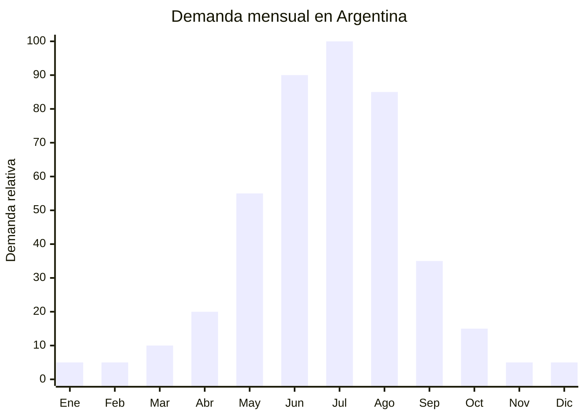

# Bolsas de agua caliente electricas recargables

> **Capitulo NCM 40** — Caucho y sus manufacturas | **Temporada:** Invierno (Jun-Ago)

## Que es y por que importarlo

Las bolsas de agua caliente electricas recargables son dispositivos portatiles que se calientan mediante una resistencia electrica interna en 8-15 minutos y mantienen el calor durante 3-8 horas. A diferencia de las bolsas tradicionales que requieren llenar con agua hirviendo (riesgo de quemaduras), estas se enchufan, se calientan automaticamente y se desconectan. Vienen en formatos de almohadilla plana, funda de peluche con forma de animal (oso, gato, conejo), cinturon termico para espalda, y formato "manos" tipo muff.

En Argentina, la demanda alcanza su maximo entre junio y agosto, cuando las temperaturas bajan de 5 grados en Buenos Aires y bajo cero en el interior. Son especialmente populares entre mujeres (dolores menstruales, pies frios) y personas mayores (dolores articulares). El precio en MercadoLibre oscila entre ARS 8.000 y ARS 25.000, mientras que el FOB chino es de apenas USD 1.50-5.00, generando margenes excepcionales.

China (Yiwu, Cixi, Ningbo) es practicamente el unico fabricante mundial de este producto, con miles de variantes disponibles. Las fabricas ofrecen personalizacion de fundas, colores y packaging desde MOQ de 200-500 unidades. El producto es extremadamente liviano (200-500g), lo que lo hace eficiente para envios maritimos y hasta viables por via aerea. La principal consideracion regulatoria es que, al ser un producto electrico, puede requerir el sello S-Mark (seguridad electrica) dependiendo de la clasificacion arancelaria exacta y la interpretacion del organismo de control.

## Datos clave

| Dato | Valor |
|------|-------|
| **Posiciones NCM tipicas** | 4016.99.90 (manufacturas de caucho) / 8516.79.00 (aparatos electrotermicos) |
| **Derecho de importacion** | 14-20% (DIE segun NCM) + 3% tasa estadistica |
| **Rango FOB tipico** | USD 1.50 — USD 5.00 por unidad |
| **Precio de venta en Argentina** | ARS 8.000 — ARS 25.000 |
| **Margen bruto estimado** | 300% — 550% |
| **MOQ tipico** | 200 — 1,000 unidades |
| **Demanda en MercadoLibre** | Alta (pico junio-agosto) |
| **Competencia en MercadoLibre** | Media (mercado en crecimiento) |
| **Dificultad para importar** | Moderada (posible S-Mark) |
| **Certificaciones necesarias** | S-Mark puede aplicar (verificar con despachante) |
| **Antidumping** | No |

## Variantes y subtipos mas comunes

| Subtipo / Variante | Caracteristicas | FOB estimado |
|--------------------|----------------|-------------|
| Bolsa basica con funda lisa | Almohadilla plana, enchufe 220V, funda polar, 1-2L | USD 1.50 — 2.50 |
| Bolsa con funda peluche animal | Forma de oso/gato/conejo, regalo ideal | USD 2.50 — 4.00 |
| Cinturon termico lumbar | Forma de faja, ajustable con velcro, para espalda | USD 3.00 — 5.00 |
| Bolsa USB portatil | Recarga por USB, mas pequena, para manos | USD 2.00 — 3.50 |
| Almohadilla cervical | Forma de cuello en U, calor localizado cervical | USD 2.50 — 4.50 |
| Botas/pantuflas termicas electricas | Formato bota, calienta pies directamente | USD 3.00 — 5.00 |

## Regulaciones y requisitos

<Tabs>
  <Tab title="Certificaciones">
    | Organismo | Requiere | Detalle |
    |-----------|----------|---------|
    | ARCA (Aduana) | Si siempre | Despacho estandar |
    | S-Mark | **Posible** | Si se clasifica como aparato electrotermico (8516), puede requerir certificacion de seguridad electrica S-Mark. Si se clasifica como manufactura de caucho (4016) con componente electrico menor, la exigencia puede no aplicar. Consultar con despachante |
    | ENACOM | Posible | Si tiene componente Bluetooth o WiFi (version smart), requiere homologacion |
    | ANMAT | No | No es producto medico (salvo que se comercialice con claims terapeuticos) |

    **Recomendacion critica:** Antes de importar, consultar con un despachante de aduanas la clasificacion NCM exacta y si aplica S-Mark. La certificacion S-Mark tiene un costo de USD 300-800 y demora 30-60 dias. Si aplica, es obligatoria y la mercaderia puede ser retenida sin ella.
  </Tab>

  <Tab title="Etiquetado">
    | Requisito | Aplica |
    |-----------|--------|
    | Pais de origen | Si |
    | Datos importador | Si (nombre, direccion, CUIT) |
    | Voltaje/frecuencia | Si ("220V / 50Hz" para Argentina) |
    | Instrucciones de uso | Si (en espanol, con tiempos de carga maximos) |
    | Precauciones | Si ("No usar sin supervision", "No dormir con el producto enchufado", "No perforar") |
    | Sello S-Mark | Si — si aplica la certificacion |
    | Potencia (watts) | Si |
  </Tab>

  <Tab title="Restricciones">
    - **CRITICO:** Verificar que el producto este disenado para 220V/50Hz (estandar argentino). Los modelos para 110V (mercado asiatico/americano) NO funcionan en Argentina y pueden ser peligrosos.
    - El producto debe tener proteccion termica de corte automatico (cut-off thermostat) para evitar sobrecalentamiento.
    - No comercializar con claims medicos ("cura artritis", "tratamiento terapeutico") ya que podria reclasificarse como producto medico ANMAT.
    - Sin antidumping vigente.
    - Solicitar al proveedor: informe de pruebas electricas (IEC 60335) y certificado de termostatico de corte.
  </Tab>
</Tabs>

## Logistica de importacion

| Factor | Detalle |
|--------|---------|
| **Peso por unidad** | 200 — 500 g |
| **Volumen por unidad** | Compacto (caja ~20x15x8 cm) |
| **Unidades por caja (master carton)** | 20 — 50 unidades |
| **Peso por caja** | 5 — 15 kg |
| **Fragilidad** | Baja (material flexible, sin partes fragiles) |
| **Modo de envio recomendado** | Maritimo consolidado (1er pedido) o aereo (urgencia) |
| **Tiempo de produccion** | 15 — 25 dias |
| **Tiempo de envio maritimo** | 35 — 50 dias |
| **Packaging** | Caja individual impresa + manual + cable + master carton |

<Tip>
Este producto es ultraliviano: 500 unidades pesan apenas 150-250 kg. Si necesitas llegar rapido para la temporada, un envio aereo parcial (200-300 unidades) tiene un costo razonable (USD 500-1,000) y te permite empezar a vender mientras el resto viene por barco. La clave es tener stock disponible desde el 1 de junio.
</Tip>

## Estacionalidad y timing de compra

| Timing | Fecha |
|--------|-------|
| **Pedir a fabrica** | Enero — Febrero |
| **Embarque** | Febrero — Marzo |
| **Llegada Argentina** | Abril — Mayo |
| **Inicio ventas** | Junio (primeras olas de frio) |

<Warning>
La demanda cae a casi cero en verano. El stock que queda despues de agosto se convierte en capital inmovilizado por 8-9 meses. Calcular pedidos conservadores y agotar antes del fin de agosto. Si se agota en julio, evaluar un envio aereo de reposicion.
</Warning>

## Ventajas y riesgos

<CardGroup cols={2}>
  <Card title="Ventajas" icon="circle-check">
    - Margen bruto 300-550% sobre FOB
    - Producto ultraliviano (200-500g), flete minimo
    - Demanda concentrada pero intensa (ventas rapidas en temporada)
    - Gran variedad de disenos (peluches, colores, formatos)
    - Producto "regalo" atractivo (especialmente modelos con funda animal)
    - MOQ bajo: desde 200 unidades
    - El concepto "electrico recargable" justifica precio premium vs bolsa tradicional
  </Card>

  <Card title="Riesgos y desventajas" icon="triangle-exclamation">
    - Posible requerimiento S-Mark (verificar antes de importar)
    - Estacionalidad extrema: 85% de ventas en 3 meses
    - Riesgo de seguridad: producto electrico de calor corporal (quemaduras si falla el termostato)
    - Verificar voltaje 220V/50Hz (modelos de 110V no sirven)
    - Competencia creciente: cada ano entran mas importadores
    - Reclamos por durabilidad: la resistencia interna puede fallar despues de 100-200 ciclos
  </Card>
</CardGroup>

## Palabras clave para buscar en Alibaba

`electric hot water bag rechargeable` `electric hand warmer bag` `rechargeable heat pad` `electric hot water bottle plush` `heating pad rechargeable portable` `electric warm bag 220V` `hot water bag electric cute animal`

## Fuentes

- MercadoLibre Argentina — busqueda "bolsa agua caliente electrica" y "almohadilla termica"
- Alibaba.com — proveedores de electric hot water bag
- S-Mark Argentina — requisitos de certificacion electrica
- Google Trends Argentina — estacionalidad "bolsa agua caliente"
