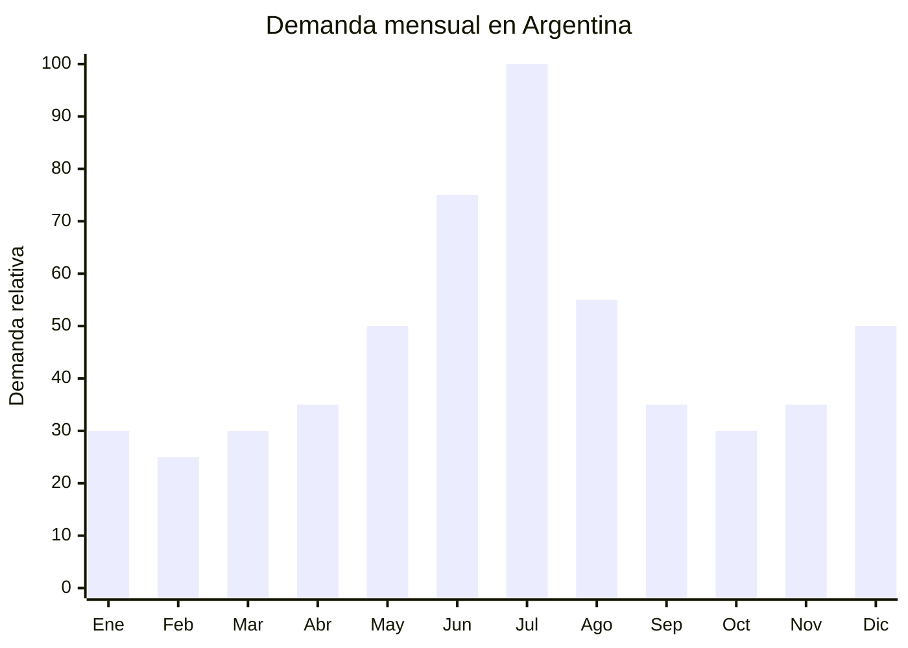

# Bolsos de viaje tipo duffle

> **Capitulo NCM 42** — Manufacturas de cuero, articulos de viaje y bolsos | **Temporada:** Invierno (Jun-Ago)

## Que es y por que importarlo

Los bolsos de viaje tipo duffle (tambien llamados bolsos de gimnasio, weekend bags o carry-on bags) son bolsos cilindricos o rectangulares de gran capacidad (40-60 litros) con asas cortas, correa al hombro y multiples compartimentos. Se fabrican en materiales como nylon 600D/1680D, poliester impermeable, PU sintetico o lona encerada. Son la alternativa practica a las valijas rigidas para viajes cortos de 2-5 dias, fin de semana o vacaciones.

En Argentina, la demanda de bolsos de viaje tiene un pico marcado en julio, coincidiendo con las vacaciones de invierno. Miles de familias viajan a destinos de nieve (Bariloche, Las Lenas, Chapelco), termas (Entre Rios, Mendoza) o escapadas cortas. El duffle bag es ideal para estos viajes: flexible, se mete en el baul del auto o como equipaje de mano en aviones, y resiste las condiciones del invierno (lluvia, nieve, humedad). En MercadoLibre, las busquedas de "bolso viaje" aumentan un 45% en junio-julio.

China (Quanzhou, Baigou, Yiwu) es el mayor productor mundial de bolsos y equipaje, con fabricas que ofrecen personalizacion completa (materiales, colores, logos, compartimentos) desde MOQ de 200 unidades. Los precios FOB de USD 5-15 por unidad permiten margenes del 200-400% en el mercado argentino. El Cap. 42 no tiene antidumping para bolsos de viaje, y no requiere certificaciones especiales.

## Datos clave

| Dato | Valor |
|------|-------|
| **Posiciones NCM tipicas** | 4202.92.00 (bolsos de viaje de materia textil) |
| **Derecho de importacion** | 20% (DIE) + 3% tasa estadistica |
| **Rango FOB tipico** | USD 5.00 — USD 15.00 por unidad |
| **Precio de venta en Argentina** | ARS 15.000 — ARS 50.000 |
| **Margen bruto estimado** | 200% — 400% |
| **MOQ tipico** | 200 — 500 unidades |
| **Demanda en MercadoLibre** | Alta (pico julio) |
| **Competencia en MercadoLibre** | Media-Alta (muchas marcas, poca diferenciacion premium) |
| **Dificultad para importar** | Baja (sin certificaciones especiales) |
| **Certificaciones necesarias** | Ninguna especifica |
| **Antidumping** | No |

## Variantes y subtipos mas comunes

| Subtipo / Variante | Caracteristicas | FOB estimado |
|--------------------|----------------|-------------|
| Duffle basico 40L nylon 600D | Asas + correa, 1 compartimento principal, bolsillo lateral | USD 5.00 — 7.00 |
| Duffle premium 50L nylon 1680D | Impermeable, compartimento zapatos, bolsillos organizadores | USD 8.00 — 12.00 |
| Duffle con ruedas 60L | Ruedas + manija telescopica + asas, hibrido valija/bolso | USD 10.00 — 15.00 |
| Weekend bag cuero PU | Estilo clasico/vintage, 30-40L, uso urbano elegante | USD 8.00 — 14.00 |
| Bolso gym/fitness 35L | Compartimento humedo separado, bolsillo zapatos, mas compacto | USD 5.00 — 8.00 |
| Duffle plegable 45L | Se pliega en bolsillo propio, ideal como bolso extra | USD 3.00 — 5.00 |

## Regulaciones y requisitos

<Tabs>
  <Tab title="Certificaciones">
    | Organismo | Requiere | Detalle |
    |-----------|----------|---------|
    | ARCA (Aduana) | Si siempre | Despacho estandar |
    | ANMAT | No | No es cosmetico ni producto de salud |
    | ENACOM | No | No es electronico |
    | IRAM | No | No hay norma especifica para bolsos de viaje |

    **Nota:** El capitulo 42 es uno de los mas simples para importar en terminos regulatorios. No hay certificaciones obligatorias, no hay antidumping para bolsos de viaje, y el despacho es estandar.
  </Tab>

  <Tab title="Etiquetado">
    | Requisito | Aplica |
    |-----------|--------|
    | Pais de origen | Si |
    | Datos importador | Si (nombre, direccion, CUIT) |
    | Composicion / material | Si ("Nylon 1680D", "Poliester 600D", "PU sintetico") |
    | Capacidad (litros) | Recomendable |
    | Dimensiones | Recomendable (LxAxH en cm) |
    | Idioma espanol | Si |
  </Tab>

  <Tab title="Restricciones">
    - Sin antidumping vigente para bolsos de viaje Cap. 42.
    - Verificar que los cierres (zippers) sean de buena calidad. Los YKK o SBS son estandar. Cierres genericos de baja calidad generan reclamos masivos.
    - Si el bolso se declara como "impermeable", debe realmente resistir agua. Solicitar al proveedor certificado de resistencia al agua (test hydrostatico).
    - Sin restricciones especiales de importacion.
  </Tab>
</Tabs>

## Logistica de importacion

| Factor | Detalle |
|--------|---------|
| **Peso por unidad** | 500 g — 1.5 kg |
| **Volumen por unidad** | Mediano-alto (aun comprimido, ocupa espacio) |
| **Unidades por caja (master carton)** | 10 — 20 unidades |
| **Peso por caja** | 8 — 20 kg |
| **Fragilidad** | Muy baja (material flexible, no hay partes rigidas) |
| **Modo de envio recomendado** | Maritimo (producto voluminoso) |
| **Tiempo de produccion** | 20 — 35 dias (si hay personalizacion) |
| **Tiempo de envio maritimo** | 35 — 50 dias |
| **Packaging** | Bolsa plastica individual + master carton |

<Tip>
Los bolsos de viaje son "producto voluminoso": ocupan mucho espacio para su peso. Esto significa que el flete se calcula por volumen (CBM) y no por peso. Para optimizar el envio: (1) pedir al proveedor que comprima los bolsos al maximo dentro de los master cartons, (2) solicitar embalaje al vacio si el material lo permite, (3) elegir modelos plegables que reducen volumen un 60-70%.
</Tip>

## Estacionalidad y timing de compra

| Timing | Fecha |
|--------|-------|
| **Pedir a fabrica** | Febrero — Marzo |
| **Embarque** | Marzo — Abril |
| **Llegada Argentina** | Mayo — Junio |
| **Inicio ventas** | Junio (pre-vacaciones de invierno) |

<Note>
A diferencia de otros productos estacionales, los bolsos de viaje tienen demanda razonablemente distribuida durante todo el ano (viajes de negocios, fines de semana, gym). El pico es julio, pero no caen a cero nunca. Esto reduce el riesgo de stock muerto.
</Note>

## Ventajas y riesgos

<CardGroup cols={2}>
  <Card title="Ventajas" icon="circle-check">
    - SIN certificaciones obligatorias
    - Sin antidumping en Cap. 42 bolsos
    - Margen bruto 200-400% sobre FOB
    - Demanda distribuida todo el ano con pico invernal
    - Producto no perecedero (sin vencimiento)
    - Gran potencial para marca propia (logo, colores, diseno)
    - Variedad de modelos para diferentes nichos (viaje, gym, negocios)
  </Card>

  <Card title="Riesgos y desventajas" icon="triangle-exclamation">
    - Producto voluminoso: flete calculado por CBM, no por peso
    - Competencia alta con marcas establecidas (Samsonite, Primicia, etc.)
    - Calidad de cierres es el punto debil mas comun
    - Multiples SKUs (colores, tamanos) complican la gestion de inventario
    - Percepcion "bolso chino" puede limitar precio maximo
    - Modelos grandes (60L+) son dificiles de vender fuera de temporada
  </Card>
</CardGroup>

## Palabras clave para buscar en Alibaba

`duffle bag travel wholesale` `weekender bag factory` `gym bag large capacity` `travel duffle bag waterproof OEM` `nylon duffel bag private label` `PU leather weekend bag wholesale` `foldable travel bag manufacturer` `rolling duffle bag wheels`

## Fuentes

- MercadoLibre Argentina — busqueda "bolso viaje" y "bolso duffle"
- Alibaba.com — proveedores de travel duffle bags
- ARCA — arancel externo comun Cap. 42
- Google Trends Argentina — estacionalidad "bolso viaje"
