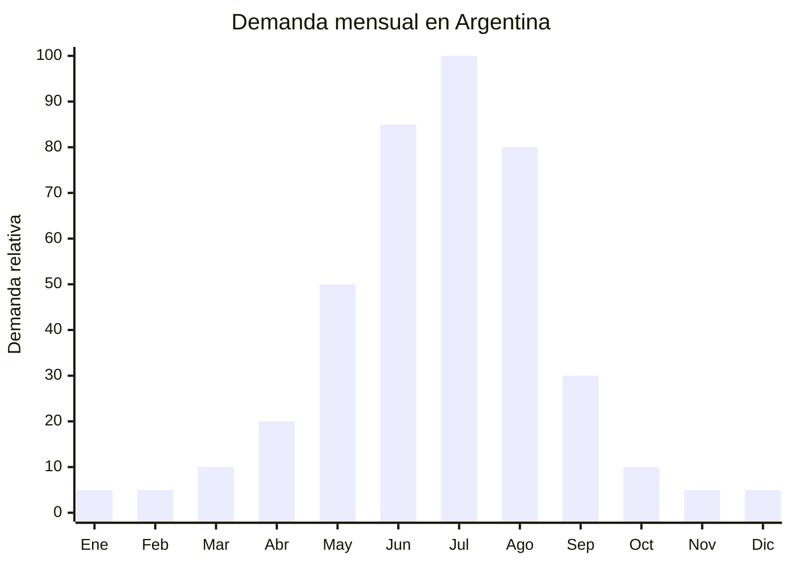

# Guantes de cuero y PU sintetico

> **Capitulo NCM 42** — Manufacturas de cuero, articulos de viaje y bolsos | **Temporada:** Invierno (Jun-Ago)

## Que es y por que importarlo

Los guantes de cuero y PU sintetico (poliuretano) son accesorios de invierno que combinan proteccion termica con estetica. Se fabrican en cuero genuino (oveja, cabra) o en cuero sintetico PU de alta calidad que imita la textura y apariencia del cuero real. Los modelos mas demandados incluyen forro interior termico (polar, piel sintetica, lana), compatibilidad con pantallas tactiles (dedos conductivos para usar el celular sin sacarse los guantes) y detalles de costura o herrajes decorativos.

En Argentina, la demanda de guantes se concentra entre junio y agosto, con pico maximo en julio cuando las temperaturas alcanzan los minimos del ano. A diferencia de los guantes de lana o tejidos (que son mas casuales y juveniles), los guantes de cuero/PU se posicionan como un accesorio de vestir elegante, ideal para uso urbano con abrigos y camperas. El precio en MercadoLibre oscila entre ARS 8.000 y ARS 30.000, dependiendo del material y la calidad del forro.

China (Hebei, especialmente la ciudad de Baoding, concentra el 60% de la produccion mundial de guantes de cuero) ofrece guantes de cuero genuino desde USD 3/par y PU sintetico desde USD 2/par, con MOQ de 200-500 pares. El capitulo 42 del NCM NO tiene antidumping vigente para guantes (a diferencia de otros productos del mismo capitulo), lo que facilita la importacion. La clave esta en ofrecer el feature "touchscreen" que agrega un diferencial relevante para el consumidor moderno.

## Datos clave

| Dato | Valor |
|------|-------|
| **Posiciones NCM tipicas** | 4203.29.00 (guantes de cuero) / 4203.29.00 (guantes de cuero reconstituido) |
| **Derecho de importacion** | 20% (DIE) + 3% tasa estadistica |
| **Rango FOB tipico** | USD 2.00 — USD 6.00 por par |
| **Precio de venta en Argentina** | ARS 8.000 — ARS 30.000 |
| **Margen bruto estimado** | 250% — 450% |
| **MOQ tipico** | 200 — 500 pares (por talle y color) |
| **Demanda en MercadoLibre** | Alta (junio-agosto) |
| **Competencia en MercadoLibre** | Media (marcas locales + importadores) |
| **Dificultad para importar** | Baja (sin certificaciones especiales) |
| **Certificaciones necesarias** | Ninguna especifica |
| **Antidumping** | No (Cap. 42 guantes exento) |

## Variantes y subtipos mas comunes

| Subtipo / Variante | Caracteristicas | FOB estimado |
|--------------------|----------------|-------------|
| Guante PU sintetico basico hombre | PU liso, forro polar, touchscreen | USD 2.00 — 3.00 |
| Guante PU sintetico mujer | PU suave, detalles decorativos, forro piel sintetica | USD 2.00 — 3.50 |
| Guante cuero genuino hombre | Cuero oveja/cabra, forro lana, touchscreen, costura clasica | USD 4.00 — 6.00 |
| Guante cuero genuino mujer | Cuero suave, forro cashmere blend, elegante | USD 3.50 — 5.50 |
| Guante driving (conduccion) | Sin forro, agarre especial, estilo deportivo | USD 2.50 — 4.00 |
| Guante largo mujer (opera length) | Hasta el codo, PU o cuero, uso formal/fashion | USD 3.00 — 5.00 |

## Regulaciones y requisitos

<Tabs>
  <Tab title="Certificaciones">
    | Organismo | Requiere | Detalle |
    |-----------|----------|---------|
    | ARCA (Aduana) | Si siempre | Despacho estandar |
    | ANMAT | No | No es cosmetico ni producto de salud |
    | ENACOM | No | No es electronico |
    | IRAM | No | No hay norma especifica para guantes de vestir |
    | SENASA | No | No es alimento |

    **Nota sobre cuero genuino:** Si se importa como "cuero genuino", el despachante puede solicitar certificacion de origen del cuero (para verificar que no es cuero sintetico declarado como genuino, lo cual seria una falsa declaracion aduanera). Algunos proveedores chinos ofrecen certificado de autenticidad del cuero.
  </Tab>

  <Tab title="Etiquetado">
    | Requisito | Aplica |
    |-----------|--------|
    | Pais de origen | Si |
    | Datos importador | Si (nombre, direccion, CUIT) |
    | Composicion / material | Si ("Cuero genuino", "PU sintetico", "Forro: poliester") |
    | Talles | Si (S, M, L, XL o sistema numerico) |
    | Instrucciones de cuidado | Recomendable ("No lavar con agua", "Hidratar con crema para cuero") |
    | Idioma espanol | Si |
  </Tab>

  <Tab title="Restricciones">
    - Sin antidumping vigente para guantes Cap. 42.
    - Si se declara como "cuero genuino" pero es PU, constituye infraccion aduanera y posible fraude comercial.
    - Verificar que los tintes del cuero no contengan cromo VI (hexavalente), un carcinogeno regulado en la UE y referencia para Argentina.
    - Los guantes "touchscreen" deben funcionar realmente con pantallas capacitivas. Verificar con muestras antes de comprar.
    - Sin restricciones especiales de importacion.
  </Tab>
</Tabs>

## Logistica de importacion

| Factor | Detalle |
|--------|---------|
| **Peso por par** | 80 — 200 g |
| **Volumen por par** | Muy compacto (con packaging ~20x10x5 cm) |
| **Pares por caja (master carton)** | 50 — 100 pares |
| **Peso por caja** | 5 — 12 kg |
| **Fragilidad** | Muy baja (material flexible) |
| **Modo de envio recomendado** | Maritimo consolidado o aereo (producto muy liviano) |
| **Tiempo de produccion** | 15 — 25 dias |
| **Tiempo de envio maritimo** | 35 — 50 dias |
| **Packaging** | Bolsa individual + etiqueta colgante + master carton |

<Tip>
La gestion de talles es critica. La distribucion ideal para el mercado argentino es aproximadamente: S (10%), M (30%), L (35%), XL (20%), XXL (5%). No pedir todos los talles en cantidades iguales. Ademas, separar las ordenes por genero: los guantes de mujer suelen ser S-M y los de hombre M-L-XL. Pedir muestras de cada talle antes del pedido masivo.
</Tip>

## Estacionalidad y timing de compra

| Timing | Fecha |
|--------|-------|
| **Pedir a fabrica** | Enero — Febrero |
| **Embarque** | Febrero — Marzo |
| **Llegada Argentina** | Abril — Mayo |
| **Inicio ventas** | Junio (primeras heladas) |

<Note>
Los guantes de cuero tienen una temporada de venta MUY corta (3-4 meses). Es fundamental llegar a tiempo. Si el embarque se retrasa a junio, se pierde un tercio de la temporada. El cuero genuino tiene mejor valor residual fuera de temporada que el PU sintetico.
</Note>

## Ventajas y riesgos

<CardGroup cols={2}>
  <Card title="Ventajas" icon="circle-check">
    - SIN certificaciones obligatorias (barrera de entrada minima)
    - Sin antidumping en Cap. 42 guantes
    - Margen bruto 250-450% sobre FOB
    - Producto ultraliviano y compacto
    - Feature "touchscreen" agrega valor diferencial real
    - El cuero genuino tiene percepcion premium alta
    - Ideal para venta en packs (guantes + gorro + bufanda)
  </Card>

  <Card title="Riesgos y desventajas" icon="triangle-exclamation">
    - Temporada muy corta: 3-4 meses de venta real
    - Gestion de talles compleja (multiples SKUs por modelo)
    - Stock de talles extremos (S, XXL) tiende a quedar sin vender
    - Cuero PU puede lucir "plastico" si la calidad es baja
    - Competencia con guantes de lana/tejidos (mas baratos)
    - Riesgo de deterioro en almacenamiento prolongado (humedad, hongos en cuero genuino)
  </Card>
</CardGroup>

## Palabras clave para buscar en Alibaba

`leather gloves touchscreen men` `PU leather gloves women winter` `sheepskin gloves fleece lined` `touch screen leather gloves wholesale` `winter driving gloves leather` `faux leather gloves bulk` `Baoding leather gloves factory`

## Fuentes

- MercadoLibre Argentina — busqueda "guantes cuero" y "guantes invierno"
- Alibaba.com — proveedores de leather gloves Baoding/Hebei
- ARCA — arancel externo comun Cap. 42
- Google Trends Argentina — estacionalidad "guantes cuero"
