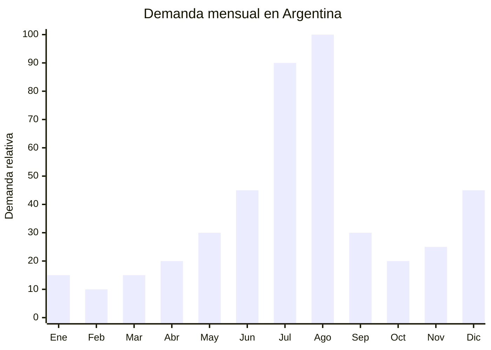

# Rompecabezas 3D de madera y maquetas para armar

> **Capitulo NCM 44** — Madera, carbon vegetal y manufacturas de madera | **Temporada:** Invierno (Jun-Ago)

## Que es y por que importarlo

Los rompecabezas 3D de madera son maquetas tridimensionales que se ensamblan pieza por pieza a partir de laminas de MDF (fibra de densidad media) o madera contrachapada cortadas a laser. Al completarse, forman figuras volumetricas como animales, edificios famosos, vehiculos, instrumentos musicales, cajas musicales mecanicas, globos terraqueos y relojes funcionales. Las marcas de referencia internacional son Robotime y Ugears (esta ultima ucraniana, pero fabricada en China). La complejidad varia desde modelos de 50 piezas (para ninos) hasta maquetas mecanicas de 500+ piezas con engranajes funcionales (para adultos).

En Argentina, la demanda se concentra entre julio y agosto por la combinacion de vacaciones de invierno (actividades indoor para ninos y familias) y el Dia del Nino (tercer domingo de agosto). Los rompecabezas 3D son un regalo ideal porque combinan entretenimiento con estimulacion cognitiva, no requieren baterias ni pantallas, y el resultado terminado funciona como pieza decorativa. En MercadoLibre, las busquedas de "rompecabezas 3D" y "maqueta madera" crecen un 70% entre julio y agosto.

China (Yiwu, Shantou, Dongguan) domina la produccion mundial, con fabricas que ofrecen cientos de modelos y posibilidad de crear disenos exclusivos (OEM). El corte laser garantiza precision de ensamblaje y el MDF de 3mm es el material estandar. Los precios FOB oscilan entre USD 2 (modelos simples) y USD 12 (maquetas mecanicas complejas), con margenes de reventa del 300-500% en Argentina.

## Datos clave

| Dato | Valor |
|------|-------|
| **Posiciones NCM tipicas** | 4421.99.00 (las demas manufacturas de madera) / 9503.00.99 (si se clasifica como juguete) |
| **Derecho de importacion** | 12-18% (DIE segun NCM) + 3% tasa estadistica |
| **Rango FOB tipico** | USD 2.00 — USD 12.00 por unidad |
| **Precio de venta en Argentina** | ARS 8.000 — ARS 45.000 |
| **Margen bruto estimado** | 300% — 500% |
| **MOQ tipico** | 200 — 1,000 unidades (por modelo) |
| **Demanda en MercadoLibre** | Alta (julio-agosto) |
| **Competencia en MercadoLibre** | Media (Robotime presente, espacio para otras marcas) |
| **Dificultad para importar** | Moderada (IRAM 3583 si es para menores de 14 anos) |
| **Certificaciones necesarias** | IRAM 3583 si el usuario es menor de 14 anos |
| **Antidumping** | No |

## Variantes y subtipos mas comunes

| Subtipo / Variante | Caracteristicas | FOB estimado |
|--------------------|----------------|-------------|
| Puzzle 3D animal basico (50-80 pcs) | Dinosaurio, caballo, leon, para ninos 6+ | USD 2.00 — 3.50 |
| Puzzle 3D edificio (100-200 pcs) | Torre Eiffel, Coliseo, Taj Mahal, decorativo | USD 3.00 — 5.00 |
| Maqueta mecanica con engranajes (200+ pcs) | Tipo Robotime/Ugears, mecanismo funcional, para 14+ | USD 5.00 — 10.00 |
| Caja musical mecanica (150+ pcs) | Mecanismo de cuerda, suena al completarse | USD 6.00 — 12.00 |
| Globo terraqueo 3D | Esfera armable con base, educativo | USD 4.00 — 7.00 |
| Kit principiante (3-5 modelos simples) | Varios modelos faciles en un pack, ideal regalo | USD 4.00 — 8.00 |

## Regulaciones y requisitos

<Tabs>
  <Tab title="Certificaciones">
    | Organismo | Requiere | Detalle |
    |-----------|----------|---------|
    | ARCA (Aduana) | Si siempre | Despacho estandar |
    | IRAM | **Si — IRAM 3583** | Si el producto esta destinado a menores de 14 anos, debe cumplir norma de seguridad de juguetes |
    | ANMAT | No | No es cosmetico ni producto de salud |
    | ENACOM | No | No es electronico |
    | SENASA | No* | Puede requerir tratamiento fitosanitario para productos de madera (ver restricciones) |

    **Estrategia recomendada:** Los modelos complejos (200+ piezas) pueden clasificarse como "articulos de madera para adultos" (14+) y evitar IRAM 3583. Los modelos simples para ninos requieren certificacion. Indicar claramente "+14 anos" en el packaging de los modelos complejos.
  </Tab>

  <Tab title="Etiquetado">
    | Requisito | Aplica |
    |-----------|--------|
    | Pais de origen | Si |
    | Datos importador | Si (nombre, direccion, CUIT) |
    | Edad recomendada | Si — obligatorio |
    | Numero de piezas | Si |
    | Precauciones | Si ("Contiene piezas pequenas", "No apto para menores de 3 anos") |
    | Material | Si ("MDF", "Madera contrachapada") |
    | Sello "S" de seguridad | Si — si cumple IRAM 3583 |
    | Idioma espanol | Si |
  </Tab>

  <Tab title="Restricciones">
    - **Tratamiento fitosanitario:** La madera importada puede requerir certificado de tratamiento fitosanitario (NIMF 15) o fumigacion con bromuro de metilo. Sin embargo, el MDF procesado generalmente esta exento porque el proceso de fabricacion (alta temperatura y presion) elimina plagas. Consultar con el despachante.
    - Las piezas de MDF deben tener bajo contenido de formaldehido (clase E1 o superior). Solicitar certificado al proveedor.
    - Si se clasifica como juguete (menores de 14 anos), la norma IRAM 3583 exige: test de piezas pequenas, toxicidad de pinturas/barnices, bordes afilados.
    - Sin antidumping vigente.
  </Tab>
</Tabs>

## Logistica de importacion

| Factor | Detalle |
|--------|---------|
| **Peso por unidad** | 200 g — 1.5 kg (segun complejidad) |
| **Volumen por unidad** | Mediano (cajas planas 25x20x5 a 35x25x8 cm) |
| **Unidades por caja (master carton)** | 20 — 50 unidades |
| **Peso por caja** | 8 — 20 kg |
| **Fragilidad** | Media (las laminas de MDF pueden quebrarse si se presionan) |
| **Modo de envio recomendado** | Maritimo consolidado |
| **Tiempo de produccion** | 15 — 30 dias |
| **Tiempo de envio maritimo** | 35 — 50 dias |
| **Packaging** | Caja individual impresa + laminas en bolsa + instrucciones + master carton |

<Tip>
Las laminas de MDF son rigidas pero fragiles en los puntos de corte laser (donde las piezas estan pre-cortadas). Si las cajas sufren aplastamiento durante el transporte, las piezas se quiebran y el producto queda inutilizable. Exigir al proveedor: (1) separadores de carton ondulado entre capas de cajas, (2) master cartons de doble pared, y (3) advertencias de "NO APILAR" si superan las 5 cajas.
</Tip>

## Estacionalidad y timing de compra

| Timing | Fecha |
|--------|-------|
| **Pedir a fabrica** | Febrero — Marzo |
| **Embarque** | Marzo — Abril |
| **Llegada Argentina** | Mayo — Junio |
| **Inicio ventas** | Julio (vacaciones de invierno) |

<Warning>
Si la mercaderia necesita certificacion IRAM 3583, sumar 15-30 dias adicionales de ensayos de laboratorio despues de la llegada a Argentina. Esto significa que para vender en julio, la mercaderia debe llegar a mas tardar a fines de mayo.
</Warning>

## Ventajas y riesgos

<CardGroup cols={2}>
  <Card title="Ventajas" icon="circle-check">
    - Margen bruto 300-500% sobre FOB
    - Producto educativo y decorativo (doble proposito)
    - Los modelos "+14 anos" evitan IRAM 3583
    - Producto no perecedero (sin vencimiento, sin deterioro)
    - Tendencia DIY y STEM en crecimiento
    - Excelente regalo para Dia del Nino y Navidad
    - Gran variedad de modelos (cientos de disenos disponibles)
  </Card>

  <Card title="Riesgos y desventajas" icon="triangle-exclamation">
    - IRAM 3583 obligatorio para modelos infantiles (costo y tiempo)
    - Fragilidad del MDF en transporte (laminas pre-cortadas)
    - Posible requerimiento fitosanitario para productos de madera
    - Estacionalidad marcada: pico concentrado en julio-agosto
    - Si las instrucciones no estan en espanol, genera reclamos
    - Competencia con marcas premium como Robotime (ya posicionadas)
  </Card>
</CardGroup>

## Palabras clave para buscar en Alibaba

`3D wooden puzzle wholesale` `wooden mechanical model kit` `laser cut wood puzzle factory` `DIY wooden model building kit` `MDF 3D puzzle manufacturer` `Robotime style wooden puzzle OEM` `music box wooden puzzle wholesale` `STEM wooden puzzle educational`

## Fuentes

- MercadoLibre Argentina — busqueda "rompecabezas 3D madera" y "maqueta madera"
- Alibaba.com — proveedores de 3D wooden puzzles
- Robotime — referencia de modelos y precios
- IRAM — Norma IRAM 3583 seguridad de juguetes
- SENASA — requisitos fitosanitarios para productos de madera importada
