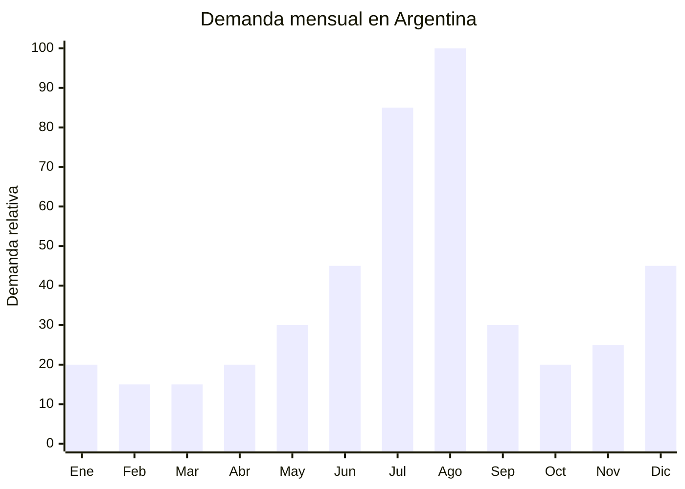

# Rompecabezas de carton (puzzles 500-2000 piezas)

> **Capitulo NCM 48** — Papel y carton; manufacturas de pasta de celulosa | **Temporada:** Invierno (Jun-Ago)

## Que es y por que importarlo

Los rompecabezas de carton (puzzles o jigsaw puzzles) son juegos de mesa clasicos que consisten en ensamblar 500 a 2000 piezas de carton troqueladas para formar una imagen completa. Los temas mas populares incluyen paisajes, ciudades famosas, obras de arte, animales, mapas y disenos fantasia. Se fabrican en carton gris de 2mm con impresion offset de alta resolucion, recubierto con barniz UV o laminado mate, y troquelado con matrices de precision que generan piezas unicas.

En Argentina, los rompecabezas de carton experimentan un boom de demanda entre julio y agosto. Las vacaciones de invierno dejan a familias enteras buscando actividades para hacer juntos en casa durante los dias frios y lluviosos. Los puzzles son la actividad indoor por excelencia: no requieren pantallas, fomentan la concentracion y el trabajo en equipo, y duran horas o dias de entretenimiento. Ademas, el Dia del Nino (tercer domingo de agosto) impulsa las ventas de juegos de mesa un 63% segun datos del mercado. Marcas como Implas, Rompecabezas Argentinos y la referencia internacional Ravensburger dominan el mercado local.

China (Shenzhen, Dongguan) es el mayor fabricante mundial de puzzles, produciendo para marcas globales como Ravensburger, Educa y Trefl. Los precios FOB de USD 0.80-4.00 por puzzle (dependiendo del numero de piezas) permiten margenes del 300-500% en Argentina. La gran ventaja regulatoria es que los puzzles de 500+ piezas se destinan a mayores de 14 anos, por lo que NO requieren certificacion IRAM 3583. Esto elimina la principal barrera de entrada.

## Datos clave

| Dato | Valor |
|------|-------|
| **Posiciones NCM tipicas** | 4911.91.00 (estampas, grabados y fotografias) / 9503.00.60 (rompecabezas como juguete) |
| **Derecho de importacion** | 14-18% (DIE segun NCM) + 3% tasa estadistica |
| **Rango FOB tipico** | USD 0.80 — USD 4.00 por unidad |
| **Precio de venta en Argentina** | ARS 6.000 — ARS 25.000 |
| **Margen bruto estimado** | 300% — 500% |
| **MOQ tipico** | 500 — 3,000 unidades (por diseno) |
| **Demanda en MercadoLibre** | Alta (julio-agosto, Dia del Nino) |
| **Competencia en MercadoLibre** | Media (Implas domina, espacio para nuevos) |
| **Dificultad para importar** | Muy baja (sin regulacion si es +14 anos) |
| **Certificaciones necesarias** | IRAM 3583 solo si se destina a menores de 14 anos (evitable con "+14") |
| **Antidumping** | No |

## Variantes y subtipos mas comunes

| Subtipo / Variante | Caracteristicas | FOB estimado |
|--------------------|----------------|-------------|
| Puzzle 500 piezas estandar | 48x35 cm terminado, caja 27x20 cm, principiante | USD 0.80 — 1.50 |
| Puzzle 1000 piezas estandar | 70x50 cm terminado, caja 37x27 cm, mas popular | USD 1.50 — 2.50 |
| Puzzle 1500 piezas | 83x57 cm terminado, intermedio-avanzado | USD 2.00 — 3.00 |
| Puzzle 2000 piezas | 97x67 cm terminado, avanzado | USD 2.50 — 4.00 |
| Puzzle luminiscente (glow in dark) | Brilla en la oscuridad, diferencial atractivo | USD 2.00 — 3.50 |
| Puzzle circular/irregular | Forma redonda o silueta, nicho premium | USD 2.00 — 4.00 |

## Regulaciones y requisitos

<Tabs>
  <Tab title="Certificaciones">
    | Organismo | Requiere | Detalle |
    |-----------|----------|---------|
    | ARCA (Aduana) | Si siempre | Despacho estandar |
    | IRAM | **No*** | *Si se indica "+14 anos" en el packaging, NO requiere IRAM 3583. Los puzzles de 500+ piezas son intrinsecamente para mayores: piezas muy pequenas, alta complejidad |
    | ANMAT | No | No es cosmetico ni producto de salud |
    | ENACOM | No | No es electronico |

    **Estrategia clave:** Etiquetar TODOS los puzzles como "+14 anos" para evitar el requisito IRAM 3583. Los puzzles de 500+ piezas son naturalmente para adolescentes y adultos. Esto elimina la necesidad de certificacion, laboratorio y tiempos de espera.
  </Tab>

  <Tab title="Etiquetado">
    | Requisito | Aplica |
    |-----------|--------|
    | Pais de origen | Si |
    | Datos importador | Si (nombre, direccion, CUIT) |
    | Numero de piezas | Si — obligatorio |
    | Edad recomendada | Si — indicar "+14 anos" |
    | Imagen del puzzle terminado | Si — generalmente en la caja |
    | Dimensiones terminado | Recomendable (en cm) |
    | Idioma espanol | Si |
  </Tab>

  <Tab title="Restricciones">
    - Sin antidumping vigente para puzzles/rompecabezas.
    - Si se comercializa para menores de 14 anos, IRAM 3583 es obligatoria (test de piezas pequenas, toxicidad de tintas).
    - Verificar que las tintas de impresion sean no toxicas (solicitar certificado de tintas al proveedor).
    - Los puzzles con disenos de marcas registradas (Disney, Marvel, etc.) requieren licencia. No importar puzzles con personajes sin verificar derechos.
    - Sin restricciones especiales de importacion.
  </Tab>
</Tabs>

## Logistica de importacion

| Factor | Detalle |
|--------|---------|
| **Peso por unidad** | 300 g — 1.5 kg (segun cantidad de piezas) |
| **Volumen por unidad** | Mediano (cajas 27x20x6 a 37x27x8 cm) |
| **Unidades por caja (master carton)** | 10 — 30 unidades |
| **Peso por caja** | 8 — 20 kg |
| **Fragilidad** | Baja (carton resistente, sin partes fragiles) |
| **Modo de envio recomendado** | Maritimo consolidado |
| **Tiempo de produccion** | 15 — 30 dias |
| **Tiempo de envio maritimo** | 35 — 50 dias |
| **Packaging** | Caja individual impresa + bolsa de piezas sellada + master carton |

<Tip>
Los puzzles son pesados para su valor (un puzzle de 1000 piezas pesa ~800g y cuesta FOB USD 2). Esto significa que el flete maritimo tiene peso significativo en el costo final. Para optimizar: (1) pedir la mayor cantidad por embarque posible para diluir costos fijos, (2) no mezclar con productos muy livianos en un consolidado (se pierde eficiencia), (3) considerar que un pallet de 1,000 puzzles de 1000 piezas pesa aprox. 800 kg.
</Tip>

## Estacionalidad y timing de compra

| Timing | Fecha |
|--------|-------|
| **Pedir a fabrica** | Febrero — Marzo |
| **Embarque** | Marzo — Abril |
| **Llegada Argentina** | Mayo — Junio |
| **Inicio ventas** | Julio (vacaciones de invierno) |

<Note>
Los puzzles tienen un segundo pico menor en diciembre (Navidad/regalos). Esto ayuda a liquidar stock remanente de invierno. Ademas, la pandemia de 2020 genero un habito de consumo de puzzles que se mantuvo: la demanda base anual es mayor que pre-2020.
</Note>

## Ventajas y riesgos

<CardGroup cols={2}>
  <Card title="Ventajas" icon="circle-check">
    - SIN certificacion obligatoria si se etiqueta "+14 anos"
    - Margen bruto 300-500% sobre FOB
    - Producto no perecedero (sin vencimiento, duracion infinita)
    - Bajo riesgo de rotura o deterioro en transporte
    - Segundo pico en Navidad (diciembre)
    - Tendencia "screen detox" beneficia la categoria
    - MOQ por diseno es bajo (500-1000 unidades)
  </Card>

  <Card title="Riesgos y desventajas" icon="triangle-exclamation">
    - Producto pesado para su valor (flete impacta en margen)
    - Competencia con marcas establecidas (Implas, Ravensburger)
    - Los disenos deben ser atractivos: un puzzle con imagen aburrida no se vende
    - Riesgo de piezas faltantes (control de calidad critico)
    - Disenos con personajes licenciados pueden generar problemas legales
    - Estacionalidad marcada: 55% de ventas en julio-agosto
  </Card>
</CardGroup>

## Palabras clave para buscar en Alibaba

`jigsaw puzzle 1000 pieces wholesale` `custom puzzle manufacturer` `cardboard puzzle factory Shenzhen` `puzzle 500 pieces bulk` `2000 pieces puzzle OEM` `glow in dark puzzle wholesale` `round puzzle circular custom` `puzzle gift set private label`

## Fuentes

- MercadoLibre Argentina — busqueda "rompecabezas 1000 piezas" y "puzzle adultos"
- Alibaba.com — proveedores de jigsaw puzzle manufacturers
- Implas Argentina — referencia de precios y presentaciones
- Google Trends Argentina — estacionalidad "rompecabezas"
- IRAM — Norma IRAM 3583 seguridad de juguetes (aplicabilidad)
