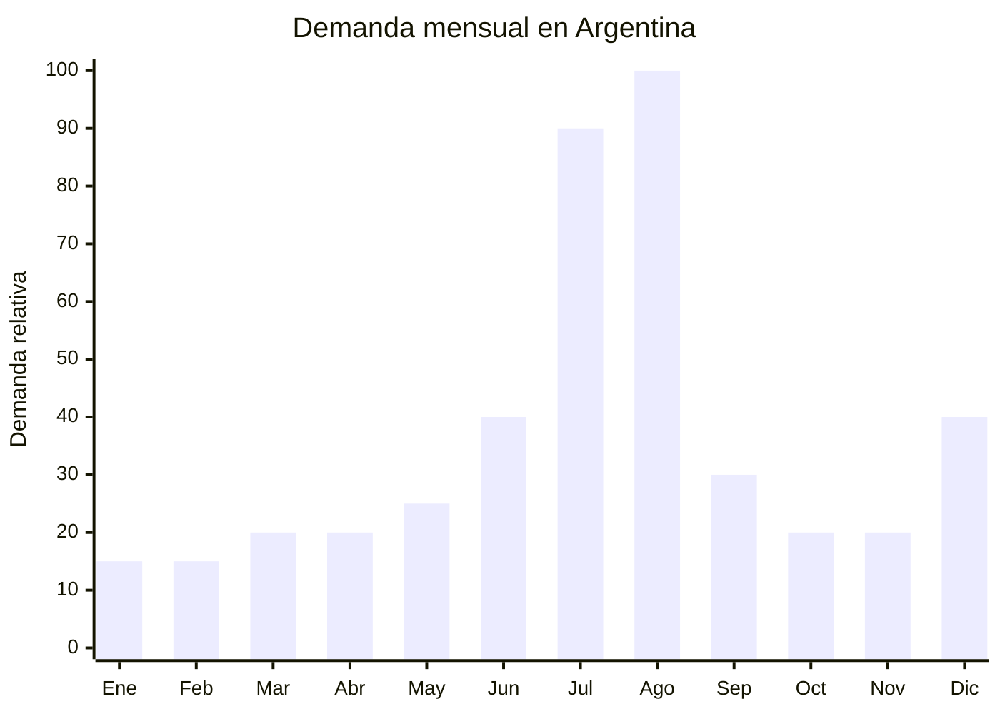

# Libros de actividades y colorear para ninos

> **Capitulo NCM 49** — Productos editoriales, de la prensa y de las industrias graficas | **Temporada:** Invierno (Jun-Ago)

## Que es y por que importarlo

Los libros de actividades y colorear son publicaciones impresas de 100-200 paginas que combinan dibujos para pintar, laberintos, sopas de letras, sudokus infantiles, unir puntos, buscar diferencias, recortables, stickers, actividades de escritura y matematicas basicas. Se imprimen en papel obra de 80-120 g/m2, con tapas blandas o semirrigidas, en formato A4 o ligeramente menor. Los temas populares incluyen animales, dinosaurios, unicornios, piratas, princesas, vehiculos y naturaleza.

En Argentina, la demanda de estos productos se dispara en julio-agosto por las vacaciones de invierno. Los padres buscan actividades para mantener a los ninos entretenidos durante las dos semanas de receso escolar sin depender exclusivamente de las pantallas. Los libros de actividades son baratos (ARS 3.000-10.000), portatiles, no requieren pilas ni wifi, y generan entretenimiento durante horas. El Dia del Nino (agosto) potencia aun mas la categoria, ya que son regalos ideales para agregar a otros obsequios o para regalos grupales.

China es la potencia mundial de impresion. Fabricas de Shenzhen, Dongguan y Shanghai imprimen para editoriales globales con calidad de exportacion a precios FOB de USD 0.50-2.00 por libro. La ventaja decisiva para importar es que los libros y publicaciones gozan de **arancel 0% en el MERCOSUR** (derechos de importacion exentos), lo que reduce drasticamente los costos de nacionalizacion. Ademas, NO requieren certificacion IRAM (no son juguetes), NO requieren ANMAT y tienen una de las barreras de entrada mas bajas de todo el universo de importacion.

## Datos clave

| Dato | Valor |
|------|-------|
| **Posiciones NCM tipicas** | 4903.00.00 (albums o libros de estampas y cuadernos para dibujar o colorear, para ninos) |
| **Derecho de importacion** | **0%** (exento — productos editoriales MERCOSUR) |
| **Tasa estadistica** | 0% (exenta para libros) |
| **Rango FOB tipico** | USD 0.50 — USD 2.00 por unidad |
| **Precio de venta en Argentina** | ARS 3.000 — ARS 10.000 |
| **Margen bruto estimado** | 400% — 700% |
| **MOQ tipico** | 1,000 — 5,000 unidades (por titulo) |
| **Demanda en MercadoLibre** | Alta (julio-agosto) |
| **Competencia en MercadoLibre** | Media (editoriales locales + importadores) |
| **Dificultad para importar** | Muy baja (barrera minima) |
| **Certificaciones necesarias** | Ninguna |
| **Antidumping** | No |

<Note>
**Arancel 0%:** Los productos del capitulo 49 (libros, publicaciones, material impreso) estan exentos de derechos de importacion en el MERCOSUR. Esto significa que NO se pagan aranceles de importacion ni tasa estadistica. Solo se abonan gastos aduaneros basicos (honorarios despachante, terminal, etc.) y el IVA (que es un impuesto general, no arancel). Esto convierte a los libros en uno de los productos mas eficientes para importar.
</Note>

## Variantes y subtipos mas comunes

| Subtipo / Variante | Caracteristicas | FOB estimado |
|--------------------|----------------|-------------|
| Libro colorear basico 64-80 pags | Dibujos para pintar, tapa blanda, A4 | USD 0.50 — 0.80 |
| Libro actividades mixto 100-150 pags | Colorear + laberintos + sopas de letras + unir puntos | USD 0.80 — 1.30 |
| Libro actividades premium 200 pags | Actividades variadas + stickers incluidos, tapa semirrigida | USD 1.30 — 2.00 |
| Libro acuatico (water coloring) | Se pinta con pincel y agua, revela colores, reutilizable | USD 1.00 — 2.00 |
| Libro rascar (scratch art) | Paginas negras que revelan colores al rascar con palito | USD 0.80 — 1.50 |
| Pack 3-5 libros variados | Varios titulos tematicos en shrink wrap | USD 2.00 — 5.00/pack |

## Regulaciones y requisitos

<Tabs>
  <Tab title="Certificaciones">
    | Organismo | Requiere | Detalle |
    |-----------|----------|---------|
    | ARCA (Aduana) | Si siempre | Despacho estandar, pero con arancel 0% |
    | IRAM | **No** | Un libro de actividades NO es un juguete. No aplica IRAM 3583 |
    | ANMAT | No | No es cosmetico ni producto de salud |
    | ENACOM | No | No es electronico |
    | ISBN | No obligatorio | Para libros de actividades/colorear no se requiere ISBN (es material grafico, no editorial con registro obligatorio). Sin embargo, tener ISBN facilita la venta en librerias |

    **Nota:** La clasificacion como "libro de colorear/actividades" (4903.00.00) es la clave para obtener el arancel 0%. Si el producto se clasifica en otra partida (por ejemplo, como "juguete educativo" 9503), el arancel cambia. Coordinar la clasificacion con el despachante antes de embarcar.
  </Tab>

  <Tab title="Etiquetado">
    | Requisito | Aplica |
    |-----------|--------|
    | Pais de origen | Si (puede ir impreso en la ultima pagina) |
    | Datos importador/editor | Si (nombre, direccion) |
    | Idioma espanol | Si — contenido e instrucciones en espanol |
    | Edad recomendada | Recomendable |
    | Numero de paginas | Recomendable |
    | Codigo de barras (EAN) | Recomendable para retail |
  </Tab>

  <Tab title="Restricciones">
    - El contenido debe estar en espanol para el mercado argentino (los libros en ingles tienen mercado, pero mucho mas reducido).
    - NO utilizar personajes licenciados (Disney, Marvel, Peppa Pig, etc.) sin licencia oficial. Es la causa mas comun de retencion en aduana y demandas legales.
    - Las tintas de impresion deben ser no toxicas (solicitar certificado al proveedor).
    - Si el libro incluye stickers con adhesivo, verificar que el adhesivo sea seguro para ninos.
    - Sin antidumping vigente.
    - Verificar que la imprenta china pueda manejar texto en espanol con caracteres especiales (n con tilde, acentos, signos de interrogacion/exclamacion invertidos).
  </Tab>
</Tabs>

## Logistica de importacion

| Factor | Detalle |
|--------|---------|
| **Peso por unidad** | 200 — 600 g (segun paginas) |
| **Volumen por unidad** | Compacto (formato A4 plano) |
| **Unidades por caja (master carton)** | 20 — 50 unidades |
| **Peso por caja** | 8 — 20 kg |
| **Fragilidad** | Baja (papel, no se rompe) |
| **Modo de envio recomendado** | Maritimo consolidado |
| **Tiempo de produccion** | 15 — 25 dias |
| **Tiempo de envio maritimo** | 35 — 50 dias |
| **Packaging** | Shrink wrap individual o en packs + master carton |

<Tip>
Los libros son pesados para su valor (el papel pesa). Sin embargo, el arancel 0% compensa ampliamente el mayor costo de flete. Un pedido de 3,000 libros de 150 paginas pesa aproximadamente 1,200 kg. El flete maritimo consolidado desde China seria de USD 600-1,000 (USD 0.20-0.33 por libro), lo cual es marginal frente al margen de venta. No optimizar volumen/peso a costa de la calidad del papel.
</Tip>

## Estacionalidad y timing de compra

| Timing | Fecha |
|--------|-------|
| **Pedir a fabrica** | Febrero — Marzo |
| **Embarque** | Marzo — Abril |
| **Llegada Argentina** | Mayo — Junio |
| **Inicio ventas** | Julio (vacaciones de invierno) |

<Note>
Los libros de actividades tienen un segundo pico menor en diciembre (Navidad, regalos para ninos). Ademas, la vuelta al colegio (marzo) genera demanda de libros de actividades educativas (matematicas, lectoescritura). Esto ayuda a mantener ventas durante todo el ano.
</Note>

## Ventajas y riesgos

<CardGroup cols={2}>
  <Card title="Ventajas" icon="circle-check">
    - **Arancel 0%** — cero derechos de importacion (ventaja decisiva)
    - SIN certificaciones obligatorias (barrera minima)
    - Margen bruto 400-700% sobre FOB (el mas alto de esta lista)
    - Producto no perecedero (sin vencimiento)
    - No fragil: cero riesgo de rotura en transporte
    - MOQ accesible: desde 1,000 unidades por titulo
    - Ideal para marca propia editorial
    - Demanda distribuida en el ano con pico invernal
  </Card>

  <Card title="Riesgos y desventajas" icon="triangle-exclamation">
    - Producto pesado para su valor (papel = peso)
    - El contenido DEBE estar en espanol (requiere traduccion/creacion)
    - Riesgo legal alto si se usan personajes licenciados sin autorizacion
    - Competencia con editoriales argentinas establecidas
    - La calidad de impresion china puede variar (pedir muestras previas)
    - Los disenos "genericos" pueden verse poco atractivos vs marcas con licencia
  </Card>
</CardGroup>

<Warning>
**Personajes licenciados:** NUNCA importar libros con personajes de Disney, Marvel, Pixar, Nickelodeon, Peppa Pig o cualquier otra marca registrada sin licencia oficial. Las empresas licenciatarias vigilan activamente las importaciones y pueden: (1) solicitar retencion en aduana, (2) iniciar acciones legales, (3) decomiso de la mercaderia. Usar disenos originales o comprar licencias de diseno al proveedor chino.
</Warning>

## Palabras clave para buscar en Alibaba

`coloring book children wholesale` `activity book kids printing` `children puzzle book factory` `sticker book printing China` `water coloring book kids` `scratch art book manufacturer` `kids activity book OEM printing` `Shenzhen book printing factory`

## Fuentes

- MercadoLibre Argentina — busqueda "libro colorear ninos" y "libro actividades"
- Alibaba.com — proveedores de children book printing
- ARCA — Nomenclador NCM 4903.00.00 (arancel 0%)
- Google Trends Argentina — estacionalidad "libro colorear"
- Arancel externo comun MERCOSUR — capitulo 49 exento
