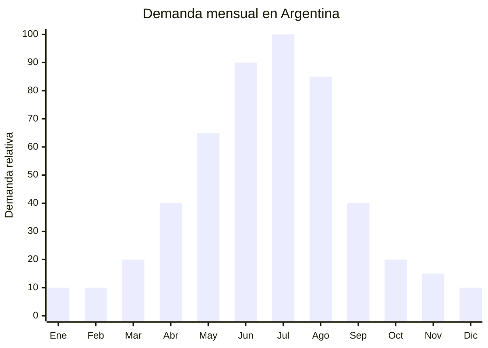

# Alfombras de piel sintética / faux fur

> **Capítulo NCM 57** — Alfombras y demás revestimientos para el suelo, de materia textil | **Temporada:** Invierno (Jun–Ago)

## Qué es y por qué importarlo

Las alfombras de piel sintética (faux fur rugs / faux sheepskin) son revestimientos decorativos de pelo largo ultra suave que imitan la textura de la piel de oveja, conejo o visón. Son la pieza clave de la estética **hygge** (confort escandinavo) que domina la decoración invernal en Argentina y el mundo. Se colocan al pie de la cama, junto al sillón, sobre sillas o como centro decorativo en livings.

El pico de demanda se concentra en **junio-agosto**, cuando el frío impulsa la búsqueda de elementos que aporten calidez visual y funcional al hogar. En MercadoLibre Argentina, las búsquedas de "alfombra pelo largo" y "alfombra piel sintética" se multiplican x3 respecto al verano, con precios de venta entre ARS 15.000 y ARS 80.000 según tamaño.

China (especialmente Nantong y Tianjin) produce el 85% de las alfombras de piel sintética del mundo. Los precios FOB arrancan en USD 2.00 para formatos 60x90cm y llegan a USD 8.00 para formatos 120x180cm premium. A diferencia de las alfombras de pelo largo convencionales (que se venden también en otoño), las faux fur se posicionan como producto **premium decorativo** con mayor margen por unidad.

## Datos clave

| Dato | Valor |
|------|-------|
| **Posiciones NCM típicas** | 5703.30.00 (alfombras de mechón insertado, de fibras sintéticas), 5705.00.00 (las demás alfombras) |
| **Derecho de importación** | 20% (DIE) + 3% tasa estadística |
| **Rango FOB típico** | USD 2.00 — USD 8.00 por unidad |
| **Precio de venta en Argentina** | ARS 15.000 — ARS 80.000 |
| **Margen bruto estimado** | 150% — 350% |
| **MOQ típico** | 200 — 500 unidades |
| **Demanda en MercadoLibre** | Alta (6,000+ resultados "alfombra pelo largo") |
| **Competencia en MercadoLibre** | Media |
| **Dificultad para importar** | Baja |
| **Certificaciones necesarias** | Etiquetado textil básico |
| **Antidumping** | **No** (alfombras Cap. 57 sin antidumping vigente) |

## Variantes y subtipos más comunes

| Subtipo / Variante | FOB aprox. | Venta AR aprox. | Nota |
|--------------------|-----------|-----------------|------|
| Faux sheepskin 60x90cm blanca | USD 2.00 — 3.00 | ARS 15.000 — 25.000 | **Más vendida** |
| Faux sheepskin 80x120cm | USD 3.50 — 5.00 | ARS 25.000 — 45.000 | Tamaño living |
| Faux fur rectangular 120x180cm | USD 5.00 — 8.00 | ARS 45.000 — 80.000 | Premium gran formato |
| Alfombra piel sintética forma irregular (doble pelt) | USD 4.00 — 6.00 | ARS 30.000 — 55.000 | Estilo nórdico |
| Faux fur circular 120cm diámetro | USD 3.00 — 5.00 | ARS 22.000 — 40.000 | Dormitorio / infantil |
| Almohadones faux fur 45x45cm | USD 1.50 — 3.00 | ARS 10.000 — 20.000 | Complemento decorativo |

## Regulaciones y requisitos

<Tabs>
  <Tab title="Certificaciones">
    | Requisito | Obligatorio | Detalle |
    |-----------|-------------|---------|
    | Etiquetado textil | **Sí** | Composición de fibra, dimensiones, país de origen |
    | Antidumping CNCE | **No aplica** | Alfombras Cap. 57 sin antidumping vigente |
    | INTI | No obligatorio | No requiere certificación INTI para alfombras |
    | Retardante de llama | Recomendado | No obligatorio en Argentina para uso residencial, pero agrega valor |
  </Tab>
  <Tab title="Etiquetado">
    Composición de fibra (ej: "100% Poliéster — Pelo sintético"), dimensiones en cm, instrucciones de limpieza (aspirar, no lavar en lavarropas), país de origen ("Hecho en China"), datos del importador (razón social, CUIT, dirección). La etiqueta puede ser cosida o adherida al reverso.
  </Tab>
  <Tab title="Restricciones">
    - **Sin antidumping** en alfombras Cap. 57 — importación libre
    - Sin restricciones de sustancias peligrosas para uso textil hogar
    - Verificar que el reverso tenga base antideslizante o dots de PVC (valor agregado, no obligatorio)
    - Barrera regulatoria: **BAJA**
  </Tab>
</Tabs>

## Logística de importación

| Dato | Valor |
|------|-------|
| **Peso típico por unidad** | 0.40 — 1.80 kg (según tamaño) |
| **Volumen típico** | Medio (pelo largo ocupa volumen) |
| **Fragilidad** | Nula |
| **Envío recomendado** | Marítimo LCL (lotes medianos) / FCL (2,000+ unidades) |
| **Tiempo total estimado** | 50 — 80 días (producción + marítimo) |
| **Origen principal** | Nantong y Tianjin, China |

<Tip>
Las alfombras faux fur son voluminosas pero livianas. Solicitar al proveedor **enrollado comprimido con film stretch** en lugar de empaque plano reduce el volumen hasta un 40%. Para lotes grandes, un contenedor 40' HQ puede contener 3,000-5,000 unidades de 80x120cm enrolladas. Combinar con almohadones faux fur del mismo material para completar contenedor y ofrecer set decorativo.
</Tip>

## Estacionalidad y timing de compra



| Aspecto | Detalle |
|---------|---------|
| **Meses pico de venta** | Junio — Agosto (invierno pleno, hygge máximo) |
| **Meses valle** | Noviembre — Febrero (verano) |
| **Cuándo pedir a China** | Febrero — Marzo para tener stock listo en junio |
| **Tiempo de anticipación** | 60-80 días (producción 15-20 días + envío marítimo 35-50 días) |

## Ventajas y riesgos

<CardGroup cols={2}>
  <Card title="Ventajas" icon="circle-check">
    - **Sin antidumping** Cap. 57 — importación libre
    - Producto premium con margen alto (150-350%)
    - Tendencia hygge/decoración invernal en auge
    - Liviano y resistente al transporte
    - Diferenciación vs. alfombras pelo largo convencionales
    - Complemento decorativo (venta cruzada con almohadones)
    - Barrera regulatoria baja
  </Card>
  <Card title="Riesgos" icon="triangle-exclamation">
    - Estacionalidad fuerte (difícil vender en verano)
    - Pelo sintético de baja calidad se aplasta rápido (verificar densidad)
    - Voluminoso para almacenar
    - Colores claros (blanco, crema) se ensucian fácilmente — reclamos
    - Competencia creciente con tiendas de decoración
    - Olor químico en producto nuevo puede generar devoluciones
  </Card>
</CardGroup>

## Palabras clave para buscar en Alibaba

```
faux fur rug wholesale, faux sheepskin rug 60x90,
faux fur carpet long pile, shaggy faux fur area rug,
imitation sheepskin rug bulk, fluffy rug wholesale,
faux fur throw rug white, decorative fur carpet wholesale
```

## Fuentes

- [MercadoLibre Argentina — Alfombras pelo largo](https://listado.mercadolibre.com.ar/alfombra-pelo-largo)
- [Alibaba — Faux fur rug wholesale](https://www.alibaba.com/showroom/faux-fur-rug.html)
- [CNCE — Medidas antidumping vigentes](https://www.argentina.gob.ar/cnce/investigaciones/medidasvigentes)
- [Nubimetrics — Tendencias decoración hogar](https://www.nubimetrics.com)
