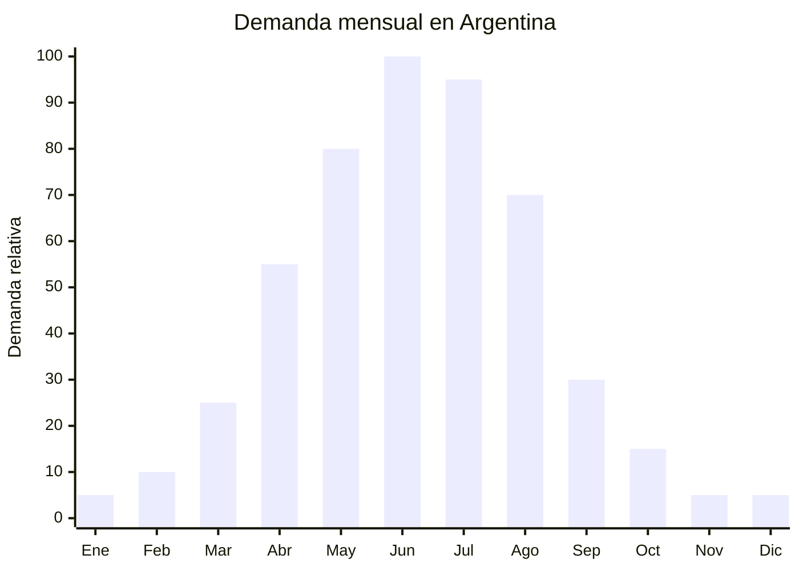

# Camperas puffer / inflables de punto

> **Capítulo NCM 61** — Prendas y complementos de vestir, de punto | **Temporada:** Invierno (Jun–Ago)

<Warning>
**ANTIDUMPING VIGENTE:** Argentina mantiene derechos antidumping sobre prendas de punto originarias de China. El Decreto 236/2025 redujo el arancel general del 35% al 20%, pero el antidumping es **ADICIONAL** al arancel. La campera puffer es uno de los productos más fiscalizados. Verificar siempre el NCM exacto en la [CNCE](https://www.argentina.gob.ar/cnce/investigaciones/medidasvigentes). A pesar del antidumping, el volumen de importación sigue siendo masivo dado el margen del producto.
</Warning>

## Qué es y por qué importarlo

La campera puffer (inflable / acolchada) es el **producto ESTRELLA del invierno argentino**. Se distingue por su diseño con costuras horizontales o en diamante que crean compartimentos rellenos de fibra sintética (hollow fiber) o pluma de ganso/pato. El resultado es una prenda ultraliviana con alta capacidad térmica.

En MercadoLibre Argentina, la búsqueda "campera puffer" arroja **21,345+ resultados** con precios entre ARS 80.000 y ARS 400.000. Es una de las categorías con mayor facturación del invierno. Las tendencias 2025 muestran un dominio absoluto de las versiones **reversibles** (dos colores/texturas en una) y las **puffer con cuello borreguillo** (sherpa collar).

China concentra más del 90% de la producción mundial de camperas puffer. Las fábricas de Jiangsu y Zhejiang ofrecen desde modelos básicos con relleno sintético 150g/m2 (FOB USD 8) hasta versiones premium con pluma de ganso 90/10 (FOB USD 28+). La clave del negocio está en calcular correctamente el landed cost incluyendo antidumping, que puede sumar USD 3-8 adicionales por prenda.

## Datos clave

| Dato | Valor |
|------|-------|
| **Posiciones NCM típicas** | 6101.30.00 (abrigos de punto de fibras sintéticas hombre), 6102.30.00 (mujer) |
| **Derecho de importación** | 20% (DIE) + 3% tasa estadística + **antidumping adicional** |
| **Rango FOB típico** | USD 8.00 — USD 28.00 por unidad |
| **Precio de venta en Argentina** | ARS 80.000 — ARS 400.000 |
| **Margen bruto estimado** | 100% — 250% (variable según impacto antidumping) |
| **MOQ típico** | 200 — 500 unidades por modelo/talle |
| **Demanda en MercadoLibre** | Muy Alta (21,345+ resultados "campera puffer") |
| **Competencia en MercadoLibre** | Alta |
| **Dificultad para importar** | Difícil (antidumping + etiquetado IRAM) |
| **Certificaciones necesarias** | Etiquetado textil IRAM 12560 obligatorio |
| **Antidumping** | **SÍ — Verificar NCM exacto en CNCE** |

## Variantes y subtipos más comunes

| Subtipo / Variante | FOB aprox. | Venta AR aprox. | Nota |
|--------------------|-----------|-----------------|------|
| Puffer básica relleno sintético 150g/m2 | USD 8.00 — 12.00 | ARS 80.000 — 150.000 | Entrada de gama |
| Puffer reversible bicolor | USD 10.00 — 16.00 | ARS 120.000 — 220.000 | **Tendencia 2025** |
| Puffer cuello borreguillo (sherpa) | USD 12.00 — 18.00 | ARS 140.000 — 250.000 | **Tendencia 2025** |
| Puffer larga (3/4 o hasta rodilla) | USD 14.00 — 22.00 | ARS 160.000 — 300.000 | Premium mujer |
| Puffer chaleco (sin mangas) | USD 6.00 — 10.00 | ARS 60.000 — 120.000 | Complemento capas |
| Puffer relleno pluma ganso 90/10 | USD 20.00 — 28.00 | ARS 250.000 — 400.000 | Gama alta |

## Regulaciones y requisitos

<Tabs>
  <Tab title="Certificaciones">
    **IRAM 12560** — Etiquetado textil obligatorio para todas las prendas importadas. Se verifica en aduana. Sin la etiqueta correcta, la mercadería queda retenida.

    **Antidumping** — Las camperas puffer de punto de China tienen derechos antidumping adicionales al arancel del 20%. El monto varía según el NCM exacto y puede representar entre USD 3 y USD 8 adicionales por prenda. Consultar con despachante de aduana **ANTES** de comprar.
  </Tab>
  <Tab title="Etiquetado">
    **Obligatorio según IRAM 12560:**
    - Composición exterior e interior por separado (ej: "Exterior: 100% Nylon. Relleno: 100% Poliéster Hollow Fiber 200g/m2")
    - Talle (sistema argentino: S, M, L, XL o numérico)
    - Instrucciones de lavado (símbolos ISO)
    - País de origen ("Hecho en China")
    - Datos del importador (razón social, CUIT, domicilio en Argentina)

    Si el relleno es pluma, debe indicarse el porcentaje exacto (ej: "90% Pluma de ganso, 10% Plumón").
  </Tab>
  <Tab title="Restricciones">
    **Antidumping vigente** — Los derechos antidumping sobre prendas de punto de China son adicionales al arancel del 20%. Las camperas puffer son una de las categorías más fiscalizadas por la AFIP en canal rojo.

    **Relleno pluma** — Si se importa con relleno de pluma de ganso/pato, verificar certificado sanitario de desinfección y tratamiento anti-ácaros. SENASA puede intervenir en partidas con relleno de origen animal.

    **Canal rojo frecuente** — Las camperas puffer tienen alta probabilidad de verificación física en aduana por su valor declarado (subfacturación frecuente en el sector).
  </Tab>
</Tabs>

## Logística de importación

| Dato | Valor |
|------|-------|
| **Peso típico por unidad** | 0.50 — 1.20 kg |
| **Volumen típico** | Medio (comprimibles pero voluminosas sin comprimir) |
| **Fragilidad** | Baja |
| **Envío recomendado** | Marítimo FCL para lotes 1,000+ / LCL para lotes menores |
| **Tiempo total estimado** | 60 — 90 días (producción 20-30 días + marítimo 35-50 días) |
| **Origen principal** | Jiangsu (Nanjing, Changzhou) y Zhejiang, China |

<Tip>
Pedir al proveedor **empaque al vacío (vacuum packed)** para camperas puffer. Reduce el volumen hasta un 70% y optimiza dramáticamente el flete. Un contenedor 40' HQ puede contener 6,000-10,000 camperas comprimidas al vacío. Al descomprimir, la prenda recupera su volumen en 24-48 horas. Incluir instrucciones de descompresión para el cliente final.
</Tip>

## Estacionalidad y timing de compra



| Aspecto | Detalle |
|---------|---------|
| **Meses pico de venta** | Junio — Julio (invierno pleno) |
| **Meses valle** | Noviembre — Febrero (verano) |
| **Cuándo pedir a China** | Enero — Febrero para tener stock en mayo-junio |
| **Tiempo de anticipación** | 80-100 días (producción MOQ 300+ con personalización + envío marítimo) |

## Ventajas y riesgos

<CardGroup cols={2}>
  <Card title="Ventajas" icon="circle-check">
    - Producto ESTRELLA del invierno con demanda masiva
    - Alto ticket promedio (ARS 80,000-400,000)
    - Margen bruto 100-250% incluso con antidumping
    - Personalizable con marca propia (etiqueta, colores, diseño)
    - Tendencia reversible y borreguillo sostenida 2025-2026
    - Producto aspiracional con alta percepción de valor
    - Comprimible al vacío (optimiza flete)
  </Card>
  <Card title="Riesgos" icon="triangle-exclamation">
    - **Antidumping puede reducir significativamente el margen**
    - Canal rojo frecuente en aduana (verificación física)
    - Talles chinos vs. argentinos (curvatura, largos de manga)
    - Stock sobrante queda congelado hasta próximo invierno
    - Subfacturación del sector genera competencia desleal
    - Problemas de calidad en cierres (YKK vs. genéricos)
    - Relleno pluma requiere certificado sanitario adicional
  </Card>
</CardGroup>

## Palabras clave para buscar en Alibaba

```
puffer jacket wholesale, padded jacket women bulk,
winter jacket quilted wholesale, reversible puffer jacket,
down jacket goose feather wholesale, bubble jacket unisex,
sherpa collar puffer jacket, long puffer coat women wholesale,
hollow fiber jacket bulk, vest puffer wholesale
```

## Fuentes

- [MercadoLibre Argentina — Camperas puffer](https://listado.mercadolibre.com.ar/campera-puffer)
- [CNCE — Medidas antidumping vigentes](https://www.argentina.gob.ar/cnce/investigaciones/medidasvigentes)
- [Nubimetrics — Tendencias MercadoLibre](https://www.nubimetrics.com)
- [Alibaba — Puffer jacket wholesale](https://www.alibaba.com/showroom/puffer-jacket-wholesale.html)
