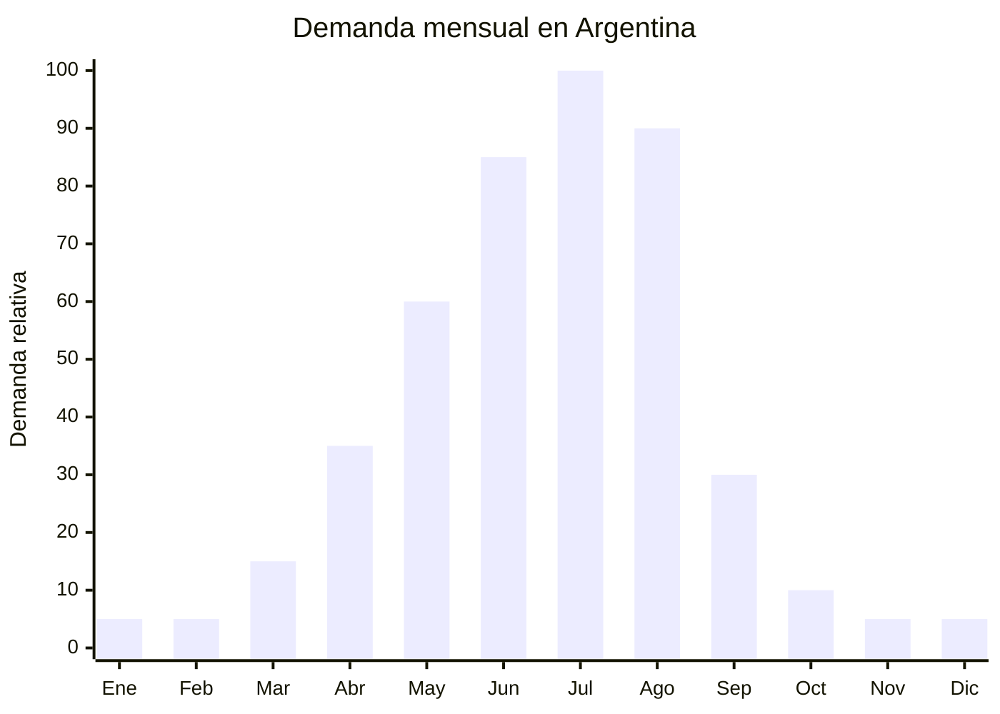

# Conjuntos térmicos segunda capa (polar grueso)

> **Capítulo NCM 61** — Prendas y complementos de vestir, de punto | **Temporada:** Invierno (Jun–Ago)

<Warning>
**ANTIDUMPING VIGENTE:** Argentina mantiene derechos antidumping sobre prendas de punto originarias de China. Verificar siempre el NCM exacto en la [CNCE](https://www.argentina.gob.ar/cnce/investigaciones/medidasvigentes). Los conjuntos de polar pueden tener un tratamiento diferente según la composición y el NCM declarado.
</Warning>

## Qué es y por qué importarlo

Los conjuntos térmicos de segunda capa son sets de buzo + pantalón confeccionados en polar grueso (280-400 g/m2) diseñados para usar como capa intermedia de abrigo en climas fríos. A diferencia de la ropa térmica primera piel (que va pegada al cuerpo), la segunda capa polar se usa sobre la remera y bajo la campera, creando una cámara de aire que retiene el calor corporal.

El pico de demanda es **julio-agosto**, coincidiendo con las vacaciones de invierno y la temporada de ski en Bariloche, Chapelco, Las Leñas y Cerro Catedral. Los viajeros buscan conjuntos abrigados para actividades outdoor e indoor en destinos de montaña. En MercadoLibre, la búsqueda "conjunto polar" se activa fuertemente desde mayo.

Las fábricas chinas de Jiangsu y Zhejiang producen conjuntos de polar anti-pilling de 300g/m2 con cierre completo desde FOB USD 5.00 el conjunto. La clave está en especificar gramaje alto (280-400g/m2) y acabado anti-pilling, ya que el polar barato de 180g/m2 no abriga lo suficiente y genera pilling inmediato.

## Datos clave

| Dato | Valor |
|------|-------|
| **Posiciones NCM típicas** | 6110.30.00 (suéteres de fibras sintéticas — buzo polar), 6103.43.00 / 6104.63.00 (pantalones de fibras sintéticas) |
| **Derecho de importación** | 20% (DIE) + 3% tasa estadística + **antidumping adicional** |
| **Rango FOB típico** | USD 5.00 — USD 12.00 por conjunto (buzo + pantalón) |
| **Precio de venta en Argentina** | ARS 45.000 — ARS 120.000 |
| **Margen bruto estimado** | 100% — 200% (variable según antidumping) |
| **MOQ típico** | 300 — 500 conjuntos por modelo/talle |
| **Demanda en MercadoLibre** | Alta (pico julio-agosto) |
| **Competencia en MercadoLibre** | Media |
| **Dificultad para importar** | Moderada-Difícil (antidumping + IRAM) |
| **Certificaciones necesarias** | Etiquetado textil IRAM 12560 obligatorio |
| **Antidumping** | **SÍ — Verificar NCM exacto en CNCE** |

## Variantes y subtipos más comunes

| Subtipo / Variante | FOB aprox. | Venta AR aprox. | Nota |
|--------------------|-----------|-----------------|------|
| Conjunto polar 280g/m2 básico (buzo + pantalón) | USD 5.00 — 7.00 | ARS 45.000 — 70.000 | Entrada de gama |
| Conjunto polar 330g/m2 anti-pilling premium | USD 7.00 — 10.00 | ARS 65.000 — 95.000 | **Mejor relación calidad-precio** |
| Conjunto polar 400g/m2 heavy weight | USD 9.00 — 12.00 | ARS 80.000 — 120.000 | Máximo abrigo, uso outdoor |
| Buzo polar cierre completo (solo) | USD 3.50 — 6.00 | ARS 30.000 — 55.000 | Venta individual |
| Pantalón polar con puño (solo) | USD 2.50 — 4.00 | ARS 20.000 — 40.000 | Venta individual |
| Conjunto polar infantil | USD 4.00 — 7.00 | ARS 35.000 — 65.000 | Vacaciones invierno niños |

## Regulaciones y requisitos

<Tabs>
  <Tab title="Certificaciones">
    **IRAM 12560** — Etiquetado textil obligatorio. Se verifica en aduana.

    **Antidumping** — Verificar derechos antidumping vigentes para el NCM exacto. El buzo polar (NCM 6110.30) y el pantalón (NCM 6103.43/6104.63) pueden tener tratamientos diferentes. Si se importa como "conjunto", consultar clasificación arancelaria con despachante.
  </Tab>
  <Tab title="Etiquetado">
    **Obligatorio según IRAM 12560:**
    - Composición (ej: "100% Poliéster Polar Fleece 330g/m2")
    - Talle (sistema argentino: S, M, L, XL)
    - Instrucciones de lavado (lavar a 30°C, no planchar, no secar en secadora)
    - País de origen ("Hecho en China")
    - Datos del importador (razón social, CUIT, domicilio en Argentina)

    Cada pieza del conjunto debe tener su propia etiqueta.
  </Tab>
  <Tab title="Restricciones">
    **Antidumping vigente** — Prendas de punto de fibras sintéticas de China.

    **Anti-pilling** — Especificar en la orden de compra "anti-pilling finish" y solicitar prueba de pilling (ISO 12945). Sin este acabado, el polar barato genera bolitas al primer uso y dispara reclamos.

    **Gramaje mínimo recomendado** — No importar polar de menos de 280g/m2 para conjunto invernal. El de 180-200g/m2 es para otoño y no cumple la expectativa del consumidor invernal.
  </Tab>
</Tabs>

## Logística de importación

| Dato | Valor |
|------|-------|
| **Peso típico por conjunto** | 0.60 — 1.20 kg |
| **Volumen típico** | Medio (polar es voluminoso) |
| **Fragilidad** | Nula |
| **Envío recomendado** | Marítimo LCL o FCL |
| **Tiempo total estimado** | 60 — 85 días (producción + marítimo) |
| **Origen principal** | Jiangsu, Zhejiang, China |

<Tip>
Vender el conjunto completo (buzo + pantalón) como **pack** aumenta el ticket promedio un 40% vs. venta individual. Incluir bolsa de packaging con cierre zip reutilizable que sirva como bolsa de viaje — agrega valor percibido para el comprador que va a Bariloche o la montaña. Costo adicional del packaging: ~USD 0.20/conjunto.
</Tip>

## Estacionalidad y timing de compra



| Aspecto | Detalle |
|---------|---------|
| **Meses pico de venta** | Julio — Agosto (vacaciones invierno + frío máximo) |
| **Meses valle** | Octubre — Marzo |
| **Cuándo pedir a China** | Febrero — Marzo para tener stock en junio |
| **Tiempo de anticipación** | 70-90 días (producción + envío marítimo) |

## Ventajas y riesgos

<CardGroup cols={2}>
  <Card title="Ventajas" icon="circle-check">
    - Demanda fuerte julio-agosto (vacaciones invierno + ski)
    - Venta como pack aumenta ticket promedio
    - Producto de reposición (se compra cada temporada)
    - Uso versátil: indoor, outdoor, ski, montaña, hogar
    - Packaging viajero agrega valor diferencial
    - Competencia media en ML (oportunidad para marcas propias)
  </Card>
  <Card title="Riesgos" icon="triangle-exclamation">
    - **Antidumping puede impactar fuertemente el margen**
    - Pilling en polar de baja calidad (principal reclamo)
    - Estacionalidad concentrada (julio-agosto)
    - Stock sobrante difícil de liquidar fuera de temporada
    - Voluminoso para almacenar
    - Talles chinos pueden quedar chicos
  </Card>
</CardGroup>

## Palabras clave para buscar en Alibaba

```
polar fleece tracksuit wholesale, fleece jogger set bulk,
polar fleece jacket pants set, anti-pilling fleece suit,
winter fleece set 300gsm wholesale, zip up fleece tracksuit,
polar fleece sweatsuit bulk, heavyweight fleece set wholesale
```

## Fuentes

- [MercadoLibre Argentina — Conjunto polar](https://listado.mercadolibre.com.ar/conjunto-polar)
- [CNCE — Medidas antidumping vigentes](https://www.argentina.gob.ar/cnce/investigaciones/medidasvigentes)
- [Nubimetrics — Tendencias invierno](https://www.nubimetrics.com)
