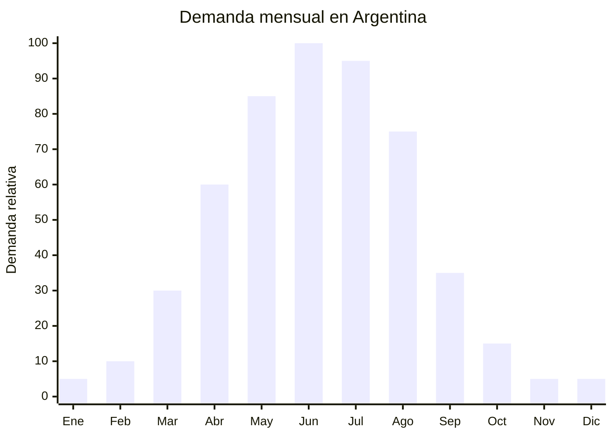

# Sweaters y chalecos de lana / acrílico

> **Capítulo NCM 61** — Prendas y complementos de vestir, de punto | **Temporada:** Invierno (Jun–Ago)

<Warning>
**ANTIDUMPING VIGENTE:** Argentina mantiene derechos antidumping sobre prendas de punto originarias de China. El Decreto 236/2025 redujo el arancel general del 35% al 20%, pero el antidumping es **ADICIONAL** al arancel. Verificar siempre el NCM exacto en la [CNCE](https://www.argentina.gob.ar/cnce/investigaciones/medidasvigentes).
</Warning>

## Qué es y por qué importarlo

Los sweaters (pulóveres) y chalecos de lana o acrílico son prendas de punto tejido que ofrecen abrigo medio-alto para el invierno. Incluyen formatos clásicos como cuello V, cuello redondo, polera (cuello alto / turtleneck), chaleco tejido sin mangas y cardigans con botones. Son prendas versátiles que sirven tanto para uso formal como casual.

Un dato clave del mercado: el **69% de los vendedores de sweaters en MercadoLibre Argentina no tienen medalla**, lo que indica una **baja saturación profesional** en la categoría. Esto representa una oportunidad para importadores que ingresen con stock consistente, buenas fotos y atención al cliente — la competencia amateur es fácil de superar.

China produce sweaters de acrílico (imitación lana) a precios FOB desde USD 5.00 por unidad, y versiones con mezcla lana/acrílico desde USD 8.00. Las fábricas de Dongguan y Puyuan (Zhejiang) son los principales polos productores. El acrílico ofrece una relación costo-beneficio excelente: aspecto similar a la lana, lavable en máquina y sin pilling si la calidad es buena.

## Datos clave

| Dato | Valor |
|------|-------|
| **Posiciones NCM típicas** | 6110.30.00 (suéteres de fibras sintéticas), 6110.11.00 (de lana) |
| **Derecho de importación** | 20% (DIE) + 3% tasa estadística + **antidumping adicional** |
| **Rango FOB típico** | USD 5.00 — USD 15.00 por unidad |
| **Precio de venta en Argentina** | ARS 40.000 — ARS 150.000 |
| **Margen bruto estimado** | 100% — 250% (variable según antidumping) |
| **MOQ típico** | 200 — 500 unidades por modelo/talle |
| **Demanda en MercadoLibre** | Alta |
| **Competencia en MercadoLibre** | Media-Baja (69% vendedores sin medalla) |
| **Dificultad para importar** | Moderada-Difícil (antidumping + IRAM) |
| **Certificaciones necesarias** | Etiquetado textil IRAM 12560 obligatorio |
| **Antidumping** | **SÍ — Verificar NCM exacto en CNCE** |

## Variantes y subtipos más comunes

| Subtipo / Variante | FOB aprox. | Venta AR aprox. | Nota |
|--------------------|-----------|-----------------|------|
| Sweater cuello redondo acrílico básico | USD 5.00 — 7.00 | ARS 40.000 — 65.000 | Entrada de gama |
| Sweater cuello V acrílico | USD 5.00 — 8.00 | ARS 45.000 — 75.000 | Clásico formal |
| Polera / turtleneck acrílico | USD 5.50 — 8.00 | ARS 45.000 — 80.000 | Tendencia layering |
| Chaleco tejido sin mangas | USD 4.00 — 7.00 | ARS 35.000 — 65.000 | Versátil capas |
| Cardigan con botones lana/acrílico | USD 7.00 — 12.00 | ARS 60.000 — 120.000 | Premium casual |
| Sweater oversize mujer trenzado | USD 8.00 — 15.00 | ARS 80.000 — 150.000 | **Tendencia 2025** |

## Regulaciones y requisitos

<Tabs>
  <Tab title="Certificaciones">
    **IRAM 12560** — Etiquetado textil obligatorio. Se verifica en aduana. Sin la etiqueta correcta, la mercadería queda retenida.

    **Antidumping** — Verificar derechos antidumping vigentes en la [CNCE](https://www.argentina.gob.ar/cnce/investigaciones/medidasvigentes) para el NCM exacto antes de comprar. Los suéteres de lana (6110.11) y de fibras sintéticas (6110.30) pueden tener tratamientos diferentes.
  </Tab>
  <Tab title="Etiquetado">
    **Obligatorio según IRAM 12560:**
    - Composición con porcentajes exactos (ej: "70% Acrílico, 30% Lana")
    - Talle (sistema argentino: S, M, L, XL o numérico)
    - Instrucciones de lavado (símbolos ISO — fundamental para lana)
    - País de origen ("Hecho en China")
    - Datos del importador (razón social, CUIT, domicilio en Argentina)

    Para lana: indicar tipo (merino, lambswool, etc.) si se declara como premium.
  </Tab>
  <Tab title="Restricciones">
    **Antidumping vigente** — Adicional al 20% de arancel. Varía según composición (lana vs. sintético) y NCM.

    **Pilling** — Principal causa de reclamos en sweaters importados. Solicitar al proveedor prueba de pilling (anti-pilling test) antes de cerrar pedido. El acrílico de baja calidad hace pilling al primer lavado.

    **Talles** — El tallaje chino tiende a ser más chico. Pedir tabla de medidas detallada y ajustar al mercado argentino.
  </Tab>
</Tabs>

## Logística de importación

| Dato | Valor |
|------|-------|
| **Peso típico por unidad** | 0.25 — 0.60 kg |
| **Volumen típico** | Bajo-Medio (prendas compresibles) |
| **Fragilidad** | Baja |
| **Envío recomendado** | Marítimo LCL (lotes medianos) / FCL (lotes 2,000+) |
| **Tiempo total estimado** | 60 — 85 días (producción 20-25 días + marítimo 35-50 días) |
| **Origen principal** | Puyuan (Zhejiang), Dongguan (Guangdong), China |

<Tip>
Puyuan (Zhejiang) es la **capital mundial del sweater** con más de 8,000 fábricas especializadas. Si buscás precios competitivos en sweaters de acrílico, cotizar directamente en Puyuan. Para mezclas con lana merino, Inner Mongolia tiene fábricas especializadas con mejores precios que las trading companies de Yiwu.
</Tip>

## Estacionalidad y timing de compra



| Aspecto | Detalle |
|---------|---------|
| **Meses pico de venta** | Mayo — Julio (otoño-invierno pleno) |
| **Meses valle** | Noviembre — Febrero (verano) |
| **Cuándo pedir a China** | Enero — Febrero para tener stock en mayo |
| **Tiempo de anticipación** | 70-90 días (producción + envío marítimo) |

## Ventajas y riesgos

<CardGroup cols={2}>
  <Card title="Ventajas" icon="circle-check">
    - **Baja saturación profesional** (69% sin medalla en ML)
    - Oportunidad para posicionar marca propia
    - Demanda sostenida todo el invierno
    - Producto liviano y compresible (bajo costo flete/unidad)
    - Versatilidad: casual, formal, layering
    - Tendencia oversize y cardigans sostenida 2025
    - Puyuan ofrece miles de opciones con MOQ bajo
  </Card>
  <Card title="Riesgos" icon="triangle-exclamation">
    - **Antidumping puede reducir o anular el margen**
    - Pilling en acrílico de baja calidad (reclamos)
    - Problemas de talles (chino vs. argentino)
    - Etiquetado IRAM 12560 estricto
    - Lana real requiere cuidados especiales (reclamos lavado)
    - Stock sobrante queda hasta próximo invierno
  </Card>
</CardGroup>

## Palabras clave para buscar en Alibaba

```
sweater wholesale acrylic, pullover knit wholesale,
turtleneck sweater women bulk, cardigan button wholesale,
V-neck sweater men acrylic, oversized sweater women knit,
vest sweater sleeveless wholesale, Puyuan sweater factory,
wool blend sweater wholesale, cable knit sweater bulk
```

## Fuentes

- [MercadoLibre Argentina — Sweaters](https://listado.mercadolibre.com.ar/sweater)
- [CNCE — Medidas antidumping vigentes](https://www.argentina.gob.ar/cnce/investigaciones/medidasvigentes)
- [Nubimetrics — Tendencias MercadoLibre](https://www.nubimetrics.com)
- [Alibaba — Sweater wholesale](https://www.alibaba.com/showroom/sweater-wholesale.html)
