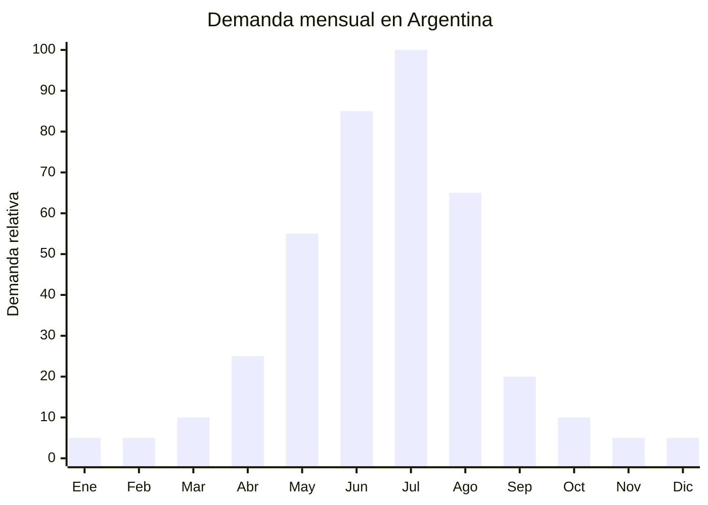

# Camperas de ski / nieve impermeables

> **Capítulo NCM 62** — Prendas y complementos de vestir, excepto los de punto | **Temporada:** Invierno (Jun–Ago)

<Warning>
**ANTIDUMPING VIGENTE:** Argentina mantiene derechos antidumping sobre prendas originarias de China. Las camperas de ski (Cap. 62 — no de punto) también están alcanzadas. El Decreto 236/2025 redujo el arancel general, pero el antidumping es **ADICIONAL**. Verificar NCM exacto en la [CNCE](https://www.argentina.gob.ar/cnce/investigaciones/medidasvigentes). A pesar del antidumping, el margen del nicho ski justifica la operación.
</Warning>

## Qué es y por qué importarlo

Las camperas de ski/nieve son prendas técnicas impermeables diseñadas para deportes de invierno y condiciones climáticas extremas. Se distinguen por su membrana impermeable (5,000-10,000mm de columna de agua), costuras termoselladas, relleno térmico (sintético o pluma), capucha ajustable compatible con casco, pollera para nieve, bolsillos internos para skipass y ventilación axilar.

El pico de demanda en Argentina es **julio**, coincidiendo con la temporada de ski en Bariloche, Las Leñas, Chapelco y Cerro Catedral. Las marcas de referencia (Montagne, The North Face, Columbia) manejan precios de ARS 300.000-800.000. Esto deja un margen enorme para marcas importadas que ofrezcan prestaciones técnicas similares a un precio de ARS 150.000-350.000.

China (especialmente Fujian y Jiangsu) produce camperas de ski para las principales marcas mundiales. Las mismas fábricas que producen para Columbia o Helly Hansen ofrecen sus líneas OEM/ODM desde FOB USD 12.00 con membrana de 5,000mm, llegando a USD 30.00 para versiones premium con membrana de 10,000mm y pluma.

## Datos clave

| Dato | Valor |
|------|-------|
| **Posiciones NCM típicas** | 6201.93.00 (anoraks de fibras sintéticas hombre), 6202.93.00 (mujer) |
| **Derecho de importación** | 20% (DIE) + 3% tasa estadística + **antidumping adicional** |
| **Rango FOB típico** | USD 12.00 — USD 30.00 por unidad |
| **Precio de venta en Argentina** | ARS 150.000 — ARS 350.000 |
| **Margen bruto estimado** | 100% — 200% (nicho premium, variable según antidumping) |
| **MOQ típico** | 100 — 300 unidades por modelo/talle |
| **Demanda en MercadoLibre** | Alta (pico julio — temporada ski) |
| **Competencia en MercadoLibre** | Media (dominada por marcas premium) |
| **Dificultad para importar** | Difícil (antidumping + técnicas específicas) |
| **Certificaciones necesarias** | Etiquetado textil IRAM 12560 obligatorio |
| **Antidumping** | **SÍ — Verificar NCM exacto en CNCE** |

## Variantes y subtipos más comunes

| Subtipo / Variante | FOB aprox. | Venta AR aprox. | Nota |
|--------------------|-----------|-----------------|------|
| Campera ski membrana 5,000mm relleno sintético 180g | USD 12.00 — 18.00 | ARS 150.000 — 220.000 | Entrada de gama |
| Campera ski membrana 8,000mm relleno 250g | USD 18.00 — 24.00 | ARS 200.000 — 280.000 | **Mejor relación calidad-precio** |
| Campera ski membrana 10,000mm + pluma | USD 24.00 — 30.00 | ARS 280.000 — 350.000 | Premium |
| Campera ski niños/adolescentes | USD 10.00 — 18.00 | ARS 100.000 — 200.000 | Demanda vacaciones invierno |
| Campera ski 3-en-1 (desmontable) | USD 18.00 — 28.00 | ARS 220.000 — 320.000 | Versátil todo invierno |

## Regulaciones y requisitos

<Tabs>
  <Tab title="Certificaciones">
    **IRAM 12560** — Etiquetado textil obligatorio.

    **Antidumping** — Camperas de ski Cap. 62 de China tienen antidumping adicional. El monto varía según NCM. Consultar despachante de aduana antes de comprar.

    **Recomendado (no obligatorio):** Solicitar al proveedor test de impermeabilidad (ISO 811 — columna de agua), test de transpirabilidad (MVTR) y test de resistencia de costuras.
  </Tab>
  <Tab title="Etiquetado">
    **Obligatorio según IRAM 12560:**
    - Composición exterior (ej: "100% Poliéster con membrana PU")
    - Composición relleno (ej: "Relleno: 100% Poliéster Hollow Fiber 250g/m2")
    - Composición forro (ej: "Forro: 100% Poliéster Tafeta")
    - Talle (sistema argentino)
    - Instrucciones de lavado
    - País de origen
    - Datos del importador

    **Recomendado:** Hang tag con especificaciones técnicas (columna de agua, transpirabilidad) para justificar precio premium.
  </Tab>
  <Tab title="Restricciones">
    **Antidumping vigente** — Prendas de China Cap. 62 con antidumping adicional.

    **Membrana mínima recomendada** — No importar con menos de 5,000mm de columna de agua. El consumidor argentino que va a ski espera impermeabilidad real. Una campera que se moja genera reclamos y destruye la reputación.

    **Costuras termoselladas** — Verificar que las costuras estén termoselladas (taped seams). Sin esto, el agua filtra por las costuras aunque la tela sea impermeable.
  </Tab>
</Tabs>

## Logística de importación

| Dato | Valor |
|------|-------|
| **Peso típico por unidad** | 0.80 — 1.50 kg |
| **Volumen típico** | Medio-Alto |
| **Fragilidad** | Baja |
| **Envío recomendado** | Marítimo LCL (nicho, lotes menores) / FCL si se combina con pantalones ski |
| **Tiempo total estimado** | 70 — 100 días (producción 25-35 días + marítimo 35-50 días) |
| **Origen principal** | Fujian, Jiangsu, China |

<Tip>
Combinar camperas de ski + pantalones de ski en un mismo embarque para completar la oferta y optimizar flete. Las fábricas especializadas en ski-wear producen ambos productos. Solicitar **packing individual con hang tag** que justifique el precio premium. Incluir bolsa de transporte reutilizable con logo de marca — costo adicional ~USD 0.30 y agrega valor percibido significativo.
</Tip>

## Estacionalidad y timing de compra



| Aspecto | Detalle |
|---------|---------|
| **Meses pico de venta** | Junio — Julio (pre-ski + temporada ski plena) |
| **Meses valle** | Octubre — Marzo (fuera de temporada) |
| **Cuándo pedir a China** | Enero — Febrero para tener stock en mayo-junio |
| **Tiempo de anticipación** | 80-100 días (producción técnica más lenta + envío marítimo) |

## Ventajas y riesgos

<CardGroup cols={2}>
  <Card title="Ventajas" icon="circle-check">
    - Nicho premium con margen alto (100-200%)
    - Ticket promedio elevado (ARS 150,000-350,000)
    - Baja saturación vs. camperas puffer genéricas
    - Fábricas chinas producen para marcas mundiales (misma calidad)
    - Combinable con pantalones ski (set completo)
    - Demanda creciente por turismo ski en Argentina
    - MOQ bajo (100-300 unidades) para nicho
  </Card>
  <Card title="Riesgos" icon="triangle-exclamation">
    - **Antidumping impacta el margen**
    - Temporada muy corta (junio-julio concentran 70% de la venta)
    - Producto técnico: una falla de impermeabilidad destruye la marca
    - Competencia con marcas reconocidas (Montagne, NorthFace)
    - Stock sobrante difícil de liquidar fuera de temporada ski
    - Producción más lenta por complejidad técnica
  </Card>
</CardGroup>

## Palabras clave para buscar en Alibaba

```
ski jacket wholesale, snowboard jacket OEM,
waterproof ski jacket 10000mm, snow jacket wholesale,
ski wear manufacturer China, winter ski jacket padded,
3-in-1 ski jacket wholesale, ski jacket taped seams,
children ski jacket wholesale, ski jacket factory Fujian
```

## Fuentes

- [MercadoLibre Argentina — Camperas ski](https://listado.mercadolibre.com.ar/campera-ski)
- [CNCE — Medidas antidumping vigentes](https://www.argentina.gob.ar/cnce/investigaciones/medidasvigentes)
- [Montagne Argentina — Referencia precios](https://www.montfrere.com)
- [Alibaba — Ski jacket wholesale](https://www.alibaba.com/showroom/ski-jacket-wholesale.html)
