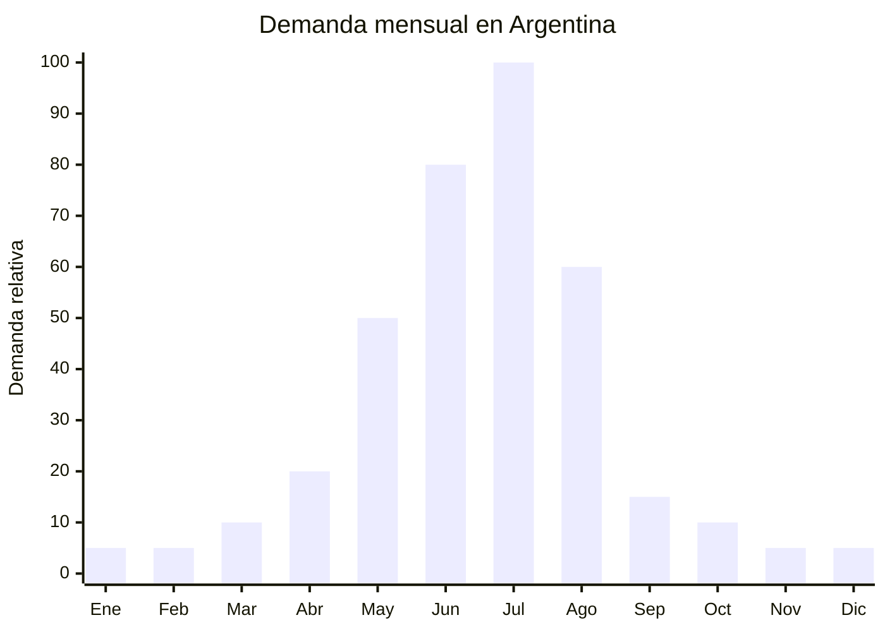

# Pantalones de ski / nieve impermeables

> **Capítulo NCM 62** — Prendas y complementos de vestir, excepto los de punto | **Temporada:** Invierno (Jun–Ago)

<Warning>
**ANTIDUMPING VIGENTE:** Argentina mantiene derechos antidumping sobre prendas originarias de China (Cap. 62). Los pantalones de ski están alcanzados. Verificar NCM exacto en la [CNCE](https://www.argentina.gob.ar/cnce/investigaciones/medidasvigentes) antes de realizar la compra.
</Warning>

## Qué es y por qué importarlo

Los pantalones de ski/nieve son prendas técnicas impermeables diseñadas para deportes de invierno en montaña. Se caracterizan por membrana impermeable (3,000-10,000mm), refuerzos en rodillas y zona de bota, polaina interior para nieve (snow gaiter), cierre lateral para ventilación y, en versiones infantiles, breteles ajustables tipo jardinero.

Es el **complemento natural de la campera de ski** y se vende frecuentemente en combo. En MercadoLibre Argentina, las búsquedas "pantalón ski" y "pantalón nieve" se concentran entre mayo y julio. Los precios de marcas reconocidas oscilan entre ARS 150.000-400.000, dejando espacio para marcas importadas en el rango de ARS 80.000-200.000.

Las mismas fábricas chinas que producen camperas de ski fabrican los pantalones. Esto permite negociar un embarque combinado (campera + pantalón) con la misma fábrica, reduciendo costos logísticos y asegurando coherencia de materiales y colores.

## Datos clave

| Dato | Valor |
|------|-------|
| **Posiciones NCM típicas** | 6203.43.00 (pantalones de fibras sintéticas hombre), 6204.63.00 (mujer) |
| **Derecho de importación** | 20% (DIE) + 3% tasa estadística + **antidumping adicional** |
| **Rango FOB típico** | USD 8.00 — USD 20.00 por unidad |
| **Precio de venta en Argentina** | ARS 80.000 — ARS 200.000 |
| **Margen bruto estimado** | 100% — 200% (variable según antidumping) |
| **MOQ típico** | 100 — 300 unidades por modelo/talle |
| **Demanda en MercadoLibre** | Alta (pico julio) |
| **Competencia en MercadoLibre** | Media |
| **Dificultad para importar** | Difícil (antidumping + especificaciones técnicas) |
| **Certificaciones necesarias** | Etiquetado textil IRAM 12560 obligatorio |
| **Antidumping** | **SÍ — Verificar NCM exacto en CNCE** |

## Variantes y subtipos más comunes

| Subtipo / Variante | FOB aprox. | Venta AR aprox. | Nota |
|--------------------|-----------|-----------------|------|
| Pantalón ski básico membrana 3,000mm | USD 8.00 — 12.00 | ARS 80.000 — 120.000 | Entrada de gama |
| Pantalón ski membrana 5,000mm refuerzos | USD 12.00 — 16.00 | ARS 120.000 — 160.000 | **Mejor relación calidad-precio** |
| Pantalón ski membrana 10,000mm premium | USD 16.00 — 20.00 | ARS 160.000 — 200.000 | Gama alta |
| Pantalón ski niños con breteles | USD 7.00 — 14.00 | ARS 70.000 — 140.000 | Demanda vacaciones invierno |
| Pantalón ski bib/overall (pechera) | USD 14.00 — 20.00 | ARS 140.000 — 200.000 | Máxima protección nieve |
| Combo campera + pantalón ski | USD 22.00 — 45.00 | ARS 200.000 — 450.000 | **Set completo, mayor ticket** |

## Regulaciones y requisitos

<Tabs>
  <Tab title="Certificaciones">
    **IRAM 12560** — Etiquetado textil obligatorio.

    **Antidumping** — Pantalones de ski Cap. 62 de China con antidumping adicional. Consultar despachante.

    **Recomendado:** Test de impermeabilidad (ISO 811), test de resistencia al desgarro en zona de rodilla y refuerzos.
  </Tab>
  <Tab title="Etiquetado">
    **Obligatorio según IRAM 12560:**
    - Composición exterior (ej: "100% Poliéster con membrana PU 5,000mm")
    - Composición forro (ej: "Forro: 100% Poliéster mesh/tafeta")
    - Talle (sistema argentino)
    - Instrucciones de lavado
    - País de origen
    - Datos del importador

    **Recomendado:** Indicar columna de agua en hang tag para justificar precio.
  </Tab>
  <Tab title="Restricciones">
    **Antidumping vigente** — Cap. 62 de China.

    **Polaina interior (snow gaiter)** — Verificar que los pantalones incluyan polaina interior con banda elástica y gancho para bota. Sin esto, la nieve entra por la bota y el producto pierde funcionalidad.

    **Refuerzos en bota** — La zona inferior del pantalón que roza con la bota debe tener refuerzo anti-abrasión (Cordura o similar). Sin refuerzo, el pantalón se destruye en una temporada.
  </Tab>
</Tabs>

## Logística de importación

| Dato | Valor |
|------|-------|
| **Peso típico por unidad** | 0.50 — 1.00 kg |
| **Volumen típico** | Medio |
| **Fragilidad** | Baja |
| **Envío recomendado** | Marítimo LCL combinado con camperas ski / FCL si lote grande |
| **Tiempo total estimado** | 70 — 100 días (producción técnica + marítimo) |
| **Origen principal** | Fujian, Jiangsu, China |

<Tip>
Negociar campera + pantalón de ski con la **misma fábrica** para asegurar coherencia de materiales, colores y calidad. En Alibaba, buscar "ski suit manufacturer" en lugar de campera y pantalón por separado. Vender en MercadoLibre como "conjunto ski" con ambas prendas aumenta el ticket promedio un 60% y el pantalón individual se vende como complemento para quienes ya tienen campera.
</Tip>

## Estacionalidad y timing de compra



| Aspecto | Detalle |
|---------|---------|
| **Meses pico de venta** | Junio — Julio (pre-ski + temporada plena) |
| **Meses valle** | Octubre — Marzo |
| **Cuándo pedir a China** | Enero — Febrero junto con camperas ski |
| **Tiempo de anticipación** | 80-100 días (producción técnica + envío marítimo) |

## Ventajas y riesgos

<CardGroup cols={2}>
  <Card title="Ventajas" icon="circle-check">
    - Complemento natural de campera ski (venta cruzada)
    - Nicho premium con margen alto
    - Venta como combo aumenta ticket 60%
    - Misma fábrica que camperas (logística simplificada)
    - Menor competencia que camperas (menos oferta individual)
    - Demanda creciente por turismo ski argentino
  </Card>
  <Card title="Riesgos" icon="triangle-exclamation">
    - **Antidumping impacta el margen**
    - Temporada ultra-corta (junio-julio)
    - Producto técnico: fallas de impermeabilidad generan reclamos
    - Talles complicados (largo de pierna varía mucho)
    - Stock sobrante queda hasta próximo invierno
    - Si la campera no se vende, el pantalón tampoco
  </Card>
</CardGroup>

## Palabras clave para buscar en Alibaba

```
ski pants wholesale, snowboard pants waterproof,
ski trousers OEM, snow pants children suspenders,
ski bib overall wholesale, waterproof ski pants 10000mm,
ski suit manufacturer China, winter snow pants bulk,
ski pants taped seams wholesale
```

## Fuentes

- [MercadoLibre Argentina — Pantalones ski](https://listado.mercadolibre.com.ar/pantalon-ski)
- [CNCE — Medidas antidumping vigentes](https://www.argentina.gob.ar/cnce/investigaciones/medidasvigentes)
- [Alibaba — Ski pants wholesale](https://www.alibaba.com/showroom/ski-pants-wholesale.html)
