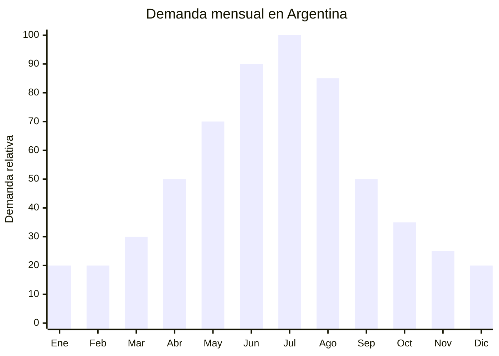

# Cortinas blackout térmicas / roller blackout

> **Capítulo NCM 63** — Los demás artículos textiles confeccionados | **Temporada:** Invierno (Jun–Ago)

## Qué es y por qué importarlo

Las cortinas blackout térmicas son revestimientos para ventanas fabricados con telas de alta densidad (generalmente poliéster con recubrimiento de espuma acrílica o aluminio en la cara posterior) que bloquean entre el 85% y el 100% de la luz solar y, lo más importante para invierno, **reducen hasta un 25% la pérdida de calor** a través de las ventanas. Las versiones roller (enrollables) con mecanismo de cadena o motorizado son las más demandadas.

En Argentina, la demanda de cortinas blackout se dispara en invierno por dos razones: los días más cortos que requieren mayor oscurecimiento para dormir bien, y la necesidad de **aislación térmica** para reducir el gasto en calefacción. Las marcas de referencia incluyen Shade Master, Coversun y Hunter Douglas.

Según datos de Nubimetrics, "cortina blackout" y "roller blackout" están entre las búsquedas con mayor crecimiento en la categoría hogar durante mayo-agosto. China produce el 80% de las cortinas blackout del mundo, con precios FOB desde USD 2.00 por unidad (cortina confeccionada con ojales, 140x230cm) y USD 4-8 para rollers con mecanismo incluido.

## Datos clave

| Dato | Valor |
|------|-------|
| **Posiciones NCM típicas** | 6303.92.00 (visillos y cortinas de fibras sintéticas), 6303.99.00 (de otras materias textiles) |
| **Derecho de importación** | 20% (DIE) + 3% tasa estadística |
| **Rango FOB típico** | USD 2.00 — USD 8.00 por unidad |
| **Precio de venta en Argentina** | ARS 20.000 — ARS 80.000 |
| **Margen bruto estimado** | 150% — 300% |
| **MOQ típico** | 300 — 1,000 unidades |
| **Demanda en MercadoLibre** | Muy Alta (tendencia creciente Nubimetrics) |
| **Competencia en MercadoLibre** | Media-Alta |
| **Dificultad para importar** | Baja |
| **Certificaciones necesarias** | Etiquetado textil básico |
| **Antidumping** | **No** (artículos textiles confeccionados Cap. 63 sin antidumping) |

## Variantes y subtipos más comunes

| Subtipo / Variante | FOB aprox. | Venta AR aprox. | Nota |
|--------------------|-----------|-----------------|------|
| Cortina blackout ojales 140x230cm | USD 2.00 — 3.50 | ARS 20.000 — 35.000 | **Más vendida** |
| Cortina blackout ojales 200x230cm | USD 3.00 — 5.00 | ARS 30.000 — 50.000 | Ventanas grandes |
| Roller blackout 90x200cm con mecanismo cadena | USD 4.00 — 6.00 | ARS 35.000 — 55.000 | Sistema roller manual |
| Roller blackout 120x200cm con mecanismo cadena | USD 5.00 — 8.00 | ARS 45.000 — 70.000 | Tamaño estándar |
| Cortina blackout térmica doble capa (blackout + voile) | USD 4.00 — 7.00 | ARS 35.000 — 60.000 | Doble función |
| Roller blackout motorizado WiFi | USD 12.00 — 25.00 | ARS 60.000 — 120.000 | Premium smart home |

## Regulaciones y requisitos

<Tabs>
  <Tab title="Certificaciones">
    | Requisito | Obligatorio | Detalle |
    |-----------|-------------|---------|
    | Etiquetado textil | **Sí** | Composición de fibra, dimensiones, instrucciones de cuidado |
    | Antidumping CNCE | **No aplica** | Cap. 63 sin antidumping vigente |
    | INTI | No obligatorio | No requiere certificación para cortinas |
    | Retardante de llama | Recomendado | No obligatorio para uso residencial en Argentina |
  </Tab>
  <Tab title="Etiquetado">
    Composición de tela (ej: "100% Poliéster con recubrimiento acrílico"), dimensiones en cm, instrucciones de cuidado (limpieza en seco o paño húmedo para rollers), país de origen, datos del importador (razón social, CUIT, dirección).
  </Tab>
  <Tab title="Restricciones">
    - **Sin antidumping** — Cap. 63 libre de antidumping
    - **Sin regulación específica** para cortinas de uso residencial
    - Los rollers con motor eléctrico pueden requerir certificación ENACOM si incluyen WiFi/Bluetooth
    - Barrera regulatoria: **MUY BAJA**
  </Tab>
</Tabs>

## Logística de importación

| Dato | Valor |
|------|-------|
| **Peso típico por unidad** | 0.50 — 2.00 kg (según tamaño y mecanismo) |
| **Volumen típico** | Medio (cortinas enrolladas o plegadas) |
| **Fragilidad** | Baja (cortinas) / Media (rollers con mecanismo) |
| **Envío recomendado** | Marítimo LCL o FCL |
| **Tiempo total estimado** | 50 — 80 días (producción + marítimo) |
| **Origen principal** | Shaoxing (Zhejiang) — capital mundial de cortinas y telas |

<Tip>
Shaoxing (Zhejiang) es la **capital mundial de las telas para cortinas**. Tiene más de 10,000 fábricas especializadas con precios imbatibles. Para rollers con mecanismo, solicitar que el proveedor envíe la tela enrollada en el tubo de aluminio **listo para instalar** — esto simplifica la venta al consumidor final que solo necesita atornillar los soportes. Incluir video de instalación QR code en el packaging.
</Tip>

## Estacionalidad y timing de compra



| Aspecto | Detalle |
|---------|---------|
| **Meses pico de venta** | Junio — Agosto (invierno, aislación térmica + oscuridad) |
| **Meses valle** | Diciembre — Febrero (verano, menos necesidad térmica) |
| **Cuándo pedir a China** | Febrero — Marzo para tener stock en mayo-junio |
| **Tiempo de anticipación** | 60-80 días (producción 15-20 días + envío marítimo) |

<Note>
A diferencia de otros productos de invierno, las cortinas blackout tienen demanda **durante todo el año** (para dormitorios, turnos nocturnos, bebés). El invierno es el pico, pero no hay "valle cero". Esto reduce el riesgo de stock sobrante.
</Note>

## Ventajas y riesgos

<CardGroup cols={2}>
  <Card title="Ventajas" icon="circle-check">
    - **Sin antidumping** Cap. 63 — importación libre
    - **Sin regulación específica** — barrera ultra baja
    - Demanda durante todo el año (pico invierno)
    - Margen bruto 150-300%
    - Tendencia aislación térmica en auge
    - Shaoxing ofrece miles de fábricas especializadas
    - Producto de instalación permanente (no estacional puro)
    - Rollers motorizados = tendencia smart home
  </Card>
  <Card title="Riesgos" icon="triangle-exclamation">
    - Medidas de ventanas varían (muchos tamaños necesarios)
    - Competencia con fabricantes locales (cortinas a medida)
    - Mecanismos de roller de baja calidad se traban
    - Color blackout real vs. "oscurecimiento parcial" (reclamos)
    - Peso en flete: los rollers con tubo de aluminio pesan más
    - Si el mecanismo roller falla, todo el producto se devuelve
  </Card>
</CardGroup>

## Palabras clave para buscar en Alibaba

```
blackout curtain wholesale, thermal insulated curtain,
roller blind blackout wholesale, blackout fabric curtain,
roller shade mechanism wholesale, Shaoxing curtain factory,
grommet blackout curtain bulk, motorized roller blind WiFi,
double layer curtain blackout voile
```

## Fuentes

- [MercadoLibre Argentina — Cortinas blackout](https://listado.mercadolibre.com.ar/cortina-blackout)
- [Nubimetrics — Tendencias hogar](https://www.nubimetrics.com)
- [Alibaba — Blackout curtain wholesale](https://www.alibaba.com/showroom/blackout-curtain-wholesale.html)
- [CNCE — Medidas antidumping vigentes](https://www.argentina.gob.ar/cnce/investigaciones/medidasvigentes)
