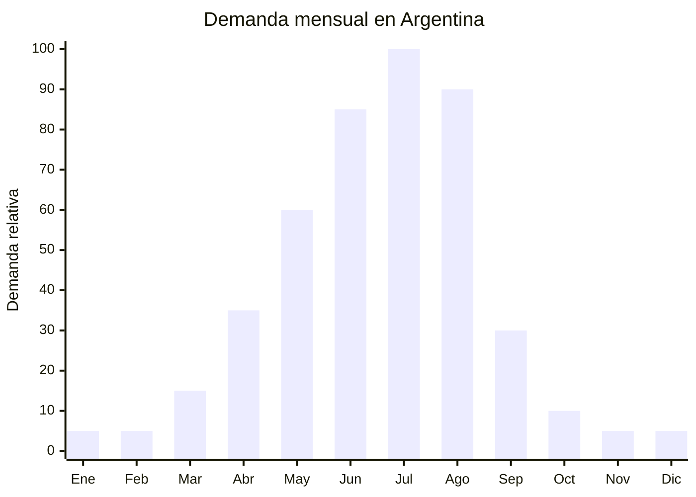

# Edredones / duvets de pluma sintética

> **Capítulo NCM 63** — Los demás artículos textiles confeccionados | **Temporada:** Invierno (Jun–Ago)

## Qué es y por qué importarlo

Los edredones (duvets / comforters) de pluma sintética son la prenda de cama de máximo abrigo para el invierno argentino. Se fabrican con relleno de **fibra hueca siliconada** (hollow fiber / microfiber fill) de 300 a 500 g/m2, que imita la capacidad térmica de la pluma de ganso a una fracción del costo. Son el **escalón superior** respecto a las frazadas polares (que se venden más en otoño): cuando las temperaturas bajan de 5°C, el consumidor busca edredones con mayor poder de abrigo.

El pico de demanda se concentra en **julio-agosto**, los meses más fríos de Argentina. En MercadoLibre, "edredón" y "acolchado pluma" son búsquedas de alto volumen con precios entre ARS 40.000 y ARS 180.000 según tamaño y calidad. Las marcas establecidas (Arredo, Cannon, Pierre Cardin licencia) compiten en el segmento premium, pero hay amplio espacio para edredones de buena calidad con marca propia.

Nantong (Jiangsu, China) es nuevamente la capital mundial de blanquería, con fábricas que producen edredones de fibra hueca siliconada desde FOB USD 8.00 (2 plazas). La ventaja clave de este producto: **sin antidumping vigente** en blanquería Cap. 63.

## Datos clave

| Dato | Valor |
|------|-------|
| **Posiciones NCM típicas** | 9404.90.00 (artículos de cama con relleno), 6302.31.00 (ropa de cama de algodón) |
| **Derecho de importación** | 20% (DIE) + 3% tasa estadística |
| **Rango FOB típico** | USD 8.00 — USD 25.00 por unidad |
| **Precio de venta en Argentina** | ARS 40.000 — ARS 180.000 |
| **Margen bruto estimado** | 150% — 300% |
| **MOQ típico** | 300 — 800 unidades |
| **Demanda en MercadoLibre** | Muy Alta (pico julio-agosto) |
| **Competencia en MercadoLibre** | Alta (marcas establecidas) / Media (marca propia) |
| **Dificultad para importar** | Baja |
| **Certificaciones necesarias** | Etiquetado textil básico |
| **Antidumping** | **No** (blanquería Cap. 63 sin antidumping) |

## Variantes y subtipos más comunes

| Subtipo / Variante | FOB aprox. | Venta AR aprox. | Nota |
|--------------------|-----------|-----------------|------|
| Edredón fibra hueca 300g/m2 — 2 plazas (200x230cm) | USD 8.00 — 12.00 | ARS 40.000 — 70.000 | Abrigo medio |
| Edredón fibra hueca 400g/m2 — 2 plazas | USD 10.00 — 15.00 | ARS 60.000 — 100.000 | **Más vendido invierno** |
| Edredón fibra hueca 500g/m2 — 2 plazas | USD 14.00 — 20.00 | ARS 80.000 — 140.000 | Máximo abrigo |
| Edredón Queen/King (240x260cm) 400g/m2 | USD 14.00 — 22.00 | ARS 80.000 — 160.000 | Premium |
| Edredón 1½ plaza (160x220cm) | USD 6.00 — 10.00 | ARS 30.000 — 60.000 | Individual |
| Edredón infantil con diseño (120x150cm) | USD 5.00 — 8.00 | ARS 25.000 — 50.000 | Personajes, estampados |
| Duvet insert blanco (para funda) | USD 8.00 — 18.00 | ARS 45.000 — 120.000 | Estilo nórdico |

## Regulaciones y requisitos

<Tabs>
  <Tab title="Certificaciones">
    | Requisito | Obligatorio | Detalle |
    |-----------|-------------|---------|
    | Etiquetado textil | **Sí** | Composición de tela exterior, composición de relleno, gramaje, dimensiones |
    | Antidumping CNCE | **No aplica** | Blanquería Cap. 63 sin antidumping vigente |
    | INTI | No obligatorio | No requiere certificación INTI |
    | Certificado sanitario | No (relleno sintético) | Solo aplica si el relleno fuera pluma real de ave |
  </Tab>
  <Tab title="Etiquetado">
    Composición de tela exterior (ej: "100% Algodón 233 hilos" o "100% Microfibra Poliéster"), composición y gramaje de relleno (ej: "Relleno: 100% Poliéster Fibra Hueca Siliconada 400g/m2"), dimensiones en cm, instrucciones de lavado, país de origen, datos del importador.
  </Tab>
  <Tab title="Restricciones">
    - **Sin antidumping** en blanquería — ventaja significativa vs. ropa
    - Relleno sintético no requiere certificado sanitario (la pluma real de ave sí)
    - Sin restricciones de sustancias peligrosas para uso textil hogar
    - Barrera regulatoria: **BAJA**
  </Tab>
</Tabs>

## Logística de importación

| Dato | Valor |
|------|-------|
| **Peso típico por unidad** | 1.50 — 4.00 kg (según gramaje y tamaño) |
| **Volumen típico** | Alto (producto muy voluminoso) |
| **Fragilidad** | Nula |
| **Envío recomendado** | Marítimo FCL (producto voluminoso — optimizar con vacuum) |
| **Tiempo total estimado** | 55 — 85 días (producción + marítimo) |
| **Origen principal** | Nantong, Jiangsu, China |

<Tip>
Los edredones son **extremadamente voluminosos** sin comprimir. Solicitar al proveedor **empaque al vacío (vacuum packed)** es OBLIGATORIO para optimizar flete. Un edredón 2 plazas 400g/m2 sin vacío ocupa ~60 litros; con vacío, ~15 litros. Un contenedor 40' HQ puede pasar de 2,000 a 8,000 edredones con empaque al vacío. El costo del vacuum packing es ~USD 0.20-0.40 por unidad y se paga solo con el ahorro de flete.
</Tip>

## Estacionalidad y timing de compra



| Aspecto | Detalle |
|---------|---------|
| **Meses pico de venta** | Julio — Agosto (máximo frío) |
| **Meses valle** | Noviembre — Febrero (verano) |
| **Cuándo pedir a China** | Febrero — Marzo para tener stock en junio |
| **Tiempo de anticipación** | 65-85 días (producción 15-25 días + envío marítimo) |

## Ventajas y riesgos

<CardGroup cols={2}>
  <Card title="Ventajas" icon="circle-check">
    - **Sin antidumping** Cap. 63 — ventaja competitiva clave
    - Margen bruto 150-300%
    - Producto de máximo abrigo (escalón superior a frazadas)
    - Nantong: cientos de fábricas especializadas
    - Vacuum packing optimiza flete dramáticamente
    - Fibra hueca siliconada es hipoalergénica (argumento de venta)
    - Duvet insert estilo nórdico es tendencia creciente
    - Barrera regulatoria baja
  </Card>
  <Card title="Riesgos" icon="triangle-exclamation">
    - **Extremadamente voluminoso** sin vacuum packing
    - Competencia con marcas establecidas (Arredo, Cannon)
    - Estacionalidad fuerte (venta concentrada julio-agosto)
    - Gramaje real vs. declarado (verificar con proveedor)
    - Fibra de baja calidad se aplasta rápido (pierde volumen y abrigo)
    - Stock sobrante ocupa mucho espacio de almacén
    - Tamaños deben adaptarse al mercado argentino
  </Card>
</CardGroup>

## Palabras clave para buscar en Alibaba

```
duvet comforter wholesale, hollow fiber comforter bulk,
microfiber duvet insert wholesale, Nantong duvet factory,
vacuum packed comforter wholesale, quilted comforter 400gsm,
all season duvet insert, siliconized fiber comforter,
white duvet insert hotel quality, printed comforter wholesale
```

## Fuentes

- [MercadoLibre Argentina — Edredones y acolchados](https://listado.mercadolibre.com.ar/edredon)
- [Alibaba — Duvet comforter wholesale](https://www.alibaba.com/showroom/duvet-comforter-wholesale.html)
- [CNCE — Medidas antidumping vigentes](https://www.argentina.gob.ar/cnce/investigaciones/medidasvigentes)
- [Nubimetrics — Tendencias blanquería](https://www.nubimetrics.com)
