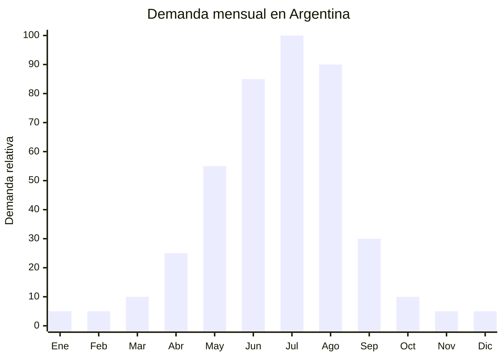

# Pasamontanas y balaclavas térmicas

> **Capítulo NCM 63** — Los demás artículos textiles confeccionados | **Temporada:** Invierno (Jun–Ago)

## Qué es y por qué importarlo

Los pasamontanas (balaclavas) son coberturas faciales y de cuello que protegen la cabeza, cara y cuello del frío extremo, viento y nieve. Se fabrican en polar fleece, neopreno, lycra térmica y telas windproof (cortaviento). Son esenciales para cuatro segmentos: **motociclistas** (uso diario urbano en invierno), **deportes de ski/snowboard**, **ciclismo invernal** y **trabajadores en exterior** (construcción, campos, frigoríficos).

El pico de demanda es **julio-agosto**, cuando las temperaturas bajan de 0°C en zonas del interior y Patagonia. En MercadoLibre Argentina, "pasamontañas" y "balaclava" son búsquedas activas desde mayo con precios entre ARS 5.000 y ARS 25.000. Es un producto de **ticket bajo pero alta rotación** con márgenes porcentuales excelentes gracias al FOB ultra bajo.

China (especialmente Yiwu y Dongguan) produce balaclavas desde FOB USD 0.80 por unidad en volumen. El producto es **extremadamente liviano** (30-80g por unidad), lo que hace viable incluso el envío aéreo para reposición rápida. Sin antidumping en Cap. 63 para este tipo de accesorios textiles confeccionados.

## Datos clave

| Dato | Valor |
|------|-------|
| **Posiciones NCM típicas** | 6307.90.90 (los demás artículos confeccionados de materia textil) |
| **Derecho de importación** | 20% (DIE) + 3% tasa estadística |
| **Rango FOB típico** | USD 0.80 — USD 3.00 por unidad |
| **Precio de venta en Argentina** | ARS 5.000 — ARS 25.000 |
| **Margen bruto estimado** | 200% — 500% |
| **MOQ típico** | 500 — 2,000 unidades |
| **Demanda en MercadoLibre** | Alta (motociclistas + ski + trabajo) |
| **Competencia en MercadoLibre** | Media |
| **Dificultad para importar** | Muy Baja |
| **Certificaciones necesarias** | Etiquetado textil básico |
| **Antidumping** | **No** (accesorios textiles Cap. 63 sin antidumping) |

## Variantes y subtipos más comunes

| Subtipo / Variante | FOB aprox. | Venta AR aprox. | Nota |
|--------------------|-----------|-----------------|------|
| Balaclava polar fleece básica | USD 0.80 — 1.20 | ARS 5.000 — 10.000 | **Más vendida** |
| Balaclava windproof / cortaviento | USD 1.50 — 2.50 | ARS 10.000 — 18.000 | Para moto y ski |
| Pasamontañas neopreno cara completa | USD 1.50 — 3.00 | ARS 10.000 — 20.000 | Motociclistas |
| Balaclava con filtro respiración | USD 2.00 — 3.00 | ARS 12.000 — 25.000 | Ciclismo / polución |
| Cuello térmico multiuso (buff style) | USD 0.60 — 1.50 | ARS 4.000 — 12.000 | Versátil, 12 usos |
| Pack x3 balaclavas surtidas | USD 2.00 — 3.50 | ARS 12.000 — 22.000 | Venta por pack |

## Regulaciones y requisitos

<Tabs>
  <Tab title="Certificaciones">
    | Requisito | Obligatorio | Detalle |
    |-----------|-------------|---------|
    | Etiquetado textil | **Sí** | Composición de fibra, país de origen |
    | Antidumping CNCE | **No aplica** | Accesorios textiles Cap. 63 sin antidumping |
    | INTI | No obligatorio | No requiere certificación |
    | Certificación especial | No | No es EPP (equipo protección personal) en uso recreativo |
  </Tab>
  <Tab title="Etiquetado">
    Composición (ej: "100% Poliéster Polar Fleece" o "90% Poliéster, 10% Elastano"), país de origen ("Hecho en China"), datos del importador. La etiqueta puede ser cosida en la costura lateral o en hang tag.
  </Tab>
  <Tab title="Restricciones">
    - **Sin antidumping** — Cap. 63 libre
    - **Sin regulación específica** para uso recreativo/deportivo
    - Si se comercializa como EPP (equipo de protección personal) para trabajo, puede requerir certificación adicional según normativa laboral
    - Barrera regulatoria: **MUY BAJA**
  </Tab>
</Tabs>

## Logística de importación

| Dato | Valor |
|------|-------|
| **Peso típico por unidad** | 30 — 80 g |
| **Volumen típico** | Muy Bajo (producto ultracompacto) |
| **Fragilidad** | Nula |
| **Envío recomendado** | Marítimo LCL (consolidado) o **Aéreo** (viable por peso ultra bajo) |
| **Tiempo total estimado** | Marítimo: 50-75 días / Aéreo: 15-25 días |
| **Origen principal** | Yiwu, Dongguan, China |

<Tip>
Las balaclavas son uno de los pocos productos textiles donde el **envío aéreo es económicamente viable** por su peso ultra bajo (30-80g/unidad). Un lote de 1,000 unidades pesa solo 30-80 kg, con un costo aéreo de ~USD 150-400. Si la temporada ya arrancó y necesitás reposición rápida en 15-20 días, el aéreo es la solución. Para el stock principal, usar marítimo LCL consolidado con otros productos.
</Tip>

## Estacionalidad y timing de compra



| Aspecto | Detalle |
|---------|---------|
| **Meses pico de venta** | Julio — Agosto (frío extremo) |
| **Meses valle** | Octubre — Marzo |
| **Cuándo pedir a China** | Marzo — Abril (marítimo) o Mayo (aéreo para reposición) |
| **Tiempo de anticipación** | 50-75 días marítimo / 15-25 días aéreo |

## Ventajas y riesgos

<CardGroup cols={2}>
  <Card title="Ventajas" icon="circle-check">
    - **Sin antidumping** Cap. 63
    - **FOB ultra bajo** (desde USD 0.80)
    - Margen bruto 200-500%
    - Ultraliviano — viable envío aéreo
    - Múltiples segmentos (moto, ski, ciclismo, trabajo)
    - Producto de impulso (ticket bajo, compra rápida)
    - Regulación mínima
    - Ideal para venta en packs (x3, x5)
    - Ocupa mínimo espacio de almacén
  </Card>
  <Card title="Riesgos" icon="triangle-exclamation">
    - Ticket bajo (necesita volumen para ser rentable)
    - Estacionalidad fuerte
    - Calidad variable (costuras, elasticidad)
    - Competencia por precio con vendedores minoristas
    - Producto genérico difícil de diferenciar
    - Talle único puede no ser cómodo para todas las cabezas
  </Card>
</CardGroup>

## Palabras clave para buscar en Alibaba

```
balaclava wholesale, ski mask fleece bulk,
windproof balaclava motorcycle, neoprene face mask winter,
thermal balaclava wholesale, neck gaiter buff wholesale,
full face mask winter motorcycle, polar fleece balaclava bulk,
cycling balaclava windproof wholesale
```

## Fuentes

- [MercadoLibre Argentina — Pasamontañas](https://listado.mercadolibre.com.ar/pasamontanas)
- [Alibaba — Balaclava wholesale](https://www.alibaba.com/showroom/balaclava-wholesale.html)
- [CNCE — Medidas antidumping vigentes](https://www.argentina.gob.ar/cnce/investigaciones/medidasvigentes)
