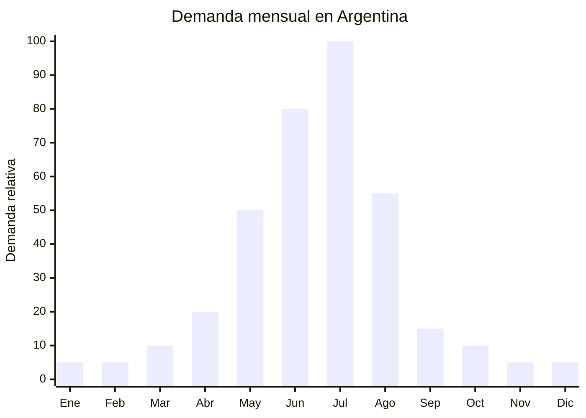

# Botas de nieve impermeables (pre-ski / after-ski)

> **Capítulo NCM 64** — Calzado, polainas y artículos análogos | **Temporada:** Invierno (Jun–Ago)

<Warning>
**ANTIDUMPING CALZADO:** Argentina mantiene derechos antidumping sobre calzado originario de China según Resolución 915/2021 y sus actualizaciones. Las botas de nieve pueden estar alcanzadas dependiendo del NCM exacto y la composición (parte superior de material textil vs. cuero/sintético). **Verificar el NCM específico en la [CNCE](https://www.argentina.gob.ar/cnce/investigaciones/medidasvigentes) ANTES de comprar.** El antidumping en calzado puede ser significativo.
</Warning>

## Qué es y por qué importarlo

Las botas de nieve impermeables son calzado técnico diseñado para caminar sobre nieve, hielo y superficies mojadas en condiciones de frío extremo. Se caracterizan por membrana impermeable, suela con agarre antideslizante (grip en hielo), forro térmico interior (polar o sherpa sintético) y caña media o alta. Se usan como calzado **pre-ski** (para llegar a la pista), **after-ski** (después de esquiar) y **uso urbano invernal** en ciudades frías como Bariloche, Ushuaia, Mendoza.

El pico de demanda es **julio**, coincidiendo con las vacaciones de invierno y la temporada de ski. En MercadoLibre Argentina, "botas nieve" y "botas after ski" son búsquedas de alto volumen con precios entre ARS 60.000 y ARS 250.000. Las marcas de referencia (Montagne, Hi-Tec, Columbia) dejan espacio para marcas importadas en el rango de ARS 50.000-120.000.

China (especialmente Wenzhou y Putian, Fujian) es el mayor productor mundial de calzado, con fábricas que producen botas de nieve desde FOB USD 8.00 por par. La clave está en verificar la impermeabilidad real (test de columna de agua) y la adherencia de la suela en hielo.

## Datos clave

| Dato | Valor |
|------|-------|
| **Posiciones NCM típicas** | 6402.19.00 (calzado impermeable parte superior caucho/plástico), 6404.19.00 (parte superior material textil, suela caucho) |
| **Derecho de importación** | 20% (DIE) + 3% tasa estadística + **posible antidumping adicional** |
| **Rango FOB típico** | USD 8.00 — USD 20.00 por par |
| **Precio de venta en Argentina** | ARS 50.000 — ARS 180.000 |
| **Margen bruto estimado** | 100% — 200% (variable según antidumping) |
| **MOQ típico** | 200 — 500 pares (curva de talles) |
| **Demanda en MercadoLibre** | Alta (pico julio) |
| **Competencia en MercadoLibre** | Media |
| **Dificultad para importar** | Difícil (antidumping calzado + curva talles) |
| **Certificaciones necesarias** | Etiquetado de calzado obligatorio |
| **Antidumping** | **Verificar — Res. 915/2021 calzado de China** |

## Variantes y subtipos más comunes

| Subtipo / Variante | FOB aprox. | Venta AR aprox. | Nota |
|--------------------|-----------|-----------------|------|
| Bota nieve caña media hombre | USD 8.00 — 13.00 | ARS 50.000 — 100.000 | Uso urbano + montaña |
| Bota nieve caña alta mujer forro sherpa | USD 10.00 — 16.00 | ARS 70.000 — 130.000 | **Más vendida** |
| Bota after-ski acolchada (moon boot style) | USD 8.00 — 14.00 | ARS 60.000 — 120.000 | Estilo casual |
| Bota nieve infantil con velcro | USD 6.00 — 12.00 | ARS 40.000 — 90.000 | Vacaciones invierno niños |
| Bota trekking invernal impermeable | USD 14.00 — 20.00 | ARS 100.000 — 180.000 | Técnica outdoor |
| Bota nieve térmica -30°C | USD 12.00 — 18.00 | ARS 80.000 — 150.000 | Ushuaia, Patagonia |

## Regulaciones y requisitos

<Tabs>
  <Tab title="Certificaciones">
    **Antidumping calzado Res. 915/2021** — El calzado de China tiene antidumping vigente. El monto varía según el NCM exacto (parte superior de textil vs. plástico/caucho vs. cuero). Algunos NCM están alcanzados y otros no. Consultar con despachante de aduana **ANTES** de comprar.

    **Etiquetado de calzado** — Obligatorio indicar materiales de parte superior, forro, plantilla y suela.
  </Tab>
  <Tab title="Etiquetado">
    **Obligatorio para calzado importado:**
    - Material parte superior (ej: "Material textil impermeable")
    - Material suela (ej: "Caucho termoplástico TPR antideslizante")
    - Material forro interior (ej: "Forro polar sintético")
    - Talle (sistema argentino: 35-45)
    - País de origen ("Hecho en China")
    - Datos del importador (razón social, CUIT, domicilio)
  </Tab>
  <Tab title="Restricciones">
    **Antidumping calzado** — Res. 915/2021 y actualizaciones. El impacto puede ser significativo (USD 3-10 adicionales por par según NCM).

    **Curva de talles** — Calzado requiere stock en toda la curva de talles (35-45), lo que aumenta la inversión mínima y el riesgo de talles sobrantes. Los talles más vendidos en Argentina son 37-42.

    **Impermeabilidad real** — Solicitar test de impermeabilidad al proveedor. Botas que se mojan en nieve generan reclamos masivos y destruyen la reputación.
  </Tab>
</Tabs>

## Logística de importación

| Dato | Valor |
|------|-------|
| **Peso típico por par** | 0.80 — 1.50 kg (con caja) |
| **Volumen típico** | Medio-Alto (cajas individuales voluminosas) |
| **Fragilidad** | Baja |
| **Envío recomendado** | Marítimo LCL o FCL |
| **Tiempo total estimado** | 65 — 95 días (producción 20-30 días + marítimo 35-50 días) |
| **Origen principal** | Wenzhou y Putian (Fujian), China |

<Tip>
Wenzhou (Fujian) es la **capital del calzado chino**. Concentrar la búsqueda de fábricas ahí para botas de nieve. Solicitar al proveedor que envíe las botas en **caja individual con hang tag** que incluya especificaciones técnicas (impermeabilidad, temperatura, materiales). Para optimizar volumen, pedir cajas de calzado de tamaño ajustado (no cajas oversized). Un contenedor 20' contiene ~3,000-5,000 pares según tamaño.
</Tip>

## Estacionalidad y timing de compra



| Aspecto | Detalle |
|---------|---------|
| **Meses pico de venta** | Junio — Julio (pre-vacaciones invierno + temporada ski) |
| **Meses valle** | Octubre — Marzo |
| **Cuándo pedir a China** | Enero — Febrero para tener stock en mayo-junio |
| **Tiempo de anticipación** | 75-95 días (producción calzado más lenta + envío marítimo) |

## Ventajas y riesgos

<CardGroup cols={2}>
  <Card title="Ventajas" icon="circle-check">
    - Nicho premium con margen alto (100-200%)
    - Ticket promedio elevado (ARS 50,000-180,000)
    - Demanda concentrada y predecible (julio)
    - Producto técnico diferenciable (impermeabilidad, grip)
    - Combinable con ropa ski (venta cruzada)
    - Infantil muy demandado en vacaciones invierno
    - Wenzhou/Putian: miles de fábricas especializadas
  </Card>
  <Card title="Riesgos" icon="triangle-exclamation">
    - **Antidumping calzado puede impactar severamente el margen**
    - Curva de talles obliga a stock diversificado
    - Temporada ultra-corta (junio-julio concentran 80%)
    - Impermeabilidad deficiente = reclamos masivos
    - Talles chinos vs. argentinos (diferencias significativas)
    - Stock sobrante de talles extremos (35, 44, 45)
    - Producción calzado requiere más tiempo (moldes, hormas)
  </Card>
</CardGroup>

## Palabras clave para buscar en Alibaba

```
snow boots wholesale waterproof, winter boots fur lined,
snow boots women warm wholesale, after ski boots bulk,
waterproof hiking boots winter, children snow boots velcro,
moon boots wholesale, thermal boots -30 wholesale,
snow boots TPR sole anti-slip, Wenzhou snow boots factory
```

## Fuentes

- [MercadoLibre Argentina — Botas nieve](https://listado.mercadolibre.com.ar/botas-nieve)
- [CNCE — Medidas antidumping vigentes](https://www.argentina.gob.ar/cnce/investigaciones/medidasvigentes)
- [Resolución 915/2021 — Antidumping calzado China](https://www.argentina.gob.ar/cnce)
- [Alibaba — Snow boots wholesale](https://www.alibaba.com/showroom/snow-boots-wholesale.html)
