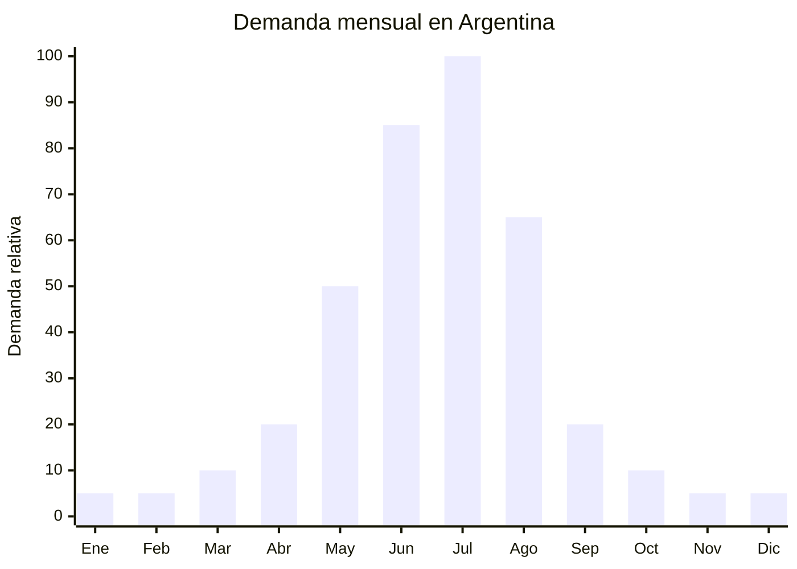

# Gorros de ski / snowboard técnicos windproof

> **Capítulo NCM 65** — Sombreros, demás tocados y sus partes | **Temporada:** Invierno (Jun–Ago)

## Qué es y por qué importarlo

Los gorros de ski/snowboard técnicos son accesorios de cabeza diseñados para deportes de invierno en montaña. Se diferencian de los gorros de lana convencionales por tres características clave: **membrana windproof** (cortaviento — bloquea el viento frío en pista), **forro polar interior** (doble capa para máximo abrigo) y **perfil bajo compatible con casco de ski** (fit ajustado que entra debajo del casco sin generar presión).

El pico de demanda es **julio**, coincidiendo con la temporada de ski en Argentina. En MercadoLibre, "gorro ski" y "gorro térmico" son búsquedas activas con precios entre ARS 8.000 y ARS 30.000. Las marcas de ski (Montagne, Columbia) venden gorros técnicos a ARS 25.000-45.000, dejando espacio para importadores en el rango accesible.

China produce gorros técnicos de ski desde FOB USD 1.50 por unidad, con versiones premium windproof + polar fleece hasta USD 4.00. Las fábricas de Dongguan y Yiwu son las principales productoras. El producto es liviano (60-100g), compacto y sin regulación especial.

## Datos clave

| Dato | Valor |
|------|-------|
| **Posiciones NCM típicas** | 6505.00.90 (los demás sombreros y tocados de punto) |
| **Derecho de importación** | 20% (DIE) + 3% tasa estadística |
| **Rango FOB típico** | USD 1.50 — USD 4.00 por unidad |
| **Precio de venta en Argentina** | ARS 8.000 — ARS 30.000 |
| **Margen bruto estimado** | 200% — 400% |
| **MOQ típico** | 500 — 1,500 unidades |
| **Demanda en MercadoLibre** | Alta (pico julio) |
| **Competencia en MercadoLibre** | Media |
| **Dificultad para importar** | Muy Baja |
| **Certificaciones necesarias** | Etiquetado básico |
| **Antidumping** | **No** |

## Variantes y subtipos más comunes

| Subtipo / Variante | FOB aprox. | Venta AR aprox. | Nota |
|--------------------|-----------|-----------------|------|
| Gorro ski básico forro polar doble capa | USD 1.50 — 2.00 | ARS 8.000 — 14.000 | Entrada de gama |
| Gorro ski windproof membrana + polar | USD 2.50 — 4.00 | ARS 15.000 — 25.000 | **Técnico recomendado** |
| Gorro ski con cuello integrado (balaclava) | USD 2.00 — 3.50 | ARS 12.000 — 22.000 | Protección completa |
| Gorro ski infantil con orejeras | USD 1.50 — 2.50 | ARS 8.000 — 16.000 | Vacaciones invierno |
| Gorro ski reflectivo (seguridad nocturna) | USD 2.00 — 3.00 | ARS 12.000 — 20.000 | Diferenciador |
| Pack x2 gorros ski (hombre + mujer) | USD 3.00 — 5.00 | ARS 18.000 — 35.000 | Venta por pack pareja |

## Regulaciones y requisitos

<Tabs>
  <Tab title="Certificaciones">
    | Requisito | Obligatorio | Detalle |
    |-----------|-------------|---------|
    | Etiquetado | **Básico** | Composición, país de origen |
    | Antidumping CNCE | **No aplica** | Sin antidumping para sombreros/gorros Cap. 65 |
    | Certificación especial | No | Producto sin regulación |
  </Tab>
  <Tab title="Etiquetado">
    Composición de materiales (ej: "Exterior: 100% Poliéster windproof. Forro: 100% Poliéster Polar Fleece"), país de origen, datos del importador. Etiqueta cosida interior o hang tag.
  </Tab>
  <Tab title="Restricciones">
    - **Sin antidumping** — importación libre
    - **Sin regulación específica**
    - Si se comercializa como "compatible con casco", no implica certificación adicional
    - Barrera regulatoria: **NULA**
  </Tab>
</Tabs>

## Logística de importación

| Dato | Valor |
|------|-------|
| **Peso típico por unidad** | 60 — 100 g |
| **Volumen típico** | Muy Bajo |
| **Fragilidad** | Nula |
| **Envío recomendado** | Marítimo LCL consolidado o Aéreo |
| **Tiempo total estimado** | Marítimo: 45-70 días / Aéreo: 12-20 días |
| **Origen principal** | Dongguan, Yiwu, China |

<Tip>
Combinar gorros de ski con otros accesorios técnicos de invierno (balaclavas, orejeras, guantes térmicos) en un **mismo consolidado LCL desde Yiwu** para armar una línea completa de accesorios ski. En MercadoLibre, ofrecer el "kit ski completo" (gorro + balaclava + guantes) como publicación premium aumenta el ticket promedio un 150% vs. venta individual.
</Tip>

## Estacionalidad y timing de compra



| Aspecto | Detalle |
|---------|---------|
| **Meses pico de venta** | Junio — Julio (pre-ski + temporada ski) |
| **Meses valle** | Octubre — Marzo |
| **Cuándo pedir a China** | Marzo — Abril (marítimo) o Mayo (aéreo) |
| **Tiempo de anticipación** | 45-70 días marítimo / 12-20 días aéreo |

## Ventajas y riesgos

<CardGroup cols={2}>
  <Card title="Ventajas" icon="circle-check">
    - Sin antidumping ni regulación
    - Margen bruto 200-400%
    - FOB bajo (USD 1.50-4.00)
    - Ultraliviano — viable envío aéreo
    - Diferenciación con feature windproof vs. gorros genéricos
    - Combinable en kits ski (mayor ticket)
    - Compatible con casco = argumento de venta técnico
    - Producto de impulso previo a vacaciones invierno
  </Card>
  <Card title="Riesgos" icon="triangle-exclamation">
    - Temporada corta (junio-julio)
    - Ticket bajo (requiere volumen)
    - Competencia con gorros de lana artesanales argentinos
    - Talle único puede no adaptarse a todas las cabezas
    - Windproof de baja calidad no cumple expectativa
    - Stock sobrante de temporada
  </Card>
</CardGroup>

## Palabras clave para buscar en Alibaba

```
ski beanie wholesale windproof, winter hat fleece lined,
ski hat helmet compatible, beanie windproof membrane,
thermal ski cap wholesale, snowboard beanie bulk,
double layer winter hat wholesale, skull cap ski wholesale,
reflective beanie winter, children ski hat ear flap
```

## Fuentes

- [MercadoLibre Argentina — Gorros ski](https://listado.mercadolibre.com.ar/gorro-ski)
- [Alibaba — Ski beanie wholesale](https://www.alibaba.com/showroom/ski-beanie-wholesale.html)
- [CNCE — Medidas antidumping vigentes](https://www.argentina.gob.ar/cnce/investigaciones/medidasvigentes)
