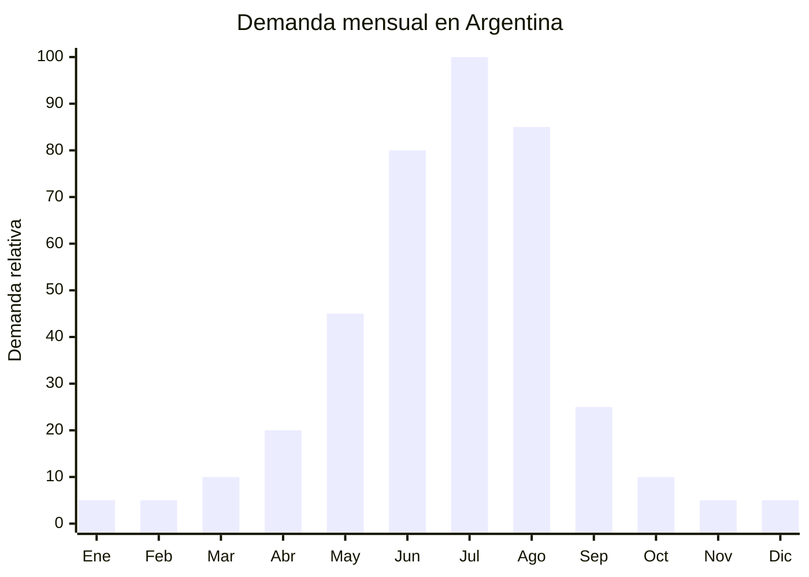

# Orejeras térmicas (earmuffs)

> **Capítulo NCM 65** — Sombreros, demás tocados y sus partes | **Temporada:** Invierno (Jun–Ago)

## Qué es y por qué importarlo

Las orejeras térmicas (earmuffs) son accesorios de protección auditiva contra el frío que cubren ambas orejas mediante almohadillas acolchadas unidas por una banda ajustable que pasa por encima o detrás de la cabeza. Se fabrican en polar fleece, peluche sintético, faux fur o cuero sintético con forro interior térmico. La versión plegable es la más demandada por su portabilidad.

El pico de demanda es **julio-agosto**, cuando las temperaturas caen por debajo de 5°C en Buenos Aires y bajo cero en el interior y Patagonia. En MercadoLibre Argentina, "orejeras térmicas" y "orejeras invierno" tienen demanda activa con precios entre ARS 5.000 y ARS 20.000. Es un producto de **ticket bajo, alta rotación y margen porcentual excelente** gracias al FOB extremadamente bajo.

China (Yiwu) domina la producción mundial de orejeras con precios FOB desde USD 0.50 por unidad. El producto es **ultraliviano** (40-80g por unidad), lo que permite un envío extremadamente eficiente e incluso viable por vía aérea. Sin regulación específica ni antidumping para accesorios de sombrerería Cap. 65.

## Datos clave

| Dato | Valor |
|------|-------|
| **Posiciones NCM típicas** | 6505.00.90 (los demás sombreros y tocados) |
| **Derecho de importación** | 20% (DIE) + 3% tasa estadística |
| **Rango FOB típico** | USD 0.50 — USD 2.00 por unidad |
| **Precio de venta en Argentina** | ARS 5.000 — ARS 20.000 |
| **Margen bruto estimado** | 300% — 600% |
| **MOQ típico** | 500 — 2,000 unidades |
| **Demanda en MercadoLibre** | Media-Alta |
| **Competencia en MercadoLibre** | Baja-Media |
| **Dificultad para importar** | Muy Baja |
| **Certificaciones necesarias** | Ninguna específica |
| **Antidumping** | **No** |

## Variantes y subtipos más comunes

| Subtipo / Variante | FOB aprox. | Venta AR aprox. | Nota |
|--------------------|-----------|-----------------|------|
| Orejeras plegables polar fleece básicas | USD 0.50 — 0.80 | ARS 5.000 — 8.000 | **Más vendidas** |
| Orejeras peluche / faux fur | USD 0.80 — 1.50 | ARS 7.000 — 14.000 | Mujer / niñas |
| Orejeras behind-the-head (banda atrás) | USD 0.70 — 1.20 | ARS 6.000 — 12.000 | Compatible con gorros |
| Orejeras con auriculares Bluetooth | USD 3.00 — 6.00 | ARS 15.000 — 35.000 | Nicho tech |
| Orejeras infantiles con diseño (animales) | USD 0.60 — 1.20 | ARS 5.000 — 10.000 | Diseños divertidos |
| Pack x3 orejeras surtidas | USD 1.50 — 3.00 | ARS 12.000 — 22.000 | Venta por pack |

## Regulaciones y requisitos

<Tabs>
  <Tab title="Certificaciones">
    | Requisito | Obligatorio | Detalle |
    |-----------|-------------|---------|
    | Etiquetado | **Básico** | Composición, país de origen |
    | Antidumping CNCE | **No aplica** | Sin antidumping para accesorios Cap. 65 |
    | ENACOM | Solo Bluetooth | Si incluyen módulo Bluetooth, requieren ENACOM |
    | Certificación especial | No | Producto sin regulación específica |
  </Tab>
  <Tab title="Etiquetado">
    Composición de materiales (ej: "Exterior: Poliéster Polar. Interior: Poliéster peluche"), país de origen, datos del importador. Etiqueta en hang tag es suficiente.
  </Tab>
  <Tab title="Restricciones">
    - **Sin antidumping** — importación libre
    - **Sin regulación específica** — barrera prácticamente nula
    - Orejeras con Bluetooth requieren homologación ENACOM (si la tienen)
    - Barrera regulatoria: **NULA** (para versiones sin electrónica)
  </Tab>
</Tabs>

## Logística de importación

| Dato | Valor |
|------|-------|
| **Peso típico por unidad** | 40 — 80 g |
| **Volumen típico** | Muy Bajo (plegables ultra compactas) |
| **Fragilidad** | Baja (banda metálica flexible) |
| **Envío recomendado** | Marítimo LCL consolidado o **Aéreo** (viable por peso ultra bajo) |
| **Tiempo total estimado** | Marítimo: 45-70 días / Aéreo: 12-20 días |
| **Origen principal** | Yiwu, China |

<Tip>
Las orejeras son **ideales para consolidado LCL** junto con otros accesorios de invierno (gorros, bufandas, guantes, balaclavas). Un lote de 2,000 orejeras plegables pesa solo ~100 kg y ocupa ~0.3 m3. Combinar 4-5 accesorios en un solo envío LCL para completar una línea de invierno completa y reducir costos logísticos por unidad. En Yiwu se consiguen todos estos productos en el mismo mercado.
</Tip>

## Estacionalidad y timing de compra



| Aspecto | Detalle |
|---------|---------|
| **Meses pico de venta** | Julio — Agosto (frío extremo) |
| **Meses valle** | Octubre — Marzo |
| **Cuándo pedir a China** | Marzo — Abril (marítimo) o Mayo (aéreo) |
| **Tiempo de anticipación** | 45-70 días marítimo / 12-20 días aéreo |

## Ventajas y riesgos

<CardGroup cols={2}>
  <Card title="Ventajas" icon="circle-check">
    - **FOB ultra bajo** (desde USD 0.50)
    - Margen bruto 300-600%
    - Sin antidumping ni regulación específica
    - Ultraliviano — viable envío aéreo
    - Producto de impulso (ticket bajo, compra rápida)
    - Combinable con otros accesorios invierno
    - Ocupa mínimo espacio de almacén
    - Baja competencia profesional en ML
    - Versiones infantiles con diseños atractivos
  </Card>
  <Card title="Riesgos" icon="triangle-exclamation">
    - Ticket bajo (requiere volumen para rentabilidad total)
    - Estacionalidad fuerte (solo invierno)
    - Banda metálica de baja calidad se deforma
    - Producto genérico difícil de diferenciar
    - Peluche de baja calidad se aplasta rápido
    - Mercado reducido vs. gorros (alternativa más popular)
  </Card>
</CardGroup>

## Palabras clave para buscar en Alibaba

```
earmuffs wholesale winter, foldable earmuffs bulk,
ear muffs fleece wholesale, faux fur earmuffs,
behind head earmuffs wholesale, bluetooth earmuffs,
children earmuffs animal design, winter ear warmers bulk,
plush earmuffs foldable Yiwu
```

## Fuentes

- [MercadoLibre Argentina — Orejeras térmicas](https://listado.mercadolibre.com.ar/orejeras-termicas)
- [Alibaba — Earmuffs wholesale](https://www.alibaba.com/showroom/earmuffs-wholesale.html)
- [CNCE — Medidas antidumping vigentes](https://www.argentina.gob.ar/cnce/investigaciones/medidasvigentes)
