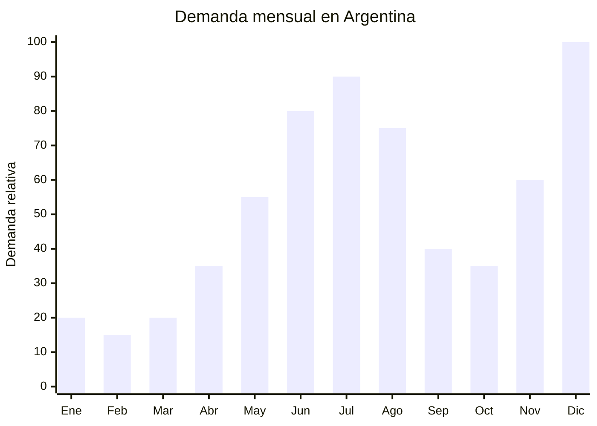

# Guirnaldas de luces LED decorativas (fairy lights)

> **Capítulo NCM 67** — Plumas y plumón preparados; flores artificiales; manufacturas de cabello | **Temporada:** Invierno (Jun–Ago)

<Note>
Las guirnaldas LED pueden clasificarse también en **Cap. 94** (aparatos de alumbrado) o **Cap. 85** (material eléctrico) según la composición y funcionalidad. La clasificación en Cap. 67 aplica cuando se comercializan como **elemento decorativo** (guirnalda ornamental con luces). Consultar con despachante de aduana el NCM exacto según el producto específico.
</Note>

## Qué es y por qué importarlo

Las guirnaldas de luces LED decorativas (fairy lights / string lights) son tiras de micro LEDs sobre cable de cobre o plástico transparente, alimentadas por pilas (AA, CR2032), USB o transformador de baja tensión (5V-12V). Son el elemento decorativo estrella de la estética **hygge** (confort escandinavo) que domina el invierno: días cortos + noches largas + necesidad de crear ambientes cálidos y acogedores en el hogar.

En Argentina, la demanda de fairy lights se dispara en invierno por tres factores: las noches más largas (oscurece a las 18:00), el tiempo que se pasa en interiores y la tendencia de decoración cálida en redes sociales. En MercadoLibre, "luces LED decorativas" y "guirnaldas LED" son búsquedas de altísimo volumen con precios entre ARS 3.000 y ARS 25.000. También tienen un segundo pico en diciembre (Navidad), lo que reduce el riesgo estacional.

Shenzhen y Yiwu son los principales centros de producción, con precios FOB desde USD 0.30 por unidad (guirnalda básica 2m a pilas) hasta USD 2.00 para versiones de 10m con control remoto y múltiples modos. El producto es **ultraliviano** (20-100g por unidad) y opera a **baja tensión** (5V-12V), lo que lo exime de regulaciones eléctricas complejas.

## Datos clave

| Dato | Valor |
|------|-------|
| **Posiciones NCM típicas** | 6702.90.00 (flores/follaje artificial — decorativo), 9405.40.90 (aparatos de alumbrado eléctrico), 8539.52.00 (diodos emisores de luz LED) |
| **Derecho de importación** | 14-20% (DIE según NCM) + 3% tasa estadística |
| **Rango FOB típico** | USD 0.30 — USD 2.00 por unidad |
| **Precio de venta en Argentina** | ARS 3.000 — ARS 25.000 |
| **Margen bruto estimado** | 300% — 800% |
| **MOQ típico** | 500 — 3,000 unidades |
| **Demanda en MercadoLibre** | Muy Alta (todo el año, pico invierno + Navidad) |
| **Competencia en MercadoLibre** | Alta |
| **Dificultad para importar** | Baja |
| **Certificaciones necesarias** | Ninguna especial para baja tensión (pilas/USB) |
| **Antidumping** | **No** |

## Variantes y subtipos más comunes

| Subtipo / Variante | FOB aprox. | Venta AR aprox. | Nota |
|--------------------|-----------|-----------------|------|
| Fairy lights 2m 20 LEDs a pilas (CR2032) | USD 0.30 — 0.50 | ARS 3.000 — 5.000 | **Más vendida** (impulso) |
| Fairy lights 5m 50 LEDs USB blanco cálido | USD 0.50 — 1.00 | ARS 5.000 — 10.000 | Versátil |
| Fairy lights 10m 100 LEDs control remoto | USD 1.00 — 2.00 | ARS 10.000 — 20.000 | Premium con modos |
| Guirnalda cortina LED 3x3m (curtain lights) | USD 1.50 — 3.00 | ARS 12.000 — 25.000 | Ventanas / cabecera cama |
| Fairy lights con clips para fotos | USD 0.80 — 1.50 | ARS 6.000 — 14.000 | Tendencia deco juvenil |
| Guirnalda LED exterior impermeable IP65 | USD 1.50 — 3.00 | ARS 10.000 — 22.000 | Balcones, patios |

## Regulaciones y requisitos

<Tabs>
  <Tab title="Certificaciones">
    | Requisito | Obligatorio | Detalle |
    |-----------|-------------|---------|
    | ENACOM | **No para baja tensión** | Guirnaldas a pilas o USB (5V) no requieren ENACOM. Solo aplica si incluyen módulo WiFi/Bluetooth o si usan transformador 220V directo |
    | Antidumping CNCE | **No aplica** | Sin antidumping vigente |
    | S-Mark | No obligatorio | Para productos de baja tensión (pilas/USB) no se requiere certificación eléctrica S-Mark |
    | IRAM | No obligatorio | Para baja tensión no aplica |
  </Tab>
  <Tab title="Etiquetado">
    País de origen, datos del importador, tipo de alimentación (pilas/USB/transformador), voltaje de operación, instrucciones básicas de uso. Si incluye pilas, indicar tipo y cantidad.
  </Tab>
  <Tab title="Restricciones">
    - **Sin regulación especial** para productos de baja tensión (pilas, USB 5V)
    - Si el producto incluye transformador 220V-12V, el transformador puede requerir certificación IRAM/S-Mark
    - Guirnaldas con WiFi/Bluetooth requieren homologación ENACOM
    - **Recomendación:** Importar versiones a pilas o USB para evitar cualquier trámite regulatorio
    - Barrera regulatoria: **MUY BAJA** (versiones pilas/USB)
  </Tab>
</Tabs>

## Logística de importación

| Dato | Valor |
|------|-------|
| **Peso típico por unidad** | 20 — 100 g |
| **Volumen típico** | Muy Bajo (producto ultra compacto) |
| **Fragilidad** | Baja (LEDs en cable flexible) |
| **Envío recomendado** | Marítimo LCL consolidado o **Aéreo** (viable por peso ultra bajo) |
| **Tiempo total estimado** | Marítimo: 45-70 días / Aéreo: 12-20 días |
| **Origen principal** | Shenzhen (electrónica) y Yiwu (decoración), China |

<Tip>
Las fairy lights son uno de los productos con **mejor ratio valor/peso** para importar. Un lote de 3,000 guirnaldas de 5m pesa solo ~150 kg y cabe en 2-3 cajas master carton. Por envío aéreo, el costo es ~USD 300-600 para un lote que se vende por ARS 15-30 millones. Ideal para un primer envío de prueba por aéreo con inversión mínima. Las pilas CR2032 se pueden comprar por separado en Argentina para evitar restricciones de envío de baterías.
</Tip>

## Estacionalidad y timing de compra



| Aspecto | Detalle |
|---------|---------|
| **Meses pico de venta** | Junio — Agosto (invierno hygge) + Diciembre (Navidad) |
| **Meses valle** | Febrero — Marzo |
| **Cuándo pedir a China** | Marzo (para invierno) y Septiembre (para Navidad) |
| **Tiempo de anticipación** | 45-70 días marítimo / 12-20 días aéreo |

<Note>
A diferencia de la mayoría de productos de invierno, las fairy lights tienen **doble temporada**: invierno (hygge) + Navidad (decoración navideña). Esto reduce significativamente el riesgo de stock sobrante. Un lote comprado para invierno que no se venda completamente se liquida fácilmente en noviembre-diciembre.
</Note>

## Ventajas y riesgos

<CardGroup cols={2}>
  <Card title="Ventajas" icon="circle-check">
    - **FOB ultra bajo** (desde USD 0.30)
    - Margen bruto 300-800%
    - Sin regulación para versiones pilas/USB
    - Ultraliviano — envío aéreo viable y económico
    - **Doble temporada** (invierno + Navidad)
    - Producto de impulso con alta rotación
    - Tendencia hygge/deco sostenida en redes sociales
    - Ideal para primer importación (bajo riesgo)
    - Múltiples variantes para diversificar publicaciones
    - Ocupa mínimo espacio de almacén
  </Card>
  <Card title="Riesgos" icon="triangle-exclamation">
    - Alta competencia en MercadoLibre (muchos vendedores)
    - Ticket bajo (requiere volumen para rentabilidad significativa)
    - Calidad LED variable (vida útil, color real vs. declarado)
    - Pilas no incluidas pueden generar reclamos
    - Producto genérico difícil de construir marca
    - Versiones con transformador 220V requieren más trámites
  </Card>
</CardGroup>

## Palabras clave para buscar en Alibaba

```
fairy lights wholesale, LED string lights copper wire,
fairy lights USB 5m, micro LED lights battery operated,
curtain lights LED wholesale, photo clip string lights,
fairy lights remote control, LED string lights waterproof IP65,
warm white fairy lights bulk, Yiwu LED decorative lights
```

## Fuentes

- [MercadoLibre Argentina — Guirnaldas LED](https://listado.mercadolibre.com.ar/guirnalda-led)
- [Alibaba — Fairy lights wholesale](https://www.alibaba.com/showroom/fairy-lights-wholesale.html)
- [Shenzhen LED manufacturers](https://www.alibaba.com/showroom/shenzhen-led-string-lights.html)
