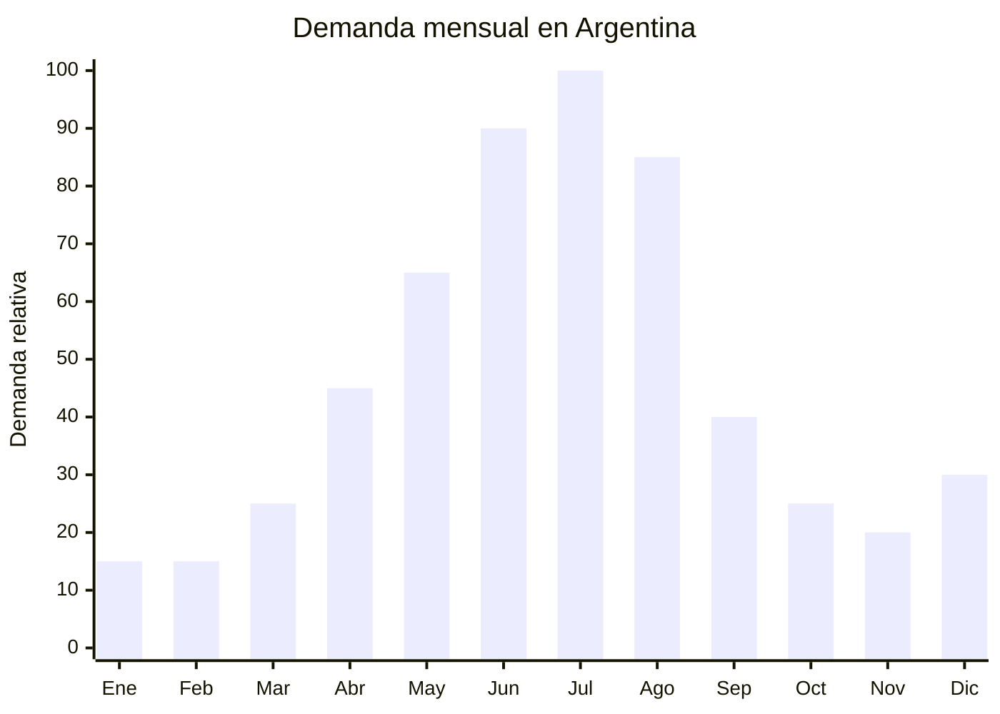

# Ollas y cazuelas de cerámica para cocina lenta (slow cooking)

> **Capítulo NCM 69** — Productos cerámicos | **Temporada:** Invierno (Jun–Ago)

## Qué es y por qué importarlo

Las ollas y cazuelas de cerámica para cocina lenta son recipientes de barro esmaltado o cerámica refractaria diseñados para cocinar a fuego bajo y prolongado. Incluyen cazuelas con tapa de 2 a 5 litros, tagines (forma cónica marroquí), cocottes cerámicas (imitación Le Creuset en cerámica) y soperas. Son ideales para los platos típicos del invierno argentino: guisos, locro, estofados, sopas, puchero y carbonada.

El pico de demanda es **junio-agosto**, cuando las bajas temperaturas impulsan la cocina de olla y fuego lento. En MercadoLibre Argentina, "cazuela cerámica" y "olla barro" tienen demanda activa con precios entre ARS 15.000 y ARS 60.000. Las marcas de referencia (Tramontina, Le Creuset, Bialetti) manejan precios muy altos para las versiones premium, dejando espacio amplio para cerámica importada de China con buena relación calidad-precio.

Chaozhou (Guangdong) y Dehua (Fujian) son los principales polos productores de cerámica de China, con fábricas que producen cazuelas refractarias desde FOB USD 3.00 por unidad. La cerámica tiene la ventaja adicional de ser un producto con **percepción de valor alto** (se ve y se siente premium) a un costo de producción bajo.

## Datos clave

| Dato | Valor |
|------|-------|
| **Posiciones NCM típicas** | 6911.10.00 (artículos de cerámica para mesa y cocina de porcelana), 6912.00.00 (de las demás cerámicas) |
| **Derecho de importación** | 18% (DIE) + 3% tasa estadística |
| **Rango FOB típico** | USD 3.00 — USD 10.00 por unidad |
| **Precio de venta en Argentina** | ARS 15.000 — ARS 60.000 |
| **Margen bruto estimado** | 150% — 300% |
| **MOQ típico** | 200 — 500 unidades |
| **Demanda en MercadoLibre** | Media-Alta (pico invierno) |
| **Competencia en MercadoLibre** | Media |
| **Dificultad para importar** | Moderada (fragilidad en transporte) |
| **Certificaciones necesarias** | Apto contacto alimentos (migración de metales pesados) |
| **Antidumping** | **No** |

## Variantes y subtipos más comunes

| Subtipo / Variante | FOB aprox. | Venta AR aprox. | Nota |
|--------------------|-----------|-----------------|------|
| Cazuela cerámica con tapa 2L | USD 3.00 — 5.00 | ARS 15.000 — 30.000 | Individual / pareja |
| Cazuela cerámica con tapa 3.5L | USD 4.00 — 7.00 | ARS 25.000 — 40.000 | **Más vendida** (familiar) |
| Cazuela cerámica con tapa 5L | USD 6.00 — 10.00 | ARS 35.000 — 60.000 | Gran formato |
| Tagine cerámica (cónico marroquí) | USD 4.00 — 8.00 | ARS 20.000 — 45.000 | Nicho gourmet |
| Cocotte cerámica estilo Le Creuset | USD 5.00 — 10.00 | ARS 30.000 — 55.000 | Premium imitación |
| Set 3 cazuelas (1.5L + 2.5L + 3.5L) | USD 8.00 — 16.00 | ARS 40.000 — 80.000 | Set regalo |
| Sopera cerámica con tapa y cucharón | USD 4.00 — 7.00 | ARS 20.000 — 40.000 | Sopas invierno |

## Regulaciones y requisitos

<Tabs>
  <Tab title="Certificaciones">
    | Requisito | Obligatorio | Detalle |
    |-----------|-------------|---------|
    | Apto contacto alimentos | **Sí** | Debe cumplir normativa de migración de plomo y cadmio (Res. GMC Nro. 02/2001 MERCOSUR o equivalente) |
    | Antidumping CNCE | **No aplica** | Sin antidumping para cerámica Cap. 69 |
    | ANMAT / INAL | Consultar | Artículos en contacto con alimentos pueden requerir registro según disposiciones vigentes |

    **Recomendación:** Solicitar al proveedor chino certificado de **FDA approved** o **test de migración de metales pesados** (plomo < 0.5 ppm, cadmio < 0.25 ppm) según norma europea EN 1388 o equivalente. Este certificado facilita cualquier trámite regulatorio en Argentina.
  </Tab>
  <Tab title="Etiquetado">
    País de origen, datos del importador, material ("Cerámica refractaria esmaltada"), capacidad en litros, instrucciones de uso (apto/no apto para: horno, microondas, lavavajillas, fuego directo según el producto), precauciones ("No exponer a cambios bruscos de temperatura").
  </Tab>
  <Tab title="Restricciones">
    - **Sin antidumping** en cerámica Cap. 69
    - El esmalte debe ser libre de plomo en niveles peligrosos — este es el principal requisito regulatorio
    - Si la cazuela se declara "apta fuego directo", debe ser efectivamente refractaria (verificar con proveedor)
    - Cambios bruscos de temperatura pueden rajar la cerámica — incluir instrucciones claras
    - Barrera regulatoria: **BAJA-MODERADA** (migración metales)
  </Tab>
</Tabs>

## Logística de importación

| Dato | Valor |
|------|-------|
| **Peso típico por unidad** | 1.00 — 3.50 kg (con tapa) |
| **Volumen típico** | Medio-Alto |
| **Fragilidad** | **ALTA** — producto cerámico, riesgo de rotura en transporte |
| **Envío recomendado** | Marítimo LCL o FCL con embalaje reforzado |
| **Tiempo total estimado** | 55 — 85 días (producción + marítimo) |
| **Origen principal** | Chaozhou (Guangdong), Dehua (Fujian), China |

<Tip>
La cerámica es **extremadamente frágil** en transporte marítimo. Exigir al proveedor: caja individual con espuma protectora (foam insert) para cada pieza + separadores de cartón corrugado entre cajas + pallet stretch film. Solicitar fotos del embalaje ANTES del envío. Presupuestar un **3-5% de rotura** como costo inevitable y negociar con el proveedor una política de reposición por rotura. Contratar seguro marítimo que cubra rotura es **obligatorio** para cerámica.
</Tip>

## Estacionalidad y timing de compra



| Aspecto | Detalle |
|---------|---------|
| **Meses pico de venta** | Junio — Agosto (invierno, cocina lenta, guisos) |
| **Meses valle** | Noviembre — Febrero (verano) |
| **Cuándo pedir a China** | Febrero — Marzo para tener stock en mayo-junio |
| **Tiempo de anticipación** | 65-85 días (producción cerámica 20-30 días + envío marítimo) |

<Note>
Las cazuelas de cerámica tienen demanda secundaria como **regalo** para Día de la Madre (octubre) y Navidad (diciembre), especialmente los sets y tagines. Esto extiende la ventana de venta más allá del invierno puro.
</Note>

## Ventajas y riesgos

<CardGroup cols={2}>
  <Card title="Ventajas" icon="circle-check">
    - Sin antidumping en cerámica Cap. 69
    - Alta percepción de valor (producto premium)
    - Margen bruto 150-300%
    - Tendencia cocina casera / slow cooking en auge
    - Tagine y cocotte son nicho gourmet con margen superior
    - Venta como set regalo (mayor ticket)
    - Demanda secundaria como regalo (Día Madre, Navidad)
    - Chaozhou/Dehua: polos productores con precios competitivos
  </Card>
  <Card title="Riesgos" icon="triangle-exclamation">
    - **Alta fragilidad** — rotura en transporte (3-5% mínimo)
    - Producto pesado (impacta flete marítimo)
    - Requiere seguro marítimo obligatoriamente
    - Embalaje especial aumenta costo logístico
    - Migración de metales pesados (riesgo regulatorio)
    - Estacionalidad concentrada en invierno
    - Competencia con cerámica artesanal local
    - Si se raja por uso incorrecto, genera reclamos
  </Card>
</CardGroup>

## Palabras clave para buscar en Alibaba

```
ceramic casserole wholesale, clay pot cooking wholesale,
tagine pot ceramic, ceramic cocotte casserole with lid,
stoneware casserole dish bulk, Chaozhou ceramic cookware,
ceramic soup tureen wholesale, heat resistant ceramic pot,
casserole dish set wholesale, slow cooking ceramic pot
```

## Fuentes

- [MercadoLibre Argentina — Cazuelas cerámica](https://listado.mercadolibre.com.ar/cazuela-ceramica)
- [Alibaba — Ceramic casserole wholesale](https://www.alibaba.com/showroom/ceramic-casserole-wholesale.html)
- [CNCE — Medidas antidumping vigentes](https://www.argentina.gob.ar/cnce/investigaciones/medidasvigentes)
- [ANMAT — Materiales en contacto con alimentos](https://www.argentina.gob.ar/anmat)
