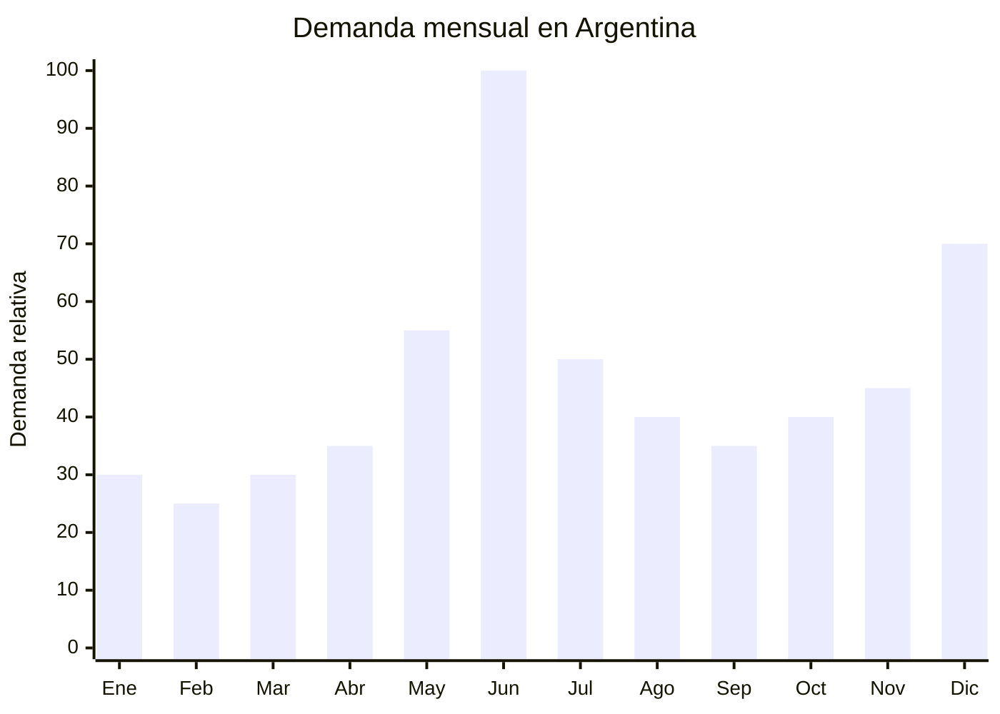

# Bijouterie masculina para regalo (Día del Padre)

> **Capítulo NCM 71** — Perlas, piedras preciosas, metales preciosos y manufacturas; bisutería | **Temporada:** Invierno (Jun–Ago)

## Qué es y por qué importarlo

La bijouterie masculina para regalo incluye pulseras de cuero con cierre de acero inoxidable, cadenas y colgantes de acero quirúrgico 316L, gemelos (cufflinks), anillos de acero, clips de corbata y sets combinados presentados en estuche de regalo. El driver principal de demanda en invierno argentino es el **Día del Padre** (tercer domingo de junio), que genera un pico masivo de ventas de accesorios masculinos durante las primeras tres semanas de junio.

En MercadoLibre Argentina, "pulsera hombre" y "cadena acero quirúrgico hombre" son búsquedas de alto volumen todo el año, con un salto significativo en junio. Los precios oscilan entre ARS 5.000 y ARS 40.000 según material y presentación. La clave comercial es la **presentación en estuche regalo**, que convierte un accesorio de ARS 5.000 en un regalo de ARS 12.000-15.000.

Yiwu (Zhejiang, China) es el epicentro mundial de bijouterie y accesorios de moda, con miles de fábricas y showrooms especializados. Los precios FOB arrancan en USD 0.50 por pulsera básica y llegan a USD 5.00 para sets premium en estuche de cuero sintético. El acero inoxidable 316L (acero quirúrgico) es el material estrella: no genera alergias, no se oxida y tiene aspecto premium.

## Datos clave

| Dato | Valor |
|------|-------|
| **Posiciones NCM típicas** | 7117.19.00 (bisutería de metales comunes), 7117.90.00 (las demás bisuterías) |
| **Derecho de importación** | 18% (DIE) + 3% tasa estadística |
| **Rango FOB típico** | USD 0.50 — USD 5.00 por unidad/set |
| **Precio de venta en Argentina** | ARS 5.000 — ARS 40.000 |
| **Margen bruto estimado** | 300% — 700% |
| **MOQ típico** | 100 — 500 unidades por modelo |
| **Demanda en MercadoLibre** | Alta (pico junio — Día del Padre) |
| **Competencia en MercadoLibre** | Alta (muchos vendedores) / Media (con presentación premium) |
| **Dificultad para importar** | Muy Baja |
| **Certificaciones necesarias** | Ninguna específica |
| **Antidumping** | **No** |

## Variantes y subtipos más comunes

| Subtipo / Variante | FOB aprox. | Venta AR aprox. | Nota |
|--------------------|-----------|-----------------|------|
| Pulsera cuero trenzado cierre acero inoxidable | USD 0.50 — 1.50 | ARS 5.000 — 12.000 | **Más vendida** |
| Cadena acero quirúrgico 316L 60cm | USD 1.00 — 3.00 | ARS 8.000 — 20.000 | Clásica masculina |
| Pulsera acero inoxidable eslabones | USD 0.80 — 2.50 | ARS 6.000 — 18.000 | Estilo robusto |
| Set pulsera + collar acero + estuche regalo | USD 2.00 — 5.00 | ARS 15.000 — 35.000 | **Ideal Día del Padre** |
| Gemelos acero (cufflinks) en caja | USD 1.00 — 3.00 | ARS 8.000 — 22.000 | Nicho formal |
| Clip de corbata acero + caja | USD 0.80 — 2.00 | ARS 6.000 — 15.000 | Complemento formal |
| Anillo acero quirúrgico con diseño | USD 0.50 — 2.00 | ARS 5.000 — 15.000 | Variedad de diseños |
| Pack x3 pulseras hombre surtidas | USD 1.50 — 3.00 | ARS 10.000 — 22.000 | Venta por pack |

## Regulaciones y requisitos

<Tabs>
  <Tab title="Certificaciones">
    | Requisito | Obligatorio | Detalle |
    |-----------|-------------|---------|
    | Certificación | **No** | Bijouterie no requiere certificación especial |
    | Antidumping CNCE | **No aplica** | Sin antidumping para bisutería Cap. 71 |
    | Declaración de material | Recomendado | Indicar "Acero inoxidable 316L" / "Cuero genuino" en la publicación |
    | Contenido de níquel | Recomendado verificar | La UE regula el níquel en bisutería (EN 1811). Argentina no tiene regulación específica, pero es buena práctica solicitar test al proveedor |
  </Tab>
  <Tab title="Etiquetado">
    Material principal (ej: "Acero Inoxidable 316L", "Cuero genuino con cierre de acero"), país de origen, datos del importador. Etiqueta en hang tag o sticker en estuche.

    **Importante:** Si se declara "acero quirúrgico" o "cuero genuino", el material debe ser efectivamente eso. Declarar cuero cuando es PU sintético puede generar reclamos y problemas legales por publicidad engañosa.
  </Tab>
  <Tab title="Restricciones">
    - **Sin antidumping** — importación completamente libre
    - **Sin regulación específica** para bijouterie en Argentina
    - Verificar que los cierres de pulsera funcionen correctamente (principal causa de reclamos)
    - Evitar materiales que generen alergia (níquel libre)
    - Barrera regulatoria: **NULA**
  </Tab>
</Tabs>

## Logística de importación

| Dato | Valor |
|------|-------|
| **Peso típico por unidad** | 30 — 150 g (con estuche) |
| **Volumen típico** | Muy Bajo (producto compacto) |
| **Fragilidad** | Baja (acero inoxidable resistente) |
| **Envío recomendado** | Marítimo LCL consolidado o **Aéreo** (viable por peso ultra bajo) |
| **Tiempo total estimado** | Marítimo: 45-70 días / Aéreo: 12-20 días |
| **Origen principal** | Yiwu (Zhejiang), China |

<Tip>
La **presentación en estuche regalo** es el diferenciador que multiplica el precio de venta. En Yiwu, los estuches de cuero sintético con interior de terciopelo cuestan USD 0.30-0.80 adicionales. Un set pulsera + cadena con estuche premium se vende a 3x el precio de las mismas piezas sueltas. Para Día del Padre, incluir tarjeta "Para Papá" impresa cuesta USD 0.02 y aumenta la conversión significativamente. Pedir todo al mismo proveedor en Yiwu.
</Tip>

## Estacionalidad y timing de compra



| Aspecto | Detalle |
|---------|---------|
| **Meses pico de venta** | Junio (Día del Padre) + Diciembre (Navidad/regalos) |
| **Meses valle** | Febrero — Marzo |
| **Cuándo pedir a China** | Febrero — Marzo para tener stock listo en mayo (antes Día del Padre) |
| **Tiempo de anticipación** | 50-70 días marítimo / 15-20 días aéreo |

<Note>
La bijouterie masculina tiene **demanda durante todo el año** (no es solo Día del Padre), con picos adicionales en **Navidad** (diciembre), **cumpleaños** (todo el año) y **San Valentín** (febrero en algunos países, no tan fuerte en Argentina). Esto la convierte en un producto con estacionalidad atenuada y bajo riesgo de stock muerto.
</Note>

## Ventajas y riesgos

<CardGroup cols={2}>
  <Card title="Ventajas" icon="circle-check">
    - **FOB ultra bajo** (desde USD 0.50)
    - Margen bruto 300-700%
    - Sin regulación ni antidumping — barrera nula
    - Ultraliviano — envío aéreo viable
    - Estuche regalo multiplica el precio x3
    - Demanda todo el año (pico Día del Padre + Navidad)
    - Yiwu: epicentro mundial con infinitas opciones
    - Acero quirúrgico 316L = hipoalergénico (argumento venta)
    - MOQ bajo (100-500 unidades) — baja inversión inicial
    - Ocupa mínimo espacio de almacén
  </Card>
  <Card title="Riesgos" icon="triangle-exclamation">
    - Alta competencia en MercadoLibre (muchos vendedores)
    - Cierres de pulsera defectuosos = principal reclamo
    - Calidad variable (acero real vs. aleación barata)
    - Difícil construir marca (producto genérico)
    - Si se declara "cuero genuino" y es PU, riesgo legal
    - Fotos de producto deben ser profesionales (muchos vendedores)
    - Tendencias cambian rápido (diseños de moda)
  </Card>
</CardGroup>

## Palabras clave para buscar en Alibaba

```
men bracelet wholesale stainless steel, leather bracelet men bulk,
316L stainless steel necklace men, cufflinks wholesale box,
men jewelry set gift box, Yiwu men accessories wholesale,
stainless steel ring men wholesale, tie clip wholesale,
men bracelet leather steel clasp, bijoux homme acier wholesale
```

## Fuentes

- [MercadoLibre Argentina — Pulseras hombre](https://listado.mercadolibre.com.ar/pulsera-hombre)
- [MercadoLibre Argentina — Cadenas acero quirúrgico](https://listado.mercadolibre.com.ar/cadena-acero-quirurgico-hombre)
- [Alibaba — Men bracelet wholesale](https://www.alibaba.com/showroom/men-bracelet-wholesale.html)
- [Yiwu International Trade Market](https://www.yiwugou.com)
