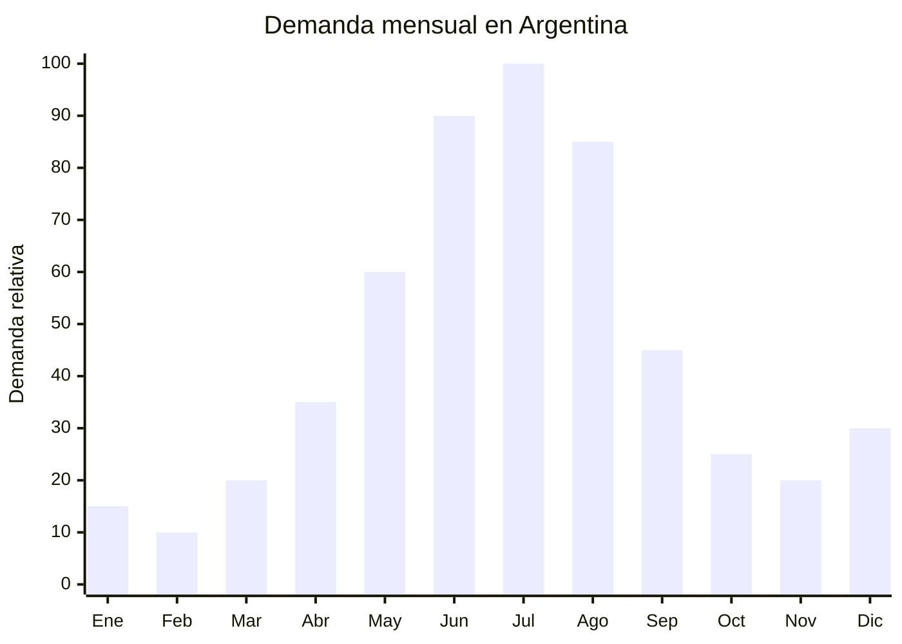

# Ollas de hierro fundido (dutch oven / cocotte)

> **Capítulo NCM 73** — Manufacturas de fundición, de hierro o de acero | **Temporada:** Invierno (Jun–Ago)

## Qué es y por qué importarlo

Las ollas de hierro fundido, conocidas internacionalmente como dutch oven o cocotte, son recipientes de cocción pesados fabricados en fundición de hierro gris, generalmente recubiertos con esmalte vitrificado interior y exterior. Su característica principal es la distribución uniforme del calor y la retención térmica excepcional: una vez caliente, mantiene la temperatura durante largo tiempo con fuego mínimo, lo que las hace ideales para cocciones lentas como guisos, estofados, pucheros, locro, pan artesanal y braseados.

El invierno argentino (junio-agosto) dispara la demanda de este tipo de producto porque coincide con la temporada de comfort food: guisos de lentejas, estofados de carne, puchero criollo, locro (especialmente en julio por las Fiestas Patrias), sopas y la creciente tendencia del pan casero artesanal. La referencia aspiracional es Le Creuset, marca francesa cuyos modelos se venden en Argentina por encima de los USD 300-500. Esto genera un enorme espacio para marcas alternativas importadas de China con calidad similar a una fracción del precio.

Hebei (especialmente la ciudad de Pingxiang) es el principal polo productor mundial de hierro fundido esmaltado. Las fábricas de Hebei producen para marcas europeas y americanas (OEM) y también ofrecen producción con marca propia o marca blanca. Las medidas más demandadas son 24 cm (3.5-4L, ideal para 2-4 personas) y 28 cm (5-6L, ideal para familias). El FOB oscila entre USD 8 y USD 25 dependiendo del tamaño, grosor del esmalte y cantidad de capas de esmaltado.

## Datos clave

| Dato | Valor |
|------|-------|
| **Posiciones NCM típicas** | 7323.91.00 (artículos de uso doméstico, de fundición, esmaltados) |
| **Derecho de importación** | 18% (DIE) + 3% tasa estadística |
| **Rango FOB típico** | USD 8.00 — USD 25.00 por unidad |
| **Precio de venta en Argentina** | ARS 30.000 — ARS 120.000 |
| **Margen bruto estimado** | 150% — 400% |
| **MOQ típico** | 200 — 500 unidades |
| **Demanda en MercadoLibre** | Alta (con pico fuerte junio-agosto) |
| **Competencia en MercadoLibre** | Media (pocas marcas importadas vs. Le Creuset) |
| **Dificultad para importar** | Baja (sin certificaciones obligatorias) |
| **Certificaciones necesarias** | Ninguna obligatoria (recomendable certificado food grade / libre de plomo y cadmio) |
| **Antidumping** | No |

## Variantes y subtipos más comunes

| Subtipo / Variante | FOB aprox. | Venta AR aprox. | Nota |
|--------------------|-----------|-----------------|------|
| Cocotte redonda 24 cm esmaltada (3.5L) | USD 8.00 — 14.00 | ARS 30.000 — 55.000 | **Más vendida**, ideal pareja/familia chica |
| Cocotte redonda 26 cm esmaltada (4.5L) | USD 10.00 — 17.00 | ARS 40.000 — 70.000 | Tamaño intermedio versátil |
| Cocotte redonda 28 cm esmaltada (5.5L) | USD 14.00 — 22.00 | ARS 55.000 — 95.000 | Familiar, locro, puchero |
| Cocotte ovalada 30-33 cm (6-7L) | USD 16.00 — 25.00 | ARS 65.000 — 120.000 | Para piezas grandes de carne |
| Cocotte sin esmalte (pre-curada) | USD 6.00 — 12.00 | ARS 20.000 — 45.000 | Nicho campestre/parrillero |
| Sartén de hierro fundido esmaltado 26 cm | USD 5.00 — 10.00 | ARS 15.000 — 35.000 | Complemento, cross-sell |

## Regulaciones y requisitos

<Tabs>
  <Tab title="Certificaciones">
    | Organismo | Requiere | Detalle |
    |-----------|----------|---------|
    | ARCA (Aduana) | Sí siempre | Despacho estándar |
    | ANMAT | No obligatorio | No es envase de alimento procesado. Sin embargo, al ser un utensilio de cocina con esmalte, se recomienda certificado de conformidad con FDA 21 CFR 109.15 (plomo y cadmio en cerámica/esmalte) |
    | ENACOM | No | No es electrónico |
    | SENASA | No | No es alimento |
    | INTI | No obligatorio | No existe norma IRAM específica para ollas de hierro fundido |

    **Recomendación:** Solicitar al proveedor chino: test de migración de plomo y cadmio del esmalte (norma FDA o EU 84/500/EEC), certificado SGS de calidad del esmalte (resistencia a impacto térmico, adherencia), y ficha técnica del hierro fundido (composición). Estos documentos generan confianza en la publicación de venta y protegen ante reclamos.
  </Tab>

  <Tab title="Etiquetado">
    | Requisito | Aplica |
    |-----------|--------|
    | País de origen | Sí |
    | Datos del importador | Sí (nombre, dirección, CUIT) |
    | Material | Recomendable indicar "Hierro fundido con esmalte vitrificado" |
    | Capacidad en litros | Recomendable |
    | Instrucciones de uso y cuidado | Recomendable (curado, lavado, almacenamiento) |
    | Apto horno/inducción | Recomendable indicar compatibilidad |
  </Tab>

  <Tab title="Restricciones">
    - Sin medidas antidumping vigentes para esta categoría.
    - Sin restricciones específicas de importación.
    - El esmalte debe ser libre de plomo y cadmio — verificar con test de laboratorio.
    - El producto debe ser compatible con todas las fuentes de calor: gas, eléctrica, vitrocerámica, inducción y horno.
    - Verificar que la tapa cierre correctamente y no tenga defectos de esmaltado (burbujas, descascaramiento).
  </Tab>
</Tabs>

## Logística de importación

| Factor | Detalle |
|--------|---------|
| **Peso por unidad** | 3.5 — 7.5 kg (según tamaño, hierro fundido es pesado) |
| **Volumen por unidad** | Alto — caja individual de 30x30x20 cm aprox. |
| **Unidades por caja (master carton)** | 1 — 4 unidades |
| **Peso por caja** | 5 — 20 kg |
| **Cajas por contenedor 20'** | ~800 — 1,500 cajas |
| **Unidades por contenedor 20'** | ~2,000 — 4,000 unidades |
| **Fragilidad** | Media (el esmalte puede astillarse con golpes fuertes) |
| **Requiere embalaje especial** | Sí — protección reforzada con espuma o cartón corrugado grueso entre unidades. El esmalte se astilla con impactos |

<Tip>
El hierro fundido es uno de los productos más pesados por unidad en importación. Un contenedor de 20' alcanza el límite de peso (26-28 toneladas) mucho antes del límite de volumen. Esto significa que el costo de flete marítimo por unidad es alto comparado con productos livianos. Para optimizar: combinar con productos livianos y voluminosos en el mismo contenedor, o considerar envío aéreo para lotes pequeños de modelos premium donde el margen lo justifique.
</Tip>

## Estacionalidad y timing de compra

| Dato | Valor |
|------|-------|
| **Meses de mayor venta** | Junio — Agosto (invierno pleno, Fiestas Patrias julio) |
| **Pedido ideal (marítimo)** | Febrero — Marzo (para llegar en mayo-junio) |
| **Pedido ideal (aéreo)** | Abril — Mayo (llega en 15-20 días) |
| **Anticipación mínima** | 3 meses antes del pico |

<Note>
Julio tiene un pico extra por las Fiestas Patrias (9 de julio), cuando el locro y los guisos son protagonistas gastronómicos nacionales. Una cocotte de hierro fundido es el utensilio ideal para locro, generando contenido de marketing estacional muy efectivo.
</Note>

## Ventajas y riesgos

<CardGroup cols={2}>
  <Card title="Ventajas" icon="circle-check">
    - Margen bruto 150-400% (referencia Le Creuset a fracción de precio)
    - Sin certificaciones obligatorias (barrera baja)
    - Producto aspiracional con demanda creciente (tendencia cocina gourmet)
    - Durabilidad extrema: dura décadas (genera boca a boca positivo)
    - Ideal para marca propia premium
    - Pico de demanda alineado con Fiestas Patrias (julio)
    - Cross-sell con sartenes, asaderas y accesorios de hierro fundido
  </Card>

  <Card title="Riesgos y desventajas" icon="triangle-exclamation">
    - **Producto muy pesado:** flete marítimo alto por unidad
    - Esmalte frágil: se astilla con golpes en transporte o manejo
    - Control de calidad crítico: defectos de esmalte = devoluciones
    - Competencia con Le Creuset y marcas establecidas (percepción de calidad)
    - Requiere educación del consumidor sobre uso y cuidado
    - Stock sobrante de invierno pierde rotación en verano
  </Card>
</CardGroup>

## Palabras clave para buscar en Alibaba

`cast iron dutch oven enamel wholesale` · `enamel cast iron casserole cocotte` · `cast iron pot enamel coated Hebei` · `dutch oven cast iron 24cm 26cm 28cm` · `cast iron cookware enamel OEM` · `cocotte cast iron manufacturer China`

## Fuentes

- MercadoLibre Argentina — búsqueda "olla hierro fundido esmaltada", "cocotte hierro fundido"
- Alibaba.com — proveedores de enamel cast iron dutch oven Hebei
- Nomenclador Arancelario Argentino — partida 7323.91.00
- FDA 21 CFR 109.15 — Límites de plomo y cadmio en cerámica y esmalte
