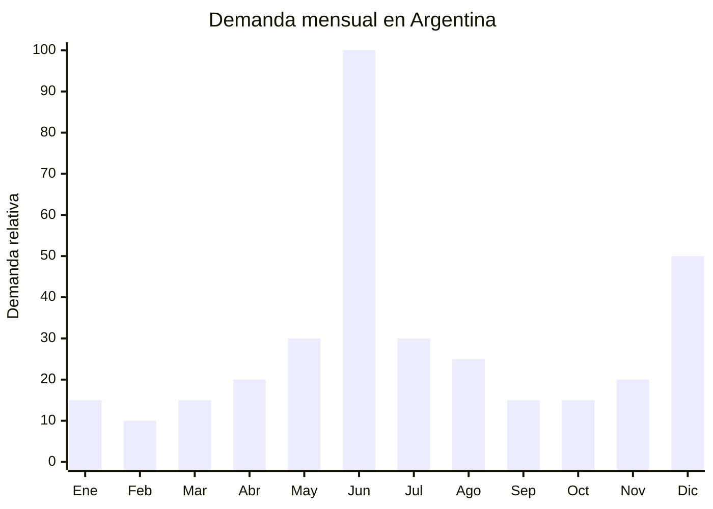

# Sets de herramientas en maletín para regalo

> **Capítulo NCM 82** — Herramientas y útiles, artículos de cuchillería y cubiertos de mesa, de metales comunes | **Temporada:** Invierno (Jun–Ago)

## Qué es y por qué importarlo

Los sets de herramientas en maletín son kits completos que incluyen una combinación de herramientas manuales y/o eléctricas organizadas en un maletín plástico o aluminio con compartimentos moldeados. La configuración típica incluye taladro inalámbrico (12V o 20V) con batería y cargador, juego de brocas para metal/madera/concreto, set de destornilladores o puntas Phillips/Torx/planas, llave inglesa ajustable, alicate, cinta métrica, nivel y cutter. Las marcas de referencia en Argentina son Einhell, Bosch y Black+Decker.

El pico de demanda se concentra en junio, específicamente la tercera semana, por el Día del Padre (tercer domingo de junio en Argentina). Los sets de herramientas son uno de los regalos más buscados para esta fecha, junto con tecnología y ropa. En MercadoLibre, las búsquedas de "set herramientas regalo" y "maletín herramientas" se multiplican por 3-4x en la primera quincena de junio. El maletín organizado genera percepción de regalo completo y profesional, justificando un ticket superior al de las herramientas sueltas.

China (especialmente Yongkang en Zhejiang para herramientas manuales y Dongguan en Guangdong para taladros inalámbricos) es el principal proveedor mundial. Las fábricas ofrecen kits prearmados con configuraciones estándar o personalizadas, con impresión de marca propia en el maletín y las herramientas.

## Datos clave

| Dato | Valor |
|------|-------|
| **Posiciones NCM típicas** | 8205.90.00 (herramientas de mano, surtidos) / 8467.21.00 (taladros eléctricos portátiles) |
| **Derecho de importación** | 14-18% (DIE según composición) + 3% tasa estadística |
| **Rango FOB típico** | USD 15.00 — USD 40.00 por set |
| **Precio de venta en Argentina** | ARS 35.000 — ARS 120.000 |
| **Margen bruto estimado** | 100% — 250% |
| **MOQ típico** | 200 — 500 sets |
| **Demanda en MercadoLibre** | Alta (pico Día del Padre) |
| **Competencia en MercadoLibre** | Media-Alta |
| **Dificultad para importar** | Baja-Media (ENACOM solo si incluye medidor láser BT) |
| **Certificaciones necesarias** | ENACOM si incluye componente Bluetooth/WiFi. IRAM si incluye taladro eléctrico con cargador 220V |
| **Antidumping** | No |

## Variantes y subtipos más comunes

| Subtipo / Variante | FOB aprox. | Venta AR aprox. | Nota |
|--------------------|-----------|-----------------|------|
| Set herramientas manuales 50-80 piezas | USD 8.00 — 15.00 | ARS 20.000 — 45.000 | Sin eléctricos, entrada |
| Set taladro inalámbrico 12V + herramientas (80-100 pcs) | USD 15.00 — 25.00 | ARS 35.000 — 70.000 | **Más vendido para regalo** |
| Set taladro inalámbrico 20V + 2 baterías + accesorios | USD 25.00 — 35.00 | ARS 60.000 — 95.000 | Nivel intermedio |
| Set profesional con rotomartillo + amoladora + maletín | USD 30.00 — 40.00 | ARS 80.000 — 120.000 | Premium, mayor ticket |
| Set herramientas manuales compacto (30 pcs) | USD 5.00 — 10.00 | ARS 12.000 — 28.000 | Regalo económico, kit auto |
| Set destornilladores de precisión (25-40 pcs) | USD 3.00 — 8.00 | ARS 8.000 — 22.000 | Nicho electrónica/celulares |

## Regulaciones y requisitos

<Tabs>
  <Tab title="Certificaciones">
    | Organismo | Requiere | Detalle |
    |-----------|----------|---------|
    | ARCA (Aduana) | Sí siempre | Despacho estándar |
    | ENACOM | **Solo si incluye Bluetooth/WiFi** | Si el set incluye medidor láser con Bluetooth u otro componente inalámbrico, requiere homologación ENACOM |
    | IRAM / S-Mark | **Solo si incluye herramienta eléctrica con cargador 220V** | El cargador de batería requiere cumplir normativa de seguridad eléctrica. Res. 16/2025 acepta certificado IEC del fabricante |
    | ANMAT | No | No es producto de salud |
    | SENASA | No | No es alimento |

    **Recomendación:** Para evitar la barrera de ENACOM, elegir sets que NO incluyan componentes Bluetooth o WiFi (medidores láser con BT, por ejemplo). Los taladros inalámbricos con batería propia (12V/20V DC) y cargador dedicado generalmente solo requieren la certificación del cargador, no ENACOM. Verificar con despachante antes de comprar.
  </Tab>

  <Tab title="Etiquetado">
    | Requisito | Aplica |
    |-----------|--------|
    | País de origen | Sí |
    | Datos del importador | Sí (nombre, dirección, CUIT) |
    | Contenido del set | Recomendable (lista de piezas incluidas) |
    | Voltaje del cargador | Sí si incluye eléctrico (220V 50Hz) |
    | Voltaje de batería | Sí (12V, 20V) |
    | Instrucciones de uso | Sí — en español |
    | Precauciones de seguridad | Sí para herramientas eléctricas |
  </Tab>

  <Tab title="Restricciones">
    - **Batería de litio:** Los taladros con batería de litio tienen restricciones de transporte aéreo (IATA). Envío marítimo no tiene restricción. Para aéreo, solicitar MSDS de la batería al proveedor.
    - **Cargador 220V:** Verificar que el cargador sea compatible con 220V 50Hz argentino. Muchos cargadores chinos son multivoltaje (100-240V), pero confirmar antes de embarcar.
    - **Calidad de brocas:** Las brocas de baja calidad se quiebran al primer uso y generan devoluciones. Solicitar brocas HSS (High Speed Steel) como mínimo.
    - Sin antidumping vigente.
  </Tab>
</Tabs>

## Logística de importación

| Factor | Detalle |
|--------|---------|
| **Peso por unidad** | 2.5 — 6.0 kg (con maletín completo) |
| **Volumen por unidad** | Medio — maletín de 40x30x15 cm aprox. |
| **Unidades por caja (master carton)** | 2 — 6 maletines |
| **Peso por caja** | 8 — 25 kg |
| **Cajas por contenedor 20'** | ~800 — 1,500 cajas |
| **Unidades por contenedor 20'** | ~3,000 — 6,000 sets |
| **Fragilidad** | Baja (maletín rígido protege el contenido) |
| **Requiere embalaje especial** | No — el maletín es su propio empaque. Verificar que las piezas no se suelten dentro |

<Tip>
El Día del Padre es una fecha inamovible: el pedido marítimo debe salir de China en marzo-abril para llegar a Argentina en mayo, con tiempo de despacho y distribución antes de la tercera semana de junio. Si se pierde esta ventana, el envío aéreo es la única opción pero el costo se duplica. Planificar con 3-4 meses de anticipación es clave para este producto.
</Tip>

## Estacionalidad y timing de compra

| Dato | Valor |
|------|-------|
| **Meses de mayor venta** | Junio (Día del Padre, tercer domingo) |
| **Segundo pico** | Diciembre (Navidad/regalos) |
| **Pedido ideal (marítimo)** | Marzo — Abril (para llegar en mayo-junio) |
| **Pedido ideal (aéreo)** | Mayo (para llegar primera semana de junio) |
| **Anticipación mínima** | 3-4 meses antes de junio |

<Note>
El Día del Padre concentra más del 40% de la venta anual de sets de herramientas en una sola semana. Fuera de esta fecha, la demanda es estable pero baja. Considerar diversificar el stock remanente hacia otros canales: ferreterías, comercios de barrio, venta B2B corporativa (kits para empresas de mantenimiento).
</Note>

## Ventajas y riesgos

<CardGroup cols={2}>
  <Card title="Ventajas" icon="circle-check">
    - Demanda explosiva y predecible (Día del Padre junio)
    - Ticket alto para regalo (ARS 35,000-120,000)
    - Presentación en maletín = percepción de regalo premium
    - Sin certificaciones obligatorias en sets solo manuales
    - Marca propia fácil (impresión en maletín y herramientas)
    - Complementa con accesorios y repuestos (brocas, puntas)
    - Segundo pico en Navidad
  </Card>

  <Card title="Riesgos y desventajas" icon="triangle-exclamation">
    - Concentración extrema de demanda en 1-2 semanas de junio
    - Stock sobrante queda hasta Navidad o próximo Día del Padre
    - Calidad variable en herramientas chinas económicas
    - Brocas de baja calidad generan mala reputación
    - Competencia con marcas reconocidas (Einhell, Bosch, B+D)
    - ENACOM requerido si se incluyen componentes Bluetooth
    - Batería de litio complica envío aéreo
  </Card>
</CardGroup>

## Palabras clave para buscar en Alibaba

`tool set box wholesale 80pcs` · `cordless drill tool kit 12V 20V` · `hand tool set briefcase gift` · `power tool set rechargeable drill` · `tool kit combo set OEM Yongkang` · `DIY tool set gift box hardware`

## Fuentes

- MercadoLibre Argentina — búsqueda "set herramientas maletín", "kit taladro inalámbrico"
- Alibaba.com — proveedores de tool set briefcase wholesale
- Nomenclador Arancelario Argentino — partida 8205 / 8467
- ENACOM — Requisitos de homologación para dispositivos Bluetooth
