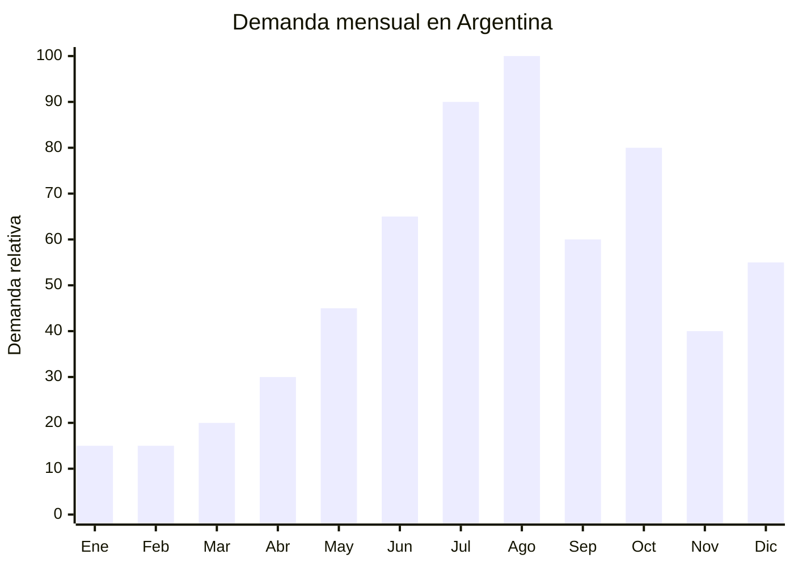

# Amasadoras / batidoras planetarias

> **Capítulo NCM 84** — Reactores nucleares, calderas, máquinas, aparatos y artefactos mecánicos | **Temporada:** Invierno (Jun–Ago)

## Qué es y por qué importarlo

Las amasadoras planetarias (también llamadas batidoras de pie o stand mixers) son electrodomésticos de cocina con un motor eléctrico que acciona un batidor, gancho amasador o pala mezcladora mediante un movimiento planetario (la herramienta gira sobre su propio eje mientras orbita alrededor del bowl). Vienen en capacidades de 3.5 a 7 litros, con potencias de 600W a 1200W. La referencia aspiracional mundial es KitchenAid, cuyos modelos se venden en Argentina por encima de USD 400-700.

El invierno argentino (julio-agosto) dispara la demanda de amasadoras por la convergencia de varios factores: la temporada de repostería casera (tortas, budines, panes caseros, medialunas, facturas), las vacaciones de invierno (niños en casa = cocina familiar), el boom del pan artesanal y masa madre que se consolidó post-pandemia, y la cercanía de las Fiestas Patrias con sus recetas tradicionales (pastelitos, empanadas). Las amasadoras son también un regalo muy buscado para el Día de la Madre (tercer domingo de octubre), generando un segundo pico.

China (especialmente Guangdong — Shunde, Zhongshan y Foshan) es el principal fabricante mundial de amasadoras planetarias. Las fábricas producen modelos que van desde líneas económicas (3.5L, 600W) hasta versiones semiprofesionales (7L, 1200W) con acabados metálicos premium. La Res. 16/2025 que acepta certificados IEC del fabricante como base para la certificación argentina simplifica el proceso de importación de electrodomésticos.

## Datos clave

| Dato | Valor |
|------|-------|
| **Posiciones NCM típicas** | 8509.40.10 (procesadores de alimentos) / 8438.10.00 (máquinas para panadería/pastelería) |
| **Derecho de importación** | 20% (DIE) + 3% tasa estadística |
| **Rango FOB típico** | USD 20.00 — USD 60.00 por unidad |
| **Precio de venta en Argentina** | ARS 50.000 — ARS 250.000 |
| **Margen bruto estimado** | 100% — 250% |
| **MOQ típico** | 200 — 500 unidades |
| **Demanda en MercadoLibre** | Alta |
| **Competencia en MercadoLibre** | Media-Alta |
| **Dificultad para importar** | Media (S-Mark + IRAM seguridad eléctrica) |
| **Certificaciones necesarias** | S-Mark + IRAM (seguridad eléctrica). Res. 16/2025 acepta IEC |
| **Antidumping** | No |

## Variantes y subtipos más comunes

| Subtipo / Variante | FOB aprox. | Venta AR aprox. | Nota |
|--------------------|-----------|-----------------|------|
| Planetaria 3.5L 600W plástico | USD 20.00 — 28.00 | ARS 50.000 — 90.000 | Entrada, hobbista |
| Planetaria 5L 800W cuerpo metal | USD 28.00 — 40.00 | ARS 80.000 — 150.000 | **Más vendida** |
| Planetaria 5.5L 1000W premium | USD 38.00 — 50.00 | ARS 120.000 — 200.000 | Semi-profesional |
| Planetaria 7L 1200W profesional | USD 45.00 — 60.00 | ARS 160.000 — 250.000 | Pastelería profesional |
| Planetaria compacta 3L (mini) | USD 15.00 — 22.00 | ARS 35.000 — 65.000 | Espacios reducidos |
| Planetaria multifunción (con picadora/pasta) | USD 35.00 — 55.00 | ARS 100.000 — 200.000 | Mayor valor percibido |

## Regulaciones y requisitos

<Tabs>
  <Tab title="Certificaciones">
    | Organismo | Requiere | Detalle |
    |-----------|----------|---------|
    | ARCA (Aduana) | Sí siempre | Despacho estándar |
    | **S-Mark** | **SÍ — OBLIGATORIO** | Certificación de seguridad eléctrica argentina |
    | **IRAM** | **SÍ — OBLIGATORIO** | Norma IRAM correspondiente a aparatos eléctricos de cocina. Res. 16/2025 permite usar certificado IEC 60335-2-14 del fabricante como base, simplificando el proceso |
    | ENACOM | No | No es producto de comunicación |
    | ANMAT | No | No es producto de salud (es procesador de alimentos doméstico) |

    **Proceso simplificado (Res. 16/2025):**
    1. Solicitar al proveedor chino certificado de conformidad con IEC 60335-2-14 (de laboratorio acreditado: SGS, TUV, Intertek)
    2. Presentar el certificado IEC ante laboratorio argentino (INTI, TUV Argentina)
    3. El laboratorio argentino emite certificación S-Mark basándose en el IEC, reduciendo ensayos
    4. Tiempo estimado: 2-4 meses (vs. 4-6 meses sin IEC)
    5. Costo estimado: USD 2,000-5,000 por modelo
  </Tab>

  <Tab title="Etiquetado">
    | Requisito | Aplica |
    |-----------|--------|
    | País de origen | Sí |
    | Datos del importador | Sí (razón social, CUIT, domicilio) |
    | Potencia (W) | **Sí — obligatorio** |
    | Tensión (V) y frecuencia (Hz) | **Sí — obligatorio** (220V 50Hz) |
    | Sello S-Mark | **Sí — obligatorio** |
    | Capacidad del bowl (litros) | Recomendable |
    | Instrucciones de uso en español | Sí |
    | Número de norma IRAM | Sí |
  </Tab>

  <Tab title="Restricciones">
    - **S-Mark es excluyente:** Sin certificación no se puede comercializar en Argentina.
    - El motor debe funcionar a 220V 50Hz. Productos para 110V/60Hz NO son aptos.
    - Protección contra sobrecalentamiento del motor es requisito de la norma.
    - Los accesorios (gancho, batidor, pala) deben ser food grade.
    - Si incluye accesorios de corte (picadora), aplica norma adicional de seguridad.
    - Sin antidumping vigente.
  </Tab>
</Tabs>

## Logística de importación

| Factor | Detalle |
|--------|---------|
| **Peso por unidad** | 4 — 9 kg (modelo metálico es pesado) |
| **Volumen por unidad** | Medio — caja de 40x30x30 cm aprox. |
| **Unidades por caja (master carton)** | 1 — 2 unidades |
| **Peso por caja** | 6 — 15 kg |
| **Cajas por contenedor 20'** | ~1,000 — 2,000 cajas |
| **Unidades por contenedor 20'** | ~1,500 — 3,000 unidades |
| **Fragilidad** | Media (bowl de acero inoxidable es robusto, cuerpo metálico también) |
| **Requiere embalaje especial** | Sí — espuma EPS en puntos de apoyo, accesorios empaquetados por separado dentro de la caja |

<Tip>
La certificación es el cuello de botella, no la logística. Iniciar el proceso de S-Mark/IRAM mínimo 4-6 meses antes del pico invernal (idealmente en enero-febrero). Si el proveedor chino ya tiene certificación IEC 60335-2-14 de laboratorio acreditado, el proceso se acelera significativamente gracias a la Res. 16/2025. Solicitar este certificado como requisito excluyente en la negociación con el proveedor.
</Tip>

## Estacionalidad y timing de compra

| Dato | Valor |
|------|-------|
| **Meses de mayor venta** | Julio — Agosto (repostería invernal, pan artesanal) |
| **Segundo pico** | Octubre (Día de la Madre) |
| **Pedido ideal (marítimo)** | Febrero — Marzo (para llegar en mayo-junio) |
| **Anticipación certificación** | Iniciar S-Mark en septiembre-noviembre del año anterior |
| **Anticipación mínima total** | 5-7 meses incluyendo certificación |

<Note>
La amasadora planetaria tiene demanda más estable que otros productos invernales porque la repostería casera es una actividad todo el año. Sin embargo, el pico invernal (julio-agosto) y el Día de la Madre (octubre) concentran el mayor volumen. Mantener stock base todo el año y reforzar para estos dos picos.
</Note>

## Ventajas y riesgos

<CardGroup cols={2}>
  <Card title="Ventajas" icon="circle-check">
    - Ticket alto (ARS 50,000-250,000) con margen atractivo
    - Referencia aspiracional (KitchenAid a fracción del precio)
    - Demanda creciente (tendencia repostería/pan casero)
    - Res. 16/2025 simplifica certificación (acepta IEC)
    - Producto durable con alta satisfacción del cliente
    - Ideal para marca propia premium
    - Múltiples picos de demanda (invierno + Día de la Madre + Navidad)
  </Card>

  <Card title="Riesgos y desventajas" icon="triangle-exclamation">
    - **S-Mark + IRAM obligatorio** (inversión USD 2,000-5,000 por modelo)
    - Certificación demora 2-4 meses (con IEC) o 4-6 meses (sin IEC)
    - Competencia con marcas establecidas (Peabody, Liliana, Atma)
    - Motor ruidoso en modelos económicos genera reclamos
    - Servicio técnico posventa necesario (engranajes, motor)
    - Producto pesado: flete no despreciable
    - Riesgo de sobrecalentamiento en modelos de baja potencia con masas pesadas
  </Card>
</CardGroup>

## Palabras clave para buscar en Alibaba

`stand mixer planetary wholesale` · `stand mixer 5L 7L 1000W` · `kitchen stand mixer OEM factory` · `planetary mixer dough hook` · `stand mixer IEC 60335 certificate` · `stand mixer metal body professional`

## Fuentes

- MercadoLibre Argentina — búsqueda "batidora planetaria", "amasadora planetaria"
- Alibaba.com — proveedores de stand mixer planetary wholesale
- Nomenclador Arancelario Argentino — partida 8509 / 8438
- Resolución 16/2025 — Aceptación de certificados IEC para electrodomésticos
- IEC 60335-2-14 — Norma de seguridad para aparatos eléctricos de cocina
