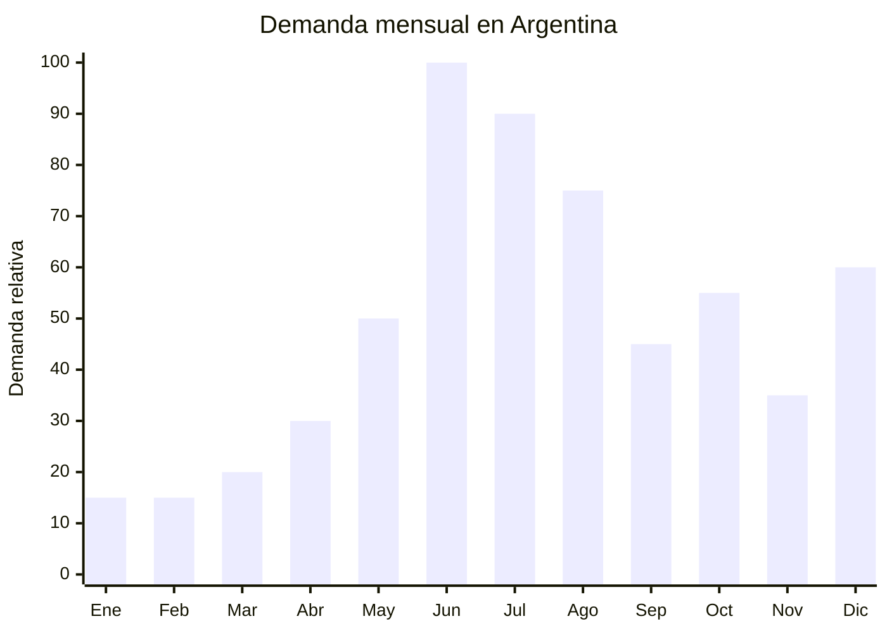

# Cafeteras express / espresso hogareñas

> **Capítulo NCM 84** — Reactores nucleares, calderas, máquinas, aparatos y artefactos mecánicos | **Temporada:** Invierno (Jun–Ago)

## Qué es y por qué importarlo

Las cafeteras express hogareñas son electrodomésticos que preparan café espresso forzando agua caliente a alta presión (9 a 20 bar) a través de café molido compactado en un portafiltro. Los modelos hogareños incluyen generalmente un espumador de leche (vaporizador) para preparar cappuccinos y lattes, bandeja calienta-tazas, portafiltro para 1 o 2 tazas, y tanque de agua de 1 a 1.5 litros. Las marcas de referencia en el mercado argentino son SUONO (con más de 10,000 unidades vendidas en MercadoLibre), Peabody, Oster y DeLonghi.

El invierno argentino concentra el pico de demanda de cafeteras espresso por dos razones: el consumo de café caliente se intensifica con el frío (junio-agosto), y el Día del Padre (tercer domingo de junio) las convierte en uno de los regalos más buscados en esa fecha. Argentina tiene una cultura cafetera creciente, con auge de cafeterías de especialidad y consumidores que quieren replicar la experiencia barista en casa. La tendencia del "home barista" impulsa la demanda de cafeteras con espumador, molinillos y accesorios.

China (Guangdong, especialmente Shunde y Zhongshan) es el principal productor mundial de cafeteras express económicas y de rango medio. Las fábricas ofrecen modelos con bombas ULKA o Jiayin (las dos referencias del mercado), sistemas de calentamiento por thermoblock o caldera, y personalización de marca con MOQ accesibles.

## Datos clave

| Dato | Valor |
|------|-------|
| **Posiciones NCM típicas** | 8516.71.00 (aparatos electrotérmicos para preparar café o té) |
| **Derecho de importación** | 20% (DIE) + 3% tasa estadística |
| **Rango FOB típico** | USD 15.00 — USD 45.00 por unidad |
| **Precio de venta en Argentina** | ARS 50.000 — ARS 200.000 |
| **Margen bruto estimado** | 100% — 250% |
| **MOQ típico** | 200 — 500 unidades |
| **Demanda en MercadoLibre** | Muy Alta (10,000+ ventas para marcas líderes) |
| **Competencia en MercadoLibre** | Alta |
| **Dificultad para importar** | Media (S-Mark + IRAM obligatorio) |
| **Certificaciones necesarias** | S-Mark + IRAM (seguridad eléctrica) |
| **Antidumping** | No |

## Variantes y subtipos más comunes

| Subtipo / Variante | FOB aprox. | Venta AR aprox. | Nota |
|--------------------|-----------|-----------------|------|
| Cafetera espresso 15 bar básica con espumador | USD 15.00 — 22.00 | ARS 50.000 — 90.000 | Entrada, más accesible |
| Cafetera espresso 20 bar con espumador ULKA | USD 22.00 — 32.00 | ARS 85.000 — 140.000 | **Más vendida** (tipo SUONO) |
| Cafetera espresso con molinillo integrado | USD 30.00 — 45.00 | ARS 120.000 — 200.000 | Premium, bean-to-cup |
| Cafetera espresso compacta (sin espumador) | USD 12.00 — 18.00 | ARS 35.000 — 65.000 | Minimalista, espacio reducido |
| Cafetera cápsulas compatibles Nespresso | USD 10.00 — 20.00 | ARS 40.000 — 80.000 | Otro segmento, alta demanda |
| Cafetera espresso doble caldera (dual boiler) | USD 40.00 — 60.00 | ARS 160.000 — 280.000 | Semi-profesional, barista |

## Regulaciones y requisitos

<Tabs>
  <Tab title="Certificaciones">
    | Organismo | Requiere | Detalle |
    |-----------|----------|---------|
    | ARCA (Aduana) | Sí siempre | Despacho estándar |
    | **S-Mark** | **SÍ — OBLIGATORIO** | Certificación de seguridad eléctrica. La cafetera trabaja con agua caliente a presión + electricidad: producto de riesgo |
    | **IRAM** | **SÍ — OBLIGATORIO** | Norma IRAM para aparatos electrotérmicos de preparación de bebidas calientes. Res. 16/2025 acepta IEC 60335-2-15 como base |
    | ENACOM | No | No es producto de comunicación |
    | ANMAT | No | No es envase alimentario |

    **Proceso (con Res. 16/2025):**
    1. Solicitar al proveedor certificado IEC 60335-2-15 de laboratorio acreditado
    2. Presentar ante laboratorio argentino para emisión de S-Mark
    3. Tiempo estimado: 2-4 meses con IEC, 4-6 meses sin IEC
    4. Costo estimado: USD 2,000-5,000 por modelo
  </Tab>

  <Tab title="Etiquetado">
    | Requisito | Aplica |
    |-----------|--------|
    | País de origen | Sí |
    | Datos del importador | Sí (razón social, CUIT, domicilio) |
    | Potencia (W) | **Sí — obligatorio** (generalmente 800-1350W) |
    | Tensión (V) y frecuencia | **Sí — obligatorio** (220V 50Hz) |
    | Presión en bar | Recomendable (dato de venta principal) |
    | Sello S-Mark | **Sí — obligatorio** |
    | Capacidad del tanque | Recomendable |
    | Instrucciones en español | Sí |
  </Tab>

  <Tab title="Restricciones">
    - **S-Mark excluyente:** Sin certificación, el producto no puede venderse en Argentina.
    - Debe funcionar a 220V 50Hz. Modelos de 110V NO son aptos.
    - La presión de la bomba declarada debe ser real (muchas cafeteras chinas declaran 20 bar pero la presión efectiva en el portafiltro es 9-12 bar, lo cual es correcto para espresso).
    - Piezas en contacto con café y agua deben ser food grade (BPA free).
    - Protección contra funcionamiento sin agua (caldera en seco) es requisito de seguridad.
    - Sin antidumping vigente.
  </Tab>
</Tabs>

## Logística de importación

| Factor | Detalle |
|--------|---------|
| **Peso por unidad** | 3 — 6 kg |
| **Volumen por unidad** | Medio — caja de 35x25x30 cm aprox. |
| **Unidades por caja (master carton)** | 2 — 4 unidades |
| **Peso por caja** | 8 — 20 kg |
| **Cajas por contenedor 20'** | ~1,000 — 1,800 cajas |
| **Unidades por contenedor 20'** | ~3,000 — 6,000 unidades |
| **Fragilidad** | Media (bandeja plástica, portafiltro, espumador pueden dañarse) |
| **Requiere embalaje especial** | Sí — espuma EPS, portafiltro envuelto por separado, accesorio espumador protegido |

<Tip>
El factor de éxito #1 en cafeteras espresso hogareñas es la bomba: exigir al proveedor bomba ULKA (italiana, referencia de la industria) o al menos Jiayin (china de buena calidad). Las bombas genéricas pierden presión rápidamente y generan devoluciones masivas. La bomba es lo que diferencia una buena cafetera de una que termina en el fondo del armario.
</Tip>

## Estacionalidad y timing de compra

| Dato | Valor |
|------|-------|
| **Meses de mayor venta** | Junio (Día del Padre) y Julio (invierno pleno) |
| **Segundo pico** | Octubre (Día de la Madre) y Diciembre (Navidad) |
| **Pedido ideal (marítimo)** | Enero — Febrero (para llegar en abril-mayo) |
| **Anticipación certificación** | Iniciar S-Mark 5-7 meses antes del primer pico |
| **Anticipación mínima total** | 5-7 meses incluyendo certificación |

## Ventajas y riesgos

<CardGroup cols={2}>
  <Card title="Ventajas" icon="circle-check">
    - Demanda muy alta y creciente (cultura cafetera en expansión)
    - Ticket alto (ARS 50,000-200,000) con margen atractivo
    - Múltiples picos de demanda (Día Padre, invierno, Día Madre, Navidad)
    - Res. 16/2025 simplifica certificación S-Mark
    - Cross-sell con accesorios (molinillo, tazas, tamper, jarra espumadora)
    - SUONO demostró que una marca nueva puede dominar el mercado
    - Producto aspiracional con alta percepción de valor
  </Card>

  <Card title="Riesgos y desventajas" icon="triangle-exclamation">
    - S-Mark + IRAM obligatorio (USD 2,000-5,000 por modelo)
    - Competencia fuerte (SUONO, Peabody, Oster, DeLonghi)
    - Calidad de la bomba es crítica: bomba mala = producto invendible
    - Servicio técnico posventa necesario (bombas, sellos, portafiltro)
    - Reclamos por presión insuficiente o espumador que no funciona
    - Producto con curva de aprendizaje: requiere educación del consumidor
  </Card>
</CardGroup>

## Palabras clave para buscar en Alibaba

`espresso machine 20 bar wholesale` · `coffee maker espresso home ULKA pump` · `espresso machine steam milk frother` · `coffee machine 220V 50Hz OEM` · `espresso maker IEC 60335 certificate` · `home barista coffee machine manufacturer`

## Fuentes

- MercadoLibre Argentina — búsqueda "cafetera express", "cafetera espresso espumador"
- Alibaba.com — proveedores de espresso machine home ULKA pump
- SUONO Argentina — referencia de mercado (10,000+ ventas ML)
- Nomenclador Arancelario Argentino — partida 8516.71.00
- Res. 16/2025 — Aceptación de certificados IEC
- IEC 60335-2-15 — Seguridad de aparatos para calentar líquidos
