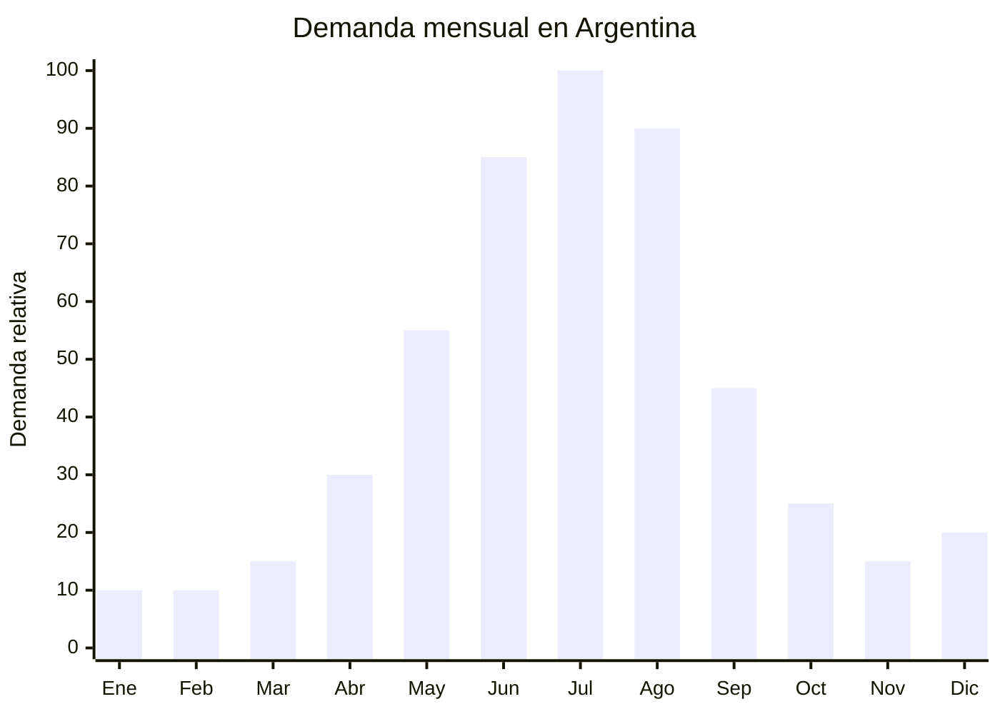

# Soperas y ollas eléctricas multifunción (slow cooker)

> **Capítulo NCM 84** — Reactores nucleares, calderas, máquinas, aparatos y artefactos mecánicos | **Temporada:** Invierno (Jun–Ago)

## Qué es y por qué importarlo

Las soperas eléctricas y ollas de cocción lenta (slow cookers) son electrodomésticos que cocinan alimentos a temperatura baja y constante durante períodos prolongados (4 a 12 horas). Se componen de una carcasa exterior con resistencia eléctrica, un recipiente interior de cerámica o antiadherente removible, tapa de vidrio templado y panel de control con timer y funciones preestablecidas (low, high, warm/mantener caliente). Las capacidades más comunes son 3.5L (2-3 personas), 5L (familia) y 6L (familias grandes o meal prep).

El invierno argentino (junio-agosto) es la temporada perfecta para este producto: sopas, guisos, estofados, caldos, puchero y la tendencia de comfort food invernal impulsan las ventas. El concepto de "poner todo en la olla y volver a casa con la cena lista" es muy atractivo para personas que trabajan fuera del hogar. Las ollas multifunción agregan modos de cocción como presión, saltear, arroz y yogurt, ampliando el valor percibido.

China (especialmente Guangdong — Foshan, Shunde y Zhongshan) domina la producción mundial de slow cookers y soperas eléctricas. Los fabricantes ofrecen desde modelos básicos con perilla mecánica hasta versiones digitales con pantalla LED, timer programable y funciones múltiples, a precios FOB de USD 8 a USD 25.

## Datos clave

| Dato | Valor |
|------|-------|
| **Posiciones NCM típicas** | 8516.60.00 (hornos y cocinas eléctricas, los demás) / 8516.79.00 (aparatos electrotérmicos de uso doméstico) |
| **Derecho de importación** | 20% (DIE) + 3% tasa estadística |
| **Rango FOB típico** | USD 8.00 — USD 25.00 por unidad |
| **Precio de venta en Argentina** | ARS 25.000 — ARS 90.000 |
| **Margen bruto estimado** | 100% — 250% |
| **MOQ típico** | 300 — 1,000 unidades |
| **Demanda en MercadoLibre** | Media-Alta (creciente con tendencia comfort food) |
| **Competencia en MercadoLibre** | Media (pocas marcas dedicadas, mercado en crecimiento) |
| **Dificultad para importar** | Media (S-Mark + IRAM obligatorio) |
| **Certificaciones necesarias** | S-Mark + IRAM (seguridad eléctrica) |
| **Antidumping** | No |

## Variantes y subtipos más comunes

| Subtipo / Variante | FOB aprox. | Venta AR aprox. | Nota |
|--------------------|-----------|-----------------|------|
| Slow cooker mecánico 3.5L (perilla) | USD 8.00 — 12.00 | ARS 25.000 — 40.000 | Entrada, simple |
| Slow cooker digital 5L con timer | USD 12.00 — 18.00 | ARS 35.000 — 60.000 | **Más vendido** |
| Slow cooker digital 6L premium | USD 15.00 — 22.00 | ARS 50.000 — 75.000 | Familiar grande |
| Olla multifunción 5L (presión + slow + saltear) | USD 18.00 — 25.00 | ARS 55.000 — 90.000 | Tipo Instant Pot, mayor valor |
| Sopera eléctrica buffet 10L (comercial) | USD 12.00 — 20.00 | ARS 30.000 — 55.000 | Para eventos, catering |
| Slow cooker oval 4L (piezas grandes de carne) | USD 10.00 — 15.00 | ARS 30.000 — 50.000 | Forma ovalada, roast beef |

## Regulaciones y requisitos

<Tabs>
  <Tab title="Certificaciones">
    | Organismo | Requiere | Detalle |
    |-----------|----------|---------|
    | ARCA (Aduana) | Sí siempre | Despacho estándar |
    | **S-Mark** | **SÍ — OBLIGATORIO** | Certificación de seguridad eléctrica |
    | **IRAM** | **SÍ — OBLIGATORIO** | Norma IRAM para aparatos electrotérmicos domésticos. Res. 16/2025 acepta IEC 60335-2-15 o IEC 60335-2-9 según clasificación |
    | ENACOM | No | No es producto de comunicación |
    | ANMAT | No | No es envase alimentario procesado |

    **Recomendación:** Solicitar al proveedor certificación IEC 60335-2-15 (aparatos para calentar líquidos) o IEC 60335-2-9 (aparatos de cocción portátiles), según cómo clasifique el laboratorio argentino. Con la Res. 16/2025, estos certificados aceleran la obtención del S-Mark argentino.
  </Tab>

  <Tab title="Etiquetado">
    | Requisito | Aplica |
    |-----------|--------|
    | País de origen | Sí |
    | Datos del importador | Sí (razón social, CUIT, domicilio) |
    | Potencia (W) | **Sí — obligatorio** (generalmente 180-300W) |
    | Tensión (V) y frecuencia | **Sí — obligatorio** (220V 50Hz) |
    | Sello S-Mark | **Sí — obligatorio** |
    | Capacidad en litros | Recomendable |
    | Funciones disponibles | Recomendable (low, high, warm, timer) |
    | Instrucciones en español | Sí |
  </Tab>

  <Tab title="Restricciones">
    - **S-Mark excluyente:** Sin certificación no se puede comercializar.
    - Debe funcionar a 220V 50Hz.
    - La tapa de vidrio templado debe ser resistente a choques térmicos — verificar con test del proveedor.
    - El recipiente interior cerámico o antiadherente debe ser food grade y libre de plomo/cadmio.
    - Protección contra sobrecalentamiento y funcionamiento en seco son requisitos de seguridad.
    - Sin antidumping vigente.
  </Tab>
</Tabs>

## Logística de importación

| Factor | Detalle |
|--------|---------|
| **Peso por unidad** | 2.5 — 5.0 kg (recipiente cerámico pesa) |
| **Volumen por unidad** | Medio — caja de 35x30x25 cm aprox. |
| **Unidades por caja (master carton)** | 2 — 4 unidades |
| **Peso por caja** | 8 — 16 kg |
| **Cajas por contenedor 20'** | ~1,200 — 2,000 cajas |
| **Unidades por contenedor 20'** | ~3,000 — 6,000 unidades |
| **Fragilidad** | **Alta** (recipiente cerámico + tapa de vidrio) |
| **Requiere embalaje especial** | **Sí** — protección reforzada para cerámica y vidrio. Exigir al proveedor espuma moldeada y separadores. La tasa de rotura en transporte puede ser 3-5% si el embalaje es deficiente |

<Tip>
El recipiente interior cerámico es el punto de fragilidad del producto. Exigir al proveedor que envíe fotos del embalaje interno antes de embarcar y solicitar test de caída (drop test) del packaging completo. Un 5% de roturas en un embarque de 1,000 unidades son 50 unidades perdidas + costo de gestión de reclamos. Invertir en embalaje reforzado es más barato que absorber las pérdidas.
</Tip>

## Estacionalidad y timing de compra

| Dato | Valor |
|------|-------|
| **Meses de mayor venta** | Junio — Agosto (sopas, guisos, comfort food invernal) |
| **Pico absoluto** | Julio (Fiestas Patrias + frío máximo) |
| **Pedido ideal (marítimo)** | Febrero — Marzo (para llegar en mayo) |
| **Anticipación certificación** | Iniciar S-Mark 5-7 meses antes del pico |
| **Anticipación mínima total** | 5-7 meses incluyendo certificación |

## Ventajas y riesgos

<CardGroup cols={2}>
  <Card title="Ventajas" icon="circle-check">
    - Mercado en crecimiento (tendencia comfort food / meal prep)
    - Ticket accesible (ARS 25,000-90,000) con margen 100-250%
    - Competencia baja: pocas marcas dedicadas en Argentina
    - Concepto fácil de comunicar ("dejás cocinando y te olvidás")
    - Consumo bajo de energía (180-300W vs. horno 2000W+)
    - Cross-sell con recetarios, ingredientes, accesorios
    - Producto ideal para contenido en redes (recetas, videos)
  </Card>

  <Card title="Riesgos y desventajas" icon="triangle-exclamation">
    - S-Mark + IRAM obligatorio (inversión USD 2,000-5,000)
    - **Fragilidad alta:** recipiente cerámico + tapa vidrio = roturas en transporte
    - Mercado todavía en educación (no todos conocen el slow cooker)
    - Estacionalidad marcada: demanda muy baja en verano
    - Roturas en transporte pueden llegar al 3-5% con mal embalaje
    - Servicio posventa: reposición de recipientes cerámicos rotos
  </Card>
</CardGroup>

## Palabras clave para buscar en Alibaba

`slow cooker ceramic wholesale` · `electric slow cooker 5L digital timer` · `crock pot ceramic insert 220V` · `multi cooker pressure slow fry` · `slow cooker OEM factory Foshan` · `electric soup maker cooker wholesale`

## Fuentes

- MercadoLibre Argentina — búsqueda "olla cocción lenta", "slow cooker eléctrica"
- Alibaba.com — proveedores de slow cooker ceramic wholesale
- Nomenclador Arancelario Argentino — partida 8516.60.00 / 8516.79.00
- Res. 16/2025 — Aceptación de certificados IEC
- IEC 60335-2-15 / IEC 60335-2-9 — Normas de seguridad aplicables
