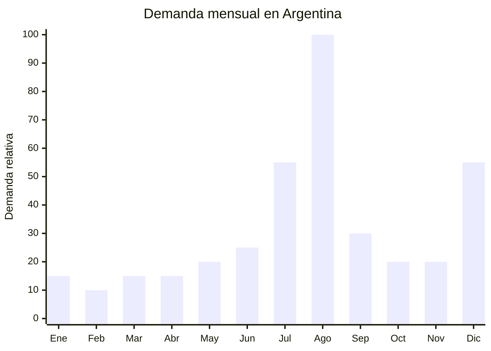

# Auriculares gaming infantiles con micrófono

> **Capítulo NCM 85** — Máquinas, aparatos y material eléctrico | **Temporada:** Invierno (Jun–Ago)

## Qué es y por qué importarlo

Los auriculares gaming infantiles son headsets over-ear (cubren la oreja completa) diseñados para niños y adolescentes, con micrófono integrado retráctil o flexible para juegos online y videollamadas. La tendencia 2024-2025 son los modelos con orejas de gato LED iluminadas en la vincha, disponibles en colores pastel (rosa, lila, celeste, verde menta). Los modelos con cable incluyen conector jack 3.5mm compatible con PC, consolas, tablets y celulares. Los modelos Bluetooth eliminan el cable pero requieren certificación ENACOM.

La característica de seguridad clave es el limitador de volumen a 85 dB (decibelios), que protege la audición de los niños durante uso prolongado. Esta función es un argumento de venta fuerte para los padres y un diferenciador frente a auriculares gaming genéricos.

El pico de demanda se concentra en agosto por el Día del Niño (segundo domingo de agosto). Los auriculares gaming con orejas de gato se viralizaron en TikTok e Instagram y se convirtieron en un accesorio de moda infantil/juvenil que va más allá del gaming: se usan para clases online, videos de YouTube, música y como accesorio estético. El precio FOB de USD 2 a USD 8 permite márgenes excepcionales.

## Datos clave

| Dato | Valor |
|------|-------|
| **Posiciones NCM típicas** | 8518.30.00 (auriculares, incluidos los de diadema) |
| **Derecho de importación** | 20% (DIE) + 3% tasa estadística |
| **Rango FOB típico** | USD 2.00 — USD 8.00 por unidad |
| **Precio de venta en Argentina** | ARS 8.000 — ARS 35.000 |
| **Margen bruto estimado** | 200% — 500% |
| **MOQ típico** | 500 — 2,000 unidades |
| **Demanda en MercadoLibre** | Alta (pico Día del Niño + tendencia orejas gato) |
| **Competencia en MercadoLibre** | Media-Alta |
| **Dificultad para importar** | **Baja** (con cable) / **Media** (Bluetooth requiere ENACOM) |
| **Certificaciones necesarias** | ENACOM solo si Bluetooth. Con cable 3.5mm: ninguna obligatoria |
| **Antidumping** | No |

## Variantes y subtipos más comunes

| Subtipo / Variante | FOB aprox. | Venta AR aprox. | Nota |
|--------------------|-----------|-----------------|------|
| Auricular gaming cable 3.5mm + mic + luz LED | USD 2.00 — 4.00 | ARS 8.000 — 18.000 | **Más vendido**, sin ENACOM |
| Auricular orejas gato LED cable 3.5mm | USD 3.00 — 5.00 | ARS 12.000 — 22.000 | **Tendencia viral**, sin ENACOM |
| Auricular orejas gato LED Bluetooth | USD 5.00 — 8.00 | ARS 18.000 — 35.000 | Mayor ticket, requiere ENACOM |
| Auricular gaming infantil con limitador 85dB cable | USD 3.00 — 5.00 | ARS 10.000 — 20.000 | Seguridad auditiva, argumento padres |
| Auricular gaming RGB 7 colores cable USB | USD 3.50 — 6.00 | ARS 12.000 — 25.000 | Efecto visual, solo PC (USB) |
| Pack x2 auriculares (hermanos/amigos) | USD 5.00 — 9.00 | ARS 18.000 — 35.000 | Mayor ticket, ideal regalo |

## Regulaciones y requisitos

<Tabs>
  <Tab title="Certificaciones">
    | Organismo | Requiere | Detalle |
    |-----------|----------|---------|
    | ARCA (Aduana) | Sí siempre | Despacho estándar |
    | ENACOM | **Solo si es Bluetooth** | Auriculares con cable 3.5mm NO requieren ENACOM. Modelos Bluetooth SÍ requieren homologación (USD 500-1,000 por modelo, 30-60 días) |
    | S-Mark | No | No se conecta directamente a 220V (la luz LED se alimenta del dispositivo o USB) |
    | ANMAT | No | No es producto de salud (aunque el limitador 85dB es un feature de seguridad) |
    | INTI | No | Sin norma IRAM obligatoria |

    **Recomendación estratégica:** Para evitar completamente la barrera ENACOM, importar SOLO modelos con cable 3.5mm. El margen es excelente incluso en la versión cableada. Si se quiere importar la versión Bluetooth, iniciar trámite ENACOM antes de embarcar y solicitar al proveedor certificado FCC/CE del módulo Bluetooth.
  </Tab>

  <Tab title="Etiquetado">
    | Requisito | Aplica |
    |-----------|--------|
    | País de origen | Sí |
    | Datos del importador | Sí (nombre, dirección, CUIT) |
    | Tipo de conexión | Recomendable (3.5mm / USB / Bluetooth) |
    | Limitador de volumen | Recomendable indicar "85dB max" si aplica |
    | Edad recomendada | Recomendable |
    | Instrucciones de uso | Recomendable |
    | Homologación ENACOM | Solo si Bluetooth |
  </Tab>

  <Tab title="Restricciones">
    - **Con cable 3.5mm:** Sin restricciones regulatorias significativas. La forma más simple de importar.
    - **Bluetooth:** Requiere homologación ENACOM. Sin ella, no se puede despachar ni vender.
    - **Volumen máximo:** Aunque no hay regulación argentina que obligue al limitador de 85dB, es una buena práctica para producto infantil y un argumento de venta diferenciador.
    - **Luz LED:** La alimentación de los LED proviene del cable USB o del dispositivo al que se conecta. No hay riesgo eléctrico adicional.
    - Sin antidumping vigente.
  </Tab>
</Tabs>

## Logística de importación

| Factor | Detalle |
|--------|---------|
| **Peso por unidad** | 150 — 350 g |
| **Volumen por unidad** | Bajo — caja de 20x18x10 cm aprox. |
| **Unidades por caja (master carton)** | 20 — 50 unidades |
| **Peso por caja** | 5 — 12 kg |
| **Cajas por contenedor 20'** | ~2,500 — 4,000 cajas |
| **Unidades por contenedor 20'** | ~80,000 — 150,000 unidades |
| **Fragilidad** | Baja (plástico, vincha flexible) |
| **Requiere embalaje especial** | No — caja color individual con blister o inserto de cartón |

<Tip>
Los auriculares gaming infantiles tienen una relación valor/peso excepcional: livianos, compactos y con margen de 200-500%. Un envío aéreo de 50 kg puede contener 250+ unidades con un costo de flete de USD 0.50-1.00 por unidad. Para llegar al Día del Niño (agosto), un envío aéreo en julio es viable y rentable. La clave es elegir la versión con cable 3.5mm para evitar ENACOM y maximizar velocidad.
</Tip>

## Estacionalidad y timing de compra

| Dato | Valor |
|------|-------|
| **Meses de mayor venta** | Agosto (Día del Niño) |
| **Segundo pico** | Julio (vacaciones invierno) y Diciembre (Navidad) |
| **Pedido ideal (marítimo)** | Abril — Mayo (para llegar en julio) |
| **Pedido ideal (aéreo)** | Julio (llega en 10-15 días para Día del Niño) |
| **Anticipación mínima** | 2-3 meses marítimo / 15 días aéreo (solo modelos con cable) |

## Ventajas y riesgos

<CardGroup cols={2}>
  <Card title="Ventajas" icon="circle-check">
    - Margen excepcional (200-500% sobre FOB)
    - Producto ultraliviano: envío aéreo viable
    - Versión con cable: SIN certificaciones obligatorias
    - Tendencia viral (orejas gato, LED) con alta demanda
    - Ticket accesible = alta rotación
    - Público amplio: niños, adolescentes, streamers
    - Ideal para packs y combos (x2, con soporte, con mousepad)
  </Card>

  <Card title="Riesgos y desventajas" icon="triangle-exclamation">
    - Competencia alta: muchos importadores en el mercado
    - Calidad de audio variable en modelos ultra-económicos
    - Micrófono de baja calidad = queja principal
    - Vincha que se rompe con uso infantil intenso
    - Versión Bluetooth requiere ENACOM (barrera adicional)
    - Producto commodity: guerra de precios
    - LED que dejan de funcionar rápido en modelos baratos
  </Card>
</CardGroup>

## Palabras clave para buscar en Alibaba

`gaming headset kids cat ears LED` · `children headphone microphone 3.5mm` · `cat ear headphones LED wholesale` · `kids gaming headset 85dB limiter` · `RGB gaming headset children wholesale` · `over ear headphone cat ears Shenzhen`

## Fuentes

- MercadoLibre Argentina — búsqueda "auriculares gaming niños", "auriculares orejas gato"
- Alibaba.com — proveedores de cat ear headphones LED wholesale
- ENACOM — Requisitos de homologación Bluetooth
- Nomenclador Arancelario Argentino — partida 8518.30.00
- OMS — Recomendación de límite de exposición sonora 85dB para niños
