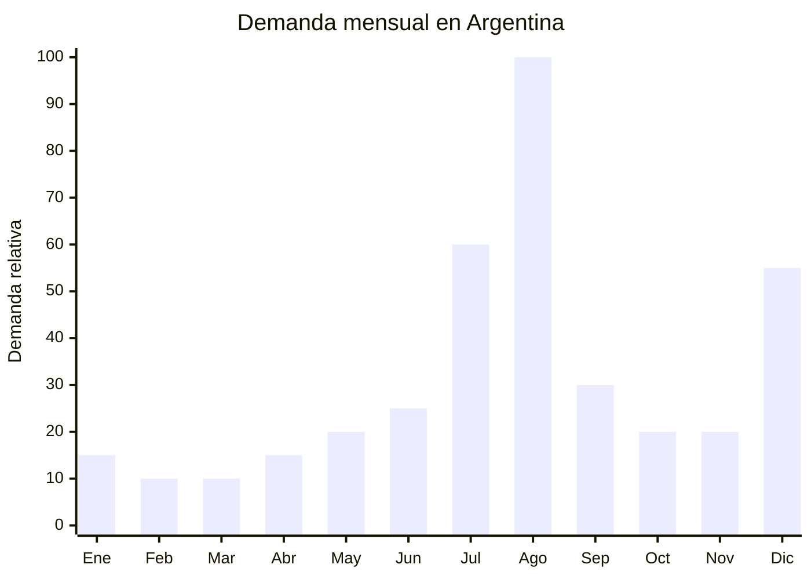

# Consolas de videojuegos retro / mini consolas

> **Capítulo NCM 85** — Máquinas, aparatos y material eléctrico | **Temporada:** Invierno (Jun–Ago)

## Qué es y por qué importarlo

Las consolas de videojuegos retro (también llamadas mini consolas o retro consolas) son dispositivos electrónicos compactos que emulan sistemas de videojuegos clásicos de los años 80 y 90 (NES, SNES, Sega Genesis, Game Boy, Arcade). Vienen con 500 a 10,000 juegos preinstalados en memoria interna, se conectan al televisor vía HDMI, incluyen 2 joysticks o gamepads y se alimentan por USB (5V). Los formatos más populares son: estilo consola de mesa (mini NES/SNES), game stick (tipo pen drive HDMI) y consola portátil con pantalla integrada.

El pico de demanda se concentra en agosto por el Día del Niño (segundo domingo de agosto en Argentina), pero el público comprador no son solo niños: los millennials y la Generación X (padres de 30-45 años) las compran por nostalgia y para compartir con sus hijos los juegos de su infancia. Este factor emocional-nostálgico permite comunicar el producto con un ángulo único. Las vacaciones de invierno (julio) también aportan demanda, ya que los padres buscan entretenimiento hogareño para los chicos.

Shenzhen (China) es el epicentro de producción de consolas retro, con decenas de fabricantes que ofrecen diferentes configuraciones de hardware (chipset Allwinner o RK3326 para los modelos más potentes) y librerías de juegos preinstalados. El precio FOB de USD 5 a USD 15 permite márgenes excelentes.

## Datos clave

| Dato | Valor |
|------|-------|
| **Posiciones NCM típicas** | 9504.50.00 (consolas y máquinas de videojuegos) |
| **Derecho de importación** | 20% (DIE) + 3% tasa estadística |
| **Rango FOB típico** | USD 5.00 — USD 15.00 por unidad |
| **Precio de venta en Argentina** | ARS 15.000 — ARS 60.000 |
| **Margen bruto estimado** | 150% — 400% |
| **MOQ típico** | 200 — 1,000 unidades |
| **Demanda en MercadoLibre** | Alta (pico Día del Niño) |
| **Competencia en MercadoLibre** | Media-Alta |
| **Dificultad para importar** | Baja (sin ENACOM si solo HDMI, sin WiFi/BT) |
| **Certificaciones necesarias** | Ninguna obligatoria si solo conecta por HDMI/USB (sin emisión de radiofrecuencia) |
| **Antidumping** | No |

## Variantes y subtipos más comunes

| Subtipo / Variante | FOB aprox. | Venta AR aprox. | Nota |
|--------------------|-----------|-----------------|------|
| Game stick HDMI 2 joysticks (500-800 juegos) | USD 5.00 — 8.00 | ARS 15.000 — 30.000 | **Más vendido**, ultra-compacto |
| Mini consola tipo NES/SNES (2,000 juegos) | USD 7.00 — 10.00 | ARS 20.000 — 40.000 | Nostálgico, estética retro |
| Consola retro portátil con pantalla 3.5" | USD 8.00 — 12.00 | ARS 25.000 — 45.000 | Juego en cualquier lugar |
| Consola retro HD box (5,000-10,000 juegos) | USD 10.00 — 15.00 | ARS 35.000 — 60.000 | Para fanáticos, más sistemas |
| Arcade stick retro (2 players, arcade) | USD 12.00 — 18.00 | ARS 40.000 — 70.000 | Experiencia arcade, nicho |
| Game stick con joystick inalámbrico 2.4GHz | USD 7.00 — 12.00 | ARS 22.000 — 45.000 | Sin cables, mejor experiencia |

## Regulaciones y requisitos

<Tabs>
  <Tab title="Certificaciones">
    | Organismo | Requiere | Detalle |
    |-----------|----------|---------|
    | ARCA (Aduana) | Sí siempre | Despacho estándar |
    | ENACOM | **No** (si solo HDMI/USB) | Solo requeriría homologación si incluye WiFi o Bluetooth. Los modelos con joystick inalámbrico 2.4GHz de corto alcance generalmente NO requieren ENACOM, pero verificar con despachante |
    | S-Mark | No | Se alimenta por USB 5V (baja tensión), no se conecta directamente a 220V |
    | ANMAT | No | No es producto de salud |
    | INTI | No | Sin norma IRAM específica |

    **Recomendación:** La ausencia de barreras regulatorias es la principal ventaja de este producto. Elegir modelos que se conecten SOLO por HDMI y USB para evitar completamente la necesidad de ENACOM. Si el joystick es inalámbrico 2.4GHz, verificar con el despachante si la frecuencia y potencia están exentas de homologación.
  </Tab>

  <Tab title="Etiquetado">
    | Requisito | Aplica |
    |-----------|--------|
    | País de origen | Sí |
    | Datos del importador | Sí (nombre, dirección, CUIT) |
    | Alimentación | Recomendable indicar "USB 5V" |
    | Contenido del paquete | Recomendable (consola + 2 joysticks + cable HDMI + cable USB) |
    | Instrucciones en español | Recomendable |
    | Edad recomendada | Recomendable (generalmente +6 años) |
  </Tab>

  <Tab title="Restricciones">
    - **Propiedad intelectual:** Los juegos preinstalados son ROMs de juegos retro cuyos derechos pertenecen a Nintendo, Sega, Konami, Capcom, etc. La comercialización de estos productos es una zona gris legal. Formalmente, vender consolas con ROMs sin licencia es infracción de propiedad intelectual.
    - **Riesgo de reclamo:** Nintendo y Sega son activas en la protección de su propiedad intelectual. Existe riesgo de denuncia en aduana o de baja de publicaciones en marketplaces.
    - No usar marcas registradas (Nintendo, SNES, Game Boy) en la publicación.
    - Describir como "consola retro" o "consola clásica" sin mencionar marcas de terceros.
    - Sin antidumping vigente.
  </Tab>
</Tabs>

## Logística de importación

| Factor | Detalle |
|--------|---------|
| **Peso por unidad** | 150 — 500 g (con joysticks) |
| **Volumen por unidad** | Bajo — caja de 20x15x8 cm aprox. |
| **Unidades por caja (master carton)** | 20 — 50 unidades |
| **Peso por caja** | 5 — 15 kg |
| **Cajas por contenedor 20'** | ~2,500 — 4,000 cajas |
| **Unidades por contenedor 20'** | ~80,000 — 150,000 unidades |
| **Fragilidad** | Baja (plástico resistente, componentes electrónicos simples) |
| **Requiere embalaje especial** | No — embalaje estándar con caja color individual |

<Tip>
Las consolas retro tienen una relación valor/peso/volumen excepcional: son livianas, compactas y con margen alto. Un envío aéreo de 50 kg puede contener 200+ unidades con un costo de flete de USD 1-2 por unidad. Para primeras importaciones o para llegar rápido al Día del Niño, el envío aéreo es totalmente viable y económicamente sensato.
</Tip>

## Estacionalidad y timing de compra

| Dato | Valor |
|------|-------|
| **Meses de mayor venta** | Agosto (Día del Niño) y Julio (vacaciones invierno) |
| **Segundo pico** | Diciembre (Navidad) |
| **Pedido ideal (marítimo)** | Abril — Mayo (para llegar en julio) |
| **Pedido ideal (aéreo)** | Julio (llega en agosto para Día del Niño) |
| **Anticipación mínima** | 2-3 meses antes del pico (o 10-15 días con aéreo) |

## Ventajas y riesgos

<CardGroup cols={2}>
  <Card title="Ventajas" icon="circle-check">
    - Margen bruto excepcional (150-400%)
    - Producto ultraliviano: envío aéreo viable y económico
    - Sin certificaciones obligatorias (si solo HDMI/USB)
    - Ticket accesible = alta rotación
    - Público doble: niños + adultos nostálgicos
    - Demanda en múltiples fechas (Día del Niño, Navidad, cumpleaños)
    - Stock sobrante se vende todo el año como regalo
  </Card>

  <Card title="Riesgos y desventajas" icon="triangle-exclamation">
    - **Riesgo de propiedad intelectual:** ROMs sin licencia son infracción
    - Nintendo/Sega pueden reclamar en aduana o marketplace
    - Competencia alta en MercadoLibre (muchos importadores)
    - Calidad de joysticks variable (el punto de fallo más común)
    - Juegos repetidos o no funcionales en listas de 10,000+
    - Producto commodity: difícil diferenciarse
    - Percepción de "juguete barato" en modelos de menor calidad
  </Card>
</CardGroup>

## Palabras clave para buscar en Alibaba

`retro game console HDMI wholesale` · `game stick 2 players wireless` · `mini console 500 games classic` · `retro handheld game console 3.5 inch` · `arcade game stick HDMI wholesale` · `retro gaming console Shenzhen factory`

## Fuentes

- MercadoLibre Argentina — búsqueda "consola retro", "mini consola juegos"
- Alibaba.com — proveedores de retro game console HDMI wholesale
- Nomenclador Arancelario Argentino — partida 9504.50.00
- Consideraciones de propiedad intelectual en productos retro gaming
