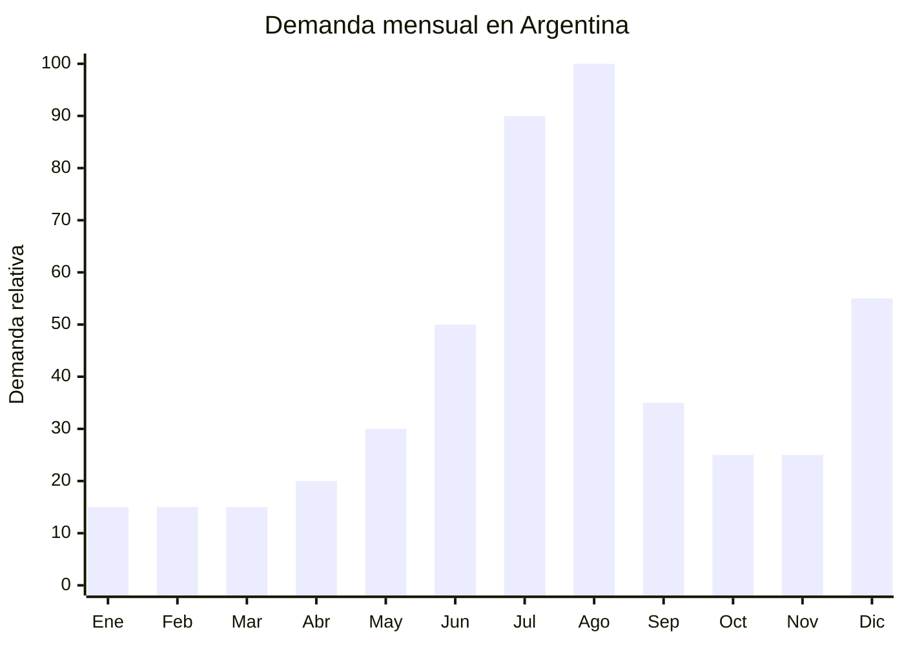

# Proyectores portátiles LED (mini proyectores)

> **Capítulo NCM 85** — Máquinas, aparatos y material eléctrico | **Temporada:** Invierno (Jun–Ago)

## Qué es y por qué importarlo

Los mini proyectores LED portátiles son dispositivos compactos que proyectan imagen y video sobre cualquier superficie lisa (pared, techo, pantalla) utilizando tecnología LED de larga duración (20,000-50,000 horas). Los modelos actuales ofrecen resoluciones de 720p nativa (la más común en el rango accesible) hasta 1080p nativa, con tamaños de proyección de 40 a 200 pulgadas según la distancia. La conectividad incluye WiFi (para streaming directo de Netflix, YouTube, Disney+), Bluetooth (para parlantes o auriculares externos), HDMI, USB, y compatibilidad con screen mirroring desde celulares.

El pico de demanda se concentra en julio-agosto por tres factores convergentes: las vacaciones de invierno (segunda quincena de julio), cuando las familias buscan entretenimiento hogareño para los chicos; el Día del Niño (segundo domingo de agosto), donde el mini proyector es un regalo estrella con alto valor percibido; y las noches largas de invierno que invitan a maratones de series y películas en casa. Es un producto con ticket alto y margen excelente, ideal para regalo.

China (Shenzhen, específicamente el distrito de Nanshan y Bao'an) es el epicentro mundial de producción de mini proyectores. Las fábricas ofrecen desde modelos económicos con chipset genérico hasta versiones premium con chipset Allwinner o Amlogic, lentes de vidrio óptico y auto-focus.

## Datos clave

| Dato | Valor |
|------|-------|
| **Posiciones NCM típicas** | 8528.69.00 (proyectores) |
| **Derecho de importación** | 20% (DIE) + 3% tasa estadística |
| **Rango FOB típico** | USD 15.00 — USD 50.00 por unidad |
| **Precio de venta en Argentina** | ARS 50.000 — ARS 250.000 |
| **Margen bruto estimado** | 100% — 300% |
| **MOQ típico** | 100 — 300 unidades |
| **Demanda en MercadoLibre** | Alta (pico vacaciones + Día del Niño) |
| **Competencia en MercadoLibre** | Media |
| **Dificultad para importar** | Media-Alta (ENACOM + S-Mark + IRAM) |
| **Certificaciones necesarias** | ENACOM (WiFi + Bluetooth) + S-Mark + IRAM (seguridad eléctrica) |
| **Antidumping** | No |

## Variantes y subtipos más comunes

| Subtipo / Variante | FOB aprox. | Venta AR aprox. | Nota |
|--------------------|-----------|-----------------|------|
| Mini proyector 720p básico WiFi+BT | USD 15.00 — 22.00 | ARS 50.000 — 90.000 | Entrada, buena relación precio/valor |
| Mini proyector 1080p nativo WiFi+BT | USD 25.00 — 35.00 | ARS 90.000 — 160.000 | **Más vendido** |
| Proyector 1080p con auto-focus y corrección trapezoidal | USD 35.00 — 45.00 | ARS 130.000 — 200.000 | Premium, mejor experiencia |
| Proyector portátil con batería recargable | USD 30.00 — 50.00 | ARS 100.000 — 250.000 | Uso outdoor, camping |
| Mini proyector infantil (diseño kid-friendly) | USD 12.00 — 20.00 | ARS 40.000 — 75.000 | Específico Día del Niño |
| Proyector 4K con Android TV integrado | USD 45.00 — 80.00 | ARS 180.000 — 350.000 | High-end, mayor ticket |

## Regulaciones y requisitos

<Tabs>
  <Tab title="Certificaciones">
    | Organismo | Requiere | Detalle |
    |-----------|----------|---------|
    | ARCA (Aduana) | Sí siempre | Despacho estándar |
    | **ENACOM** | **SÍ — OBLIGATORIO** | Homologación de WiFi 2.4/5GHz + Bluetooth. Costo aprox. USD 500-1,000 por modelo. Plazo: 30-60 días |
    | **S-Mark** | **SÍ — OBLIGATORIO** | Seguridad eléctrica (producto con fuente de alimentación 220V) |
    | **IRAM** | **SÍ — OBLIGATORIO** | Norma de seguridad eléctrica para aparatos electrónicos |
    | ANMAT | No | No es producto de salud |

    **Recomendación:** La doble barrera ENACOM + S-Mark eleva el costo y tiempo de entrada, pero actúa como protección competitiva. Iniciar ambos trámites en paralelo. Solicitar al proveedor: certificado FCC/CE (base para ENACOM), certificado IEC 60950 o IEC 62368 (base para S-Mark), y fichas técnicas de radiofrecuencia.
  </Tab>

  <Tab title="Etiquetado">
    | Requisito | Aplica |
    |-----------|--------|
    | País de origen | Sí |
    | Datos del importador | Sí (razón social, CUIT, domicilio) |
    | Potencia (W) | Sí |
    | Tensión (V) | Sí (220V 50Hz, verificar adaptador) |
    | Número de homologación ENACOM | Sí |
    | Sello S-Mark | Sí |
    | Resolución nativa | Recomendable (720p/1080p) |
    | Luminosidad (lúmenes ANSI) | Recomendable (dato clave de venta) |
  </Tab>

  <Tab title="Restricciones">
    - **ENACOM + S-Mark:** Sin ambas certificaciones, el producto NO puede despacharse ni venderse.
    - Verificar que la fuente de alimentación sea 220V 50Hz o multivoltaje (100-240V).
    - Los lúmenes declarados por proveedores chinos suelen estar inflados. Solicitar lúmenes ANSI (estándar real) y no "LED lumens" (valor de marketing).
    - Si incluye batería de litio (modelo portátil), aplican restricciones IATA para transporte aéreo.
    - Apps preinstaladas (Netflix, YouTube) pueden no funcionar correctamente con certificación DRM (Widevine L1 vs. L3).
    - Sin antidumping vigente.
  </Tab>
</Tabs>

## Logística de importación

| Factor | Detalle |
|--------|---------|
| **Peso por unidad** | 0.5 — 2.0 kg |
| **Volumen por unidad** | Bajo-Medio — caja de 25x20x15 cm aprox. |
| **Unidades por caja (master carton)** | 6 — 12 unidades |
| **Peso por caja** | 5 — 15 kg |
| **Cajas por contenedor 20'** | ~2,000 — 3,500 cajas |
| **Unidades por contenedor 20'** | ~15,000 — 35,000 unidades |
| **Fragilidad** | Media-Alta (lente óptica sensible a impactos) |
| **Requiere embalaje especial** | Sí — espuma moldeada, protección anti-estática, lente cubierta |

<Tip>
El dato técnico más importante para vender un mini proyector es la luminosidad real en lúmenes ANSI (no "LED lumens"). Un proyector de 200-300 lúmenes ANSI funciona bien en ambientes oscuros; uno de 500+ lúmenes ANSI se puede usar con algo de luz ambiental. Solicitar al proveedor un informe de medición de lúmenes ANSI de laboratorio independiente. Este dato diferencia tu publicación de la competencia.
</Tip>

## Estacionalidad y timing de compra

| Dato | Valor |
|------|-------|
| **Meses de mayor venta** | Julio (vacaciones invierno) y Agosto (Día del Niño) |
| **Segundo pico** | Diciembre (Navidad / regalos) |
| **Pedido ideal (marítimo)** | Febrero — Marzo (para llegar en mayo-junio) |
| **Anticipación ENACOM + S-Mark** | 4-6 meses antes del pico |
| **Anticipación mínima total** | 5-7 meses |

## Ventajas y riesgos

<CardGroup cols={2}>
  <Card title="Ventajas" icon="circle-check">
    - Ticket alto (ARS 50,000-250,000) con margen excepcional
    - Producto liviano: excelente relación valor/peso para flete
    - Regalo estrella para Día del Niño y Navidad
    - Doble barrera ENACOM + S-Mark protege contra competencia informal
    - Tendencia creciente de home cinema
    - Producto aspiracional con alto valor percibido
    - Cross-sell con pantallas, soportes, parlantes
  </Card>

  <Card title="Riesgos y desventajas" icon="triangle-exclamation">
    - **Doble certificación ENACOM + S-Mark** (USD 2,500-6,000 total por modelo)
    - Lúmenes inflados por proveedores: riesgo de decepción del comprador
    - Soporte posventa necesario (configuración WiFi, apps, mirroring)
    - Evolución tecnológica rápida: modelos obsolescen en 12-18 meses
    - Competencia con TV smart (cada vez más económicas)
    - DRM Widevine L3 en modelos chinos: Netflix solo en SD
  </Card>
</CardGroup>

## Palabras clave para buscar en Alibaba

`mini projector 1080p WiFi wholesale` · `portable LED projector Bluetooth` · `mini projector home cinema 720p` · `portable projector auto focus` · `mini projector Shenzhen factory OEM` · `LED projector Android WiFi HDMI wholesale`

## Fuentes

- MercadoLibre Argentina — búsqueda "mini proyector", "proyector portátil LED"
- Alibaba.com — proveedores de mini projector 1080p WiFi wholesale
- ENACOM — Requisitos de homologación WiFi/Bluetooth
- Nomenclador Arancelario Argentino — partida 8528.69.00
- ANSI — Estándar de medición de luminosidad en lúmenes
