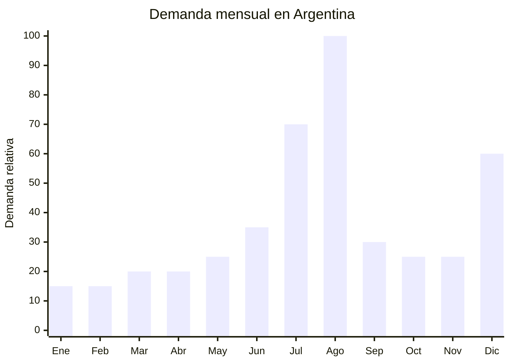

# Tablets infantiles educativas

> **Capítulo NCM 85** — Máquinas, aparatos y material eléctrico | **Temporada:** Invierno (Jun–Ago)

<Warning>
**BARRERA DE ENTRADA MEDIA-ALTA:** Este producto requiere triple certificación: **ENACOM** (WiFi + Bluetooth), **S-Mark** (seguridad eléctrica del cargador) e **IRAM** (norma de seguridad). El costo total de certificación puede alcanzar USD 3,000-7,000 por modelo. Sin las tres certificaciones, el producto NO puede despacharse ni venderse legalmente en Argentina.
</Warning>

## Qué es y por qué importarlo

Las tablets infantiles educativas son dispositivos electrónicos tipo tablet (7 a 10 pulgadas) diseñados específicamente para niños de 3 a 12 años. Se diferencian de las tablets convencionales por incluir: funda protectora antigolpes de silicona o EVA con asa y soporte integrado, sistema operativo Android con interfaz infantil (launcher kids), control parental preinstalado (límite de tiempo, filtro de contenido, bloqueo de apps), y apps educativas precargadas. Las marcas de referencia en el mercado argentino son T-Go Tabi y Enova Kids.

El pico de demanda se concentra en agosto (Día del Niño, segundo domingo) y julio (vacaciones de invierno, entretenimiento hogareño). Los padres buscan un dispositivo seguro y controlable para que sus hijos accedan a contenido educativo y entretenimiento sin riesgo de acceder a contenido inapropiado. El packaging suele incluir la funda colorida visible, generando una presentación atractiva para regalo.

China (Shenzhen) produce la gran mayoría de tablets infantiles del mundo. Las fábricas ofrecen configuraciones estándar con procesadores Allwinner o Unisoc, pantallas IPS, 2-4 GB RAM, 32-64 GB de almacenamiento, WiFi, Bluetooth, cámara frontal y trasera, y personalización de marca (logo, launcher, apps preinstaladas).

## Datos clave

| Dato | Valor |
|------|-------|
| **Posiciones NCM típicas** | 8471.30.19 (máquinas automáticas de procesamiento de datos, portátiles) |
| **Derecho de importación** | 16-20% (DIE) + 3% tasa estadística |
| **Rango FOB típico** | USD 29.00 — USD 80.00 por unidad |
| **Precio de venta en Argentina** | ARS 60.000 — ARS 200.000 |
| **Margen bruto estimado** | 80% — 200% |
| **MOQ típico** | 200 — 500 unidades |
| **Demanda en MercadoLibre** | Alta (pico Día del Niño y vacaciones) |
| **Competencia en MercadoLibre** | Media (pocas marcas específicamente infantiles) |
| **Dificultad para importar** | **Media-Alta** (ENACOM + S-Mark + IRAM triple certificación) |
| **Certificaciones necesarias** | ENACOM (WiFi + BT) + S-Mark (cargador 220V) + IRAM |
| **Antidumping** | No |

## Variantes y subtipos más comunes

| Subtipo / Variante | FOB aprox. | Venta AR aprox. | Nota |
|--------------------|-----------|-----------------|------|
| Tablet infantil 7" 2GB/32GB WiFi con funda EVA | USD 29.00 — 38.00 | ARS 60.000 — 100.000 | Entrada, más vendida |
| Tablet infantil 8" 3GB/32GB WiFi funda silicona | USD 35.00 — 48.00 | ARS 80.000 — 130.000 | **Mejor relación calidad/precio** |
| Tablet infantil 10" 4GB/64GB WiFi premium | USD 50.00 — 70.00 | ARS 120.000 — 180.000 | Pantalla grande, premium |
| Tablet infantil 7" con SIM 4G (raro) | USD 45.00 — 80.00 | ARS 100.000 — 200.000 | Mayor complejidad regulatoria |
| Tablet infantil con stylus educativo | USD 38.00 — 55.00 | ARS 85.000 — 140.000 | Diferenciador, dibujo/escritura |
| Funda antigolpes sola (accesorio) | USD 2.00 — 5.00 | ARS 8.000 — 18.000 | Cross-sell, margen alto |

## Regulaciones y requisitos

<Tabs>
  <Tab title="Certificaciones">
    | Organismo | Requiere | Detalle |
    |-----------|----------|---------|
    | ARCA (Aduana) | Sí siempre | Despacho estándar + VDI |
    | **ENACOM** | **SÍ — OBLIGATORIO** | Homologación WiFi 2.4/5GHz + Bluetooth. Costo: USD 500-1,000 por modelo. Plazo: 30-60 días |
    | **S-Mark** | **SÍ — OBLIGATORIO** | El cargador de pared (220V a 5V USB) requiere certificación de seguridad eléctrica |
    | **IRAM** | **SÍ — OBLIGATORIO** | Norma de seguridad para aparatos de tecnología de la información (IEC 62368-1) |
    | ANMAT | No | No es producto de salud |

    **Proceso:**
    1. Iniciar ENACOM y S-Mark/IRAM en paralelo para ganar tiempo
    2. Solicitar al proveedor: certificado FCC/CE (WiFi/BT), certificado IEC 62368-1 (seguridad), MSDS de batería de litio, fichas técnicas RF
    3. Tiempo total estimado: 3-5 meses
    4. Costo total estimado: USD 3,000-7,000 por modelo
  </Tab>

  <Tab title="Etiquetado">
    | Requisito | Aplica |
    |-----------|--------|
    | País de origen | Sí |
    | Datos del importador | Sí (razón social, CUIT, domicilio) |
    | Número de homologación ENACOM | Sí |
    | Sello S-Mark | Sí |
    | Tensión del cargador | Sí (220V 50Hz entrada, 5V salida) |
    | Especificaciones técnicas | Recomendable (pantalla, RAM, almacenamiento) |
    | Edad recomendada | Recomendable (3-12 años según modelo) |
    | Instrucciones en español | Sí |
  </Tab>

  <Tab title="Restricciones">
    - **Triple certificación excluyente:** ENACOM + S-Mark + IRAM. Sin las tres, el producto queda retenido en aduana.
    - **Batería de litio:** Restricciones IATA para transporte aéreo. Solicitar MSDS al proveedor. Generalmente las tablets infantiles tienen baterías de 2,500-5,000 mAh (por debajo del límite IATA).
    - **Privacidad infantil:** Aunque Argentina no tiene una ley específica tipo COPPA (EE.UU.), considerar las implicaciones de un dispositivo con cámara y micrófono para niños.
    - **Control parental:** Verificar que el software de control parental funcione correctamente y no se pueda desactivar fácilmente por el niño.
    - Sin antidumping vigente.
  </Tab>
</Tabs>

## Logística de importación

| Factor | Detalle |
|--------|---------|
| **Peso por unidad** | 400 — 700 g (tablet + funda) |
| **Volumen por unidad** | Bajo-Medio — caja de 25x20x10 cm aprox. |
| **Unidades por caja (master carton)** | 10 — 20 unidades |
| **Peso por caja** | 6 — 12 kg |
| **Cajas por contenedor 20'** | ~2,000 — 3,500 cajas |
| **Unidades por contenedor 20'** | ~30,000 — 60,000 unidades |
| **Fragilidad** | Media (pantalla puede rayarse, funda protege de golpes) |
| **Requiere embalaje especial** | Sí — protección anti-estática + cumplir normas IATA batería litio para aéreo |

<Tip>
La funda antigolpes de EVA o silicona es lo que convierte una tablet genérica en un producto "infantil" con posicionamiento diferenciado y mayor precio de venta. Solicitar al proveedor fundas en colores llamativos (rosa, celeste, verde, naranja) con asa integrada y soporte para uso en mesa. La funda es lo primero que ve el niño y genera la decisión de compra de los padres.
</Tip>

## Estacionalidad y timing de compra

| Dato | Valor |
|------|-------|
| **Meses de mayor venta** | Agosto (Día del Niño) y Julio (vacaciones invierno) |
| **Segundo pico** | Diciembre (Navidad) |
| **Pedido ideal (marítimo)** | Marzo — Abril (para llegar en junio-julio) |
| **Anticipación total (con certificaciones)** | 5-7 meses antes del primer pico |
| **Anticipación mínima** | 4-5 meses |

## Ventajas y riesgos

<CardGroup cols={2}>
  <Card title="Ventajas" icon="circle-check">
    - Ticket alto (ARS 60,000-200,000) con margen atractivo
    - Nicho específico (infantil) con menos competencia que tablets genéricas
    - Triple barrera regulatoria protege contra competencia informal
    - Demanda creciente (educación digital + entretenimiento)
    - Producto liviano: buena relación valor/peso para flete
    - Múltiples picos de demanda (Día del Niño, Navidad, vuelta a clases)
    - T-Go Tabi demostró viabilidad del nicho en Argentina
  </Card>

  <Card title="Riesgos y desventajas" icon="triangle-exclamation">
    - **Triple certificación ENACOM + S-Mark + IRAM** (USD 3,000-7,000 por modelo)
    - Proceso de certificación largo (3-5 meses)
    - Soporte posventa necesario (configuración, actualizaciones, reparaciones)
    - Obsolescencia tecnológica rápida (modelos duran 12-18 meses)
    - Competencia con tablets genéricas + funda (percibidas como alternativa)
    - Riesgo de software/launcher defectuoso que arruine la experiencia
    - Batería de litio: restricciones de transporte aéreo
  </Card>
</CardGroup>

## Palabras clave para buscar en Alibaba

`kids tablet 7 inch Android EVA case` · `children tablet education 8 inch` · `kids tablet parental control wholesale` · `tablet infantil kid-proof case OEM` · `kids learning tablet 10 inch WiFi` · `children tablet Shenzhen factory FCC CE`

## Fuentes

- MercadoLibre Argentina — búsqueda "tablet infantil", "tablet niños educativa"
- T-Go Tabi / Enova Kids — referencia de mercado argentino
- Alibaba.com — proveedores de kids tablet Android EVA case
- ENACOM — Requisitos de homologación WiFi/Bluetooth
- IEC 62368-1 — Norma de seguridad para equipos de tecnología de la información
- Nomenclador Arancelario Argentino — partida 8471.30.19
