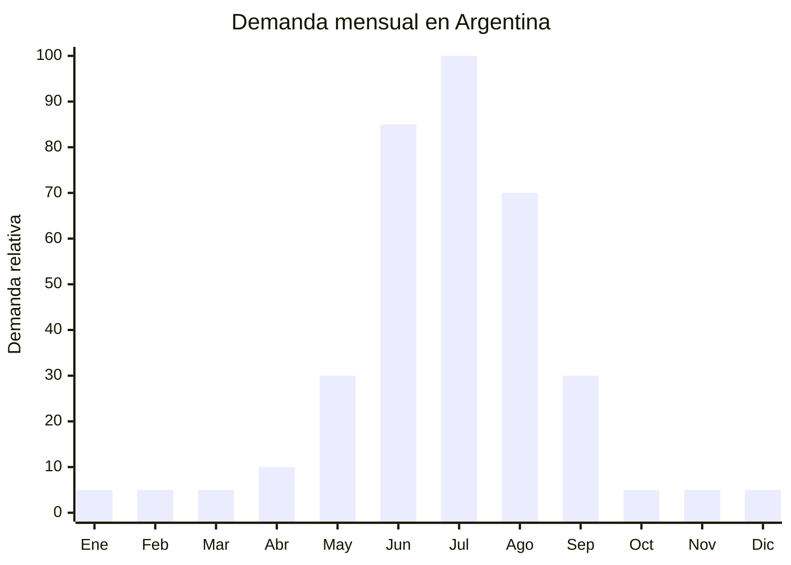

# Cadenas para nieve textiles y metálicas

> **Capítulo NCM 87** — Vehículos automóviles, tractores, velocípedos y demás vehículos terrestres | **Temporada:** Invierno (Jun–Ago)

## Qué es y por qué importarlo

Las cadenas para nieve son dispositivos de tracción que se colocan sobre los neumáticos del vehículo para circular en rutas con nieve o hielo. Existen dos tipos principales: **metálicas** (eslabones de acero endurecido en patrón escalera o rombo, montaje manual) y **textiles** (fundas de tejido técnico tipo Michelin SOS o AutoSock, montaje rápido sin herramientas). Las cadenas metálicas son más económicas y durables pero requieren práctica para colocar; las textiles son más caras pero se colocan en 2-3 minutos y son más cómodas de manejar.

En Argentina, las cadenas para nieve son **obligatorias por ley** para circular en rutas de montaña durante la temporada invernal (junio-septiembre). Gendarmería Nacional y Vialidad exigen su portación y uso en rutas como la RN 40 (Mendoza, Neuquén), accesos a centros de ski (Cerro Catedral, Las Leñas, Chapelco, Cerro Castor), y pasos internacionales a Chile (Cristo Redentor, Cardenal Samoré). La obligatoriedad legal genera una **demanda cautiva** que no depende de preferencias del consumidor sino de regulación vial.

El pico de demanda se concentra en junio-julio, cuando comienza la temporada de ski y las familias planifican vacaciones de invierno en destinos de montaña. China produce tanto cadenas metálicas (Hebei, Shandong) como accesorios antideslizantes, mientras que las cadenas textiles premium se fabrican en Europa pero tienen alternativas chinas a menor costo.

## Datos clave

| Dato | Valor |
|------|-------|
| **Posiciones NCM típicas** | 7315.89.00 (cadenas y sus partes, de fundición/hierro/acero) / 8708.99.90 (accesorios para vehículos) |
| **Derecho de importación** | 14-18% (DIE según NCM) + 3% tasa estadística |
| **Rango FOB típico** | USD 5.00 — USD 25.00 por juego (par de ruedas) |
| **Precio de venta en Argentina** | ARS 15.000 — ARS 80.000 por juego |
| **Margen bruto estimado** | 100% — 300% |
| **MOQ típico** | 200 — 500 juegos |
| **Demanda en MercadoLibre** | Alta (estacional + obligatoria por ley) |
| **Competencia en MercadoLibre** | Media |
| **Dificultad para importar** | Baja (sin regulaciones específicas obligatorias) |
| **Certificaciones necesarias** | Ninguna obligatoria específica (recomendable certificación de resistencia) |
| **Antidumping** | No |

## Variantes y subtipos más comunes

| Subtipo / Variante | FOB aprox. | Venta AR aprox. | Nota |
|--------------------|-----------|-----------------|------|
| Cadenas metálicas escalera R13-R15 | USD 5.00 — 10.00 | ARS 15.000 — 30.000 | **Más vendidas**, económicas |
| Cadenas metálicas rombo R15-R17 | USD 8.00 — 15.00 | ARS 25.000 — 45.000 | Mejor tracción lateral |
| Cadenas metálicas reforzadas SUV R16-R18 | USD 12.00 — 20.00 | ARS 35.000 — 60.000 | Para camionetas y SUV |
| Cadenas textiles tipo AutoSock R13-R17 | USD 15.00 — 25.00 | ARS 40.000 — 80.000 | Montaje rápido, premium |
| Cadenas plásticas/TPU universales | USD 10.00 — 18.00 | ARS 30.000 — 55.000 | Alternativa liviana |
| Kit cadena + guantes + alfombra + bolsa | USD 8.00 — 15.00 | ARS 20.000 — 40.000 | Valor agregado, kit completo |

## Regulaciones y requisitos

<Tabs>
  <Tab title="Certificaciones">
    | Organismo | Requiere | Detalle |
    |-----------|----------|---------|
    | ARCA (Aduana) | Sí siempre | Despacho estándar |
    | INTI | No obligatorio | No existe norma IRAM obligatoria para cadenas de nieve |
    | ENACOM | No | No es producto electrónico |
    | ANMAT | No | No es producto de salud |
    | Vialidad Nacional | No certifica producto | Pero exige su uso en rutas de montaña. La cadena debe ser apta para la medida de neumático del vehículo |

    **Recomendación:** Aunque no hay certificación obligatoria, solicitar al proveedor test de resistencia a la tracción y test de fatiga de los eslabones. Ofrecer una tabla de compatibilidad de medidas de neumáticos clara y precisa es fundamental para evitar devoluciones ("no le entra a mi auto" es la queja #1). Incluir instrucciones de montaje con fotos/video QR.
  </Tab>

  <Tab title="Etiquetado">
    | Requisito | Aplica |
    |-----------|--------|
    | País de origen | Sí |
    | Datos del importador | Sí (nombre, dirección, CUIT) |
    | Medidas de neumático compatibles | **Crítico** (ej: 195/65 R15, 205/55 R16) |
    | Material | Recomendable (acero endurecido, textil técnico) |
    | Instrucciones de montaje | **Sí — esencial** (con diagramas claros) |
    | Advertencias de uso | Sí (velocidad máxima 40-50 km/h con cadenas) |
  </Tab>

  <Tab title="Restricciones">
    - **Obligatoriedad legal:** En Argentina, la portación de cadenas para nieve es obligatoria en rutas de montaña durante la temporada invernal. Gendarmería puede multar por no llevarlas.
    - **Compatibilidad de medida:** La cadena DEBE ser de la medida exacta del neumático. Una medida incorrecta puede dañar guardabarros, frenos o suspensión.
    - **Velocidad máxima con cadenas:** 40-50 km/h. Indicar claramente en el producto.
    - **No usar en asfalto seco:** Las cadenas metálicas se destruyen y dañan el pavimento si se usan sin nieve.
    - Sin antidumping vigente.
  </Tab>
</Tabs>

## Logística de importación

| Factor | Detalle |
|--------|---------|
| **Peso por juego** | 2 — 6 kg (metálicas) / 0.5 — 1.5 kg (textiles) |
| **Volumen por juego** | Bajo-Medio — caja/bolsa de 30x25x10 cm aprox. |
| **Unidades por caja (master carton)** | 5 — 10 juegos (metálicas) / 10 — 20 juegos (textiles) |
| **Peso por caja** | 15 — 40 kg (metálicas) / 5 — 15 kg (textiles) |
| **Cajas por contenedor 20'** | ~800 — 2,000 cajas |
| **Unidades por contenedor 20'** | ~5,000 — 20,000 juegos |
| **Fragilidad** | Muy baja (acero / textil técnico) |
| **Requiere embalaje especial** | No — bolsa o caja resistente. Las metálicas pueden oxidarse: bolsa con cierre + gel de sílice |

<Tip>
La clave del éxito en cadenas para nieve es la tabla de compatibilidad de medidas. Crear una tabla detallada que indique qué modelo de cadena corresponde a cada medida de neumático (195/65 R15, 205/55 R16, 215/60 R17, etc.) y publicarla prominentemente en la publicación de MercadoLibre. La queja #1 es "compré la medida equivocada" y esto se evita con información clara. Incluir un código QR que lleve a un video de montaje.
</Tip>

## Estacionalidad y timing de compra

| Dato | Valor |
|------|-------|
| **Meses de mayor venta** | Junio — Julio (inicio temporada ski) |
| **Temporada extendida** | Junio — Septiembre |
| **Pedido ideal (marítimo)** | Febrero — Marzo (para llegar en mayo) |
| **Pedido ideal (aéreo)** | Mayo (para llegar en junio) |
| **Anticipación mínima** | 3 meses antes de junio |

<Note>
Las cadenas para nieve tienen demanda prácticamente nula fuera de la temporada junio-septiembre. Sin embargo, al ser de obligación legal, la demanda en temporada es cautiva y predecible. Los turistas que viajan a Bariloche, Las Leñas, San Martín de los Andes, Ushuaia y Mendoza por temporada de ski compran cadenas de forma casi obligatoria.
</Note>

## Ventajas y riesgos

<CardGroup cols={2}>
  <Card title="Ventajas" icon="circle-check">
    - **Demanda cautiva:** obligatorias por ley en rutas de montaña
    - Margen atractivo (100-300%)
    - Sin certificaciones obligatorias (barrera baja)
    - Producto simple: bajo riesgo de defectos
    - Logística simple: acero o textil, sin fragilidad
    - Complemento con kit invierno auto (guantes, raspador, bolsa)
    - Mercado predecible año a año
  </Card>

  <Card title="Riesgos y desventajas" icon="triangle-exclamation">
    - Estacionalidad extrema: demanda solo junio-septiembre
    - Stock sobrante queda hasta el próximo invierno
    - Devoluciones por medida incorrecta (el riesgo más frecuente)
    - Competencia de marcas establecidas en el segmento
    - Cadenas metálicas chinas pueden tener eslabones débiles
    - Responsabilidad si la cadena se rompe y causa un accidente
    - Mercado limitado: solo conductores que van a la montaña
  </Card>
</CardGroup>

## Palabras clave para buscar en Alibaba

`snow chain car tires wholesale` · `anti skid chain metal universal` · `textile snow chain car sock` · `snow chain TPU wholesale` · `car tire chain steel alloy` · `snow chain manufacturer Hebei Shandong`

## Fuentes

- MercadoLibre Argentina — búsqueda "cadenas para nieve auto", "cadenas nieve R16"
- Alibaba.com — proveedores de snow chain car tires wholesale
- Gendarmería Nacional Argentina — normativa de portación de cadenas en rutas de montaña
- Vialidad Nacional — requisitos de circulación invernal
- Nomenclador Arancelario Argentino — partida 7315 / 8708
