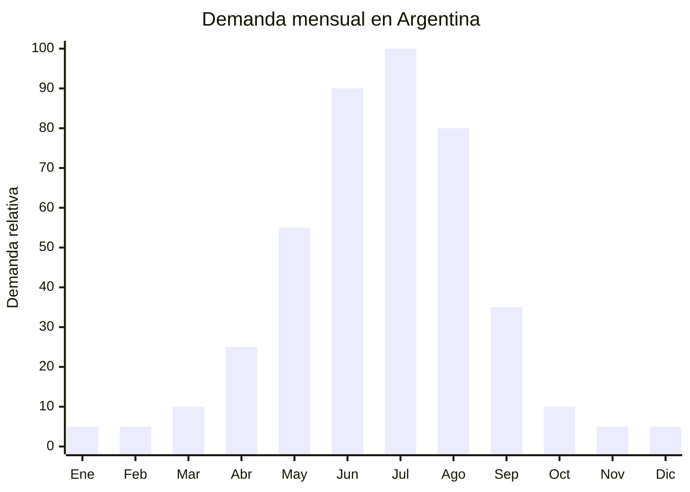

# Fundas de volante térmicas de peluche/polar

> **Capítulo NCM 87** — Vehículos automóviles, tractores, velocípedos y demás vehículos terrestres | **Temporada:** Invierno (Jun–Ago)

## Qué es y por qué importarlo

Las fundas de volante térmicas son coberturas de materiales aislantes y suaves (peluche, polar, felpa, lana sintética, cuero acolchado con forro) que se colocan sobre el volante del automóvil para evitar el contacto directo con el aro de cuero o plástico helado durante el invierno. A diferencia de las fundas con calefacción 12V (que se conectan al encendedor y se venden más en otoño como producto eléctrico), estas fundas térmicas son pasivas: no usan electricidad, simplemente aíslan térmicamente mediante el material. El diámetro universal más común es 37-38 cm, que cubre la mayoría de los autos de pasajeros.

El invierno argentino (junio-agosto) genera la demanda de este producto porque las mañanas con temperaturas de 0 a 10 grados hacen que tocar el volante con las manos desnudas sea una experiencia muy desagradable. En ciudades como Buenos Aires, Córdoba, Mendoza, Rosario y especialmente en la Patagonia, los primeros minutos al volante con el volante congelado es un "dolor" cotidiano que esta funda resuelve de manera simple y económica.

China (Yiwu, Zhejiang) es el principal proveedor mundial de fundas de volante en todos los materiales. El precio FOB de USD 1.50 a USD 4.00 permite márgenes excepcionales de 200-500%. Es un producto ultraliviano y compacto, ideal para envío aéreo y primeras importaciones de bajo riesgo.

## Datos clave

| Dato | Valor |
|------|-------|
| **Posiciones NCM típicas** | 8708.99.90 (partes y accesorios de vehículos, otros) |
| **Derecho de importación** | 18% (DIE) + 3% tasa estadística |
| **Rango FOB típico** | USD 1.50 — USD 4.00 por unidad |
| **Precio de venta en Argentina** | ARS 5.000 — ARS 18.000 |
| **Margen bruto estimado** | 200% — 500% |
| **MOQ típico** | 300 — 1,000 unidades |
| **Demanda en MercadoLibre** | Media-Alta (estacional invernal) |
| **Competencia en MercadoLibre** | Media |
| **Dificultad para importar** | **Muy baja** (sin certificaciones, sin regulaciones) |
| **Certificaciones necesarias** | Ninguna |
| **Antidumping** | No |

## Variantes y subtipos más comunes

| Subtipo / Variante | FOB aprox. | Venta AR aprox. | Nota |
|--------------------|-----------|-----------------|------|
| Funda volante peluche/felpa suave 37-38cm | USD 1.50 — 2.50 | ARS 5.000 — 10.000 | **Más vendida**, tacto ultra-suave |
| Funda volante polar/micropolar 37-38cm | USD 1.80 — 3.00 | ARS 6.000 — 12.000 | Estética sobria |
| Funda volante lana sintética tipo borrego | USD 2.50 — 4.00 | ARS 8.000 — 15.000 | Premium, aspecto rústico |
| Funda volante cuero PU con forro acolchado | USD 2.00 — 3.50 | ARS 7.000 — 14.000 | Elegante, deportivo |
| Funda volante con diseño estampado (animal print, etc.) | USD 2.00 — 3.50 | ARS 6.000 — 12.000 | Diferenciación visual |
| Kit funda volante + funda palanca + funda freno | USD 3.00 — 5.00 | ARS 10.000 — 18.000 | Mayor ticket, kit completo |

## Regulaciones y requisitos

<Tabs>
  <Tab title="Certificaciones">
    | Organismo | Requiere | Detalle |
    |-----------|----------|---------|
    | ARCA (Aduana) | Sí siempre | Despacho estándar |
    | INTI | No | Sin norma IRAM para fundas de volante |
    | ENACOM | No | No es electrónico (la funda térmica es pasiva, no tiene electricidad) |
    | ANMAT | No | No es producto de salud |
    | SENASA | No | No es alimento |

    **Recomendación:** Es uno de los productos con menor barrera regulatoria para importar. No requiere NINGUNA certificación. Simplemente cumplir con despacho aduanero estándar y etiquetado de origen. Ideal como producto de entrada para importadores principiantes.
  </Tab>

  <Tab title="Etiquetado">
    | Requisito | Aplica |
    |-----------|--------|
    | País de origen | Sí |
    | Datos del importador | Sí (nombre, dirección, CUIT) |
    | Material | Recomendable (peluche, polar, lana sintética) |
    | Diámetro compatible | **Crítico** (indicar 37-38cm universal) |
    | Instrucciones de colocación | Recomendable |
    | Instrucciones de lavado | Recomendable |
  </Tab>

  <Tab title="Restricciones">
    - Sin certificaciones requeridas.
    - Sin medidas antidumping vigentes.
    - Sin restricciones específicas de importación.
    - **Seguridad vial:** La funda NO debe girar sobre el volante durante el manejo. Verificar que el sistema de fijación (elástico interno, costura ajustada) mantenga la funda firmemente en su lugar.
    - Verificar que el material no genere pelusa excesiva que ensucie la ropa o irrité las manos.
    - El diámetro debe ser compatible: una funda muy grande gira, una muy chica no entra.
  </Tab>
</Tabs>

## Logística de importación

| Factor | Detalle |
|--------|---------|
| **Peso por unidad** | 100 — 300 g |
| **Volumen por unidad** | Bajo — bolsa de 30x20x5 cm aprox. (comprimida) |
| **Unidades por caja (master carton)** | 20 — 50 unidades |
| **Peso por caja** | 3 — 10 kg |
| **Cajas por contenedor 20'** | ~3,000 — 5,000 cajas |
| **Unidades por contenedor 20'** | ~100,000 — 200,000 unidades |
| **Fragilidad** | Nula (textil suave, indestructible en transporte) |
| **Requiere embalaje especial** | No — bolsa OPP individual + caja master. Puede comprimirse al vacío para reducir volumen |

<Tip>
Las fundas de volante son el producto de importación de menor riesgo posible: ultralivianas, sin fragilidad, sin certificaciones, margen alto y demanda estacional predecible. Ideal como primer producto para importadores principiantes o como complemento de contenedor con otros productos automotrices invernales (cadenas de nieve, cubres parabrisas, raspadores de hielo). Un envío aéreo de 30 kg puede contener 150+ unidades.
</Tip>

## Estacionalidad y timing de compra

| Dato | Valor |
|------|-------|
| **Meses de mayor venta** | Junio — Agosto (invierno pleno) |
| **Pico absoluto** | Julio (frío máximo) |
| **Pedido ideal (marítimo)** | Febrero — Marzo (para llegar en mayo) |
| **Pedido ideal (aéreo)** | Mayo (llega en junio) |
| **Anticipación mínima** | 2-3 meses marítimo / 15 días aéreo |

## Ventajas y riesgos

<CardGroup cols={2}>
  <Card title="Ventajas" icon="circle-check">
    - Margen excepcional (200-500%)
    - **Sin certificaciones:** la barrera de importación más baja posible
    - Producto ultraliviano: envío aéreo rentable
    - Fragilidad nula: cero roturas en transporte
    - Demanda predecible y estacional
    - Ideal para importadores principiantes
    - Complemento perfecto para kit auto invierno
    - MOQ bajo: 300-1,000 unidades
  </Card>

  <Card title="Riesgos y desventajas" icon="triangle-exclamation">
    - Estacionalidad extrema: demanda solo junio-agosto
    - Ticket bajo (ARS 5,000-18,000): requiere volumen para facturación
    - Producto commodity: difícil diferenciarse
    - Competencia de precio con productos ya en plaza
    - Riesgo de que la funda gire sobre el volante (seguridad vial)
    - Material de baja calidad se aplasta rápido perdiendo el efecto térmico
    - Stock sobrante ocupa espacio hasta el próximo invierno
  </Card>
</CardGroup>

## Palabras clave para buscar en Alibaba

`steering wheel cover plush winter` · `car steering cover fleece warm` · `furry steering wheel cover wholesale` · `winter steering wheel cover polar` · `sheepskin steering cover 38cm` · `steering wheel cover Yiwu factory wholesale`

## Fuentes

- MercadoLibre Argentina — búsqueda "funda volante peluche", "cubre volante invierno"
- Alibaba.com — proveedores de steering wheel cover plush winter
- Nomenclador Arancelario Argentino — partida 8708.99.90
