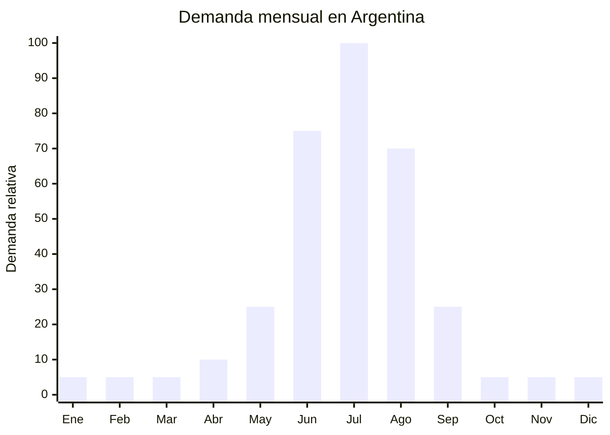

# Antiparras de ski / snowboard

> **Capítulo NCM 90** — Instrumentos y aparatos de óptica, fotografía, medida, control y precisión | **Temporada:** Invierno (Jun–Ago)

## Qué es y por qué importarlo

Las antiparras de ski (también llamadas goggles o máscaras de nieve) son equipamiento de protección ocular diseñado para deportes de nieve (ski, snowboard, motonieves). Se componen de un marco de espuma acolchada que se ajusta al rostro, una lente de policarbonato o similar con tratamiento anti-fog (antivaho), protección UV400 (bloquea el 100% de los rayos UVA/UVB/UVC), y cinta elástica ajustable compatible con cascos de ski. Las lentes pueden ser espejadas, polarizadas, fotocromáticas o con filtro intercambiable según condiciones de luz.

El pico de demanda se concentra en julio, cuando la temporada de ski argentino alcanza su punto máximo. Los centros de ski de Bariloche (Cerro Catedral), Mendoza (Las Leñas), Neuquén (Chapelco, Cerro Bayo), Ushuaia (Cerro Castor) y San Juan (Barreal) atraen miles de turistas nacionales e internacionales. Las antiparras son equipamiento esencial — no opcional — para la práctica de ski y snowboard: protegen los ojos del reflejo de la nieve (que puede causar ceguera de nieve), del viento, del frío y de la nieve misma durante la actividad.

China (Shenzhen y Dongguan para el diseño óptico, Yiwu para líneas económicas) es el principal fabricante mundial de antiparras de ski. Las fábricas producen desde modelos económicos con lente cilíndrica hasta versiones premium con lente esférica, ventilación activa y compatibilidad con lentes ópticos (OTG — Over The Glasses).

## Datos clave

| Dato | Valor |
|------|-------|
| **Posiciones NCM típicas** | 9004.90.90 (gafas y artículos análogos, los demás) |
| **Derecho de importación** | 18% (DIE) + 3% tasa estadística |
| **Rango FOB típico** | USD 3.00 — USD 12.00 por unidad |
| **Precio de venta en Argentina** | ARS 12.000 — ARS 60.000 |
| **Margen bruto estimado** | 200% — 400% |
| **MOQ típico** | 300 — 1,000 unidades |
| **Demanda en MercadoLibre** | Alta (estacional julio-agosto) |
| **Competencia en MercadoLibre** | Media |
| **Dificultad para importar** | **Baja** (sin regulaciones especiales) |
| **Certificaciones necesarias** | Ninguna obligatoria (recomendable test UV400 y anti-impacto) |
| **Antidumping** | No |

## Variantes y subtipos más comunes

| Subtipo / Variante | FOB aprox. | Venta AR aprox. | Nota |
|--------------------|-----------|-----------------|------|
| Antiparra lente cilíndrica espejada UV400 | USD 3.00 — 5.00 | ARS 12.000 — 22.000 | Entrada, buena relación precio/valor |
| Antiparra lente esférica doble capa anti-fog | USD 5.00 — 8.00 | ARS 20.000 — 38.000 | **Más vendida**, mejor campo visual |
| Antiparra lente polarizada + espejada | USD 6.00 — 10.00 | ARS 25.000 — 45.000 | Premium, reduce deslumbramiento |
| Antiparra OTG (compatible con anteojos ópticos) | USD 5.00 — 9.00 | ARS 22.000 — 40.000 | Nicho importante, usuarios con graduación |
| Antiparra con lente intercambiable magnética | USD 8.00 — 12.00 | ARS 35.000 — 60.000 | Alta gama, lente día y noche |
| Antiparra infantil ski/snowboard | USD 2.50 — 5.00 | ARS 10.000 — 22.000 | Demanda específica, familias |

## Regulaciones y requisitos

<Tabs>
  <Tab title="Certificaciones">
    | Organismo | Requiere | Detalle |
    |-----------|----------|---------|
    | ARCA (Aduana) | Sí siempre | Despacho estándar |
    | ANMAT | No | No es producto médico (es protección deportiva) |
    | ENACOM | No | No es electrónico |
    | INTI | No obligatorio | No existe norma IRAM obligatoria para antiparras de ski |
    | SENASA | No | No es alimento |

    **Recomendación:** Aunque no hay certificación obligatoria argentina, solicitar al proveedor: test de protección UV400 (laboratorio independiente), test de resistencia al impacto (norma EN 174 europea o ASTM F659 americana), y certificado anti-fog. Estos datos son valiosos para la publicación de venta y generan confianza. Las marcas premium (Oakley, Smith, POC) certifican bajo EN 174; replicar este estándar diferencia tu producto.
  </Tab>

  <Tab title="Etiquetado">
    | Requisito | Aplica |
    |-----------|--------|
    | País de origen | Sí |
    | Datos del importador | Sí (nombre, dirección, CUIT) |
    | Protección UV | Recomendable indicar "UV400" o "100% UV protection" |
    | Categoría de filtro | Recomendable (S0 a S4 según transmisión de luz) |
    | Compatibilidad con casco | Recomendable |
    | Instrucciones de cuidado de la lente | Recomendable (no limpiar con papel, usar microfibra) |
  </Tab>

  <Tab title="Restricciones">
    - Sin certificaciones obligatorias.
    - Sin medidas antidumping vigentes.
    - Sin restricciones específicas de importación.
    - **Protección UV real:** Si el producto declara UV400 pero no cumple, el usuario puede sufrir daño ocular (la lente oscura dilata la pupila y si no filtra UV, entra más radiación). Verificar con test de laboratorio.
    - Lente anti-fog de baja calidad se empaña rápidamente: la queja #1 en reviews.
    - Espuma del marco que se despega en modelos económicos: segundo punto de fallo.
  </Tab>
</Tabs>

## Logística de importación

| Factor | Detalle |
|--------|---------|
| **Peso por unidad** | 150 — 300 g |
| **Volumen por unidad** | Bajo — caja/funda de 20x12x10 cm aprox. |
| **Unidades por caja (master carton)** | 20 — 50 unidades |
| **Peso por caja** | 5 — 12 kg |
| **Cajas por contenedor 20'** | ~2,500 — 4,000 cajas |
| **Unidades por contenedor 20'** | ~80,000 — 150,000 unidades |
| **Fragilidad** | Media (lente puede rayarse si no está protegida) |
| **Requiere embalaje especial** | Sí — funda rígida o semi-rígida individual + bolsa de microfibra para proteger la lente |

<Tip>
Las antiparras de ski tienen una excelente relación valor/peso: livianas, compactas y con margen de 200-400%. Un envío aéreo de 50 kg puede contener 250+ unidades con un costo de flete de USD 0.50-1.00 por unidad. Para llegar a la temporada de ski (julio), un envío aéreo en junio es viable. Incluir la bolsa de microfibra y un estuche protector eleva la percepción de calidad y justifica un precio superior.
</Tip>

## Estacionalidad y timing de compra

| Dato | Valor |
|------|-------|
| **Meses de mayor venta** | Junio — Agosto (temporada ski) |
| **Pico absoluto** | Julio (vacaciones invierno + ski pleno) |
| **Pedido ideal (marítimo)** | Febrero — Marzo (para llegar en mayo) |
| **Pedido ideal (aéreo)** | Mayo — Junio (llega en 10-15 días) |
| **Anticipación mínima** | 2-3 meses marítimo / 15 días aéreo |

## Ventajas y riesgos

<CardGroup cols={2}>
  <Card title="Ventajas" icon="circle-check">
    - Margen excepcional (200-400%)
    - Producto ultraliviano: envío aéreo viable y rentable
    - Sin certificaciones obligatorias (barrera de entrada baja)
    - Equipamiento esencial (no opcional) para ski/snowboard
    - Ticket medio-alto (ARS 12,000-60,000)
    - Ideal para marca propia deportiva
    - Cross-sell con accesorios: balaclava, guantes, casco, cuello térmico
  </Card>

  <Card title="Riesgos y desventajas" icon="triangle-exclamation">
    - Estacionalidad extrema: demanda solo junio-agosto
    - Stock sobrante queda hasta la próxima temporada de ski
    - Lente anti-fog de baja calidad: queja principal
    - Competencia con marcas premium (Oakley, Smith, Anon)
    - Mercado geográficamente concentrado (turismo montaña)
    - Si la protección UV no es real, riesgo de salud y responsabilidad
    - Espuma que se despega = devoluciones
  </Card>
</CardGroup>

## Palabras clave para buscar en Alibaba

`ski goggles UV400 anti fog wholesale` · `snowboard goggles double lens` · `ski goggles OTG over glasses` · `snow goggles magnetic lens interchange` · `ski goggles polarized mirror wholesale` · `ski goggles factory OEM Dongguan`

## Fuentes

- MercadoLibre Argentina — búsqueda "antiparras ski", "goggles snowboard"
- Alibaba.com — proveedores de ski goggles UV400 anti fog wholesale
- EN 174 — Norma europea de protección ocular para ski
- ASTM F659 — Norma americana para goggles de ski
- Nomenclador Arancelario Argentino — partida 9004.90.90
