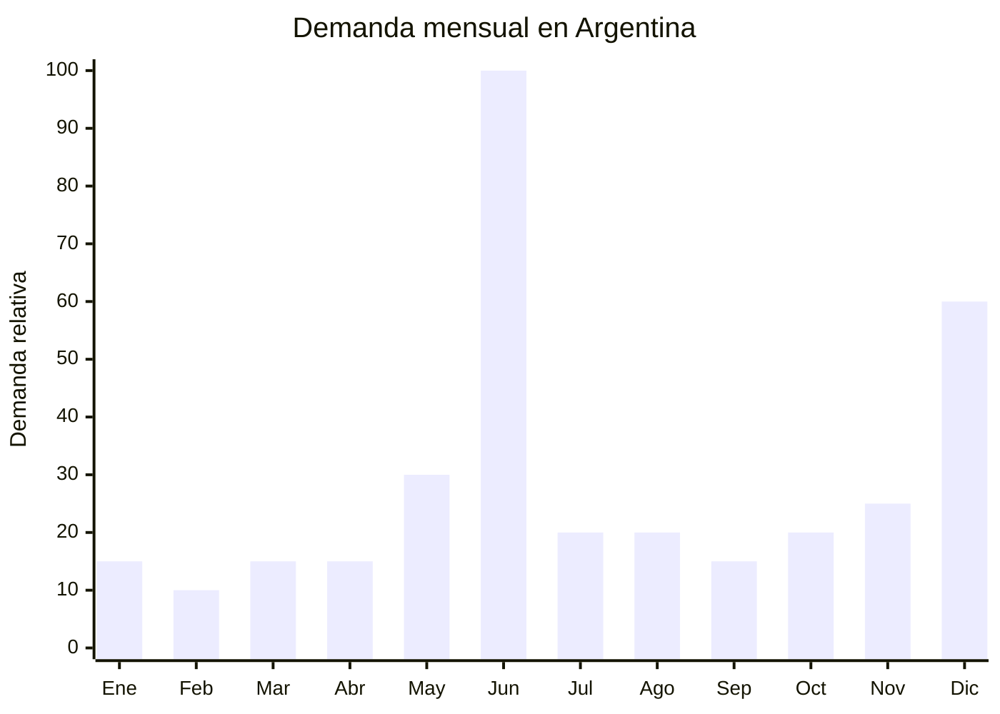

# Relojes de pulsera masculinos para regalo (Día del Padre)

> **Capítulo NCM 91** — Aparatos de relojería y sus partes | **Temporada:** Invierno (Jun–Ago)

## Qué es y por qué importarlo

Los relojes de pulsera masculinos para regalo son relojes de moda (fashion watches) con movimiento de cuarzo (a pila), dirigidos al mercado de regalos masculinos en fechas especiales. Se diferencian de los smartwatches y relojes deportivos en que priorizan el diseño, la estética y la presentación (packaging premium con caja forrada, almohadilla y bolsa) por sobre la funcionalidad tecnológica. Los estilos más demandados son: analógico clásico (caja acero, malla cuero o metal, esfera limpia), cronógrafo deportivo (sub-diales decorativos, bisel giratorio, look robusto) y minimalista tipo Bauhaus (esfera simple, malla mesh).

El pico de demanda se concentra de forma explosiva en la tercera semana de junio por el Día del Padre (tercer domingo de junio en Argentina). El reloj es uno de los regalos más tradicionales y buscados para esta fecha. A diferencia de un smartwatch que requiere ENACOM y tiene ticket alto, el reloj de cuarzo analógico NO requiere certificaciones (no emite radiofrecuencia, no se conecta a red) y se vende en un rango de ARS 8,000 a ARS 45,000, accesible para la mayoría de los compradores.

Guangzhou (Panyu) y Shenzhen (Bao'an) son los dos principales centros productores de relojes de moda del mundo. Las fábricas ofrecen personalización total: diseño de esfera, color de caja (oro rosa, negro PVD, plateado), tipo de malla (cuero genuino, cuero PU, acero, silicona), logo de marca propia, y packaging premium con caja presentación.

## Datos clave

| Dato | Valor |
|------|-------|
| **Posiciones NCM típicas** | 9102.11.00 / 9102.12.00 (relojes de pulsera, mecánicos o electrónicos) |
| **Derecho de importación** | 20% (DIE) + 3% tasa estadística |
| **Rango FOB típico** | USD 3.00 — USD 15.00 por unidad (con packaging) |
| **Precio de venta en Argentina** | ARS 8.000 — ARS 45.000 |
| **Margen bruto estimado** | 150% — 400% |
| **MOQ típico** | 200 — 500 unidades |
| **Demanda en MercadoLibre** | Alta (pico explosivo Día del Padre) |
| **Competencia en MercadoLibre** | Alta |
| **Dificultad para importar** | **Baja** (sin certificaciones obligatorias para cuarzo analógico) |
| **Certificaciones necesarias** | Ninguna (si es cuarzo analógico sin Bluetooth/WiFi) |
| **Antidumping** | No |

## Variantes y subtipos más comunes

| Subtipo / Variante | FOB aprox. | Venta AR aprox. | Nota |
|--------------------|-----------|-----------------|------|
| Reloj analógico clásico cuarzo + malla cuero PU | USD 3.00 — 5.00 | ARS 8.000 — 18.000 | Entrada, mayor volumen |
| Reloj cronógrafo deportivo + malla acero | USD 5.00 — 9.00 | ARS 15.000 — 30.000 | **Más vendido para regalo** |
| Reloj minimalista tipo Bauhaus + malla mesh | USD 4.00 — 7.00 | ARS 12.000 — 25.000 | Tendencia, diseño limpio |
| Reloj con caja madera + cuero genuino | USD 8.00 — 15.00 | ARS 25.000 — 45.000 | Premium, presentación superior |
| Set reloj + pulsera + caja regalo | USD 5.00 — 10.00 | ARS 15.000 — 35.000 | Mayor ticket, kit regalo |
| Set reloj + billetera + caja premium | USD 7.00 — 12.00 | ARS 20.000 — 40.000 | Combo Día del Padre estrella |

## Regulaciones y requisitos

<Tabs>
  <Tab title="Certificaciones">
    | Organismo | Requiere | Detalle |
    |-----------|----------|---------|
    | ARCA (Aduana) | Sí siempre | Despacho estándar |
    | ENACOM | **No** | El reloj de cuarzo analógico NO emite radiofrecuencia. NO requiere homologación ENACOM. ATENCIÓN: si el reloj fuera smartwatch o tuviera Bluetooth, SÍ requeriría ENACOM |
    | S-Mark | No | No se conecta a 220V (funciona a pila de botón) |
    | ANMAT | No | No es producto de salud |
    | INTI | No | Sin norma IRAM obligatoria para relojes |

    **Recomendación:** La ausencia total de barreras regulatorias es la principal ventaja competitiva de los relojes de cuarzo analógico frente a los smartwatches (que requieren ENACOM). Asegurarse de importar SOLAMENTE modelos sin Bluetooth, WiFi ni GPS para evitar completamente la necesidad de certificaciones.
  </Tab>

  <Tab title="Etiquetado">
    | Requisito | Aplica |
    |-----------|--------|
    | País de origen | Sí |
    | Datos del importador | Sí (nombre, dirección, CUIT) |
    | Material de la caja | Recomendable (acero inoxidable, aleación) |
    | Tipo de movimiento | Recomendable (cuarzo japonés Miyota, Seiko VD53, etc.) |
    | Resistencia al agua | Si se declara, indicar en ATM o metros (ej: 3 ATM / 30m) |
    | Tipo de vidrio | Recomendable (mineral, cristal Hardlex, etc.) |
    | Instrucciones y garantía | Recomendable |
  </Tab>

  <Tab title="Restricciones">
    - Sin certificaciones requeridas (reloj cuarzo analógico).
    - Sin medidas antidumping vigentes.
    - **Resistencia al agua:** Si se declara "resistente al agua" o "waterproof", debe ser real y demostrable. Declarar resistencia falsa es publicidad engañosa y genera devoluciones.
    - **Movimiento de cuarzo:** Especificar marca del movimiento (Miyota, Seiko/TMI, Sunon). Un movimiento genérico puede fallar en meses y generar reclamos.
    - **Propiedad intelectual:** NO copiar diseños de marcas reconocidas (Rolex, Omega, Cartier). Las imitaciones son ilegales y Aduana puede retener el embarque.
    - La pila de botón (SR626SW, LR44) no tiene restricciones de transporte.
  </Tab>
</Tabs>

## Logística de importación

| Factor | Detalle |
|--------|---------|
| **Peso por unidad** | 60 — 150 g (reloj solo) / 200 — 400 g (con packaging) |
| **Volumen por unidad** | Bajo — caja regalo de 12x10x8 cm aprox. |
| **Unidades por caja (master carton)** | 20 — 50 unidades |
| **Peso por caja** | 5 — 15 kg |
| **Cajas por contenedor 20'** | ~2,500 — 4,000 cajas |
| **Unidades por contenedor 20'** | ~80,000 — 150,000 unidades |
| **Fragilidad** | Media (vidrio del reloj puede rayarse; packaging protege) |
| **Requiere embalaje especial** | Sí — cada reloj en su caja presentación individual con almohadilla. Las cajas master con separadores para evitar movimiento |

<Tip>
El packaging premium ES el producto en el contexto de regalo. Una caja presentación elegante (cuero PU negro, interior de terciopelo, almohadilla) puede costar USD 0.50-1.50 adicional al proveedor pero permite cobrar ARS 5,000-10,000 más al consumidor. El reloj mediocre con packaging excelente se vende mejor que el reloj bueno en bolsita plástica. Solicitar fotos del packaging antes de confirmar el pedido.
</Tip>

## Estacionalidad y timing de compra

| Dato | Valor |
|------|-------|
| **Meses de mayor venta** | Junio (Día del Padre, tercer domingo) |
| **Segundo pico** | Diciembre (Navidad / regalos) |
| **Pedido ideal (marítimo)** | Febrero — Marzo (para llegar en mayo) |
| **Pedido ideal (aéreo)** | Mayo (llega primera semana de junio) |
| **Anticipación mínima** | 3 meses marítimo / 15-20 días aéreo |

<Note>
El Día del Padre concentra más del 50% de la venta anual de relojes de moda masculinos en Argentina. La ventana de venta es de apenas 10-15 días (primera a tercera semana de junio). Toda la estrategia de importación debe apuntar a tener stock disponible desde el 1 de junio. Después del Día del Padre, la demanda cae drásticamente hasta diciembre.
</Note>

## Ventajas y riesgos

<CardGroup cols={2}>
  <Card title="Ventajas" icon="circle-check">
    - Margen atractivo (150-400%)
    - **Sin certificaciones:** cero barreras regulatorias
    - Producto liviano y compacto: envío aéreo viable
    - Demanda explosiva y predecible (Día del Padre)
    - Personalización total: marca propia con MOQ bajos
    - Packaging premium agrega valor percibido enorme
    - Sets y combos (reloj + pulsera + billetera) aumentan ticket
    - Guangzhou y Shenzhen: miles de proveedores especializados
  </Card>

  <Card title="Riesgos y desventajas" icon="triangle-exclamation">
    - Concentración extrema de demanda: 10-15 días de junio
    - Stock sobrante queda hasta Navidad
    - Competencia muy alta en MercadoLibre
    - Riesgo de propiedad intelectual (NO copiar diseños de marcas)
    - Movimiento de cuarzo genérico puede fallar rápido
    - Percepción de "reloj chino barato" en parte del mercado
    - Guerra de precios en el segmento económico
  </Card>
</CardGroup>

## Palabras clave para buscar en Alibaba

`men watch quartz wholesale OEM` · `fashion watch men chronograph` · `minimalist watch men leather strap` · `men watch gift set box wholesale` · `watch brand OEM Guangzhou factory` · `quartz watch Miyota movement wholesale` · `men watch gift box premium packaging`

## Fuentes

- MercadoLibre Argentina — búsqueda "reloj hombre regalo", "reloj pulsera masculino"
- Alibaba.com — proveedores de men watch quartz wholesale Guangzhou
- Nomenclador Arancelario Argentino — partida 9102.11.00 / 9102.12.00
- Miyota (Citizen) — Catálogo de movimientos de cuarzo
